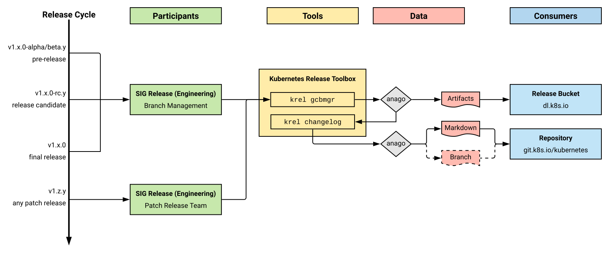

# Release Engineering

Welcome to the Kubernetes **Release Engineering** subproject! This subproject
contains two separate teams, which are:

- [Branch Management](role-handbooks/branch-manager.md)
- [Patch Release Team](role-handbooks/patch-release-team.md)

Both teams share the responsibility for the tooling in
[kubernetes/release](https://github.com/kubernetes/release), which is used to
build and deploy Kubernetes releases. The overall process looks like this:

<!-- TODO: describe the graphic textually -->
