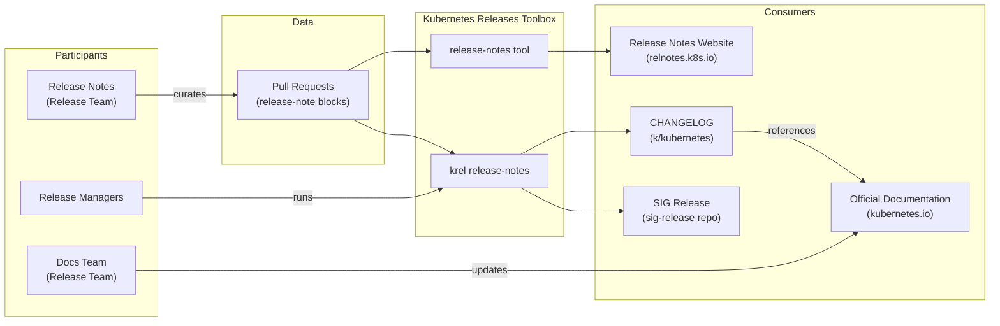

# Release Engineering

This directory contains documentation for the Kubernetes Release Engineering
subproject of [SIG Release](https://git.k8s.io/community/sig-release).

## Documentation Index

### Handbooks

- **[Release Manager Handbook](handbooks/release-manager.md)** -
  Comprehensive guide for Release Managers covering onboarding, branch
  management, cherry-pick reviews, and day-to-day responsibilities.
- **[Cutting a Kubernetes Release](handbooks/release-cuts.md)** -
  Step-by-step procedure for cutting all release types (alpha, beta, rc,
  official) and patch releases.
- **[Security Releases](handbooks/security-releases.md)** - Coordinating with
  the Security Response Committee, managing CVE data maps, and handling security
  releases.
- **[Branch Creation](handbooks/branch-creation.md)** - Infrastructure tasks
  after rc.0 is cut, including branch configuration, CI jobs, and testgrid
  setup.
- **[Go Version Management](handbooks/go-updates.md)** - Updating Go versions
  in Kubernetes, including kube-cross images and dependency management.

### Reference Documentation

- **[Release Artifacts](reference/artifacts.md)** - Overview of all artifacts
  produced by a Kubernetes release (container images, binaries, tarballs,
  packages).
- **[Release Versioning](reference/versioning.md)** - Kubernetes release
  versioning scheme, semantic versioning, and patch release policies.
- **[Platform Support](reference/platforms.md)** - Platform support tiers (Tier 1,
  2, 3), criteria, and the list of supported platforms.
- **[Base Image Exception List](reference/baseimage-exception-list.md)** -
  Tracking exceptions for container base images used in Kubernetes.
- **[GCP Projects and IAM](reference/gcp.md)** - GCP project inventory and IAM
  configuration for release infrastructure.

### Planning

- **[Roadmap and Vision](https://github.com/kubernetes/sig-release/blob/master/roadmap.md)** -
  SIG Release roadmap and long-term vision.

## Roles and Responsibilities

Details about the different roles in Release Engineering, requirements, and
the progression path are documented on the
[Kubernetes website](https://git.k8s.io/website/content/en/releases/release-managers.md).

### For Newcomers

We have a Buddy Program to improve onboarding:

- Release Managers follow up with newcomers to go over processes and empower
  them to ask questions.
- Newcomers can request a Buddy (a Release Manager), who will also be shadowed
  by up to two Release Manager Associates.
- Buddies will come from the same general time zone area and, as often as
  possible, share the same language.
- Work-related conversations should take place in Slack as much as possible to
  help other newcomers onboard.

More information about the Buddy Program is available
[on the Release Managers page](https://git.k8s.io/website/content/en/releases/release-managers.md).

## Communication

### Slack

We use the [#release-management](https://kubernetes.slack.com/messages/release-management)
channel. We strongly encourage raising questions in the channel rather than via
direct messages, to avoid duplicating conversations and drive transparency.

### Mailing List

The [kubernetes-sig-release@](https://groups.google.com/forum/#!forum/kubernetes-sig-release)
mailing list is available for topics that are too complex for Slack or GitHub.

### Meetings

Release Engineering meetings take place every other Tuesday at 7:30am PT /
14:30 UTC and last 60 minutes. Meeting agendas and notes are available
[here](https://bit.ly/k8s-releng-meeting). Meetings are recorded and follow
the Kubernetes Code of Conduct.

## How We Work

We are biased toward asynchronous communication, but use meetings, Zoom calls,
and Slack whenever questions require discussion.

### Communicating Decisions

We communicate decisions through:

- Release Engineering meeting agenda notes and recordings
- PRs, and amendment PRs on top of prior merged PRs
- Posts in [#release-management](https://kubernetes.slack.com/messages/release-management)
- The [kubernetes-sig-release@](https://groups.google.com/forum/#!forum/kubernetes-sig-release)
  mailing list for broader topics

### Pull Request Flow

- Reviewer gives `/lgtm`.
- Approver gives `/approve`.
- If unsure about changes, open the PR with a hold (`do-not-merge/hold`) to
  allow discussion.
- We do not bypass the "at least one reviewer" rule.

### Availability and Handoffs

- We do not require people to work on nights and weekends. We do not cut
  releases on Mondays to preserve weekends.
- If you cannot finish something, bring it up in Slack. If no one responds
  within 2-3 days, cc @leads. You can also raise it at the Release Engineering
  meeting.
- Do not reassign work to others without communication first.

## Release Notes

Multiple teams are involved in the creation and publishing of release notes
across different targets.

```mermaid
graph LR
    subgraph Participants
        RN["Release Notes<br/>(Release Team)"]
        RM["Release Managers"]
        DT["Docs Team<br/>(Release Team)"]
    end

    subgraph Data
        PRs["Pull Requests<br/>(release-note blocks)"]
    end

    subgraph Tooling["Kubernetes Releases Toolbox"]
        RNT["release-notes tool"]
        KRL["krel release-notes"]
    end

    subgraph Consumers
        RNW["Release Notes Website<br/>(relnotes.k8s.io)"]
        CHG["CHANGELOG<br/>(k/kubernetes)"]
        DOC["Official Documentation<br/>(kubernetes.io)"]
        SIG["SIG Release<br/>(sig-release repo)"]
    end

    PRs --> RNT
    PRs --> KRL
    RN -->|"curates"| PRs
    RM -->|"runs"| KRL
    RNT --> RNW
    KRL --> CHG
    KRL --> SIG
    DT -->|"updates"| DOC
    CHG -->|"references"| DOC
```

During the release cycle, the **Release Notes** sub-team of the Release Team
continuously creates drafted Markdown and JSON versions of the ongoing release.
The [Release Notes Website](https://relnotes.k8s.io) as well as this repository
are updated throughout the cycle.

The **[Release Managers](https://git.k8s.io/website/content/en/releases/release-managers.md)**
update [`kubernetes/kubernetes`](https://git.k8s.io/kubernetes) throughout the
release cycle. This happens as part of the release cuts in an automated fashion
via `krel`. The release notes are generated from structured release note blocks
in pull request descriptions. The
[release-notes](https://github.com/kubernetes/release/tree/master/cmd/release-notes)
tool and `krel release-notes validate` subcommand are used to collect and
validate release notes.

The **Documentation** sub-team of the Release Team ensures that the official
[kubernetes.io](https://kubernetes.io) website gets updated after the final
release version has been cut.

Patch releases happen on their own
[cadence](https://git.k8s.io/website/content/en/releases/patch-releases.md),
separate from the active release schedule. The Release Managers take care of
updating the relevant repositories during a patch release.

## Schedule of Recurring Work

### Weekly

- Cherry pick triage and approval
- Provide status updates at Release Team meetings

### Bimonthly

- k/release updates (Go dependencies, semver tags)

### Monthly

- Patch releases for the supported minor versions
  - Notify the community of the pending deadline a week before
  - Generate and share cherry pick status reports
  - Communicate ahead of the final release from a release branch
  - Deprovision CI for the oldest release branch after its last release
- Go version triage per the [Go handbook](handbooks/go-updates.md)

### Ongoing

- Cut prereleases (Alpha, Beta, Release Candidate) for the minor release in
  development

### Ad Hoc/As Needed

- Update Go versions in Kubernetes
- Update core Kubernetes base images (CRI tools, CNI plugins, OS base images,
  distroless-iptables)
- Publishing bot updates
- Curation of the [base image exception list](reference/baseimage-exception-list.md)
