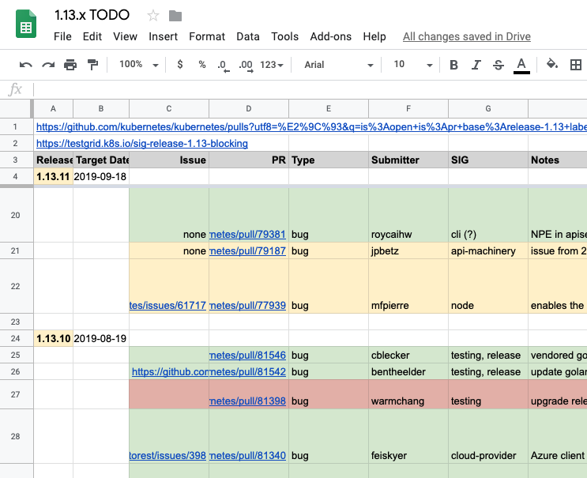

# Release Cycle Handbook

<!-- toc -->
- [Content Notice](#content-notice)
- [Release Cycle](#release-cycle)
  - [Creating and managing the Release Issue](#creating-and-managing-the-release-issue)
    - [Testgrid Screenshots](#testgrid-screenshots)
    - [Adding data about the Cloud Build Jobs](#adding-data-about-the-cloud-build-jobs)
    - [Closing the Issue](#closing-the-issue)
  - [Alpha Releases](#alpha-releases)
    - [Alpha Stage](#alpha-stage)
      - [krel stage](#krel-stage)
    - [Alpha Release](#alpha-release)
      - [krel release](#krel-release)
      - [Mock vs nomock](#mock-vs-nomock)
  - [Beta Releases](#beta-releases)
  - [Release Candidates](#release-candidates)
  - [Official Releases](#official-releases)
    - [Security fixes](#security-fixes)
    - [Debian and RPM Packaging](#debian-and-rpm-packaging)
    - [Release Validation](#release-validation)
  - [Post-release Activities](#post-release-activities)
    - [Update kubekins-e2e variants](#update-kubekins-e2e-variants)
    - [Cut next alpha](#cut-next-alpha)
- [Branch Management](#branch-management)
  - [Branch Creation](#branch-creation)
    - [During the release creation](#during-the-release-creation)
    - [After the release creation](#after-the-release-creation)
  - [Update test-infra configurations](#update-test-infra-configurations)
    - [Update milestone appliers](#update-milestone-appliers)
    - [Update milestone requirements](#update-milestone-requirements)
    - [Update e2e variants](#update-e2e-variants)
    - [Generate release branch jobs](#generate-release-branch-jobs)
  - [Configure Merge Automation](#configure-merge-automation)
    - [Tide](#tide)
    - [Code Freeze](#code-freeze)
    - [Code Thaw](#code-thaw)
  - [Branch Fast Forward](#branch-fast-forward)
  - [Reverts](#reverts)
  - [Cherry Picks](#cherry-picks)
- [Staging Repositories](#staging-repositories)
- [Debugging](#debugging)
- [Search past builds](#search-past-builds)
    - [Limitation](#limitation)
- [Patch Management Handbook](#patch-release-handbook)
  - [Prerequisites for Patch Release Team members](#prerequisites-for-patch-release-team-members)
    - [General Requirements](#general-requirements)
  - [Getting started](#getting-started)
  - [Cherry-pick requests](#cherry-pick-requests)
  - [Patch branch merge workflow and status tracking](#patch-branch-merge-workflow-and-status-tracking)
    - [Rationale](#rationale)
    - [Spreadsheets](#spreadsheets)
      - [Time Ordered Rows](#time-ordered-rows)
      - [Coloring](#coloring)
      - [Row Details](#row-details)
    - [Future Work](#future-work)
  - [Branch health](#branch-health)
  - [Release timing](#release-timing)
  - [Release cut](#release-cut)
    - [Hotfix release](#hotfix-release)
    - [Security release](#security-release)
  - [Release Commands Cheat Sheet](#release-commands-cheat-sheet)
- [References](#references)
  - [Test Infra references](#test-infra-references)
- [Background information](#background-information)
<!-- /toc -->

## Release Cycle

**General overview**:

Public build artifacts are published and an email notification goes out to the community. You will become very familiar with the following commands over the course of the 3 month release cycle:

 - `krel stage/release` for creating releases
 - `krel announce` to send the announcement email notification.

```shell
# Only for the official release: Inform the Google team to complete the corresponding Deb and RPM builds
export SENDGRID_API_KEY=<API_KEY>
krel announce --tag vX.Y.0-{alpha,beta,rc}.Z
```

There are more examples of the release process under the [References](#references) section.

It is also highly recommended to glance over the [Release Commands Cheat Sheet](https://github.com/kubernetes/sig-release/blob/master/release-engineering/role-handbooks/patch-release-team.md#release-commands-cheat-sheet).

### Creating and managing the Release Issue

Prior to cutting a release version, [open a "Cut a Release" issue](https://github.com/kubernetes/sig-release/issues/new?template=cut-release.md&title=Cut+1.x.y-%7Balpha%2Cbeta%2Crc%7D.z+release) on [kubernetes/sig-release](https://github.com/kubernetes/sig-release).

On the issue template, there are comments describing the predefined items that
need to be completed.

#### Testgrid Screenshots

For the item `Screenshot unhealthy release branch testgrid boards...`:

`krel testgridshot` takes care of generating screenshots of
[Testgrid](https://testgrid.k8s.io/) to keep as a reference of the state
it was in before cutting a release. This subcommand will generate images
of the boards and upload them to a Cloud Storage bucket, as well as the
Markdown code.

To invoke the subcommand, run it with the branch you are working on:

```
krel testgridshot --branch 1.20
```

You can include other testgrid states in the output and even have krel
autocomment the issue for you:

```
krel testgridshot --branch 1.20 --github-issue 12345 --states=FLAKY
```

Once the script generates the Markdown table, post it as a comment on the created issue. You can take a look at the [following comment](https://github.com/kubernetes/sig-release/issues/1249#issuecomment-696702503) as an example.

#### Adding data about the Cloud Build Jobs

When running a release cut, you should open a thread in the
[#release-management][release-management-url] Slack channel and include links
to the GCP build console. You can take a look at the
[following thread][example-release-thread] as an example.

[release-management-url]: https://app.slack.com/client/T09NY5SBT/CJH2GBF7Y
[example-release-thread]: https://kubernetes.slack.com/archives/CJH2GBF7Y/p1600247891103600

Once mock and nomock runs are complete, data about the jobs launched must be
collected in the issue. These are assembled in a table and correspond to the
`Collect metrics, links...` check mark.

After the release process has been completed, get the data table by using the
`krel history` subcommand. It will output a markdown table with the options used
to run the jobs, links to the GCB logs, and the result of each run.

```shell
krel history --branch release-1.xy --date-from <date-of-release>
```
The generated table is then appended to the release issue, as it can be seen in
the [following issue for the v1.20.0-alpha.1 release](https://github.com/kubernetes/sig-release/issues/1249#issue-705792603).


__Note:__ `krel history` works using the [Default Application
Credentials](https://cloud.google.com/sdk/gcloud/reference/auth/application-default)
set in your environment. While you may be logged as a user with one or more Google
accounts in the GCP SDK (which are used in `gsutil`, `gcloud`, etc), you need to
make sure your user identity is set as DAC as software using the Google Cloud
libraries uses it to authenticate.

If you have not set any Default Application Credentials previously, krel will notify
you. If you have another user or a service account you will simply get an
authentication error.

Use the following command to start the authorization flow to set your default credentials:

```shell
gcloud auth application-default login
```

#### Closing the Issue

After having thoroughly read the section on cutting a release version of the handbook, and that all items on the checklist have completed (you may include notes on events that was unique to cutting that release version as comments), close the issue with `/close` as a comment the issue thread.

### Alpha Releases

#### Alpha Stage

##### krel stage

To stage a new alpha release, simply run `krel stage`. The default command line
parameters will already default to the correct `--branch` and `--type`.

The output of the command should provide a link to GCP, where you can track the
progress of the build. The build duration takes approximately 1 hour. `krel
stage` is building all the bits for a bunch of target operating systems and
hardware architectures.

<!-- TODO: krel is not checking testgrid

Early in the release cycle, it is likely that the build might fail. By default the `stage master` command automatically looks for a place where [release master blocking tests](https://k8s-testgrid.appspot.com/sig-release-master-blocking) have green results, which traditionally has not happened in Kubernetes on an ongoing basis.

WE REALLY WANT (and need) TO GET THERE. Quality needs to be a continual focus. But in the meantime, acknowledging today especially for an early alpha or beta release, it is possible to just build via:

Rather than having `krel stage` pick a candidate by analyzing test data from the commit history that had no fails and building automatically from that point, we instead indicate we want to build explicitly from the last commit on the current branch.
-->

#### Alpha Release

The actual releasing may be intentionally delayed after staging. For example, the branch manager may stage a build from the head of the release branch late in the release cycle, doing so in the morning so that it is fully built and would be releasable in the afternoon (pending CI tests run against the head of the branch).

If the CI results are good and the release team approves, you can initiate the publishing portion of the release process. If staging the build only happened after the receipt of clean CI tests results, this will delay completing the entire release process for a release version (alpha,beta,rc,...).

This presumes reproducible builds and that the CI tests are meaningful relative to the release builds. There is always a risk that these diverge, and this needs to be managed broadly by the project and the release team.

##### krel release

Before running the release step, please refer to the [Image Promotion documentation](https://github.com/kubernetes/sig-release/blob/master/release-engineering/role-handbooks/release-image-promotion.md).

To finish the previously staged release, run `krel release --build-version=…`.
Use the `--build-version=` as specified in the output when `krel stage` is done.

This copies the staged build to public GCP buckets at well-known urls for the truncated release version string. The unique build staging identifier will subsequently be “v1.16.0-alpha.1”, even though the staged build had an “alpha.0” in its name.

This can be confusing. The v1.16.0-alpha.0 tag was created automatically in the past when the v1.15 branch was forked, but it wasn’t actually built.

##### Mock vs nomock

Any `krel stage/release` command without the `--nomock` flag is a dry run. It is highly encouraged to dry run first before letting `krel stage/release` take any actual impact on the release process. Mock building/releasing can help you verify that you have a working setup!

To get more information on `krel stage/release`, please refer to their
corresponding help (`-h`) output.

**Note: This run may fail. Mock builds can only be mock released. A nomock release requires a nomock build to be staged.**

### Beta Releases

Before run the `official release step` please refer to the [Image Promotion documentation](./release-image-promotion.md).

To stage a new beta release, simply run `krel stage --type=beta`. The same
applies to `krel release --build-version=… --type=beta`.

### Release Candidates

Builds against a `release-x.y` branch are implicitly the next RC (release candidate). `krel` automatically finds and increments the current build number.

**Note: If this is the first release (`rc.0`), there are additional tasks to complete. Please review them _COMPLETELY_ in the [Branch Creation section](#branch-creation), _before_ continuing.**

Before run the `official release step` please refer to the [Image Promotion documentation](./release-image-promotion.md).

To stage a new RC release, simply run `krel stage --type=rc --branch=release-x.y`. The same
applies to `krel release --build-version=… --type=rc --branch=release-x.y`.

In a perfect world, `rc.1` and the official release are the same commit. To get as close to that perfect state as we can, the following things should be considered:

1. PRs tagged with the release cycle milestone should have all merged onto the `master` branch:

   For example, there should be no open PRs tagged with the v1.18 milestone, `is:pr is:open milestone:v1.18`.

   You and the release team should push for PRs to get merged before the [code freeze](#code-freeze) is lifted or determine if the open PRs can be removed from the milestone and be merged in the next release cycle.

2. When to stage and release `rc.1`:

   Make sure that all the changes that have been merged onto `master`, make it onto the release branch. Run [`krel ff`](#branch-fast-forward) to see the state of the two branches and pull any remaining PRs from `master` onto the release branch.

   At this point in time, `master` and the release branch should have the same commits. Nothing new gets merged onto `master`, since [code freeze](#code-freeze) is not lifted. Therefore, it is safe to cut the release candidate.

3. Factors that determine if Code Freeze can be lifted:

   - Zero pending PRs and no open issues tagged with the release cycle milestone.
   - No failing X.Y-blocking tests, for example the [sig-release-1.18-blocking](https://testgrid.k8s.io/sig-release-1.18-blocking) dashboard should not have any red failing test builds.

   > **Note:** If there are non-zero pending PRs, open issues or failing tests, there is high confidence that the issue is understood and the solution can be [cherry picked](#cherry-picks) over to the release branch between the release candidate(s) and official release.

Technically we can keep [code freeze](#code-freeze) in place after `rc.1` was cut. However, we should aim at lifting code freeze relatively quickly after `rc.1`.

Otherwise we might have a mix of PRs against master, some have been merged in code freeze and for the milestone, just after `rc.1`, and others have been merged when code freeze has been lifted. We might miss this specific PR in the plethora of PRs that [tide] merges after [code thaw](#code-thaw), and we might miss that this PR actually needs to be cherry-picked into the release branch.

[tide]: https://git.k8s.io/test-infra/prow/tide

### Official Releases

Before run the `official release step` please refer to the [Image Promotion documentation](./release-image-promotion.md).

To stage a new official release, simply run `krel stage --type=official
--branch=release-x.y`. The same applies to `krel release --build-version=…
--type=official --brancH=release-x.y`.

In addition to `v1.18.n` this will also build and stage the subsequent patch's
`rc.0`, in this example `v1.18.(n+1)-rc.0`. Similar to [creating a new branch](#branch-creation), the staging step will take about twice as long, the
release step will also take a couple of minutes more.

However, there is an embargo policy which requires the nomock release publication happens after 4 pm Pacific (see [Release Team Lead Handbook](https://github.com/kubernetes/sig-release/tree/master/release-team/role-handbooks/release-team-lead#week-12) for details), make sure to coordinates with other roles and follow the timeline.

To better prepare and see what to expect, this is a sequence of events that took place on past [official release days](https://docs.google.com/document/d/1K0B91lgeEiJTbT602VloA5arb6AkaTif-MLryaHmlYc/edit?usp=sharing).

#### Security fixes

The Security Response Committee (SRC) may contact you via the [Security Release Team][security-release-team]
mailing list if there are security fixes needed on the release branch.

Once the release has been confirmed to contain security fixes, the Branch Manager must inform the current
Release Team Lead and Lead Shadows. Information pertaining to these fixes is considered need-to-know and should not be disseminated to anyone else on the Release Team.

You must not make any public announcements regarding these fixes unless the SRC tells you to.

See the [Security Release Process](https://git.k8s.io/security/security-release-process.md) doc for more details.

[security-release-team]: https://groups.google.com/a/kubernetes.io/forum/#!forum/security-release-team

#### Debian and RPM Packaging

[Packaging the Official Release](https://github.com/kubernetes/sig-release/blob/master/release-engineering/packaging.md) is by conducted by employees at Google. Once `krel release --type=official …` has completed, **before sending out the email notification**, contact the [Release Managers Google Group][release-managers-group] to notify them that an official release for `vX.Y` is complete and the release is ready to be packaged.

The entire packaging process including the build and validation of the builds could take around 3-4 hours. It is preferable to have the DEB and RPM files ready prior to sending out the release notification email since, people worldwide will attempt to download the official release. Since packaging uses the release tag, it is important to [validate the release process](#release-validation).

Once the .deb and .rpm packages are done building, you can `grep` for `X.Y` e.g. `1.16` in the [yum](https://packages.cloud.google.com/yum/repos/kubernetes-el7-x86_64/repodata/primary.xml) and [apt](https://packages.cloud.google.com/apt/dists/kubernetes-xenial/main/binary-amd64/Packages) repositories.

#### Release Validation

The following are some ways to determine if the release process was successful:

1. The build tag and release artifacts become [visible on GitHub at https://github.com/kubernetes/kubernetes/releases](https://github.com/kubernetes/kubernetes/releases)

2. The release is logged automatically by [k8s-release-robot](https://github.com/k8s-release-robot) in [k/sig-release](https://git.k8s.io/sig-release)

3. CHANGELOG-X.Y.md is automatically loaded into the kubernetes/kubernetes repo: [https://github.com/kubernetes/kubernetes/blob/master/CHANGELOG-1.16.md](https://github.com/kubernetes/kubernetes/blob/master/CHANGELOG-1.16.md)


### Post-release Activities

#### Update kubekins-e2e variants

Set the `K8S_RELEASE` marker for the current release variant to `stable-x.y` which was currently `latest-x.y` in the [`variants.yaml` file for `kubekins-e2e`](https://github.com/kubernetes/test-infra/blob/fa43d4a7a6c88c0dedd0db83b250cec485b60736/images/kubekins-e2e/variants.yaml). ([reference PR review comment](https://github.com/kubernetes/test-infra/pull/13870#discussion_r313628808))

#### Cut next alpha

Recall that an alpha.0 of the next minor release was created during [branch creation](#branch-creation).

The previously created alpha.0 is now several commits behind `master`.
As an example, see the [comparison between the `v1.18.0-alpha.0` (after 1.17 branch creation) and `v1.18.0-alpha.1` (after 1.17.0 release) tags](https://github.com/kubernetes/kubernetes/compare/v1.18.0-alpha.0...v1.18.0-alpha.1).

To assist downstream consumers of Kubernetes, a new alpha should be cut to bring our next release tag to the tip of `master`.

Begin the release process with:

```shell
krel stage
```

Proceed with the [alpha release steps](#alpha-releases).

Example `1.18.0-alpha.1` release issue template: https://github.com/kubernetes/sig-release/issues/928

## Branch Management

This section discusses the methods in managing commits on the `release-x.y` branch.

### Branch Creation

During a `rc.0` release our release tooling creates a new release branch named `release-x.y`, where `x` and `y` are the major and minor versions of the next release, respectively.

Behind the scenes `krel` is doing a git branch create and git push. The branch is created in the staging phase and is pushed to the repository in the release phase.

`prow`’s [`branchprotector`](https://git.k8s.io/test-infra/prow/cmd/branchprotector/README.md) runs every hour at 54 minutes past the hour and automatically adds [branch protection](https://help.github.com/articles/about-protected-branches/) to any new branch in the `kubernetes/kubernetes` repo.

New release branch creation (for example: `release-1.18`) also automatically triggers an alpha.0 build for the subsequent release (for example: [`v1.19.0-alpha.0`](https://github.com/kubernetes/kubernetes/releases/tag/v1.19.0-alpha.0)).

This means that the staging step will take about twice as long, as it will stage both versions `v1.18.0-rc.0` and `v1.19.0-alpha.0`. The release step will also be extended, but not substantially longer in time.

#### During the release creation

Before the nomock release job is started, run through the following tasks, **_putting an explicit hold_** on any PRs (to be removed once the release branch has been created):

- [Update test-infra configurations](#update-test-infra-configurations)
  - [Update Slack branch whitelists](#update-slack-branch-whitelists)
  - [Update milestone appliers](#update-milestone-appliers)
  - [Update milestone requirements](#update-milestone-requirements)
  - [Update e2e variants](#update-e2e-variants)

#### After the release creation

Once the new `release-x.y` branch is created, the [release jobs and dashboards should be generated and merged](#generate-release-branch-jobs).

### Update test-infra configurations

Before getting started, Branch Managers should:

- Fork the [test-infra repository](https://github.com/kubernetes/test-infra)
- Clone their fork of `kubernetes/test-infra`:

```shell
git clone git@github.com:<username>/test-infra.git
```

- [Install Bazel](https://docs.bazel.build/versions/master/install.html) or run Bazel inside a container
  - Running Bazel in a container is recommended over installing Bazel locally, as Bazel has many dependencies

#### Update milestone appliers

The [milestone applier plugin](https://git.k8s.io/test-infra/prow/plugins/milestoneapplier/milestoneapplier.go) automatically applies a GitHub milestone to pull requests after they have merged.

This only applies to repos that have the milestone applier configured and for pull requests that do not already have a milestone.

Update the `milestoneapplier` plugin configs for `kubernetes/kubernetes`:

- Remove configs for the unsupported release branches, if present
- Add config for the current release branch

Here's an [example PR](https://github.com/kubernetes/test-infra/pull/20075).

#### Update milestone requirements

If the [code freeze](#code-freeze) was enabled before creating the release branch, the milestone requirements wouldn't include the newest release branch.

Find the query config for `kubernetes/kubernetes` (in [config.yaml][config.yaml] file) with the code freeze enabled and add the newest release release branch.

[config.yaml]: https://github.com/kubernetes/test-infra/blob/3a6962d/config/prow/config.yaml

Here's an [example PR](https://github.com/kubernetes/test-infra/pull/20077).

#### Update e2e variants

Images used in Kubernetes e2e tests are generated via our [GCB Builder tool](https://github.com/kubernetes/test-infra/blob/master/images/builder/README.md).

The `variants.yaml` config file, used in conjunction with the GCB Builder, allows us to target various branches or branch combinations during CI tests. The `K8S_VERSION` variable maps to the version marker `latest-x.y.txt` file viewable in the [`kubernetes-release` GCS bucket](https://gcsweb.k8s.io/gcs/kubernetes-release/release/) for example, [`latest-1.17.txt`](https://storage.googleapis.com/kubernetes-release/release/latest-1.17.txt).

Update the [variants for the `kubekins-e2e` image](https://github.com/kubernetes/test-infra/blob/master/images/kubekins-e2e/variants.yaml).

- Remove the release variants for the unsupported releases
- Add an entry for the newest release variant
- Copy the `master` variant, rename it to the newest release and ensure the following:
  - The `K8S_RELEASE` marker for `experimental` matches `master`
  - The `CONFIG` marker for the newest release matches the variant/release name
  - The `K8S_RELEASE` marker for the newest release variant is `latest-x.y`
  - The `K8S_RELEASE` marker for every other release variant is `stable-x.y`

Create a PR with this change and wait for it to be merged ([example PR](https://github.com/kubernetes/test-infra/pull/20076)).

**Wait for the `test-infra-push-kubekins-e2e` presubmit to finish (you can [check on prow](https://prow.k8s.io/?job=post-test-infra-push-kubekins-e2e)).**

**`git pull` latest from `master` before continuing.**

#### Generate release branch jobs

This task should be done after the release is complete and previous PRs are merged. The following steps should be run from the test-infra repository's root.

1. Generate the new release branch jobs:

   ```shell
   bazel run //releng:prepare_release_branch
   ```

   Alternatively, if you want to run Bazel in a container, you can use the command such as:

   ```shell
   docker run -it \
      -v $PWD:/workspace/src/k8s.io/test-infra \
      -v $HOME/.cache/bazel:/root/.cache/bazel \
      -w /workspace/src/k8s.io/test-infra \
      gcr.io/k8s-testimages/launcher.gcr.io/google/bazel:latest-test-infra run //releng:prepare_release_branch
   ```

1. Update release dashboards in the [Testgrid config](https://git.k8s.io/test-infra/config/testgrids/kubernetes/sig-release/config.yaml) ([example commit](https://github.com/kubernetes/test-infra/pull/15023/commits/cad8a3ce8ef3537568b12619634dff702b16cda7)).
  - Remove the oldest release `sig-release-<version>-{blocking,informing}` dashboards
  - Add dashboards for the current release e.g., `sig-release-1.17-{blocking,informing}`

1. Check for and resolve configuration errors:

   ```shell
   bazel test //config/... //hack:verify-all
   ```

1. Issue a PR with the new release branch job configurations ([example PR](https://github.com/kubernetes/test-infra/pull/15023)).

1. Once the PR has merged, verify that the new dashboards have been created and are populated with jobs

    Examples:
    - [sig-release-1.17-blocking](https://testgrid.k8s.io/sig-release-1.17-blocking)
    - [sig-release-1.17-informing](https://testgrid.k8s.io/sig-release-1.17-informing)

1. [Announce in #sig-release and #release-management](https://kubernetes.slack.com/archives/C2C40FMNF/p1565746110248300?thread_ts=1565701466.241200&cid=C2C40FMNF) that this work has been completed

[sig-release-x.y-blocking]: https://testgrid.k8s.io/sig-release-1.17-blocking
[`krel ff`]: https://git.k8s.io/release

### Configure Merge Automation

Between the [Code Freeze](#code-freeze) and lifting Code Freeze ([Code Thaw](#code-thaw)) period, merging new code is restricted. The main focus is on fixing existing code and getting green test builds on Testgrid. Preventing new code is implemented by config changes for [tide]. The `master` and current release cycle branch (`release-x.y`) are the only branches affected during this period.

Code freeze initiates additional merge requirements, while Code thaw marks the switch back to the development phase. Look at the [release cycle timeline](https://github.com/kubernetes/sig-release/tree/master/releases) for the exact dates for code freeze and code thaw. Usually the the date for code thaw is flexible depending on pending PRs.

As Branch Manager, coordinate with the Release Lead on checking the exact config changes required to enable and disable merge restrictions.

#### Tide

Tide automates merges and is configured via a [config.yaml][config.yaml] file. Tide identifies PRs that are mergeable using GitHub queries that correspond to the configuration. Here is an example of what the query config for `kubernetes/kubernetes` looks like without additional constraints related to the release cycle:

```yaml
  - repos:
    - kubernetes/kubernetes
    labels:
    - lgtm
    - approved
    - "cncf-cla: yes"
    missingLabels:
    - do-not-merge
    - do-not-merge/blocked-paths
    - do-not-merge/cherry-pick-not-approved
    - do-not-merge/hold
    - do-not-merge/invalid-owners-file
    - do-not-merge/release-note-label-needed
    - do-not-merge/work-in-progress
    - do-not-merge/needs-kind
    - do-not-merge/needs-sig
    - needs-rebase
```

During code freeze, two queries are used instead of just one for the `kubernetes/kubernetes` repo. One query handles the `master` and current release branches while the other query handles all other branches. The partition is achieved with the `includedBranches` and `excludedBranches` fields.

#### Code Freeze

Code freeze means the code is "frozen" and there will not be any further modifications from the developers.

Branch managers create the "freeze" by altering the Tide merge requirements for the `master` and current `release-x.y` branch from the other branches (enforced by Tide with two queries).

We only add additional merge requirements for PRs to these two branches for code freeze:

- PRs must be in the GitHub milestone for the current release.

Milestone requirements are configured by adding `milestone: vX.Y` to a query config.

It is also helpful to remind [#sig-testing](https://kubernetes.slack.com/messages/C09QZ4DQB) when code freeze starts so they know not to do any major changes.

```yaml
  - repos:
    - kubernetes/kubernetes
    milestone: v1.16
    includedBranches:
    - master
    - release-1.16
    labels:
    - lgtm
    - approved
    - "cncf-cla: yes"
    missingLabels:
      # as above...
  - repos:
    - kubernetes/kubernetes
    excludedBranches:
    - master
    - release-1.16
    labels:
    - lgtm
    - approved
    - "cncf-cla: yes"
    missingLabels:
      ...
```

Example PR:

 - [1.18](https://github.com/kubernetes/test-infra/pull/16603)
 - [1.17](https://github.com/kubernetes/test-infra/pull/15301)

#### Code Thaw

Code Thaw removes the release cycle merge restrictions and replaces the two queries with one single query. We remain in this state until the next Code Freeze.

```yaml
  - repos:
    - kubernetes/kubernetes
    labels:
    - lgtm
    - approved
    - "cncf-cla: yes"
    missingLabels:
    ...
```

Update the `milestoneapplier` plugin configs for the following repos to the **_next_** milestone:

- `kubernetes/enhancements`
- `kubernetes/kubernetes`
- `kubernetes/release`
- `kubernetes/sig-release`
- `kubernetes/test-infra`

Example PRs:

- [1.18](https://github.com/kubernetes/test-infra/pull/16821)

### Branch Fast Forward

Prior to running `krel ff`, you will need membership in the [Release Managers GitHub Group](https://github.com/orgs/kubernetes/teams/release-managers)

To compile `krel`, just install it from the [`git.k8s.io/release`](https://git.k8s.io/release) repository:

```shell
make release-tools
```

Command invocation:

```shell
krel ff --branch release-x.y
```

Where `x.y` is the is release cycle version e.g. `1.18`

This is done daily as soon as the `release-x.y` branch has been cut (which happens after `rc.0` is released).

Earlier in the release cycle, the exact time of running [`krel ff`] can be at the discretion of the branch manager; as agreed upon with the release lead.

Later in the release cycle, it will become more important to align with the release lead and the CI signal team.

The exact time for pulling in the changes from `master` to the release branch might depend on the features that are merging. Considerations could be:

- Run [`krel ff`] sooner, before `$bigFeature` so we have a signal in the release branch before that feature was brought in
- Run [`krel ff`] later, after `$theOtherFeature` has been merged, so we get signal on that feature from both the master and the release branch

The first time the [`krel ff`] executes, it will:

- clone `kubernetes/kubernetes` to a temporary directory (`/tmp/k8s`)
- precheck that the provided branch is a release branch and can be forwarded
- merge the latest master ref into the release branch
- push the results to the GitHub remote release branch

It is highly recommended to run the following `git` commands as shown below:

```shell
Validate things look okay before pushing…

Check for files left uncommitted using:

    git status -s

Validate the fast-forward commit using:

    git show

Validate the changes pulled in from master using:

    git log origin/release-1.16..HEAD
```

You should see something like this when running `git show`:

```shell
commit d17cd2356993283316b10491a4beaad0931bbff3
Merge: 35a287caa6 6348200c92
Author: Yang Li <idealhack@gmail.com>
Date:   Tue Sep 10 03:47:38 2019 +0000

    Merge remote-tracking branch 'origin/master' into release-1.16
```

Sometimes the commit may or may not delete a Changelog.

It is critically important to run the following during code freeze. Look through the git log via:

```shell
git log origin/release-x.y..HEAD
```

Each and every commit ought to be something the release team has visibility into. Each merge commit indicates a PR number and owner. Invest time in researching these.

If unexpected code was merged to master, use your judgment on whether to escalate to the release team and SIG leadership associated with PR to question whether the commit is truly targeted for the release.

**The release team and the branch manager are the final safety guard on the release content.**

Upon a successful mock execution of `krel ff`, proceed with:
`krel ff --branch release-x.y --nomock`

Subsequent runs will simply be merging in changes from `master` to the branch, keeping the previous API fix-up commits on the branch.

Note that the merged commits from `krel ff` e.g. with `d17cd23569` from the above `git show` snippet will be tested against on Testgrid [sig-release-x.y-blocking].

Once code freeze is lifted ([code thaw](#code-thaw) occurred), then there will be no need to `krel ff` from `master` onto the release branch. Instead, PRs that need to be merged onto the release branch are cherry-picked over from `master`.

### Reverts

During code freeze it is especially important to first look at the list of commits on `master` since the prior fast forward, scanning their content and issues/PRs to ensure they are changes expected for this milestone.

**The merge-blocking mechanisms are relatively weak.**

It is possible still for some people to write directly to the repo (bypassing blocking mechanisms) as well as for unintentional milestone maintainers to approve a merge incorrectly. The branch manager is the last line of defense.

If code incorrectly merges onto `master` it should be reverted in `master`. Alternatively, release branch management must go to all cherry picks, picking around the incorrectly added commit.

### Cherry Picks

Once code freeze is lifted, and for the post-release patch management process, commits are cherry picked from `master`.

It's important to take note of [what is considered as a release blocking issue or PR](https://github.com/kubernetes/sig-release/blob/master/release-blocking-jobs.md) and identify PRs and issues as soon as possible. Ensure that there's work being done to release blocking PRs completed prior to the official release day.

Let the release lead know if there's not enough attention placed on the release blocking PR. This way we can prevent from prolonging the official release.

The current documentation in the [contributor guide for cherry picks](https://git.k8s.io/community/contributors/devel/sig-release/cherry-picks.md) should be generally sufficient. There are a couple prerequisites to running the script which are outlined in that guide.

The cherry pick script is also fairly self documenting in terms of how to invoke the command.

Running [cherry_pick_pull.sh](https://git.k8s.io/kubernetes/hack/cherry_pick_pull.sh) creates a cherry pick PR against the specified `release-x.y` branch. The content of the cherry pick PR is taken from a PR that was made against `master`. Once the appropriate approval is given to the cherry pick PR and has met the requirements set by the [k8s-ci-robot](https://github.com/k8s-ci-robot), this will trigger test re-runs on the PR. As soon as these tests all pass, add the `cherry-pick-approved` label.

For example, [#79044](https://github.com/kubernetes/kubernetes/pull/79044) is the cherry pick PR of [#78999](https://github.com/kubernetes/kubernetes/pull/78999). Once [#79044](https://github.com/kubernetes/kubernetes/pull/79044) is tagged with the `cherry-pick-approved` label, Prow begins the merge onto the release branch.

There has been quite a bit of recent discussion (see: [1](https://github.com/kubernetes/community/pull/2408), [2](https://github.com/kubernetes/community/pull/1980)) around improving both the cherry pick process process and its documentation.

After the official release has been published, the [Release Managers](../../release-managers.md#release-managers) will take over in handling cherry picks. In the time between [code thaw](#code-thaw) and the official release, cherry picks are the responsibility of the branch management team.

Consider the following when assessing the cherry-picks:

- Check regularly if there are new cherry picks with
  [`is:open is:pr base:release-1.18 label:do-not-merge/cherry-pick-not-approved`][cherry-pick-query]
- Consider that each cherry-pick diverges the latest release candidate that has been cut from the bits to be released as the official release
- Engage with the cherry pick requester: How important is that cherry-pick, can it be pushed to a later release (patch or even minor), ... ?
- Discuss (especially controversial) cherry-picks in [#sig-release] or at the burndown meeting if you are unsure
- If certain cherry-picks merge, does this mean we want another release
  candidate, more time for the release candidate to soak (e.g. over the
  weekend)?

[cherry-pick-query]: https://github.com/kubernetes/kubernetes/pulls?utf8=%E2%9C%93&q=is%3Aopen+is%3Apr+base%3Arelease-1.18+label%3Ado-not-merge%2Fcherry-pick-not-approved

## Staging Repositories

The [publishing-bot](https://github.com/kubernetes/publishing-bot) is responsible for publishing the code in [staging](https://git.k8s.io/kubernetes/staging/src/k8s.io) to their own repositories.

The bot also syncs the Kubernetes version tags to the published repos, prefixed with `kubernetes-`. For example, if you check out the `kubernetes-1.16.0` tag in client-go, the code you get is exactly the same as if you check out the `v1.16.0` tag in Kubernetes, and change the directory to `staging/src/k8s.io/client-go`.

[client-go](https://github.com/kubernetes/client-go) follows [semver](http://semver.org/) and has its own release process. This release process and the publishing-bot are maintained by SIG API Machinery. In case of any questions related to the published staging repos, please ask someone listed in the following [OWNERS](https://git.k8s.io/publishing-bot/OWNERS) file.

The bot runs every four hours, so it might take sometime for a new tag to appear on a published repository.

The client-go major release (e.g. `v1.18.0`) is released manually a day after the main Kubernetes release.

## Debugging

To debug `krel stage/release` you can set the log level to `debug` by doing
`krel --log-level debug [args]`. There is also a `trace` log level for maximum
output verbosity. The log level is passed correctly to the Google Cloud console
and can be inspected there.

## Search past builds

To search past `cloudbuilds` to make any kind of analysis and check metrics you can use the Google Cloud Console for that.
You can access [Google Cloud Build History](https://console.cloud.google.com/cloud-build/builds?project=kubernetes-release-test)

There you can see all the `cloudbuilds`  that already ran or if there is any one running in the moment you can see that as well.

To filter for a specific build or set of builds you can use the `Filter Builds` textbox. When you click there it opens a dropdown box to you select which kind of keys you want to filter.

For example you can select `Tags` and then add the tags you want to filter, like, `Tags: release-1.18 Status: Successful`. This query in the [Google Cloud Build](https://console.cloud.google.com/cloud-build/builds?project=kubernetes-release-test&pageState=(%22builds%22:(%22f%22:%22%255B%257B_22k_22_3A_22Tags_22_2C_22t_22_3A10_2C_22v_22_3A_22_5C_22release-1.18_5C_22_22_2C_22s_22_3Atrue_2C_22i_22_3A_22tags_22%257D_2C%257B_22k_22_3A_22Status_22_2C_22t_22_3A10_2C_22v_22_3A_22_5C_22Successful_5C_22_22_2C_22s_22_3Atrue_2C_22i_22_3A_22status_22%257D%255D%22)))


#### Limitation

Looks like in the Google Cloud Build History you cannot set more than one `tag` when using the `AND` operator. The query does not bring anything if you add, for example, `Tags: release-1.18 Tags: STAGE`.
Besides the fact that exists.


---
# Patch Management Handbook

As the name implies, Patch Release Team members are responsible for
managing patches against Kubernetes release branches and making the
1.X.Y patch releases during the support period after each 1.X minor
release.  Kubernetes 1.X releases receive approximately one year
of support (for releases 1.19 and newer; release 1.18 and earlier received
9 months of support) in terms of patches for bugfixes and ongoing CI insuring
the branch's health and the ability to update from 1.X.Y to 1.(X+1).Y,
for the newest Y on each of those two branches.


While this playbook is intended to guide Patch Release Team members,
it largely consists of opinions and recommendations from former
patch release managers.  Each Patch Release Team member is ultimately
responsible for carrying out their duties in the manner they deem
best for the project.  The playbook then is more what you might
call "guidelines" than actual hard rules.  Still each Patch Release
Team member should endeavor to keep this document up to date, improve
its content, and improve the overall process of patch management
for the project.

## Prerequisites for Patch Release Team members

### General Requirements

**Before continuing on to the Patch Release specific requirements listed below, please review and work through the tasks in the [Release Team Onboarding Guide](/release-team/release-team-onboarding.md).**

## Getting started

You're here because you've volunteered and have been selected to
contribute to patch release management for one or more branches.
You will need to make yourself known to the community and gain
access to multiple build and release tools:

* Add your name and contact info, and if applicable a new section
  for the current release, to the [Patch Releases landing
  page](/releases/patch-release.md) so the community knows you're the
  point of contact.  If your work is specific to one particular
  release, add your name to that release's release team in the patch
  release manager row, for example [here for
  1.13](https://git.k8s.io/sig-release/releases/release-1.13/release_team.md).
* Peribolos is used for GitHub team membership.  You need to be a member of the
  [kubernetes-release-managers](https://github.com/orgs/kubernetes/teams/kubernetes-release-managers/members)
  team to have write access to the main repository.  Send a pull request
  against the [sig-release teams configuration](https://git.k8s.io/org/config/kubernetes/sig-release/teams.yaml)
  adding your userid to the kubernetes-release-managers member list.
* Ask the list owner(s) to add you to the
  [release-managers-private](https://groups.google.com/a/kubernetes.io/forum/#!forum/release-managers-private)
  via the owner contact form [here](https://groups.google.com/forum/#!contactowner/kubernetes-dev).
* Ask the list owner(s) to give you access to post to these mailing lists:
   * [kubernetes-announce](https://groups.google.com/forum/#!forum/kubernetes-announce) via owner contact form [here](https://groups.google.com/forum/#!contactowner/kubernetes-announce)
   * [kubernetes-dev-announce](https://groups.google.com/forum/#!forum/kubernetes-dev-announce) via owner contact form [here](https://groups.google.com/forum/#!contactowner/kubernetes-dev-announce)
* If applicable, sync up with the outgoing release branch manager
  to take ownership of any lingering issues on the branch.
* Review the [Branch Manager
  Handbook](/release-engineering/role-handbooks/branch-manager.md) as
  much of the tooling and process used by the branch manager pre-release
  relates to the post-release duties of Patch Release management.
  Pay close attention to the
  [Pre-requirements](/release-team/role-handbooks/branch-manager#pre-requirements),
  [Safety Check](/release-team/role-handbooks/branch-manager#safety-check), and
  [Build and Release](/release-team/role-handbooks/branch-manager#build-and-release)
  sections.  This outlines current requirements for running `krel stage/release` to do
  builds.

## Cherry-pick requests

As a patch release manager, you are responsible for reviewing
[cherry-picks](https://git.k8s.io/community/contributors/devel/sig-release/cherry-picks.md)
on your release branch.

**Finding outstanding cherry-picks**

Use a GitHub search such as [`is:pr is:open
label:do-not-merge/cherry-pick-not-approved
base:release-1.13`](https://github.com/kubernetes/kubernetes/pulls?utf8=%E2%9C%93&q=is%3Aopen+is%3Apr+base%3Arelease-1.13+label%3Ado-not-merge%2Fcherry-pick-not-approved+)
to find all un-triaged cherry-pick PRs for a branch.

As an example of the kind of load to expect, there were close to
300 cherry-pick PRs against the 1.10 milestone during its approximately
one year lifetime.

For each cherry-pick request:

1.  **Decide if it meets the criteria for a cherry-pick**

    Make sure the PR author has supplied enough information to answer:

    * What bug does this fix?
      (e.g. *enhancement X was already launched but doesn't work as intended*)
    * What is the scope of users affected?
      (e.g. *anyone who uses enhancement X*)
    * How big is the impact on affected users?
      (e.g. *pods using X fail to start*)
    * How have you verified the fix works and is safe?
      (e.g. *added new regression test*)

    Ask the PR author for details if these are missing and not obvious.
    If you aren't sure what to do, escalate to the relevant SIGs.

    **Notes**

    * Version bumps (e.g. v0.5.1 -> v0.5.2) for dependencies with their own
      release cycles (e.g. kube-dns, autoscaler, ingress controllers, etc.)
      deserve special attention because it's hard to see what's changing.
      In the past, such bumps have been a significant source of regressions in
      the stable release branch.

      Check the release notes for the dependency to make sure there are no new
      behaviors that could destabilize the release branch.
      Ideally you should only accept version bumps whose release deltas contain
      only changes that you would have approved individually, if they had been
      part of the Kubernetes release cycle.

      However, this gets tricky when there are fixes you need for your branch
      that are tied up with other changes. Ask the cherry-pick requester for
      context on the other changes and use your best judgment.

    * Historically (up through at least 1.6), there have been exceptions
      occasionally granted to the "no new enhancements" rule for
      cherry-picks that are confined to plugins like cloud providers
      (e.g. vSphere, Azure) and volumes (e.g. Portworx).

      However, we required that these exceptions be approved by the plugin
      owners, who were asked to `/approve` through the normal `OWNERS` process
      (despite it being a cherry-pick PR).

1.  **Make sure it has an appropriate release note**

    [Good release notes](https://github.com/kubernetes/community/issues/484)
    are particularly important for patch releases because cluster admins expect
    the release branch to remain stable and need to know exactly what changed.
    Take care to ensure every cherry-pick that deserves a release note has one
    *before you approve it* or else the change may fall through the cracks at
    release cut time.

    Also make sure the release note expresses the change from a user's
    perspective, not from the perspective of someone contributing to Kubernetes.
    Think about what the user would experience when hitting the problem,
    not the implementation details of the root cause.

    For example:

    User perspective (good) | Code perspective (bad)
    ----------------------- | ----------------------
    *"Fix kubelet crash when Node detaches old volumes after restart."* | *"Call initStuff() before startLoop() to prevent race condition."*

    Ask the PR author for context if it's not clear to you what the release note
    should say.

    Lastly, make sure the release note is located where the
    [relnotes](https://git.k8s.io/release/relnotes) script will
    find it.  You'll know it was not in such a place if the PR is
    labelled as `do-not-merge/release-note-label-needed`.  This can be
    resolved by either of:

    * If the cherry-pick PR comes from a branch called `automated-cherry-pick-of-*`,
      then the release notes are taken from each parent PR (possibly more than one)
      and the cherry-pick PR itself is ignored.

      Make sure the cherry-pick PR and parent PRs have the `release-note` label.

    * Otherwise, the release note is taken from the cherry-pick PR.

      Make sure the cherry-pick PR has the `release-note` label.

    **Notes**

    * Almost all changes that are important enough to cherry-pick are important
      enough that we should inform users about them when they upgrade.

      Rare exceptions include test-only changes or follow-ups to a previous
      cherry-pick whose release note already explains all the intended changes.

1.  **Approve for Cherry-pick**

    PRs on release branches follow a different review process than those on the
    `master` branch.  Patch Release Team members review every PR on the release branch,
    but the focus is just on ensuring the above criteria are met.
    The code itself was already reviewed, assuming it's copied from `master`, and
    should have `/lgtm` and `/approve` from the relevant reviewers and
    approvers in the code's associated OWNERS file.

    * For an *automated cherry-pick* (created with `hack/cherry_pick_pull.sh`),
      first make sure the parent PR has merged into master.

      If the parent PR hasn't merged yet, leave a comment explaining that you
      will wait for it before approving the cherry-pick.
      We don't want the release branch to get out of sync if the parent PR changes.

      If the parent PR has merged, comment `/lgtm` to apply the `lgtm` label and
      notify the author that you've reviewed the cherry-pick request.

      For cherry-picks that are clearly justified and low risk in your judgment,
      you can directly apply the `approved` label as long as the parent PR was
      approved and merged into `master`.

      If you lack sufficient context or have any doubts, leave a comment
      explaining that the PR needs to get an `/approve` from relevant OWNERS
      to ensure that the change is appropriate for a cherry-pick.

    * For a *manual patch or cherry-pick* (not a direct copy of a PR already merged
      on `master`), leave a comment explaining that it needs to get
      LGTM+Approval through the usual review process.

      You don't need to do anything special to fall back to this process.
      The bot will suggest reviewers and approvers just like on `master`.

    Compared to non-cherry-pick PR's, a cherry-pick PR has one
    additional merge criteria:  The Patch Release Team members are
    entrusted with applying the `cherry-pick-approved` label.  This
    is done manually directly through the GitHub UI, not through a
    Prow command.  In response, the bot will remove the
    `do-not-merge/cherry-pick-not-approved` label.

    Note that the PR will not actually merge until it meets all usual criteria
    enforced by the merge bot (`lgtm` + `approved` labels, required presubmits,
    etc.) and makes its way through the submit queue.

    Tide has pools per active branch, so release branch cherry-pick
    PRs pending merge will be visible as rows distinct from the master
    branch in the [Tide Status](https://prow.k8s.io/tide).

## Patch branch merge workflow and status tracking

###  Rationale

At any moment we typically have between a half dozen and a dozen
cherry pick PRs pending on each branch.  Many of these are in a
"cluster", picking the same change from master back to the various
release branches.  These can be found per branch by a query such as:
[is:open is:pr base:release-1.16
label:do-not-merge/cherry-pick-not-approved](https://github.com/kubernetes/kubernetes/pulls?utf8=✓&q=is%3Aopen+is%3Apr+base%3Arelease-1.16+label%3Ado-not-merge%2Fcherry-pick-not-approved+).

But these GitHub queries are point-in-time and do not show what's
changed versus a prior run of the query.  Intermediate state must
be externally recorded and updated for consistency.

### Spreadsheets

We maintain this evolving state in a set of spreadsheets, one
spreadsheet per release branch.  These are privately shared amongst
the patch release team because they contain information on inbound
PRs that relate to security patches and target release date information
that may be embargoed as per the Kubernetes security process (link).
The use of the Google Docs platform means the team can simultaneously
edit the state while also retaining a version history of changes
for the team's future reference.



#### Time Ordered Rows

The spreadsheets run in reverse chronological order with the newest
patch release's activity at the top.

Sections are made per patch release.

A row is entered in a section per cherry pick pending ahead of that
patch release.  Within each of these sections, cherry picks are
listed in reverse PR number order, newest on top.  To add a notation
for a newly inbound cherry pick, add a row above the current newest
row.

Using a consistent schema for rows and columns means the results
of triaging one cherry pick, when it is part of a cluster of cherry
picks on multiple branches pulling the same change from master, can
be copy/pasted between spreadsheets.  This on average saves a lot
of time and effort.  While we have settled into a roughly monthly
release cadence and release updates for all branches simultaneously
most of the time, on occasion the branches do diverge both on release
timing and on state for a cluster of cherry picks of the same parent
PR, and this divergent state needs tracked distinctly per branch.

The result is roughly a running log of our activities with the
newest items on top.

#### Coloring

Rows are colored with red/yellow/green scheme to focus activity on
specific cherry picks:

 * red - a cherry pick that has been closed

 * yellow - a cherry pick that is open and has no 'cherry-pick-approved' label

 * green - a cherry pick that has the 'cherry-pick-approved' label

Cells are colored with bright yellow or red to highlight special action
required, eg:

 * yellow - Eg: decision needed, is in Tide merge pool, is a CVE or security related

 * red - Eg: PR is held

#### Row Details

Each cherry pick row has a set of associated columns:

 * ***Issue*** - link to GitHub issue, or "none"

 * ***PR*** - link to the cherry pick PR

 * ***Kind*** - eg: "bug", "cleanup", "feature", etc. from the PR label

   * May be comma separated list depending on PR labels

   * If the bug is determined to be a CVE this should also be noted, eg:
     "bug CVE" and highlighted bright yellow.  This serves to help remind
     that these are important to not discuss publicly and may have
     additional external context not yet publicly in the GitHub PR.

 * ***Submitter*** - human contact for the cherry pick PR

 * ***SIG*** - comma separated list of SIGs labelled on the cherry pick PR

 * ***Notes*** - short, human readable summary of the cherry pick PR, eg:

   * "race in the ECR credentials provider kubernetes -> kubelet panic"

   * "NPE in apiserver(?) and/or cli{?)"

   * "upgrade release-1.13 to go1.11.13"

   * In general our community does not provide the best of PR summary lines
     and it can take considerable time for each patch release team member to
     get to an understanding of the PR content.  Once one of us has done
     that, storing it helps the rest of us as we collaboratively assess the
     merit of the cherry pick.

 * ***Disposition*** - "to merge?", "to close?", "to merge", "merging", "merged", "hold", "closed"

   * current short form thinking of the team regarding where the cherry pick is

   * "merging": when applying the ```cherry-pick-approved``` label in GitHub, update
     the disposition to "merging" and highlight it bright yellow.  These PRs
     will fall off the standard query of ```cherry-pick-not-approved``` PRs,
     but may not actually merge for example due to a test failure or a Tide
     hiccup, yet they need tracked until they have actually fully merged.
     Once merged the cell can move back to a basic green.

 * ***TODO*** - multi-line additional details on status and actions, where each
  line may be, eg:

   * "needs lgtm"

   * "needs approve"

   * "needs lgtm/approve"

   * "CVE-2018-1002105"

   * For many of the cherry picks, there is a corresponding cherry pick on
     other release branches which should be noted, eg:

     ```
     CP in other releases:
     1.13 https://github.com/kubernetes/kubernetes/pull/82503
     1.14 https://github.com/kubernetes/kubernetes/pull/82502
     1.15 https://github.com/kubernetes/kubernetes/pull/82384
     ```

     Filling this out means that once an issue is triaged for one branch,
     it's just a copy/paste of that row into the spreadsheet for the other
     branches.

   * It can be useful to note your name and a date next to a line of text
     here, especially early during the triage where we're trying to come to
     a consensus on the merit of the cherry pick.

A number of the fields here come from the parent PR automatically
when the cherry pick automation is used (this should be the norm
for most PRs).  The parent PRs may have poor labelling resulting
in incomplete labels on the cherry pick.  Attempt to clean then up
if possible or comment asking for owners to better disposition them.
When recording unsure status from labels add a "?" in the spreadsheet
cell to indicate the uncertainty.

### Future Work

 * It would be awesome to replace this manual stateful review workflow with a
   tool.  Such a tool appears to need invented.

 * Enhancing the cherry pick automation to accept a list of branches to
   target, add cross-reference mentions between the clustered GitHub pull
   requests, and assign the same human initial default reviewer to the set.

 * Enhancing the k8s-ci-robot and merge criteria automation such that
   features, api-changes, and non-critical-urgent pull requests are by default
   merge blocked.

## Branch health

Keep an eye on approved cherry-pick PRs to make sure they aren't getting blocked
on presubmits that are failing across the whole branch.
Also periodically check the [testgrid](https://k8s-testgrid.appspot.com)
dashboard for your release branch to make sure the continuous jobs are healthy.

Escalate to test owners,
[sig-testing](https://git.k8s.io/community/sig-testing), and
[test-infra](https://git.k8s.io/test-infra) as needed to diagnose
failures.

## Release timing

The general guideline is to leave about 2 to 4 weeks between patch releases on
a given minor release branch.
The lower bound is intended to avoid upgrade churn for cluster administrators,
and to allow patches time to undergo testing on `master` and on the release
branch.
The upper bound is intended to avoid making users wait too long for fixes that
are ready to go.

The actual timing is up to the patch release team, who should take into
account input from cherry-pick PR authors and SIGs.
For example, some bugs may be serious enough, and have a clear enough fix,
to trigger a new patch release immediately.

As a 1.X minor release is getting towards its final weeks pre-release, it
is beneficial to begin tracking that release team's meetings to get an
early idea of bugs for which the fix may need delays to the 1.X.1 first
patch release and ensure a smooth handoff from the release team into the
post-release patch support phase.

You should attend the [Kubernetes Community Meeting](http://bit.ly/k8scommunity)
whenever possible to give updates on activity in your release branch
(bugs, tests, cherry-picks, etc.) and discuss release timing.

When you have a plan for the next patch release, send an announcement
([example](https://groups.google.com/forum/#!topic/kubernetes-dev-announce/HGYsjOFtcdU)):

* TO: [kubernetes-dev@googlegroups.com](https://groups.google.com/forum/#!forum/kubernetes-dev)
* *BCC*: [kubernetes-dev-announce@googlegroups.com](https://groups.google.com/forum/#!forum/kubernetes-dev-announce)

several working days in advance, including a release notes preview.  Also
update the [posted schedule](https://git.k8s.io/sig-release/releases/patch-releases.md).

You generate the preview with the [relnotes](https://git.k8s.io/release/relnotes)
script, run against a local checkout of the release branch, and querying
GitHub via an API token associated with your GitHub identity.  For example:

```bash
~$ cd src/k8s.io/kubernetes
~/src/k8s.io/kubernetes$ git checkout release-1.13
~/src/k8s.io/kubernetes$ ../release/relnotes --htmlize-md \
		--markdown-file=$HOME/tmp/relnotes.md \
		--html-file=$HOME/tmp/relnotes.html \
		--preview
```

## Release cut

A few days before you plan to cut a patch release, put a temporary freeze on
cherry-pick requests by removing the `cherry-pick-approved` label from any PR that
isn't ready to merge.
Leave a comment explaining that a freeze is in effect until after the release.

The freeze serves several purposes:

1.  It ensures a minimum time period during which problems with the accepted
    patches may be discovered by people testing on `master`, or by continuous
    test jobs on the release branch.

1.  It allows the continuous jobs to catch up with `HEAD` on the release branch.
    Note that you cannot cut a patch release from any point other than `HEAD`
    on the release branch; for example, you can't cut at the last green build.

1.  It allows slow test jobs like "serial", which has a period of many hours,
    to run several times at `HEAD` to ensure they pass consistently.

On the day before the planned release, run a mock build with `krel stage/release`
to make sure the tooling is ready as per the [Branch Manager
Handbook](/release-engineering/role-handbooks/branch-manager.md).
Also give the Google Debs/RPMs build staff notification that their
help will be needed the next day.  Once you've done the mock build, you can
also do a mock release and notify, sending the release notification email
to yourself to visual confirm its content:

```bash
~$ cd src/k8s.io/release
~$ export SENDGRID_API_KEY=<API_KEY>
~$ krel announce --tag v1.13.2 --nomock
```

If the mock build and release goes well and CI tests show the branch
is healthy, run the real cut the next day by repeating the build
and release process with the `--nomock` argument in the commands.
Collaborate with the Google Debs/RPMs build staff to insure the
packages are successfully published.  Then announce the release:

```bash
~$ cd src/k8s.io/release
~$ export SENDGRID_API_KEY=<API_KEY>
~$ krel announce --tag v1.13.2 --nomock
```

This will automatically send the formatted announcement to the
kubernetes-dev and kubernetes-announce mailing lists.

After the release cut, reapply the `cherry-pick-approved` label to any PRs that
had it before the freeze, and go through the backlog of new cherry-picks.

Update the [posted schedule](https://git.k8s.io/sig-release/releases/patch-releases.md)
to reflect the actual release date and any initial info on the next release's timing.

### Hotfix release

A normal patch release rolls up everything that merged into the release branch
since the last patch release.
Sometimes it's necessary to cut an emergency hotfix release that contains only
one specific change relative to the last past release.
For example, we may need to fix a severe bug quickly without taking on the added
risk of allowing other changes in.

In this case, you would create a new, three-part branch of the form
`release-X.Y.Z`, which [branches from a tag](https://git.k8s.io/release/docs/branching.md#branching-from-a-tag)
called `vX.Y.Z`.
You would then use the normal cherry-pick PR flow, except that you target PRs at
the `release-X.Y.Z` branch instead of `release-X.Y`.
This lets you exclude the rest of the changes that already went into
`release-X.Y` since the `vX.Y.Z` tag was cut.

Make sure you communicate clearly in your release plan announcement that some
changes on the release branch will be excluded, and will have to wait until the
next patch release.

### Security release

The Security Response Committee (SRC) will contact you via the [Security Release Team][security-release-team]
mailing list if security releases are needed on branches.

In contrast to a normal release, you must not make any public announcements
or push tags or release artifacts to public repositories until the SRC tells you to.

See the [Security Release Process](https://git.k8s.io/security/security-release-process.md)
doc for more details.

[security-release-team]: https://groups.google.com/a/kubernetes.io/forum/#!forum/security-release-team

## Release Commands Cheat Sheet

For more information in how to run `krel stage/release` please check their
corresponding command line help (`-h`) outputs.

| Action | Example |
| --- |--- |
| Make sure you have latest release tooling | ```cd ~/go/src/k8s.io/release && git pull``` |
| Configure branch | n/a |
| Mock build staging | `krel stage --type=official --branch=release-x.y` |
| Mock build staging success? | Visually confirm yes |
| Mock release | `krel release --type=official --branch=release.x.y --build-verison=…` (get the build-version from the Google Cloud console output of `krel stage`) |
| Mock release success? | Visually confirm yes |
| Mock email notify test | ```krel announce --tag v1.13.3-beta.1``` |
| Check mail arrives, list has expected commits? | manual/visual |
| Official build staging | `krel stage --nomock --type=official --branch=release-x.y` |
| Official build staging success? | Visually confirm yes |
| Official release | `krel release --nomock --type=official --branch=release.x.y --build-verison=…` |
| Official email notify test | ```krel announce --tag vX.Y.Z --nomock``` |
| Check mail arrives, list has expected commits? | manual/visual |
| Package creation (needs its own improved workflow; work starting on that) | Ping [Build Admins](https://git.k8s.io/sig-release/release-managers.md#build-admins) by name on Slack for package building |
| Package testing (needs improvement) | Visually validate [yum repo](https://packages.cloud.google.com/yum/repos/kubernetes-el7-x86_64/repodata/primary.xml) and [apt repo](https://packages.cloud.google.com/apt/dists/kubernetes-xenial/main/binary-amd64/Packages) have entries for "1.13.3" in package NVRs (Name-Version-Release) |
| Official email notify | ```krel announce --tag v1.13.3 --nomock``` |
| Check mail arrives | manual/visual check that [k-announce](https://groups.google.com/forum/#!forum/kubernetes-announce) and [k-dev](https://groups.google.com/forum/#!forum/kubernetes-dev) got mail OK |
| Completion | n/a |

[release-managers]: /release-managers.md#release-managers


## References

- [Release Tools Documentation](https://github.com/kubernetes/release/blob/master/README.md)
- [Generic Release Steps](https://docs.google.com/document/d/1x-GQDZpKk3WajtSnO0axDazE9Xs2mOSVgjziIuTWNO0/edit)
- [Detailed overview (Cutting v1.15.0-alpha.2)](https://docs.google.com/document/d/1Xv5w_eNvLvD-nNinMNqQAh0qlzee8btqAyHyFFMz3z4/edit?usp=sharing)
- If you prefer a video walk-through, see [cutting release candidate v1.15.0-rc.1](https://youtu.be/ldYt1elShD4).

### Test Infra references

Concerns and questions can be directed to [#testing-ops](https://kubernetes.slack.com/messages/C7J9RP96G) and [#sig-testing](https://kubernetes.slack.com/messages/C09QZ4DQB). For urgent matters, please contact the user group [@test-infra-oncall](https://get.slack.help/hc/en-us/articles/212906697-Create-a-user-group#browse-user-groups-and-view-members) on Slack.

- [Prow](https://github.com/kubernetes/test-infra/tree/master/prow) the Kubernetes-based CI/CD system
  - [PR Status](https://prow.k8s.io/pr)
  - [Tide Status](https://prow.k8s.io/tide)
- [Gubernator](https://github.com/kubernetes/test-infra/tree/master/gubernator) displays Kubernetes test results stored in Google Cloud Storage (GCS)
- [PR Dashboard](https://gubernator.k8s.io/pr)
- [Hound](https://cs.k8s.io/) a Kubernetes Codebase Search
- [Kubernetes DevStats](https://k8s.devstats.cncf.io/) displays Kubernetes Developer Productivity
- [Kubernetes On-call Rotation](https://go.k8s.io/oncall) displays the current Test Infra person on call
- [APISnoop](https://apisnoop.cncf.io/) snoops on the Kubernetes OpenAPI communications
  - [Source](https://github.com/cncf/apisnoop)
- [TestGrid](https://testgrid.k8s.io/) displays Kubernetes CI tests results in grids
  - [Source](https://github.com/GoogleCloudPlatform/testgrid)
  - [TestGrid Open-sourcing Planning](https://github.com/kubernetes/test-infra/issues/10409)
  - [Displaying Kubernetes Conformance Results with Testgrid](https://docs.google.com/document/d/1lGvP89_DdeNO84I86BVAU4qY3h2VCRll45tGrpyx90A/edit)
- [Triage Dashboard](https://storage.googleapis.com/k8s-gubernator/triage/index.html) displays Kubernetes aggregated failures

## Background information

You may have seen reference to `./anago` when cutting releases but there's no mention of using `anago` in this handbook, see:

- [Summary of discussion with Caleb about moving from `anago` to `gcbmgr`](https://groups.google.com/d/topic/kubernetes-milestone-burndown/YdHa51d95VI/discussion)

>  Note: To access this forum, you will need to join the [kubernetes-milestone-burndown](https://groups.google.com/forum/#!forum/kubernetes-milestone-burndown) Google group.

See the branch management process prior to v1.12 when `anago` was still used.

- [Branch Management Playbook](https://docs.google.com/document/d/1Qoqz5IZYBp6A-Q_R9CGhMAc358ykOiE49GXZU9r5usQ/edit#heading=h.s71iha1627td)

>  Note: To view this document, you will need to join the [kubernetes-dev](https://groups.google.com/forum/#!forum/kubernetes-dev) Google group.

[kubernetes-release-team]: https://groups.google.com/a/kubernetes.io/g/release-team
[release-managers]: /release-managers.md#release-managers
[release-managers-group]: https://groups.google.com/a/kubernetes.io/forum/#!forum/release-managers
