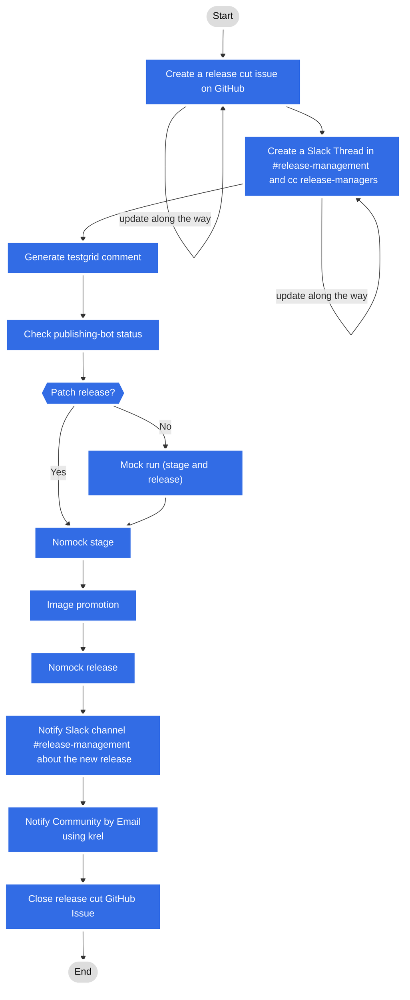

# Release Manager Handbook

- [Overview](#overview)
  - [Conventions](#conventions)
- [Prerequisites](#prerequisites)
  - [Onboarding](#onboarding)
  - [Machine setup](#machine-setup)
    - [Operating System](#operating-system)
    - [Release tooling](#release-tooling)
    - [Google Cloud SDK](#google-cloud-sdk)
    - [Sending mail](#sending-mail)
      - [Mailing List Permissions](#mailing-list-permissions)
    - [Skopeo](#skopeo)
- [Release cutting](#release-cutting)
  - [Creating and managing the release issue](#creating-and-managing-the-release-issue)
    - [Testgrid](#testgrid)
    - [Cloud Build job data](#cloud-build-job-data)
    - [Closing the issue](#closing-the-issue)
  - [Release types](#release-types)
  - [Mock vs nomock](#mock-vs-nomock)
  - [Release validation](#release-validation)
- [Patch release management](#patch-release-management)
  - [Getting started with patch releases](#getting-started-with-patch-releases)
  - [Cherry-pick requests](#cherry-pick-requests)
  - [Branch health](#branch-health)
  - [Release timing](#release-timing)
  - [Patch release cut](#patch-release-cut)
  - [Hotfix release](#hotfix-release)
- [Security releases](#security-releases)
- [Branch management](#branch-management)
  - [Release branch creation](#release-branch-creation)
  - [Configure merge automation](#configure-merge-automation)
    - [Tide](#tide)
    - [Code Freeze](#code-freeze)
    - [Code Thaw](#code-thaw)
  - [Branch fast forward](#branch-fast-forward)
  - [Reverts](#reverts)
  - [Cherry picks during code freeze](#cherry-picks-during-code-freeze)
- [Staging repositories](#staging-repositories)
- [Debugging](#debugging)
- [Search past builds](#search-past-builds)
- [Release commands cheat sheet](#release-commands-cheat-sheet)
- [References](#references)
- [Background information](#background-information)
- [Visual release cut process](#visual-release-cut-process)

## Overview

Release Managers are responsible for cutting Kubernetes releases (alpha, beta,
RC, official, and patch), managing release branches, handling cherry picks, and
coordinating security fixes. This handbook covers the full lifecycle of release
management, from cutting pre-releases during the development cycle through
ongoing patch release management after the official release.

For the step-by-step release cutting procedure, see the
[Release Cut Handbook](release-cuts.md).

### Conventions

In this handbook, we will make several references to Kubernetes releases,
milestones, and [semantic versioning](https://semver.org/).

For the purposes of this handbook, we'll assume that:

- the current release in development is Kubernetes 1.36
- the previous release is Kubernetes 1.35
- the next release is Kubernetes 1.37
- the release no longer in support is Kubernetes 1.32

To simplify certain instructions, we will make the following connections:

| Text | SemVer | Reference Release |
|---|---|---|
| "current release", "current milestone", "in development" | `x.y` | Kubernetes 1.36 |
| "previous release", "previous milestone" | `x.y-1` | Kubernetes 1.35 |
| "next release", "next milestone" | `x.y+1` | Kubernetes 1.37 |
| "release no longer in support" | `x.y-4` | Kubernetes 1.32 |

**As an editor of this content, Release Managers should periodically update
these conventions and the examples contained within this handbook.**

## Prerequisites

This is a collection of requirements and conditions to fulfill when taking on
the role as Release Manager.

### Onboarding

**Before we can grant Release Manager access to new Release Managers, a
[Release Manager onboarding issue](https://github.com/kubernetes/sig-release/issues/new?labels=sig%2Frelease%2C+area%2Frelease-eng&template=release-manager.md&title=Release+Manager+access+for+%3CGH-handle%3E)
_MUST_ be opened in this repo. Please take a moment to do that before executing
the tasks contained in this handbook.**

### Machine setup

#### Operating System

There's a small amount of effort to ensure our [release tools] are supported on
multiple platforms, please note that only the following systems are supported:

- Debian-like (Debian, Ubuntu)
- Fedora-like (Fedora, RHEL, CentOS)
- MacOS

Windows is not supported by [release tools].

While our tooling may not support every platform, you may find success running
within a container image.

See "Cutting v1.15.0-alpha.2" under [References](#references) for an example
Dockerfile.

**If you notice that [release tools] are not working as expected, please file an
issue in [kubernetes/release].**

#### Release tooling

To use and contribute to our [release tools], Release Managers will need to fork
and clone the [kubernetes/release] repo.

Building and publishing releases requires the latest revision of the release
tools. The release tools can be compiled by running the following command from
the [kubernetes/release] repository:

```shell
make release-tools
```

Release Managers primarily use an SSH key to authenticate to GitHub.

GitHub has documentation to assist in:

- [Connecting to GitHub with SSH](https://help.github.com/en/github/authenticating-to-github/connecting-to-github-with-ssh)
- [Forking a repo](https://help.github.com/en/github/getting-started-with-github/fork-a-repo)

Additionally, `kubernetes/community` has a great
[overview of the GitHub workflow](https://git.k8s.io/community/contributors/guide/github-workflow.md)
we use across several Kubernetes org repositories.

Please take a moment to review the above documentation before continuing.

#### Google Cloud SDK

[Kubernetes release artifacts](/release-engineering/reference/artifacts.md) are stored on
Google Cloud Platform (GCP).

Release Managers will need to use the Google Cloud SDK to interact with release
artifacts.

Google Cloud has
[documentation on installing and configuring the Google Cloud SDK CLI tools](https://cloud.google.com/sdk/docs/quickstarts).

To authenticate the Google Cloud SDK tool with your GCP account, you can run:

```shell
gcloud auth login
```

It might ask you to define the default project, region, and similar settings.
The project can be set to `kubernetes-release-test`, while other settings can be
ignored.

In addition to `gcloud,` `gsutil` is required as well. By default, it comes
with Google Cloud SDK.

#### Sending mail

At the end of a release, Release Managers will need to announce the new release
to the community.

> NOTE: ALL OF THE FOLLOWING `krel` COMMANDS RUN AS MOCK (NO CHANGES) BY
> DEFAULT. No mock (`--nomock`) must be specified for command to execute / take
> action. This is clear in the output based on the targeted email test groups,
> but not obvious before running the command.

This can be done in one of two ways:

- Using `krel announce send`, which sends the announcement via the Gmail API
  with Google OAuth. A browser window will open for authentication:
  ```shell
  krel announce send --tag vX.Y.0-{alpha,beta,rc}.Z --nomock
  ```
- Manually: send the email notification manually to
  [kubernetes-announce][k-announce-list] and [kubernetes-dev][k-dev-list]. You
  can get the announcement content in one of the following ways:
  - By taking the contents from the Release Cloud Bucket:
    `https://dl.k8s.io/release/v1.y.z/announcement.html` and using the subject
    "[kubernetes-announce] Kubernetes v1.y.z is live!", for example:
    - https://dl.k8s.io/release/v1.31.1/announcement.html
  - By using `krel announce send` with the `--print-only` flag

See the [Release Commands Cheat Sheet](#release-commands-cheat-sheet) for
example commands.

[k-announce-list]: https://groups.google.com/forum/#!forum/kubernetes-announce
[k-dev-list]: https://groups.google.com/a/kubernetes.io/g/dev
[release tools]: https://github.com/kubernetes/release#tools
[kubernetes/release]: https://github.com/kubernetes/release

##### Mailing List Permissions

Permissions to send mail to the
[kubernetes-announce](https://groups.google.com/g/kubernetes-announce) are
managed in Google Groups. To request access please reach out to the
[list owners](https://groups.google.com/g/kubernetes-announce/members?q=role%3Aowner)
in Slack.

#### Skopeo

[Skopeo][skopeo] is a command line utility that performs various operations on
container images and image repositories. Skopeo is not required for performing
release management tasks (if needed, Docker and other relevant tools can be used
instead), however, it might be referred to by other guides. If you want to
install Skopeo, you can follow the
[official installation guide][skopeo-install].

[skopeo]: https://github.com/containers/skopeo
[skopeo-install]: https://github.com/containers/skopeo/blob/master/install.md

## Release cutting

**General overview**:

Public build artifacts are published and an email notification goes out to the
community. You will become very familiar with the following commands over the
course of the release cycle:

- `krel stage/release` for creating releases
- `krel announce send` to send the announcement email notification.

For the detailed step-by-step procedure, see the
[Release Cut Handbook](release-cuts.md).

### Creating and managing the release issue

Prior to cutting a release version,
[open a "Cut a Release" issue](https://github.com/kubernetes/sig-release/issues/new?template=cut-release.md&title=Cut+1.x.y-%7Balpha%2Cbeta%2Crc%7D.z+release)
on [kubernetes/sig-release](https://github.com/kubernetes/sig-release).

On the issue template, there are comments describing the predefined items that
need to be completed.

#### Testgrid

For the item `Screenshot unhealthy release branch testgrid boards...`:

`krel testgridshot` fetches the current status of
[Testgrid](https://testgrid.k8s.io/) dashboards to keep as a reference of the
state they were in before cutting a release. This subcommand queries the
Testgrid JSON summaries and generates a Markdown table listing failing (or other
specified state) jobs.

To invoke the subcommand, run it with the branch you are working on:

```
krel testgridshot --branch 1.36
```

You can include other testgrid states in the output and even have krel
autocomment the issue for you:

```
krel testgridshot --branch 1.36 --github-issue 12345 --states=FLAKY
```

Once the script generates the Markdown table, post it as a comment on the
created issue. You can take a look at the
[following comment](https://github.com/kubernetes/sig-release/issues/1249#issuecomment-696702503)
as an example.

#### Cloud Build job data

When running a release cut, you should open a thread in the
[#release-management][release-management-url] Slack channel and include links to
the GCP build console. You can take a look at the
[following thread][example-release-thread] as an example.

[release-management-url]: https://app.slack.com/client/T09NY5SBT/CJH2GBF7Y
[example-release-thread]: https://kubernetes.slack.com/archives/CJH2GBF7Y/p1600247891103600

Once the release runs are complete (nomock only for patch releases, mock and
nomock for all other release types), data about the jobs launched must be
collected in the issue. These are assembled in a table and correspond to the
`Collect metrics, links...` check mark.

After the release process has been completed, get the data table by using the
`krel history` subcommand. It will output a markdown table with the options used
to run the jobs, links to the GCB logs, and the result of each run.

```shell
krel history --branch release-1.xy --date-from <date-of-release>
```

The generated table is then appended to the release issue, as it can be seen in
the
[following issue for the v1.20.0-alpha.1 release](https://github.com/kubernetes/sig-release/issues/1249#issue-705792603).

__Note:__ `krel history` works using the
[Default Application Credentials](https://cloud.google.com/sdk/gcloud/reference/auth/application-default)
set in your environment. While you may be logged as a user with one or more
Google accounts in the GCP SDK (which are used in `gsutil`, `gcloud`, etc), you
need to make sure your user identity is set as DAC as software using the Google
Cloud libraries uses it to authenticate.

If you have not set any Default Application Credentials previously, krel will
notify you. If you have another user or a service account you will simply get an
authentication error.

Use the following command to start the authorization flow to set your default
credentials:

```shell
gcloud auth application-default login
```

#### Closing the issue

After having thoroughly read the section on cutting a release version of the
handbook, and that all items on the checklist have completed (you may include
notes on events that was unique to cutting that release version as comments),
close the issue with `/close` as a comment the issue thread.

### Release types

Release Managers cut the following types of releases throughout the cycle. The
step-by-step procedure for each is in the
[Release Cut Handbook](release-cuts.md).

- **Alpha releases** are cut from `master` using `krel stage --type alpha`.
  They are the earliest pre-releases.
- **Beta releases** are cut from `master` using `krel stage --type=beta`.
- **Release candidates (RC)** are cut from the `release-x.y` branch using
  `krel stage --type=rc --branch=release-x.y`. If this is the first release
  (`rc.0`), there are additional tasks in the
  [Release Branch Creation section](#release-branch-creation).
- **Official releases** are cut from the `release-x.y` branch using
  `krel stage --type=official --branch=release-x.y`.
- **Patch releases** are cut from the `release-x.y` branch. Mock runs are
  skipped for patch releases; proceed directly with `--nomock`.

In a perfect world, `rc.1` and the official release are the same commit. To get
as close to that state as possible:

1. PRs tagged with the release cycle milestone should have all merged onto
   `master`.
2. Run [`krel ff`](#branch-fast-forward) to ensure `master` and the release
   branch have the same commits.
3. Factors for lifting Code Freeze: zero pending PRs, no open issues tagged with
   the milestone, and no failing release-blocking tests.

### Mock vs nomock

Any `krel stage/release` command without the `--nomock` flag is a dry run. For
minor releases, RCs, alphas, and betas, it is highly encouraged to dry run first
before letting `krel stage/release` take any actual impact on the release
process. Mock building/releasing can help you verify that you have a working
setup.

For patch releases (x.y.z where z > 0), mock runs are skipped. The nomock
pipeline includes built-in safety checks that make a separate mock run
unnecessary for patches.

To get more information on `krel stage/release`, please refer to their
corresponding help (`-h`) output.

**Note: Mock builds can only be mock released. A nomock release requires a
nomock build to be staged.**

### Release validation

The following are some ways to determine if the release process was successful:

1. The build tag and release artifacts become
   [visible on GitHub at https://github.com/kubernetes/kubernetes/releases](https://github.com/kubernetes/kubernetes/releases)
2. The release is logged automatically by
   [k8s-release-robot](https://github.com/k8s-release-robot) in
   [k/sig-release](https://git.k8s.io/sig-release)
3. CHANGELOG-X.Y.md is automatically loaded into the kubernetes/kubernetes repo

## Patch release management

Release Managers are responsible for managing patches against Kubernetes release
branches and making the 1.X.Y patch releases during the support period after
each 1.X minor release. Kubernetes 1.X releases receive approximately one year
of support (for releases 1.19 and newer) in terms of patches for bugfixes and
ongoing CI ensuring the branch's health.

### Getting started with patch releases

You're here because you've volunteered and have been selected to contribute to
patch release management for one or more branches. You will need to make
yourself known to the community and gain access to multiple build and release
tools:

* Add your name and contact info, and if applicable a new section for the
  current release, to the
  [Patch Releases landing page](https://github.com/kubernetes/website/blob/main/content/en/releases/patch-releases.md)
  so the community knows you're the point of contact.
* Peribolos is used for GitHub team membership. You need to be a member of the
  [kubernetes-release-managers](https://github.com/orgs/kubernetes/teams/kubernetes-release-managers/members)
  team to have write access to the main repository. Send a pull request against
  the
  [sig-release teams configuration](https://git.k8s.io/org/config/kubernetes/sig-release/teams.yaml)
  adding your userid to the kubernetes-release-managers member list.
* Ask the list owner(s) to add you to the
  [release-managers-private](https://groups.google.com/a/kubernetes.io/forum/#!forum/release-managers-private)
  via the owner contact form
  [here](https://groups.google.com/forum/#!contactowner/kubernetes-dev).
* Ask the list owner(s) to give you access to post to these mailing lists:
   * [kubernetes-announce](https://groups.google.com/forum/#!forum/kubernetes-announce)
     via owner contact form
     [here](https://groups.google.com/forum/#!contactowner/kubernetes-announce)
   * [kubernetes-dev-announce](https://groups.google.com/forum/#!forum/kubernetes-dev-announce)
     via owner contact form
     [here](https://groups.google.com/forum/#!contactowner/kubernetes-dev-announce)
* If applicable, sync up with the outgoing Release Manager to take ownership of
  any lingering issues on the branch.
* Review the [Prerequisites](#prerequisites) and
  [Release cutting](#release-cutting) sections of this handbook, as much of the
  tooling and process used during pre-release relates to the post-release duties
  of patch release management.

While this handbook is intended to guide Release Managers, it largely consists
of opinions and recommendations from former patch release managers. Each Release
Manager is ultimately responsible for carrying out their duties in the manner
they deem best for the project. The handbook is more what you might call
"guidelines" than actual hard rules. Still each Release Manager should endeavor
to keep this document up to date, improve its content, and improve the overall
process of patch management for the project.

### Cherry-pick requests

As a Release Manager, you are responsible for reviewing
[cherry-picks](https://git.k8s.io/community/contributors/devel/sig-release/cherry-picks.md)
on your release branch.

**Finding outstanding cherry-picks**

Use a GitHub search such as
[`is:pr is:open label:do-not-merge/cherry-pick-not-approved base:release-1.36`](https://github.com/kubernetes/kubernetes/pulls?utf8=%E2%9C%93&q=is%3Aopen+is%3Apr+base%3Arelease-1.36+label%3Ado-not-merge%2Fcherry-pick-not-approved+)
to find all un-triaged cherry-pick PRs for a branch.

**Review criteria**

For each cherry-pick request, make sure the PR author has supplied enough
information to answer:

* What bug does this fix?
  (e.g. *enhancement X was already launched but doesn't work as intended*)
* What is the scope of users affected?
  (e.g. *anyone who uses enhancement X*)
* How big is the impact on affected users?
  (e.g. *pods using X fail to start*)
* How have you verified the fix works and is safe?
  (e.g. *added new regression test*)

Ask the PR author for details if these are missing and not obvious. If you
are not sure what to do, escalate to the relevant SIGs.

Version bumps for dependencies with their own release cycles (e.g. kube-dns,
autoscaler, ingress controllers) deserve special attention because it is hard
to see what is changing. Check the release notes for the dependency to make
sure there are no new behaviors that could destabilize the release branch.

Also verify the cherry-pick has an appropriate release note that describes the
change from a user's perspective. Almost all changes that are important enough
to cherry-pick are important enough that we should inform users about them when
they upgrade.

User perspective (good) | Code perspective (bad)
----------------------- | ----------------------
*"Fix kubelet crash when Node detaches old volumes after restart."* | *"Call initStuff() before startLoop() to prevent race condition."*

**Approving cherry-picks**

Once the review criteria are met, approve the PR through the GitHub review
feature. The
[Prow `cherry-pick-approved` plugin](https://github.com/kubernetes-sigs/prow/tree/main/pkg/plugins/cherrypickapproved)
handles the rest automatically. When a configured cherry-pick approver submits
a GitHub review approval, the plugin verifies that the PR has `lgtm` and
`approved` labels, no blocking labels (hold, needs-rebase, WIP, etc.), and no
failed tests. If all checks pass, it adds the `cherry-pick-approved` label and
removes `do-not-merge/cherry-pick-not-approved`. The PR then merges through
the normal submit queue.

The list of cherry-pick approvers is maintained in the
[Prow plugin configuration](https://github.com/kubernetes/test-infra/blob/master/config/prow/plugins.yaml)
under the `cherry_pick_approved` section.

### Branch health

Keep an eye on approved cherry-pick PRs to make sure they aren't getting blocked
on presubmits that are failing across the whole branch. Also periodically check
the [testgrid](https://testgrid.k8s.io) dashboard for your release branch to
make sure the continuous jobs are healthy.

Escalate to test owners,
[sig-testing](https://git.k8s.io/community/sig-testing), and
[test-infra](https://git.k8s.io/test-infra) as needed to diagnose failures.

### Release timing

The general guideline is to leave about 2 to 4 weeks between patch releases on
a given minor release branch. The lower bound is intended to avoid upgrade churn
for cluster administrators, and to allow patches time to undergo testing on
`master` and on the release branch. The upper bound is intended to avoid making
users wait too long for fixes that are ready to go.

The actual timing is up to the Release Manager, who should take into account
input from cherry-pick PR authors and SIGs. For example, some bugs may be
serious enough, and have a clear enough fix, to trigger a new patch release
immediately.

When you have a plan for the next patch release, send an announcement
([example](https://groups.google.com/forum/#!topic/kubernetes-dev-announce/HGYsjOFtcdU)):

* TO: [kubernetes-dev@googlegroups.com](https://groups.google.com/a/kubernetes.io/g/dev)
* *BCC*: [kubernetes-dev-announce@googlegroups.com](https://groups.google.com/forum/#!forum/kubernetes-dev-announce)

several working days in advance, including a release notes preview. Also update
the
[posted schedule](https://git.k8s.io/website/content/en/releases/patch-releases.md).

You generate the preview with the
[release-notes](https://github.com/kubernetes/release/tree/master/cmd/release-notes)
tool, run against a local checkout of the release branch with a `GITHUB_TOKEN`
set in your environment.

### Patch release cut

A few days before you plan to cut a patch release, put a temporary freeze on
cherry-pick requests by removing the `cherry-pick-approved` label from any PR
that isn't ready to merge. Leave a comment explaining that a freeze is in effect
until after the release.

The freeze serves several purposes:

1.  It ensures a minimum time period during which problems with the accepted
    patches may be discovered by people testing on `master`, or by continuous
    test jobs on the release branch.
2.  It allows the continuous jobs to catch up with `HEAD` on the release branch.
    Note that you cannot cut a patch release from any point other than `HEAD` on
    the release branch.
3.  It allows slow test jobs like "serial", which has a period of many hours, to
    run several times at `HEAD` to ensure they pass consistently.

Mock builds are no longer required for patch releases. The nomock pipeline
includes built-in safety checks (provenance verification, deterministic builds)
that make a separate mock run unnecessary. Proceed directly with the `--nomock`
stage and release on the day of the cut.

If CI tests show the branch is healthy, run the release cut using the `--nomock`
argument in the commands. Then announce the release:

```bash
krel announce send --tag vX.Y.Z --nomock
```

This sends the formatted announcement to the kubernetes-dev and
kubernetes-announce mailing lists via the Gmail API. A browser window will open
for OAuth authentication. Use `--no-browser` in headless environments.

After the release cut, reapply the `cherry-pick-approved` label to any PRs that
had it before the freeze, and go through the backlog of new cherry-picks.

Update the
[posted schedule](https://git.k8s.io/website/content/en/releases/patch-releases.md)
to reflect the actual release date and any initial info on the next release's
timing.

### Hotfix release

A normal patch release rolls up everything that merged into the release branch
since the last patch release. Sometimes it's necessary to cut an emergency
hotfix release that contains only one specific change relative to the last past
release. For example, we may need to fix a severe bug quickly without taking on
the added risk of allowing other changes in.

In this case, you would create a new, three-part branch of the form
`release-X.Y.Z`, branching from the tag `vX.Y.Z`. You would then use the normal
cherry-pick PR flow, except that you target PRs at the `release-X.Y.Z` branch
instead of `release-X.Y`. This lets you exclude the rest of the changes that
already went into `release-X.Y` since the `vX.Y.Z` tag was cut.

Make sure you communicate clearly in your release plan announcement that some
changes on the release branch will be excluded, and will have to wait until the
next patch release.

## Security releases

Security fixes require coordination with the Security Response Committee (SRC).
See the [Security Releases Handbook](security-releases.md) for the
full process, including CVE data maps, announcement procedures, and embargo
requirements.

## Branch management

This section discusses the methods in managing commits on the `release-x.y`
branch.

### Release branch creation

See
[this section](release-cuts.md#next-release-branch-creation) of
the release cut handbook for more info.

Run through the tasks detailed in the
[post-release branch creation handbook](branch-creation.md)
after the `rc.0` release is communicated and therefore the release branch has
been created.

---

### Configure merge automation

Between the [Code Freeze](#code-freeze) and lifting Code Freeze
([Code Thaw](#code-thaw)) period, merging new code is restricted. The main focus
is on fixing existing code and getting green test builds on Testgrid. Preventing
new code is implemented by config changes for [tide]. The `master` and current
release cycle branch (`release-x.y`) are the only branches affected during this
period.

Code freeze initiates additional merge requirements, while Code thaw marks the
switch back to the development phase. Look at the
[release cycle timeline](https://github.com/kubernetes/sig-release/tree/master/releases)
for the exact dates for code freeze and code thaw. Usually the date for code
thaw is flexible depending on pending PRs.

As Release Manager, coordinate with the Release Lead on checking the exact
config changes required to enable and disable merge restrictions.

#### Tide

Tide automates merges and is configured via a
[config.yaml](https://github.com/kubernetes/test-infra/blob/master/config/prow/config.yaml)
file. Tide identifies PRs that are mergeable using GitHub queries that correspond
to the configuration. Here is an example of what the query config for
`kubernetes/kubernetes` looks like without additional constraints related to the
release cycle:

```yaml
  - repos:
    - kubernetes/kubernetes
    labels:
    - lgtm
    - approved
    - "cncf-cla: yes"
    missingLabels:
    - do-not-merge
    - do-not-merge/blocked-paths
    - do-not-merge/cherry-pick-not-approved
    - do-not-merge/hold
    - do-not-merge/invalid-owners-file
    - do-not-merge/release-note-label-needed
    - do-not-merge/work-in-progress
    - do-not-merge/needs-kind
    - do-not-merge/needs-sig
    - needs-rebase
```

During code freeze, two queries are used instead of just one for the
`kubernetes/kubernetes` repo. One query handles the `master` and current release
branches while the other query handles all other branches. The partition is
achieved with the `includedBranches` and `excludedBranches` fields.

#### Code Freeze

Code freeze means the code is "frozen" and there will not be any further
modifications from the developers.

Release Managers create the "freeze" by altering the Tide merge requirements for
the `master` and current `release-x.y` branch from the other branches (enforced
by Tide with two queries).

We only add additional merge requirements for PRs to these two branches for code
freeze:

- PRs must be in the GitHub milestone for the current release.

Milestone requirements are configured by adding `milestone: vX.Y` to a query
config.

It is also helpful to remind
[#sig-testing](https://kubernetes.slack.com/messages/C09QZ4DQB) when code freeze
starts so they know not to do any major changes.

```yaml
  - repos:
    - kubernetes/kubernetes
    milestone: v1.36
    includedBranches:
    - master
    - release-1.36
    labels:
    - lgtm
    - approved
    - "cncf-cla: yes"
    missingLabels:
      # as above...
  - repos:
    - kubernetes/kubernetes
    excludedBranches:
    - master
    - release-1.36
    labels:
    - lgtm
    - approved
    - "cncf-cla: yes"
    missingLabels:
      ...
```

Example PR:

 - [1.18](https://github.com/kubernetes/test-infra/pull/16603)
 - [1.17](https://github.com/kubernetes/test-infra/pull/15301)

#### Code Thaw

Code Thaw removes the release cycle merge restrictions and replaces the two
queries with one single query. We remain in this state until the next Code
Freeze.

```yaml
  - repos:
    - kubernetes/kubernetes
    labels:
    - lgtm
    - approved
    - "cncf-cla: yes"
    missingLabels:
    ...
```

Update the `milestoneapplier` plugin configs for the following repos to the
**_next_** milestone:

- `kubernetes/enhancements`
- `kubernetes/kubernetes`
- `kubernetes/release`
- `kubernetes/sig-release`
- `kubernetes/test-infra`

Example PRs:

- [1.33](https://github.com/kubernetes/test-infra/pull/34693)

> [!IMPORTANT]
After Code Thaw is performed, remind @release-managers to perform the
preparatory tasks for the next `alpha.1` cut, such as setting up the new OBS
project.

[tide]: https://github.com/kubernetes-sigs/prow/tree/main/pkg/tide

### Branch fast forward

We now run the branch fast forward automatically to even the branches.

Noted that no need for manual cherry-pick against current release and the job
would be promoted to
[release-blocking](https://testgrid.k8s.io/sig-release-releng-blocking#git-repo-kubernetes-fast-forward).

Once code freeze is lifted ([code thaw](#code-thaw) occurred), PRs that need to
be merged onto the release branch are cherry-picked over from `master`.

### Reverts

During code freeze it is especially important to first look at the list of
commits on `master` since the prior fast forward, scanning their content and
issues/PRs to ensure they are changes expected for this milestone.

**The merge-blocking mechanisms are relatively weak.**

It is possible still for some people to write directly to the repo (bypassing
blocking mechanisms) as well as for unintentional milestone maintainers to
approve a merge incorrectly. The Release Manager is the last line of defense.

If code incorrectly merges onto `master` it should be reverted in `master`.
Alternatively, release branch management must go to all cherry picks, picking
around the incorrectly added commit.

### Cherry picks during code freeze

During code freeze, cherry-pick handling follows the same
[review criteria](#cherry-pick-requests) as patch releases, but with additional
considerations:

- Check regularly for new cherry picks with
  [`is:open is:pr base:release-x.y label:do-not-merge/cherry-pick-not-approved`](https://github.com/kubernetes/kubernetes/pulls?utf8=%E2%9C%93&q=is%3Aopen+is%3Apr+base%3Arelease-1.36+label%3Ado-not-merge%2Fcherry-pick-not-approved)
- Each cherry-pick diverges the latest release candidate from the bits to be
  released as the official release
- Engage with the cherry-pick requester: how important is it, can it be pushed
  to a later release (patch or minor)?
- Discuss controversial cherry-picks in
  [#sig-release](https://kubernetes.slack.com/messages/sig-release) or at the
  burndown meeting
- If cherry-picks merge, consider whether another release candidate is needed

Identify
[release blocking issues or PRs](https://github.com/kubernetes/sig-release/blob/master/release-blocking-jobs.md)
as soon as possible and let the release lead know if there is not enough
attention on them.

After the official release has been published, Release Managers continue
handling cherry picks as part of [patch release management](#patch-release-management).

## Staging repositories

The [publishing-bot](https://github.com/kubernetes/publishing-bot) is
responsible for publishing the code in
[staging](https://git.k8s.io/kubernetes/staging/src/k8s.io) to their own
repositories.

The bot also syncs the Kubernetes version tags to the published repos, prefixed
with `kubernetes-`. For example, if you check out the `kubernetes-1.16.0` tag in
client-go, the code you get is exactly the same as if you check out the
`v1.16.0` tag in Kubernetes, and change the directory to
`staging/src/k8s.io/client-go`.

[client-go](https://github.com/kubernetes/client-go) follows
[semver](https://semver.org/) and has its own release process. This release
process and the publishing-bot are maintained by SIG API Machinery. In case of
any questions related to the published staging repos, please ask someone listed
in the following
[OWNERS](https://git.k8s.io/publishing-bot/OWNERS) file.

The bot runs every four hours, so it might take sometime for a new tag to appear
on a published repository.

The client-go major release (e.g. `v1.18.0`) is released manually a day after
the main Kubernetes release.

## Debugging

To debug `krel stage/release` you can set the log level to `debug` by doing
`krel --log-level debug [args]`. There is also a `trace` log level for maximum
output verbosity. The log level is passed correctly to the Google Cloud console
and can be inspected there.

## Search past builds

To search past `cloudbuilds` to make any kind of analysis and check metrics you
can use the Google Cloud Console for that. You can access
[Google Cloud Build History](https://console.cloud.google.com/cloud-build/builds?project=kubernetes-release-test).

There you can see all the `cloudbuilds` that already ran or if there is any one
running in the moment you can see that as well.

To filter for a specific build or set of builds you can use the `Filter Builds`
textbox. When you click there it opens a dropdown box to you select which kind
of keys you want to filter.

For example you can select `Tags` and then add the tags you want to filter,
like, `Tags: release-1.36 Status: Successful`.

## Release commands cheat sheet

For more information in how to run `krel stage/release` please check their
corresponding command line help (`-h`) outputs.

| Action | Example |
| --- |--- |
| Make sure you have latest release tooling | ```cd ~/go/src/k8s.io/release && git pull``` |
| Configure branch | n/a |
| Official build staging | `krel stage --nomock --type=official --branch=release-x.y` |
| Official build staging success? | Visually confirm yes |
| Official release | `krel release --nomock --type=official --branch=release-x.y --build-version=…` |
| Official email notify test | ```krel announce send --tag vX.Y.Z``` |
| Check mail arrives, list has expected commits? | manual/visual |
| Package testing | Visually validate [yum repo](https://pkgs.k8s.io/core:/stable:/v1.x/rpm/repodata/) and [apt repo](https://pkgs.k8s.io/core:/stable:/v1.x/deb/Packages) have entries for the release version in package NVRs (Name-Version-Release) |
| Official email notify | ```krel announce send --tag vX.Y.Z --nomock``` |
| Check mail arrives | manual/visual check that [k-announce](https://groups.google.com/forum/#!forum/kubernetes-announce) and [k-dev](https://groups.google.com/a/kubernetes.io/g/dev) got mail OK |
| Completion | n/a |

## References

- [Release Tools Documentation](https://github.com/kubernetes/release/blob/master/README.md)
- [Generic Release Steps](https://docs.google.com/document/d/1x-GQDZpKk3WajtSnO0axDazE9Xs2mOSVgjziIuTWNO0/edit)
- [Detailed overview (Cutting v1.15.0-alpha.2)](https://docs.google.com/document/d/1Xv5w_eNvLvD-nNinMNqQAh0qlzee8btqAyHyFFMz3z4/edit?usp=sharing)
- If you prefer a video walk-through, see
  [cutting release candidate v1.15.0-rc.1](https://youtu.be/ldYt1elShD4).

### Test Infra references

Concerns and questions can be directed to
[#testing-ops](https://kubernetes.slack.com/messages/C7J9RP96G) and
[#sig-testing](https://kubernetes.slack.com/messages/C09QZ4DQB). For urgent
matters, please contact the user group
[@test-infra-oncall](https://get.slack.help/hc/en-us/articles/212906697-Create-a-user-group#browse-user-groups-and-view-members)
on Slack.

- [Prow](https://github.com/kubernetes-sigs/prow) the Kubernetes-based CI/CD
  system
  - [PR Status](https://prow.k8s.io/pr)
  - [Tide Status](https://prow.k8s.io/tide)
- [Hound](https://cs.k8s.io/) a Kubernetes Codebase Search
- [Kubernetes DevStats](https://k8s.devstats.cncf.io/) displays Kubernetes
  Developer Productivity
- [Kubernetes On-call Rotation](https://go.k8s.io/oncall) displays the current
  Test Infra person on call
- [APISnoop](https://apisnoop.cncf.io/) snoops on the Kubernetes OpenAPI
  communications
  - [Source](https://github.com/cncf/apisnoop)
- [TestGrid](https://testgrid.k8s.io/) displays Kubernetes CI tests results in
  grids
  - [Source](https://github.com/GoogleCloudPlatform/testgrid)

## Visual release cut process

The diagram below shows the actions needed to cut a Kubernetes release:


