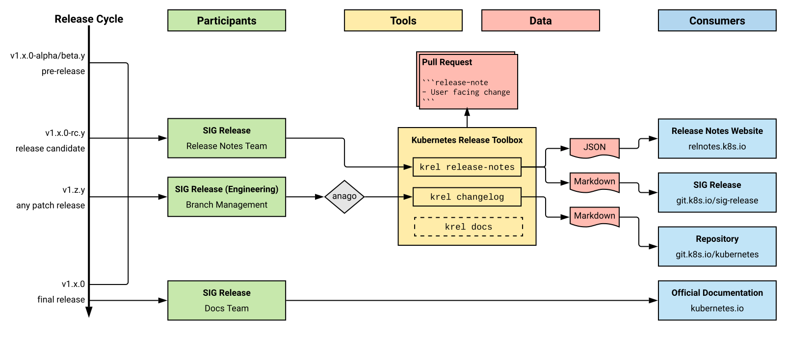

# Kubernetes Release Notes Overview

The process around the creation of the Release Notes in Kubernetes falls into
the responsibility of SIG Release. Multiple teams are involved in the
process as well as different publishing targets (or consumers). The current
state of the involved participants and tooling looks like this:

During the release cycle, the **Release Notes** sub-team of the Release Team continuously
creates drafted Markdown and JSON versions of the ongoing release. The [Release
Notes Website](https://relnotes.k8s.io) as well as this repository are updated
throughout the cycle.

The **Branch Managers** (part of the [Release Managers group](https://git.k8s.io/website/content/en/releases/release-managers.md)) update
[`kubernetes/kubernetes`](https://git.k8s.io/kubernetes) throughout the release cycle.
This happens as part of the release cuts in an
automated fashion.

The **Documentation** sub-team of the Release Team ensures that the official
[kubernetes.io](https://kubernetes.io) website gets updated after the final
release version has been cut.

Patch releases happen on their own [cadence](https://git.k8s.io/website/content/en/releases/patch-releases.md), separate from the active release
schedule. The **Patch Release Team** (part of the [Release Managers group](https://git.k8s.io/website/content/en/releases/release-managers.md)) takes
care of updating the relevant repositories during a patch release.
