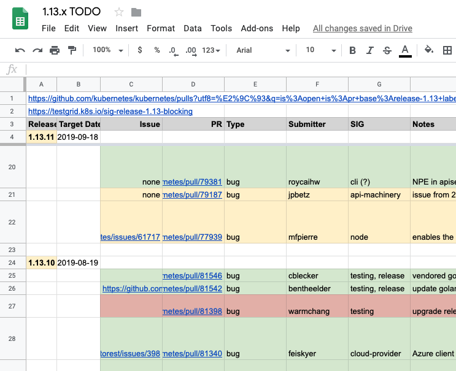

# Patch Release Team Playbook <!-- omit in toc -->

As the name implies, Patch Release Team members are responsible for
managing patches against Kubernetes release branches and making the
1.X.Y patch releases during the support period after each 1.X minor
release.  Kubernetes 1.X releases receive approximately 9 months
of support in terms of patches for bugfixes and ongoing CI insuring
the branch's health and the ability to update from 1.X.Y to 1.(X+1).Y,
for the newest Y on each of those two branches.

- [Prerequisites for Patch Release Team members](#prerequisites-for-patch-release-team-members)
  - [General Requirements](#general-requirements)
- [Getting started](#getting-started)
- [Cherry-pick requests](#cherry-pick-requests)
- [Patch branch merge workflow and status tracking](#patch-branch-merge-workflow-and-status-tracking)
  - [Rationale](#rationale)
  - [Spreadsheets](#spreadsheets)
    - [Time Ordered Rows](#time-ordered-rows)
    - [Coloring](#coloring)
    - [Row Details](#row-details)
  - [Future Work](#future-work)
- [Branch health](#branch-health)
- [Release timing](#release-timing)
- [Release cut](#release-cut)
  - [Hotfix release](#hotfix-release)
  - [Security release](#security-release)
- [Release Commands Cheat Sheet](#release-commands-cheat-sheet)

---

Specific duties of the Patch Release Team include:

- Ensuring the release branch (e.g. `release-1.13`) remains in a
  healthy state as measured by the branch version specific release-blocking
  CI (e.g. for version 1.13 it is [testgrid sig-release-1.13-blocking
  board](https://testgrid.k8s.io/sig-release-1.13-blocking). If the
  build breaks or any CI for the release branch becomes unhealthy due
  to a bad merge or infrastructure issue, ensure that actions are
  taken ASAP to bring it back to a healthy state.
- Reviewing and approving [cherry
  picks](https://git.k8s.io/community/contributors/devel/sig-release/cherry-picks.md) to
  the release branch.
  - Patch releases should not contain new features, so ensure that
    cherry-picks are for bug/security fixes only.
  - Cherry picks should not destabilize the branch, so ensure that
    either the PR has had time to stabilize in master or will have
    time to stabilize in the release branch before the next patch
    release is cut.
- Setting the [schedule and cadence for patch
  releases](/releases/patch-releases.md) and cutting the
  [releases](https://github.com/kubernetes/kubernetes/releases).

While this playbook is intended to guide Patch Release Team members,
it largely consists of opinions and recommendations from former
patch release managers.  Each Patch Release Team member is ultimately
responsible for carrying out their duties in the manner they deem
best for the project.  The playbook then is more what you might
call "guidelines" than actual hard rules.  Still each Patch Release
Team member should endeavor to keep this document up to date, improve
its content, and improve the overall process of patch management
for the project.

## Prerequisites for Patch Release Team members

### General Requirements

**Before continuing on to the Patch Release specific requirements listed below, please review and work through the tasks in the [Release Team Onboarding Guide](/release-team/release-team-onboarding.md).**


## Getting started

You're here because you've volunteered and have been selected to
contribute to patch release management for one or more branches.
You will need to make yourself known to the community and gain
access to multiple build and release tools:

* Add your name and contact info, and if applicable a new section
  for the current release, to the [Patch Releases landing
  page](/releases/patch-release.md) so the community knows you're the
  point of contact.  If your work is specific to one particular
  release, add your name to that release's release team in the patch
  release manager row, for example [here for
  1.13](https://git.k8s.io/sig-release/releases/release-1.13/release_team.md).
* Peribolos is used for GitHub team membership.  You need to be a member of the
  [kubernetes-release-managers](https://github.com/orgs/kubernetes/teams/kubernetes-release-managers/members)
  team to have write access to the main repository.  Send a pull request
  against the [sig-release teams configuration](https://git.k8s.io/org/config/kubernetes/sig-release/teams.yaml)
  adding your userid to the kubernetes-release-managers member list.
* Ask the list owner(s) to add you to the
  [release-managers-private](https://groups.google.com/a/kubernetes.io/forum/#!forum/release-managers-private)
  via the owner contact form [here](https://groups.google.com/forum/#!contactowner/kubernetes-dev).
* Ask the list owner(s) to give you access to post to these mailing lists:
   * [kubernetes-announce](https://groups.google.com/forum/#!forum/kubernetes-announce) via owner contact form [here](https://groups.google.com/forum/#!contactowner/kubernetes-announce)
   * [kubernetes-dev-announce](https://groups.google.com/forum/#!forum/kubernetes-dev-announce) via owner contact form [here](https://groups.google.com/forum/#!contactowner/kubernetes-dev-announce)
* If applicable, sync up with the outgoing release branch manager
  to take ownership of any lingering issues on the branch.
* Review the [Branch Manager
  Handbook](/release-engineering/role-handbooks/branch-manager.md) as
  much of the tooling and process used by the branch manager pre-release
  relates to the post-release duties of Patch Release management.
  Pay close attention to the
  [Pre-requirements](/release-team/role-handbooks/branch-manager#pre-requirements),
  [Safety Check](/release-team/role-handbooks/branch-manager#safety-check), and
  [Build and Release](/release-team/role-handbooks/branch-manager#build-and-release)
  sections.  This outlines current requirements for running `gcbmgr` to do
  builds.

## Cherry-pick requests

As a patch release manager, you are responsible for reviewing
[cherry-picks](https://git.k8s.io/community/contributors/devel/sig-release/cherry-picks.md)
on your release branch.

**Finding outstanding cherry-picks**

Use a GitHub search such as [`is:pr is:open
label:do-not-merge/cherry-pick-not-approved
base:release-1.13`](https://github.com/kubernetes/kubernetes/pulls?utf8=%E2%9C%93&q=is%3Aopen+is%3Apr+base%3Arelease-1.13+label%3Ado-not-merge%2Fcherry-pick-not-approved+)
to find all un-triaged cherry-pick PRs for a branch.

As an example of the kind of load to expect, there were close to
300 cherry-pick PRs against the 1.10 milestone during its approximately
9 month lifetime.

For each cherry-pick request:

1.  **Decide if it meets the criteria for a cherry-pick**

    Make sure the PR author has supplied enough information to answer:

    * What bug does this fix?
      (e.g. *enhancement X was already launched but doesn't work as intended*)
    * What is the scope of users affected?
      (e.g. *anyone who uses enhancement X*)
    * How big is the impact on affected users?
      (e.g. *pods using X fail to start*)
    * How have you verified the fix works and is safe?
      (e.g. *added new regression test*)

    Ask the PR author for details if these are missing and not obvious.
    If you aren't sure what to do, escalate to the relevant SIGs.

    **Notes**

    * Version bumps (e.g. v0.5.1 -> v0.5.2) for dependencies with their own
      release cycles (e.g. kube-dns, autoscaler, ingress controllers, etc.)
      deserve special attention because it's hard to see what's changing.
      In the past, such bumps have been a significant source of regressions in
      the stable release branch.

      Check the release notes for the dependency to make sure there are no new
      behaviors that could destabilize the release branch.
      Ideally you should only accept version bumps whose release deltas contain
      only changes that you would have approved individually, if they had been
      part of the Kubernetes release cycle.

      However, this gets tricky when there are fixes you need for your branch
      that are tied up with other changes. Ask the cherry-pick requester for
      context on the other changes and use your best judgment.

    * Historically (up through at least 1.6), there have been exceptions
      occasionally granted to the "no new enhancements" rule for
      cherry-picks that are confined to plugins like cloud providers
      (e.g. vSphere, Azure) and volumes (e.g. Portworx).

      However, we required that these exceptions be approved by the plugin
      owners, who were asked to `/approve` through the normal `OWNERS` process
      (despite it being a cherry-pick PR).

1.  **Make sure it has an appropriate release note**

    [Good release notes](https://github.com/kubernetes/community/issues/484)
    are particularly important for patch releases because cluster admins expect
    the release branch to remain stable and need to know exactly what changed.
    Take care to ensure every cherry-pick that deserves a release note has one
    *before you approve it* or else the change may fall through the cracks at
    release cut time.

    Also make sure the release note expresses the change from a user's
    perspective, not from the perspective of someone contributing to Kubernetes.
    Think about what the user would experience when hitting the problem,
    not the implementation details of the root cause.

    For example:

    User perspective (good) | Code perspective (bad)
    ----------------------- | ----------------------
    *"Fix kubelet crash when Node detaches old volumes after restart."* | *"Call initStuff() before startLoop() to prevent race condition."*

    Ask the PR author for context if it's not clear to you what the release note
    should say.

    Lastly, make sure the release note is located where the
    [relnotes](https://git.k8s.io/release/relnotes) script will
    find it.  You'll know it was not in such a place if the PR is
    labelled as `do-not-merge/release-note-label-needed`.  This can be
    resolved by either of:

    * If the cherry-pick PR comes from a branch called `automated-cherry-pick-of-*`,
      then the release notes are taken from each parent PR (possibly more than one)
      and the cherry-pick PR itself is ignored.

      Make sure the cherry-pick PR and parent PRs have the `release-note` label.

    * Otherwise, the release note is taken from the cherry-pick PR.

      Make sure the cherry-pick PR has the `release-note` label.

    **Notes**

    * Almost all changes that are important enough to cherry-pick are important
      enough that we should inform users about them when they upgrade.

      Rare exceptions include test-only changes or follow-ups to a previous
      cherry-pick whose release note already explains all the intended changes.

1.  **Approve for Cherry-pick**

    PRs on release branches follow a different review process than those on the
    `master` branch.  Patch Release Team members review every PR on the release branch,
    but the focus is just on ensuring the above criteria are met.
    The code itself was already reviewed, assuming it's copied from `master`, and
    should have `/lgtm` and `/approve` from the relevant reviewers and
    approvers in the code's associated OWNERS file.

    * For an *automated cherry-pick* (created with `hack/cherry_pick_pull.sh`),
      first make sure the parent PR has merged into master.

      If the parent PR hasn't merged yet, leave a comment explaining that you
      will wait for it before approving the cherry-pick.
      We don't want the release branch to get out of sync if the parent PR changes.

      If the parent PR has merged, comment `/lgtm` to apply the `lgtm` label and
      notify the author that you've reviewed the cherry-pick request.

      For cherry-picks that are clearly justified and low risk in your judgment,
      you can directly apply the `approved` label as long as the parent PR was
      approved and merged into `master`.

      If you lack sufficient context or have any doubts, leave a comment
      explaining that the PR needs to get an `/approve` from relevant OWNERS
      to ensure that the change is appropriate for a cherry-pick.

    * For a *manual patch or cherry-pick* (not a direct copy of a PR already merged
      on `master`), leave a comment explaining that it needs to get
      LGTM+Approval through the usual review process.

      You don't need to do anything special to fall back to this process.
      The bot will suggest reviewers and approvers just like on `master`.

    Compared to non-cherry-pick PR's, a cherry-pick PR has one
    additional merge criteria:  The Patch Release Team members are
    entrusted with applying the `cherry-pick-approved` label.  This
    is done manually directly through the GitHub UI, not through a
    Prow command.  In response, the bot will remove the
    `do-not-merge/cherry-pick-not-approved` label.

    Note that the PR will not actually merge until it meets all usual criteria
    enforced by the merge bot (`lgtm` + `approved` labels, required presubmits,
    etc.) and makes its way through the submit queue.

    Tide has pools per active branch, so release branch cherry-pick
    PRs pending merge will be visible as rows distinct from the master
    branch in the [Tide Status](https://prow.k8s.io/tide).

## Patch branch merge workflow and status tracking

###  Rationale

At any moment we typically have between a half dozen and a dozen
cherry pick PRs pending on each branch.  Many of these are in a
"cluster", picking the same change from master back to the various
release branches.  These can be found per branch by a query such as:
[is:open is:pr base:release-1.16
label:do-not-merge/cherry-pick-not-approved](https://github.com/kubernetes/kubernetes/pulls?utf8=✓&q=is%3Aopen+is%3Apr+base%3Arelease-1.16+label%3Ado-not-merge%2Fcherry-pick-not-approved+).

But these GitHub queries are point-in-time and do not show what's
changed versus a prior run of the query.  Intermediate state must
be externally recorded and updated for consistency.

### Spreadsheets

We maintain this evolving state in a set of spreadsheets, one
spreadsheet per release branch.  These are privately shared amongst
the patch release team because they contain information on inbound
PRs that relate to security patches and target release date information
that may be embargoed as per the Kubernetes security process (link).
The use of the Google Docs platform means the team can simultaneously
edit the state while also retaining a version history of changes
for the team's future reference.



#### Time Ordered Rows

The spreadsheets run in reverse chronological order with the newest
patch release's activity at the top.

Sections are made per patch release.

A row is entered in a section per cherry pick pending ahead of that
patch release.  Within each of these sections, cherry picks are
listed in reverse PR number order, newest on top.  To add a notation
for a newly inbound cherry pick, add a row above the current newest
row.

Using a consistent schema for rows and columns means the results
of triaging one cherry pick, when it is part of a cluster of cherry
picks on multiple branches pulling the same change from master, can
be copy/pasted between spreadsheets.  This on average saves a lot
of time and effort.  While we have settled into a roughly monthly
release cadence and release udpates for all branches simultaneously
most of the time, on occasion the branches do diverge both on release
timing and on state for a cluster of cherry picks of the same parent
PR, and this divergent state needs tracked distinctly per branch.

The result is roughly a running log of our activities with the
newest items on top.

#### Coloring

Rows are colored with red/yellow/green scheme to focus activity on
specific cherry picks:

 * red - a cherry pick that has been closed

 * yellow - a cherry pick that is open and has no 'cherry-pick-approved' label

 * green - a cherry pick that has the 'cherry-pick-approvel' label

Cells are colored with bright yellow or red to highlight special action
required, eg:

 * yellow - Eg: decision needed, is in Tide merge pool, is a CVE or security related

 * red - Eg: PR is held

#### Row Details

Each cherry pick row has a set of associated columns:

 * ***Issue*** - link to GitHub issue, or "none"

 * ***PR*** - link to the cherry pick PR

 * ***Kind*** - eg: "bug", "cleanup", "feature", etc. from the PR label

   * May be comma separated list depending on PR labels

   * If the bug is determined to be a CVE this should also be noted, eg:
     "bug CVE" and highlighted bright yellow.  This serves to help remind
     that these are important to not discuss publicly and may have
     additional external context not yet publicly in the GitHub PR.

 * ***Submitter*** - human contact for the cherry pick PR

 * ***SIG*** - comma separated list of SIGs labelled on the cherry pick PR

 * ***Notes*** - short, human readable summary of the cherry pick PR, eg:

   * "race in the ECR credentials provider kubernetes -> kubelet panic"

   * "NPE in apiserver(?) and/or cli{?)"

   * "upgrade release-1.13 to go1.11.13"

   * In general our community does not provide the best of PR summary lines
     and it can take considerable time for each patch release team member to
     get to an understanding of the PR content.  Once one of us has done
     that, storing it helps the rest of us as we collaboratively assess the
     merit of the cherry pick.

 * ***Disposition*** - "to merge?", "to close?", "to merge", "merging", "merged", "hold", "closed"

   * current short form thinking of the team regarding where the cherry pick is

   * "merging": when applying the ```cherry-pick-approved``` label in GitHub, update
     the disposition to "merging" and highlight it bright yellow.  These PRs
     will fall off the standard query of ```cherry-pick-not-approved``` PRs,
     but may not actually merge for example due to a test failure or a Tide
     hiccup, yet they need tracked until they have actually fully merged.
     Once merged the cell can move back to a basic green.

 * ***TODO*** - multi-line additional details on status and actions, where each
  line may be, eg:

   * "needs lgtm"

   * "needs approve"

   * "needs lgtm/approve"

   * "CVE-2018-1002105"

   * For many of the cherry picks, there is a corresponding cherry pick on
     other release branches which should be noted, eg:

     ```
     CP in other releases:
     1.13 https://github.com/kubernetes/kubernetes/pull/82503
     1.14 https://github.com/kubernetes/kubernetes/pull/82502
     1.15 https://github.com/kubernetes/kubernetes/pull/82384
     ```

     Filling this out means that once an issue is triaged for one branch,
     it's just a copy/paste of that row into the spreadsheet for the other
     branches.

   * It can be useful to note your name and a date next to a line of text
     here, especially early during the triage where we're trying to come to
     a consensus on the merit of the cherry pick.

A number of the fields here come from the parent PR automatically
when the cherry pick automation is used (this should be the norm
for most PRs).  The parent PRs may have poor labelling resulting
in incomplete labels on the cherry pick.  Attempt to clean then up
if possible or comment asking for owners to better disposition them.
When recording unsure status from labels add a "?" in the spreadsheet
cell to indicate the uncertainty.

### Future Work

 * It would be awesome to replace this manual stateful review workflow with a
   tool.  Such a tool appears to need invented.

 * Enhancing the cherry pick automation to accept a list of branches to
   target, add cross-reference mentions between the clustered GitHub pull
   requests, and assign the same human initial default reviewer to the set.

 * Enhancing the k8s-ci-robot and merge criteria automation such that
   features, api-changes, and non-critical-urgent pull requests are by default
   merge blocked.

## Branch health

Keep an eye on approved cherry-pick PRs to make sure they aren't getting blocked
on presubmits that are failing across the whole branch.
Also periodically check the [testgrid](https://k8s-testgrid.appspot.com)
dashboard for your release branch to make sure the continuous jobs are healthy.

Escalate to test owners,
[sig-testing](https://git.k8s.io/community/sig-testing), and
[test-infra](https://git.k8s.io/test-infra) as needed to diagnose
failures.

## Release timing

The general guideline is to leave about 2 to 4 weeks between patch releases on
a given minor release branch.
The lower bound is intended to avoid upgrade churn for cluster administrators,
and to allow patches time to undergo testing on `master` and on the release
branch.
The upper bound is intended to avoid making users wait too long for fixes that
are ready to go.

The actual timing is up to the patch release team, who should take into
account input from cherry-pick PR authors and SIGs.
For example, some bugs may be serious enough, and have a clear enough fix,
to trigger a new patch release immediately.

As a 1.X minor release is getting towards its final weeks pre-release, it
is beneficial to begin tracking that release team's meetings to get an
early idea of bugs for which the fix may need delays to the 1.X.1 first
patch release and ensure a smooth handoff from the release team into the
post-release patch support phase.

You should attend the [Kubernetes Community Meeting](http://bit.ly/k8scommunity)
whenever possible to give updates on activity in your release branch
(bugs, tests, cherry-picks, etc.) and discuss release timing.

When you have a plan for the next patch release, send an announcement
([example](https://groups.google.com/forum/#!topic/kubernetes-dev-announce/HGYsjOFtcdU)):

* TO: [kubernetes-dev@googlegroups.com](https://groups.google.com/forum/#!forum/kubernetes-dev)
* *BCC*: [kubernetes-dev-announce@googlegroups.com](https://groups.google.com/forum/#!forum/kubernetes-dev-announce)

several working days in advance, including a release notes preview.  Also
update the [posted schedule](https://git.k8s.io/sig-release/releases/patch-releases.md).

You generate the preview with the [relnotes](https://git.k8s.io/release/relnotes)
script, run against a local checkout of the release branch, and querying
GitHub via an API token associated with your GitHub identity.  For example:

```bash
~$ cd src/k8s.io/kubernetes
~/src/k8s.io/kubernetes$ git checkout release-1.13
~/src/k8s.io/kubernetes$ ../release/relnotes --htmlize-md \
		--markdown-file=$HOME/tmp/relnotes.md \
		--html-file=$HOME/tmp/relnotes.html \
		--preview
```

## Release cut

A few days before you plan to cut a patch release, put a temporary freeze on
cherry-pick requests by removing the `cherry-pick-approved` label from any PR that
isn't ready to merge.
Leave a comment explaining that a freeze is in effect until after the release.

The freeze serves several purposes:

1.  It ensures a minimum time period during which problems with the accepted
    patches may be discovered by people testing on `master`, or by continuous
    test jobs on the release branch.

1.  It allows the continuous jobs to catch up with `HEAD` on the release branch.
    Note that you cannot cut a patch release from any point other than `HEAD`
    on the release branch; for example, you can't cut at the last green build.

1.  It allows slow test jobs like "serial", which has a period of many hours,
    to run several times at `HEAD` to ensure they pass consistently.

On the day before the planned release, run a mock build with `gcbmgr`
to make sure the tooling is ready as per the [Branch Manager
Handbook](/release-engineering/role-handbooks/branch-manager.md).
Also give the Google Debs/RPMs build staff notification that their
help will be needed the next day.  Once you've done the mock build, you can
also do a mock release and notify, sending the release notification email
to yourself to visual confirm its content:

```bash
~$ cd src/k8s.io/release
~$ ./release-notify v1.13.2 --nomock --mailto=you@somewhere.com
```

If the mock build and release goes well and CI tests show the branch
is healthy, run the real cut the next day by repeating the build
and release process with the `--nomock` argument in the commands.
Collaborate with the Google Debs/RPMs build staff to insure the
packages are successfully published.  Then announce the release:

```bash
~$ cd src/k8s.io/release
~$ ./release-notify v1.13.2 --nomock
```

This will automatically send the formatted announcement to the
kubernetes-dev and kubernetes-announce mailing lists.

After the release cut, reapply the `cherry-pick-approved` label to any PRs that
had it before the freeze, and go through the backlog of new cherry-picks.

Update the [posted schedule](https://git.k8s.io/sig-release/releases/patch-releases.md)
to reflect the actual release date and any initial info on the next release's timing.

### Hotfix release

A normal patch release rolls up everything that merged into the release branch
since the last patch release.
Sometimes it's necessary to cut an emergency hotfix release that contains only
one specific change relative to the last past release.
For example, we may need to fix a severe bug quickly without taking on the added
risk of allowing other changes in.

In this case, you would create a new, three-part branch of the form
`release-X.Y.Z`, which [branches from a tag](https://git.k8s.io/release/docs/branching.md#branching-from-a-tag)
called `vX.Y.Z`.
You would then use the normal cherry-pick PR flow, except that you target PRs at
the `release-X.Y.Z` branch instead of `release-X.Y`.
This lets you exclude the rest of the changes that already went into
`release-X.Y` since the `vX.Y.Z` tag was cut.

Make sure you communicate clearly in your release plan announcement that some
changes on the release branch will be excluded, and will have to wait until the
next patch release.

### Security release

The Product Security Committee (PSC) will contact you via the [Security Release Team][security-release-team]
mailing list if security releases are needed on branches.

In contrast to a normal release, you must not make any public announcements
or push tags or release artifacts to public repositories until the PSC tells you to.

See the [Security Release Process](https://git.k8s.io/security/security-release-process.md)
doc for more details.

[security-release-team]: https://groups.google.com/a/kubernetes.io/forum/#!forum/security-release-team

## Release Commands Cheat Sheet

| Action | Example flow for 1.13.3 |
| --- |--- |
| Make sure you have latest release tooling | ```cd ~/go/src/k8s.io/release && git pull``` |
| Configure branch | n/a |
| Mock build staging | ```./gcbmgr stage release-1.13``` This may frequently fail. When the failure is due to lack of a green CI signal, the output will include a gives hint on a suggested ```--buildversion``` for explicit use. |
| Mock build staging, optionally running on explicit commit (CI not green, looks like flake) | ```./gcbmgr stage release-1.13 --buildversion=v1.13.3-beta.0.37+721bfa751924da```  ```./gcbmgr tail eaa329ae-b013-4feb-9194-68fe8597b497 ``` |
| Mock build staging success? | Visually confirm yes |
| Mock release | ```./gcbmgr release release-1.13 --buildversion=v1.13.3-beta.0.37+721bfa751924da```  ```./gcbmgr tail c2cfa733-de1a-4faa-a746-c4f018768ff8``` |
| Mock release success? | Visually confirm yes |
| Mock email notify test | ```./release-notify v1.13.3-beta.1 --mailto=me@some.com``` |
| Check mail arrives, list has expected commits? | manual/visual |
| Official build staging | ```./gcbmgr stage --official --nomock release-1.13 --buildversion=v1.13.3-beta.0.37+721bfa751924da```  ```./gcbmgr tail aae9f1e1-6a03-4848-ba48-c3c1f7e71f16 ``` |
| Official build staging success? | Visually confirm yes |
| Official release | ```./gcbmgr release --official --nomock  release-1.13 --buildversion=v1.13.3-beta.0.37+721bfa751924da```  ```./gcbmgr tail bcd8809f-afd0-40fd-8498-561a596e7bbd ``` |
| Official email notify test | ```./release-notify v1.13.3 --nomock --mailto=me@some.com``` |
| Check mail arrives, list has expected commits? | manual/visual |
| Package creation (needs its own improved workflow; work starting on that) | Ping [Build Admins](https://git.k8s.io/sig-release/release-managers.md#build-admins) by name on Slack for package building |
| Package testing (needs improvement) | Visually validate [yum repo](https://packages.cloud.google.com/yum/repos/kubernetes-el7-x86_64/repodata/primary.xml) and [apt repo](https://packages.cloud.google.com/apt/dists/kubernetes-xenial/main/binary-amd64/Packages) have entries for "1.13.3" in package NVRs (Name-Version-Release) |
| Official email notify | ```./release-notify v1.13.3 --nomock``` |
| Check mail arrives | manual/visual check that [k-announce](https://groups.google.com/forum/#!forum/kubernetes-announce) and [k-dev](https://groups.google.com/forum/#!forum/kubernetes-dev) got mail OK |
| Completion | n/a |
