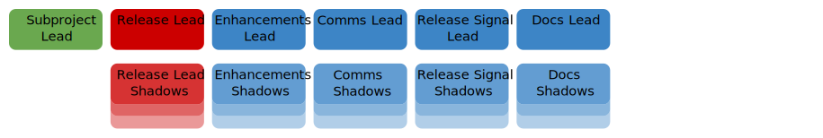
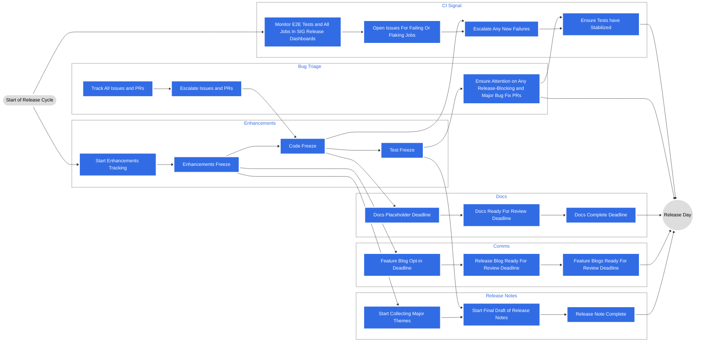
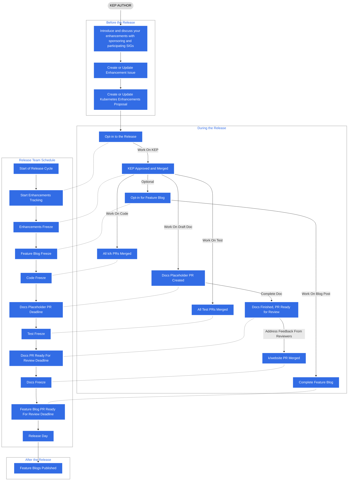

# Kubernetes Release Team

- [Overview][overview]
- [Specific responsibilities][specific-responsibilities]
- [Kubernetes Release Team roles][kubernetes-release-team-roles]
- [Other activities of the Release Team][other-activities-of-the-release-team]
- [Release Team Selection][release-team-selection]
- [Milestone Maintainers][milestone-maintainers]
- [Filing exceptions][filing-exceptions]
- [Visual Release Path](#visual-release-path)

## Overview

The Kubernetes Release Team is embedded within SIG Release and is responsible for the day to day work required to
successfully release while the SIG at large is focused on the continued improvement of the release process. Historically
the Release Manager (previously Release Czar)
and later Release Team have assumed the following responsibilities
- Authority to build and publish releases at the published release date under the auspices of the CNCF
- Authority to accept or reject cherrypick merge requests to the release branch
- Authority to accept or reject PRs to the kubernetes/kubernetes master branch during code freeze period
- Changing the release timeline as needed if keeping it would materially impact the stability or quality of the release

These responsibilities will continue to be discharged by SIG release through the Release Team. This charter grants SIG 
Release the following additional responsibilities:
- Authority to revert code changes which imperil the ability to produce a release by the communicated date or otherwise 
  negatively impact the quality of the release (e.g. insufficient testing, lack of documentation)
- Authority to guard code changes behind a feature flag which do not meet criteria for release
- Authority to close the submit queue to any changes which do not target the release as part of enforcing the code freeze
  period
which shall be the discharged by the Release Team.

## Specific responsibilities

- Generation of release notes
- Communicate enhancement burndown progress during a release cycle
- Manage repositories and tooling dedicated to releasing Kubernetes which at time of chartering these include:
  - kubernetes/release
  - deb/rpm packaging and hosting
  - Container image hosting
- Set and enforce criteria for repository inclusion in a Kubernetes release
  - Governance
  - Stabilization
  - Test coverage
- Set and enforce criteria for code inclusion in a Kubernetes release
  - Feature flags
  - Documentation
  - Test coverage
  - Dashboards
  - Status reports
- Define template and format for communication of release status
  - Ongoing status of the release process
  - Announcement of alpha, beta, release candidate availability
  - Announcement of release availability
- Deriving signal from the following sources
  - [test grid](https://testgrid.k8s.io/)
  - GitHub [flake issues](https://github.com/kubernetes/kubernetes/issues?q=is%3Aopen+is%3Aissue+label%3Akind%2Fflake)
  - GitHub [bug issues](https://github.com/kubernetes/kubernetes/issues?utf8=%E2%9C%93&q=is%3Aopen%20is%3Aissue%20label%3Akind%2Fbug)
- Identifying owning individuals and SIGs for blocking issues
- Working with SIGs and individuals to drive resolution of open issues
- Building summary of release criteria and status and publish to the community on a regular basis throughout the release cycle
- Manage the contents of `kubernetes/enhancements`
- Define burndown process
  - use of GitHub labels to signal release blocking status
  - use of GitHub milestones to communicate release blocking issues
  - use of flake GitHub issue count or CI signal as a release blocking status
- Coordinate the resolution of release blocking issues

## Kubernetes Release Team roles

As documented in the [Kubernetes Versioning doc](../release-engineering/versioning.md),
there are 3 types of Kubernetes releases:
- Major (x.0.0)
- Minor (x.x.0)
- Patch (x.x.x)

| Role | Handbook |
|---|---|
| Release Team Lead | [Lead Handbook](role-handbooks/release-team-lead/README.md) |
| Enhancements | [Enhancements Handbook](role-handbooks/enhancements/README.md) |
| CI Signal | [CI Signal Handbook](role-handbooks/ci-signal/README.md) |
| Bug Triage | [Bug Triage Handbook](role-handbooks/bug-triage/README.md) |
| Docs | [Docs Handbook](role-handbooks/docs/README.md) |
| Release Notes | [Release Notes Handbook](role-handbooks/release-notes/README.md) |
| Communications | [Communications Handbook](role-handbooks/communications/README.md) |

#### Retired Release Team roles

- Patch Release Manager: moved to a role of [Release Managers](https://git.k8s.io/website/content/en/releases/release-managers.md), which operates under the Release Engineering subproject.
- Branch Manager: moved to a role of [Release Managers](https://git.k8s.io/website/content/en/releases/release-managers.md), which operates under the Release Engineering subproject.
- Test Infra: deprecated at the end of Kubernetes 1.15. Duties are now distributed to the [Branch Manager](/release-engineering/role-handbooks/branch-manager.md) and [Test Infra On-call (SIG Testing)](https://go.k8s.io/oncall) (#testing-ops and #sig-testing on Slack).

### Release Team Shadow
Any Release Team member may select one or more mentees to shadow the release process in order to help fulfill future
Release Team staffing requirements and continue to grow the Kubernetes community in general. Potential mentees should
be prepared to devote a significant amount of time to shadowing their mentor during the release cycle. Successful Release Team Shadows
should be prepared to assume a lead role in a subsequent release.

### Individual Contributors
Release responsibilities of individual contributors to the Kubernetes project are captured below

#### During a patch release
If you have a patch that needs to be ported back to a previous release (meaning it is a critical bug/security fix), once it is merged to the Kubernetes `master` branch:
- Follow the [cherry-pick instructions to open a cherry-pick PR.](https://git.k8s.io/community/contributors/devel/sig-release/cherry-picks.md)
- The Patch Release Manager will then review the PR and if it is ok for cherry-picking, will apply a `cherrypick-approved` label to it.

#### During a major/minor release

##### Propose and track enhancement
If you are developing an enhancement for Kubernetes, make sure that an issue is open in the [enhancements repository](https://github.com/kubernetes/enhancements/issues). If you are targeting a particular release, make sure the issue is marked with the corresponding release milestone.

Ensure that all code for your enhancement is written, tested, reviewed, and merged before code freeze date for the target release.

During the code freeze period, fix any bugs discovered with your enhancement, and write enhancement documentation.

##### Write enhancement documentation

1. Make sure your enhancement for the upcoming release is on the github release tracking board (e.g. [link](https://github.com/orgs/kubernetes/projects/98) for 1.26).
2. Create a PR with documentation for your enhancement in the [documents repo](https://github.com/kubernetes/kubernetes.github.io).
    - **Your PR should target the release branch (e.g. [release-1.6](https://github.com/kubernetes/kubernetes.github.io/tree/release-1.6)), not the [`master`](https://github.com/kubernetes/kubernetes.github.io/tree/master) branch.**
      - Any changes to the master branch become live on https://kubernetes.io/docs/ as soon as they are merged, and for releases we do not want documentation to go live until the release is cut.
3. Add link to your docs PR in the release tracking board, and notify the docs lead for the release ( Release team details for each release can be found under the [releases](../releases) directory. E.g. [Docs lead](../releases/release-1.26/release-team.md) for 1.26).
4. The docs lead will review your PR and give you feedback.
5. Once approved, the docs lead will merge your PR into the release branch.
6. When the release is cut, the docs lead will push the docs release branch to master, making your docs live on https://kubernetes.io/docs/.

## Other activities of the Release Team

### During "Major" releases
To date no major release has been scheduled, however, SIG Release would be responsible for working closely with SIG Testing
to coordinate this effort across SIGs. The precise work required to produce a major release (e.g. 2.0, 3.0)
is undefined.

### During "Security" releases
For all unplanned or embargoed releases
- Facilitate security releases following the [Security Release Process](https://git.k8s.io/security/security-release-process.md)

## Release Team Selection

If you're interested in learning more about how the Release Team is selected, as well as how to volunteer, please review the [Release Team Selection Process][release-team-selection-process].

---

## Milestone Maintainers

The [milestone maintainers](https://github.com/kubernetes/community/blob/master/contributors/devel/sig-release/release.md#milestone-maintainers) are responsible for adding, adapting, or removing a milestone, e.g. the next major Kubernetes release, on an enhancement, issue, PR.

Across release cycles, a "/milestone" is one of the best signals for [issue triage](https://github.com/kubernetes/community/blob/master/contributors/guide/issue-triage.md#milestones) whether or not an issue or PR is actually targeted for the current release milestone.

Each release cycle, the current Release Team Lead must update membership to the aforementioned GitHub team.

The actual process of maintaining milestones is owned by the SIGs and special elected contributors. The SIG release team steers the enhancement through the release cycle and take care that only well maintained enhancements will make it up to a new major release.
---

## Filing exceptions

The process for filing an enhancement exception can be found [here][exceptions].

[overview]: #overview
[specific-responsibilities]: #specific-responsibilities
[kubernetes-release-team-roles]: #kubernetes-release-team-roles
[other-activities-of-the-release-team]: #other-activities-of-the-release-team
[release-managers]: /release-managers.md
[release-team-selection]: #release-team-selection
[release-team-selection-process]: release-team-selection.md
[milestone-maintainers]: #milestone-maintainers
[filing-exceptions]: #filing-exceptions
[exceptions]: /releases/EXCEPTIONS.md
[k/enhancements]: https://git.k8s.io/enhancements
[k/org]: https://git.k8s.io/org

## Visual Release Path

The diagram below shows a high level overview of tasks of the release team sub teams (CI Signal, Bug Triage, Enhancements, Docs, Comms, Release Notes) during a release cycle.

The diagram below provides an overview of the work done by KEP authors during the release process and how it relates to release deadlines.

