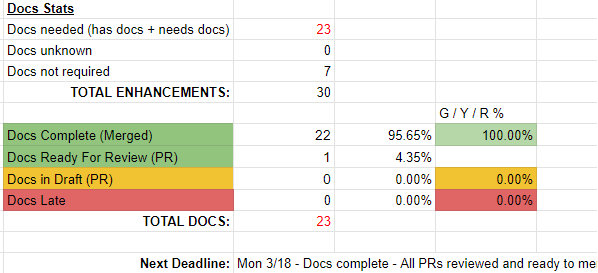
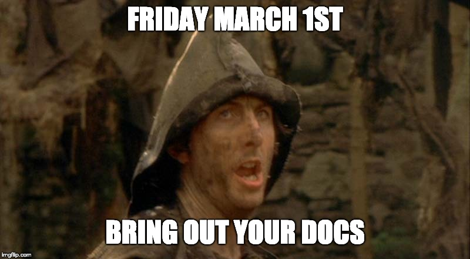
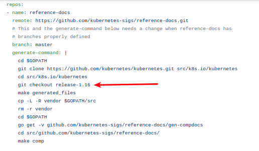
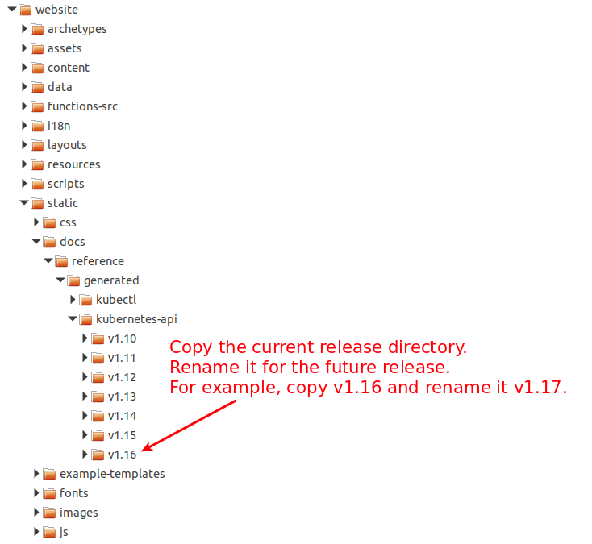
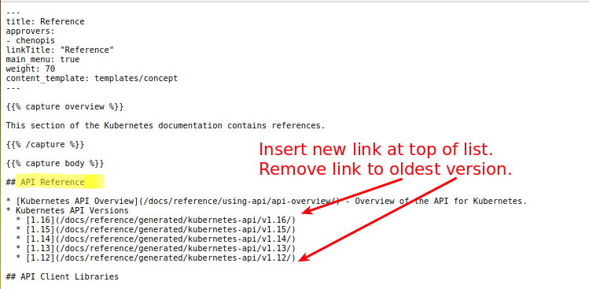
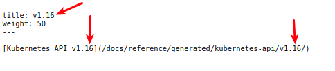

# Kubernetes Docs Lead Handbook

## Overview

This document covers the responsibilities, time commitments, and timeline for Docs Leads shepherding docs releases for Kubernetes. Docs Lead Shadows should also read through this document and understand the launch processes so they can do it in the future.

### Common Terms

| Variable       | Explanation | Example |
| -------------- | -------- | -------- |
| [current release]| Active Kubernetes release     | 1.13     |
| [future release] | Release that the team is actively composing     | 1.14     |
| [integration branch] | A PR [WIP] merging dev branch into master | [link](https://github.com/kubernetes/website/pull/11401) |
| ⚠️ | Stresses extra importance | |

## Docs Lead Responsibilities

The Docs Lead is responsible for working with the Release Team to coordinate documentation updates for the next Kubernetes release.

Responsibilities include:
* Identifying and tracking new Kubernetes features and feature updates that require new content
* Offering guidance to code contributors about where new feature and enhancements documentation should live
* Working with contributors to modify existing docs to accurately represent any upcoming changes
* Providing weekly updates to the Release Team about the current state of release-bound docs
* Introducing and mentoring Docs Lead Shadows to this process and empowering them with the knowledge needed to be future Docs Leads
* Reviewing documentation PRs to ensure quality following our [Documentation Style Guide](https://kubernetes.io/docs/contribute/style/style-guide/)
* Migrating the old website [version] documentation and updating it with the new release
* Communicating changes with all of the localization branches in order to stay synced across repositories
* Updating these instructions with each release

## Prerequisites for Docs Lead and Shadows

### General Requirements

**Before continuing on to the Docs specific requirements listed below, please review and work through the tasks in the [Release Team Onboarding Guide](/release-team/release-team-onboarding.md).**

### Time Requirements

A release is usually 12 weeks long. In general, there's a lot of work in the first few weeks of the release cycle to get the process started, and a lot of work in the last few weeks of the release cycle as documentation deadlines approach.

General time requirements for leads and shadows are:

- 1/2 hour to 2 hours a day, reviewing incoming enhancements, tracking documentation PRs, and monitoring Slack
- 1-2 hours a week to attend the majority of Release Team (weekly) and Burndown meetings (daily during Code Freeze), subject to time zone appropriateness
- 1 hour weekly to attend [SIG Docs meetings](https://github.com/kubernetes/community/tree/master/sig-docs#meetings) for status reports

Note that the time commitment becomes greater closer to the release deadline, peaking during the final release day. **During the last week of the release, shadows should expect to spend at least 5 hours and leads at least 10 hours finalizing the launch.**

### Prerequisites for Docs Leads

In addition to the time requirements above, a Docs Lead must:

- Have the ability to add a milestone to issues, so must be a member of the [milestone maintainers](https://github.com/orgs/kubernetes/teams/kubernetes-milestone-maintainers)
- Have the ability to `/approve` PRs, so must be a member of [sig-docs-maintainers](https://github.com/orgs/kubernetes/teams/sig-docs-maintainers)


### Prerequisites for Docs Lead Shadows

Docs Lead Shadows are people who are preparing to be a Docs Lead in the future. In addition to the time requirements above, shadows must:

- Have signed the [contributor CLA](https://github.com/kubernetes/community/blob/master/CLA.md) for Kubernetes.
- Be invested in becoming an org member within the release cycle. This can often be achieved during the release cycle with sponsorship from a role lead. See the [Release Team onboarding guide](/release-team/release-team-onboarding.md) for more details.
- General knowledge of our SIG-Docs [areas of responsibility](https://github.com/kubernetes/community/tree/master/sig-docs#subprojects).
- Experience with the general process involved with [contributing](https://kubernetes.io/docs/contribute/start/) to Kubernetes website.

## Release Timeline

For each release, the schedule with deliverables is added to the release directory. This section talks about specific Docs Lead deliverables for each milestone in the release timeline.

### Early Steps (Week 1-2)

These steps take approximately one hour to complete, and should be completed immediately.

1. Connect with the release team through Slack and Google Groups:

    - Join the Kubernetes [#sig-release](https://kubernetes.slack.com/messages/sig-release) Slack channel. Introduce yourself as the Docs Lead for the [future release].

    - Send a Slack direct message to the [future release] lead to introduce yourself.

    - ⚠️ Join these Google groups:
        - [kubernetes-sig-release](https://groups.google.com/forum/#!forum/kubernetes-sig-release)
        - [kubernetes-sig-leads](https://groups.google.com/forum/#!forum/kubernetes-sig-leads)
        - [kubernetes-sig-docs](https://groups.google.com/forum/#!forum/kubernetes-sig-docs)
        - [kubernetes-milestone-burndown](https://groups.google.com/forum/#!forum/kubernetes-milestone-burndown)
        - [kubernetes-dev](https://groups.google.com/forum/#!forum/kubernetes-dev)
        - [kubernetes-release-team](https://groups.google.com/forum/#!forum/kubernetes-release-team) # for enhancement google sheets access!

    - Make sure you're included in the "official" release team file, e.g: [release 1.14](https://github.com/kubernetes/sig-release/blob/master/releases/release-1.14/release_team.md). If not submit a PR and add yourself.

        Early in the release cycle, the Release Manager opens an enhancement tracking spreadsheet, e.g: [the 1.14 release spreadsheet](https://docs.google.com/spreadsheets/d/1AFksRDgAt6BGA3OjRNIiO3IyKmA-GU7CXaxbihy48ns/edit#gid=0). Later in the release this spreadsheet will contain important information for docs:

        - Which enhancements we'll be tracking for this release
        - Feature owners (and their GitHub IDs)
        - Links to docs PRs opened for each enhancement


1.  Read the release timeline and **make sure the timeline includes deadlines for documentation work**, e.g: [1.14 timeline](https://github.com/kubernetes/sig-release/tree/master/releases/release-1.14#timeline):

     - Docs deadline - Open placeholder PRs (~3.5 weeks before release)
     - Docs deadline - PRs ready for review: (~2 weeks before release)
     - Docs complete - All PRs reviewed and ready to merge (~1 week before release)

     If these deadlines aren't listed in the release timeline, request that the Release Lead add them.

1. Introduce yourself to the current localization owners to sync up early on strategy (needs coordination for main release). e.g: https://github.com/kubernetes/website/issues/12396.

1. ⚠️ Attend the release team meeting outlined in the current release. If you cannot attend, a Shadow needs to attend in your place.

1. Read this to learn more about the entire release team and process: https://github.com/kubernetes/sig-release/tree/master/release-team

1. Select your Shadows

    You will be provided with survey results from people interested working on the release team. If you do not have the results, contact the release lead for more information.

    After vetting the volunteers for their roles, role leads should make a final decision on selected shadows with the incoming Release Team Lead. **In the past the SIG Docs release team has been between 3-6 members.**

    ⚠️ Beyond meeting the basic requirements and time commitments, a good Shadow is someone who is active in SIG-Docs. Selection priority should go to previous shadows who want to eventually lead a SIG-Docs release. Other than those few guidelines, use your best judgement!

    [Link for additional information on shadows](https://github.com/kubernetes/sig-release/blob/master/release-team/release-team-selection.md#shadows)

1. Contact all volunteers

    Send a Slack message to those that you select, e.g:

    > Hey, you're officially on the SIG Docs 1.14 release team as a shadow! Let me know if there's any issues with being a shadow (as far as timing / availability / etc) and feel free to introduce yourself!
    >
    > Let me start: [General Introduction about your name, workplace, k8s community involvement, timezone etc]
    >
    >Ok, on to the business...
    >
    >We are an inclusive group so if there’s something you’re concerned about, or don’t understand, don’t worry and just ask!
    >
    > First off, check out the release team on-boarding guide: https://github.com/kubernetes/sig-release/blob/master/release-team/release-team-onboarding.md
    >
    >Make sure you join the following Slack channels: #sig-docs, #sig-release, #sig-docs-release
    You'll then want to join these mailing lists if you haven't already:
    >- https://groups.google.com/forum/#!forum/kubernetes-sig-release
    >- https://groups.google.com/forum/#!forum/kubernetes-sig-docs
    >- https://groups.google.com/forum/#!forum/kubernetes-milestone-burndown
    >- https://groups.google.com/forum/#!forum/kubernetes-dev
    >
    >Access to google docs and calendar invites are often based on these mailing lists, so it's a good idea to subscribe.
    >
    >When it comes to contributing and reviewing PRs, you should check out the docs style guide: https://kubernetes.io/docs/contribute/style/style-guide/
    >
    >We'll go over this in the meeting, but you may also want to take a quick look at the 1.14 release readme. https://github.com/kubernetes/sig-release/blob/master/releases/release-1.14/README.md
    >
    >Lastly, I'd love to jump on a call to go over the release process with everybody, describe what we'll be doing, and answer any questions. Below is a poll to see what time works best on Friday (if any). As we near the end of the release cycle I will add a regular weekly check-in.
    >
    >Please select your preferred time(s) Friday: https://doodle.com/<link-removed>


    Also send a Slack message to those that you didn't select, e.g:

    > Hey, I'm Jim Angel (Docs Lead for SIG Docs). Thanks for your interest in the SIG Docs 1.14 release team!
    >
    > The release team for sig-doc shadows has no additional availability, but please stick around help out with some of our other sigs (including sig-docs)!
    >
    > How can you help?
    > - Attend the sig release meetings (10AM PST every Monday - see #sig-release for more info).
    > - SIG-DOCs is always looking for new contributors, please go introduce yourself and we're happy to help! As a bonus, you will be preferred during the next release cycle as opposed to someone not involved with sig-docs.
    > - Slack is full of other great SIGs that could always use your help!
    >
    > I am also a resource to reach out to if you have any community questions (there's also #sig-contribex). I started out as a volunteer and now I am part of many Kubernetes sigs and teams.
    >
    > Thanks again for your interest and time!
    >
    > Jim Angel

1. Find 1/2 - 1 hour of time to meet with shadows and explain the release process. Walk through this entire document and review the flow with them. It helps to set expectations that the mantra is "hurry up and wait" but then it gets very hectic at the end. If you have the ability to, please record the meeting and share it with your Shadows for future review.

1. Add contacts to the shadows release docs, e.g: [https://bit.ly/k8s114-contacts](https://docs.google.com/spreadsheets/d/1BiGSLuCqjglQS1bJvpKk6rKFMciebPkUndzgDRnJsns/edit?ts=5c3bd42a#gid=0)

1. Make sure all shadows have edit access to the enhancement spreadsheet.

1. **As a lead**, make sure you are part of the [milestone-maintainers](https://github.com/orgs/kubernetes/teams/milestone-maintainers) and [sig-docs-en-owners](https://github.com/orgs/kubernetes/teams/sig-docs-en-owners).

1. You need push access to the Kubernetes website repo (contact a SIG Docs chair if you don't have it)

    ⚠️ Open the [integration branch] by creating a pull request against `master` referencing the `dev-[future release]` branch. **This should be done by the Docs Lead**, e.g: the [Release 1.14](https://github.com/kubernetes/website/pull/13174) PR uses the branch `dev-1.14`.

    This release pull request (also known as the [integration branch]) serves as the base for individual, component enhancement PRs of the release. A [integration branch] lets you bundle and merge multiple PRs simultaneously.

    ⚠️ Add the label `do-not-merge/hold` to the PR.

1. First PR in `dev-[future release]`: Update config.toml to show `[future release]` as the current version and add the `[future release]` entry to the drop-down, e.g: [config.toml diff](https://github.com/kubernetes/website/commit/851ef58fa8413e47bb18a15de53d9556be8c53dd#diff-618063036395fe9ee107f22b46c9eade)

    The intent is that your new branch should be showing as the current version IN the new branch...


### Middle Steps (Weeks 3-8)

The middle weeks of the launch are where the Docs Lead and Docs Lead Shadows track and review incoming PRs.

1. Track PRs based on the enhancement (KEP) spreadsheet

   Keep the enhancement tracking spreadsheet up to date with review progress and merge status for each documentation PR. For example: [Kubernetes Enhancements OSS tracking board (1.14 release)](https://docs.google.com/spreadsheets/d/116X6E-lmDJG5UZPlqDAFw8hN9vS6SNY4qRNZ9fKtsMU/edit#gid=0)

    ⚠️ Assign the enhancements evenly across your Shadows.
      - You and your Shadows will be responsible for tracking whether the enhancement:
        - **has docs:** Actively has docs in place on Kubernetes website or in flight
        - **needs docs:** Actively needs docs to support the enhancement in the [future-release]
        - **unknown:** After reviewing the KEP, it is unclear if this needs docs or not
        - **not required:** The KEP doesn't change anything that requires reflection in Kubernetes website
      - You and your Shadows will also be responsible for marking whether the docs are:
        - **Complete (Merged):** PR on the dev-[future-release] is done and merged
        - **No PR:** No PR is open (helpful for dead line tracking)
        - **Late:** No PR is open AND it's passed the deadline
        - **Draft (PR):** PR is open but content isn't ready for review
        - **Ready for Review (PR):** PR is open but content IS ready for review

    - ⚠️ Make sure that every docs PRs for the release have the correct base and set the correct Milestone. For example, enhancement PRs for version 1.14 need a base branch of `dev-1.14` and the Milestone set to `1.14`.

      The spreadsheet can be used to track the current health of the docs for release. For example:

      


      On the "Feature Stats" tab, a table was created to track the Doc Stats and then based on their category, in the other tab, assign a status "Green / Yellow / Red."


      This is very helpful for weekly reports and managing deadlines

1. Reach out to release notes team to see if there's anything that might need docs that isn't already clearly known, e.g:

    > Hey :wave: Release Notes folks! I just wanted to touch base early in the cycle to introduce myself (Jim Angel, SIG Docs Lead for 1.14) and to ask that we stay in touch as you start drafting your release notes. This came up from previous SIG Docs Leads, who said they found things in the release notes that _probably needed docs_. Any questions?

1. Maintain the current and upcoming dev / release branches

    ⚠️ **Periodically merge `master` into `dev-[future release]` and `release-[current release]`.**

    This allows us to avoid merge conflicts on release day with `dev-[future release]` and it allows us to easily sunset the current docs under it's new branch `release-[current release]` after we merge `dev-[future release]`.

    To merge `master` into `release-[current release]` on your local fork:
    ```
    $ git remote add upstream https://github.com/kubernetes/website.git
    $ git fetch upstream
    $ git checkout upstream/release-[current release]
    $ git merge upstream/master
    $ git checkout -b merged-master-release-[current release]
    $ git commit -m "merged master into release-[current release] to keep in sync"
    $ git push origin merged-master-release-[current release]
    ```

    Submit a PR against upstream ```release-[current release]```  from your fork  ```merged-master-release-[current release]``` branch with label ```tide/merge-method-merge```. e.g [merge master into current release](https://github.com/kubernetes/website/pull/16224)

    To merge `master` into `dev-[future release]` on your local fork:

    ```
    $ git remote add upstream https://github.com/kubernetes/website.git
    $ git fetch upstream
    $ git checkout upstream/dev-[future release]
    $ git merge upstream/master
    $ git checkout -b merged-master-dev-[future release]
    $ git commit -m "merged master into dev-[future release] to keep in sync"
    ## if needed: https://help.github.com/articles/resolving-a-merge-conflict-using-the-command-line/
    ## git add ...
    ## git commit -m "resolving conflicts"
    $ git push origin merged-master-dev-[future release]
    ```

    Submit a PR against upstream ```dev-[future release]```  from your fork  ```merged-master-dev-[future release]``` branch with label ```tide/merge-method-merge```. e.g [merge master into future release](https://github.com/kubernetes/website/pull/16225)

    You may need to fix conflicts manually. If somebody has improved a page on master, and at the same time it has been updated in dev-1.14, we may need to figure out how to make those changes work together. If something comes up which isn't obvious, you can always abort the merge and reach out to SIG Docs for help.

1. Make a query showing all PRs raised against dev-[future release] and monitor that regularly, e.g: [1.14 search](https://github.com/kubernetes/website/pulls?utf8=%E2%9C%93&q=is%3Apr+is%3Aopen+base%3Adev-1.14+label%3Alanguage%2Fen)

1. ⚠️ Enforce deadlines. Communicate with SIGs via Slack and email lists to keep up to date on status.

    ### COMMUNICATE ALL 3 MAJOR DATES AT LEAST A WEEK PRIOR, INCLUDING THE RELEASE DATE REPO FREEZE, FOLLOWING THE BELOW METHODS:

    - Keep developers apprised of due dates for docs.

        Send announcements to:
        - [Kubernetes Dev Group](https://groups.google.com/forum/#!forum/kubernetes-dev)
        - [#sig-release](https://kubernetes.slack.com/messages/sig-release) on Slack
        - Your team / shadows
        - [#sig-docs](https://kubernetes.slack.com/messages/sig-docs)
        - [#sig-docs-maintainers]((https://kubernetes.slack.com/messages/sig-docs-maintainers))
        - [#chairs-and-techleads](https://kubernetes.slack.com/messages/chairs-and-techleads)
        - (optional) Twitter
          - If you tweet, send a message to [#sig-release](https://kubernetes.slack.com/messages/sig-release) and ask for a friendly signal boost (retweets)

    Example notice
    > Hey! The docs `placeholder PR` deadline is Friday March 1st.
    >
    > That means if you have a v1.14 enhancement (that requires docs), #sig-docs require that you have _at the very least_ a PR opened against dev-1.14 in Kubernetes website.
    >
    > It would be AWESOME if it's the full doc! 😀
    >
    > Thanks! Important dates for v1.14: https://github.com/kubernetes/sig-release/blob/master/releases/release-1.14/README.md#tldr
    >
    > 

1. Review PRs

    It is the Docs Lead and Shadows' responsibility to ensure the incomming docs meet our standards. It's impossible for us to understand every technical component, so it is important to get a **technical LGTM** too if you're unsure about technical accuracy.

    Also review each PR for:

    - Check that the PR is in the `[future release]` milestone
    - Check that the KEP / enhancement is likely to land in `[future release]`.
    - Review PR commit histories, and make sure that PR commit histories contain only changes to files. It's especially important to **avoid revert commits**. Encourage developers to rebase any PRs with complicated commit histories.
    - Check that the PR has a technical LGTM
    - If no LGTM, assign `sig/*` labels (listed in the enhancement tracking spreadsheet) to help find technical reviewers.

    Style Guide Checklist (High to Low Level)

    The [style guide](https://kubernetes.io/docs/contribute/style/style-guide/) consists of guidelines, not rules.

    - Make sure new docs use the correct template.
        - [Concept](https://kubernetes.io/docs/contribute/style/page-templates/#concept-template)
        - [Task](https://kubernetes.io/docs/contribute/style/page-templates/#task-template)
        - [Tutorial](https://kubernetes.io/docs/contribute/style/page-templates/#tutorial-template)
    - Make sure the page content renders correctly.
        - Numbered list
        - Code blocks
        - [Shortcodes](https://kubernetes.io/docs/contribute/style/style-guide/#shortcodes) for notes, cautions, and warnings

    - Make sure the content makes sense
        - **Note**: Most PR owners are **not** writers, and many are non-native / secondary English speakers. Missing commas or passive voice should **not** block a /LGTM if the content is accurate. If something really bugs you, make a note and open a PR to fix it later.
        - Check spelling
        - Consider the Style Guide's [best practices](https://kubernetes.io/docs/contribute/style/style-guide/#content-best-practices) and [patterns to avoid](https://kubernetes.io/docs/contribute/style/style-guide/#patterns-to-avoid)

    Once the above is met, comment the following on the PR:

    ```
    /lgtm
    /approve
    ```

    If you need help reviewing PRs, ask SIG Docs (#sig-docs channel on Slack) for help. The weekly [PR Wrangler](https://github.com/kubernetes/website/wiki/PR-Wranglers) is your best resource.

    ⚠️ **NOTE:** PR's against the dev branch can merged at anytime assuming they meet the criteria. Be careful though that you don't merge a feature that might be pushed out to the next release. If that happens, you can revert - but it's better to avoid the mess all together.

1.  Nominate a Docs Lead for the Next Release

    ⚠️ **During Code Freeze** Pick a successor who has demonstrated the ability and understanding of the process. **Usually this is a Docs Lead Shadow that has been on the team for 2 releases with a desire to continue with the SIG Docs.**

    1. Reach out to the person you have in mind and confirm they are able to commit the time and effort for a successful release.

    1. Once confirmed, inform the Release Team and the SIG-Docs Team.

    If no suitable candidates are available, you may choose to lead again or nominate someone outside of the current release team (e.g: a recent Docs Lead).

### Late Steps (Weeks 9-11)

#### Prep for the release

The Docs Lead is responsible for updating the Kubernetes API reference, kubectl, and components documentation.

1. Update the generated documentation using a Python script ([Generating Reference Pages for Kubernetes Components and Tools](https://kubernetes.io/docs/contribute/generate-ref-docs/kubernetes-components/)). Before running the script, modify `reference.yml` to checkout the Kubernetes future release branch.

    

1. Create the `static/docs/reference/generated/kubernetes-api/<MINOR_VERSION>` directory for the future release. Copy the current release directory and rename it.

   

1. Add the future release link to `content/en/docs/reference/_index.md` and remove the oldest release link. The **API Reference** section should only contain five links.

   

1. Update the <MINOR_VERSION> in `content/en/docs/reference/kubernetes-api/api-index.md` for the future release.

   

1. Create PRs.

#### Touch base with SIG Cluster Lifecycle (Kubeadm)

Validate that sig-cluster-lifecycle has all of the docs in place for the upcoming release. These are mainly Kubeadm docs (upgrading, installing, changes, etc). If unsure, send a message to their [Slack](https://kubernetes.slack.com/messages/sig-cluster-lifecycle/).

#### ⚠️ Stage "Sunset" PRs

Create the PRs needed to roll the docs to the new version on the dev branch

1. Deprecate the oldest API link in the reference docs, e.g: https://github.com/kubernetes/website/pull/13467

1. Update the index for the API reference docs, e.g: https://github.com/kubernetes/website/pull/14139

    - NOTE: These first two steps can be combined into one single PR. If done in a single PR, please update this handbook with examples.

1. Create the updated config.toml's for the 4 previous releases. These need to be 4 PRs because they are all separate `release-` branches. **Make sure to update**  ```release-[current release]``` config.toml chinese localization configuration with ```deprecated = false```. e.g [chinese localization current](https://github.com/kubernetes/website/pull/16131)

    See this for example (1.13 was the "future release"):
    * 1.9 https://github.com/kubernetes/website/pull/11493
    * 1.10 https://github.com/kubernetes/website/pull/11495
    * 1.11 https://github.com/kubernetes/website/pull/11496
    * 1.12 https://github.com/kubernetes/website/pull/11497

    Also update the main `config.toml` in master for the pending release and PR it against `dev-[future release]`

    ```
    # ON LOCAL FORK
    $ git clone https://github.com/jimangel/website.git website-docs
    $ cd website-docs
    $ git remote add upstream https://github.com/kubernetes/website.git
    $ git checkout master
    $ git fetch upstream
    $ merge upstream/master
    $ checkout -b config-toml-1.14
    $ vi config.toml
    $ git add config.toml
    $ git commit -m "updated config.toml for 1.14"
    $ git remote -v
    $ git push origin config-toml-1.14
    ```
    ⚠️ **DO NOT MERGE ANY OF THE CONFIG.TOML PRs UNTIL AFTER RELEASE**

---

### Release Week (Week 12)

1. Freeze Kubernetes website

    24 hours before the release, freeze the repo. No PRs allowed to merge AT ALL until the release PR has successfully merged.

    ⚠️ **NEW:** After 1.16 release, we realized you only need to create an issue with ```tide/merge-blocker``` label to prevent merging on a repo. Please check with **test-infra**  as this is not tested. You can find more information [here](https://github.com/kubernetes/test-infra/blob/master/prow/cmd/tide/config.md#merge-blocker-issues)

    - Submit an issue with ```tide/merge-blocker``` label.
    - Submit a freeze announcement following [our protocol](#COMUNICATE-ALL-3-MAJOR-DATES-AT-LEAST-A-WEEK-PRIOR-INCLUDING-THE-RELEASE-DATE-REPO-FREEZE-FOLLOWING-THE-BELOW-METHODS)

1. Let localization team know about freeze and next tentative timeline(s) for important dates

    > Hello localization team leads! We talked about docs in v1.14 here (https://github.com/kubernetes/website/issues/12396). I don't think any action is required from you, but I wanted to let you know that we are on track for the release (3/25/19) and all Kubernetes website branches are up to date (master, dev-1.14, release-1.13). Let me know if I can help with anything! Thanks!

1. Review milestone for completion and outstanding PRs. For PRs that won't make the release, change their milestone and make sure everyone is clear.

---

### Release Day

This process takes approximately 4 hours.

Coordinate with the Release team for the exact timing. Typically the release is 'officially' built, then you merge the docs, and then you approve the blog post to "make it official." For 1.14 we merged docs at 2:30 EST and the blog was approved at 3 EST - marking the release "complete."

1. Merge master into [future release] again if any conflicts exist in the [integration branch].

1. Merge `master` back into the current release branch to keep them in sync.

1. Remove the hold from the on-hold integration PR when needed and merge into master.

1. Tag the commit hash before the [integration branch] as the final commit for [current release]. Note: This can be done at anytime post release.

    ```
    $ git clone <k/website>

    $ git checkout master
    Switched to branch 'master'
    Your branch is up to date with 'origin/master'.

    $ git log --pretty=format:"%h - %an, %ar : %s"
    6c41db7e6 - Lubomir I. Ivanov, 2 hours ago : kubeadm-ts: add entry about patching kube-proxy in CCM scenarios (#13033)
    6b8e14642 - Patrick Lang, 4 hours ago : Fix markdown around \ for file paths (#13404)
    f024de7d3 - Noah Kantrowitz, 4 hours ago : Typo fix in a docs link. (#13405)
    230dfa140 - Alex Contini, 4 hours ago : add AppDirect case study (#13338)
    ef6c80a0e - Kaitlyn Barnard, 5 hours ago : 1.14 Blog Post (#13400)
    851ef58fa - Jim Angel, 5 hours ago : Official 1.14 Release Docs (#13174)
    28dd4d515 - evilyeti, 7 hours ago : Fixed broken link in E2E Testing blog

    $ git tag -a snapshot-final-v1.13 28dd4d515 -m "Release 1.13 final snapshot"
    $ git tag -a snapshot-initial-v1.14 851ef58fa -m "Release 1.14 initial snapshot"

    $ git push --tags origin master
    ```

1. After creating the tags, you can create a release based off of a tag very easily. Follow the naming conventions as done before and update: https://github.com/kubernetes/website/releases
    - "Draft a new release"
    - Use new snapshot tag for release

1. Unfreeze the repo as done earlier (remove the ```tide/merge-blocker``` and close issue)

1. Close the [future release] milestone.

1. Merge the 4 config.toml's created as part of the sunsetting docs.

1. Create a PR to update k/website's release notes
    - ex: https://raw.githubusercontent.com/kubernetes/kubernetes/master/CHANGELOG-1.14.md will be merged into content/en/docs/setup/release/notes.md
    - ex PR: https://github.com/kubernetes/website/pull/13416

---

## Post Release Verification, Cleanup, and Handoff

These steps should be done after the launch. They require approximately 4 hours of work.

### Update Release Notes Changelog
1. Manually update the Kubernetes website release notes changelog from the actual [release notes](https://github.com/kubernetes/kubernetes/blob/master/CHANGELOG-1.14.md#v1140), e.g: https://github.com/kubernetes/website/pull/13416

    **Note:** You need to wait until the release is cut to do this as it's included with the build process.

### Review Docs Process and Update Documentation

1. Hold a docs-only burn down
    - Can we improve process?
    - Can we improve playbook?
    - Can we add / **remove** stuff from playbook?

### Prepare the Next Docs Lead for Success

1. ⚠️ **IMPORTANT:** Create a working branch (Named `dev-[future FUTURE release]`, for example `dev-1.15`) locally, based on master. Push it to upstream.

    ```
    git clone https://github.com/kubernetes/website.git
    git checkout -b dev-1.15
    git commit --allow-empty -m "initial commit"
    git push -u origin dev-1.15
    ```

1. Create a new release-[future-release] (now "current release") to represent the "sunset branch" that will get merged next cycle.

    ```
    git clone https://github.com/kubernetes/website.git
    git checkout -b release-1.14
    git commit --allow-empty -m "initial commit"
    git push -u origin release-1.14
    ```

1. Enable branch protection on the new `dev-` branch and deprecate the older one, e.g: https://github.com/kubernetes/test-infra/pull/11984

1. Create milestone for NEW upcoming release. Depending on your permissions, you might need to contact a SIG Docs maintainer. Move anything missed for the current release to the new milestone.

1. Update the Netlify (contact a [SIG Docs chair](https://github.com/kubernetes/community/tree/master/sig-docs#leadership) if you do not have access and they can assist with this):

    - Login to [Netlify](https://app.netlify.com/) and navigate to the Sites tab.

      - Clean Up
        - Delete the oldest docs site (usually a deprecated version 5+ releases ago)

      - Update [vnext](https://app.netlify.com/sites/kubernetes-io-vnext-staging/settings) staging
        - Point at the new future dev-[future release]
        - Taking the defaults here is mostly fine
        - When in doubt, compare it to a working example
        - (check) build only production branch

      - Create a Netlify site that builds from `release-[future release]` branch. Even though the `[future release]` is currently `master` (e.g: https://kubernetes.io), eventually `master` will be a newer k8s version and we'll use the `release-[future release]` branch to contain all prior changes - like a snapshot. (e.g: https://v1-14.docs.kubernetes.io)
        - Taking the defaults here is mostly fine
        - When in doubt, compare it to a working example
        - e.g, site name: k8s-v1-14
        - e.g, custom domain: v1-14.docs.kubernetes.io

      - Save the change and verify that the change is live at [https://kubernetes-io-vnext-staging.netlify.com/](https://kubernetes-io-vnext-staging.netlify.com/).

1. Announce that `[future release]` branch is open for new feature docs on slack #sig-docs.

1. Make a PR against master to edit the [pull request template](https://github.com/kubernetes/kubernetes.github.io/blob/master/.github/PULL_REQUEST_TEMPLATE.md) to give advice about raising `[future release]`-related PRs against the `[future release]` branch. Example: https://github.com/kubernetes/website/pull/8057

1. ⚠️ Assign any issues / feature / PRs (that missed the release) to the new Docs Lead

### Celebrate! 🎉

YOU MADE IT! Celebrate a job well done, keep an eye out for anything on fire, and begin to relax!

## Doc Authors and Contributors

**Authors:** [Jim Angel](https://github.com/jimangel) & [Cody Clark](https://github.com/cody-clark)

Special thanks to contibutors to this document, including:
* Andrew Chen
* Jared Bhatti
* Jennifer Rondeau
* Misty Linville
* Tim Fogarty
* Zach Arnold
* Zach Corleissen

In addition, this document wouldn't be possible without the wonderful people in [#sig-docs](https://kubernetes.slack.com/messages/sig-docs)!
