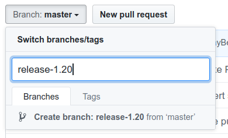
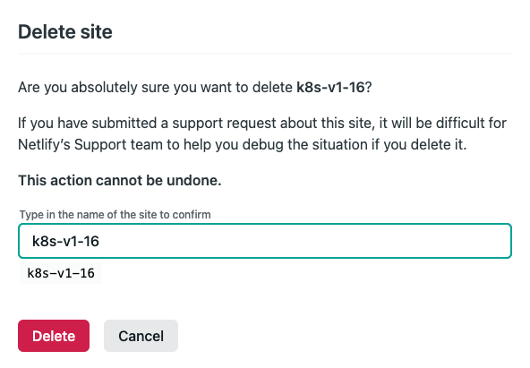
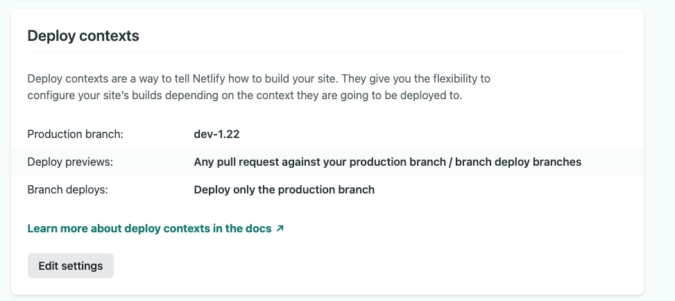

# Release Timeline
For each release, the schedule with deliverables is added to the release directory. This section talks about specific Docs Lead deliverables for each milestone in the release timeline.

- [Early Steps (Weeks 1-2)](#early-steps-weeks-1-2)
    - [Connect with the release team through Slack and Google Groups](#connect-with-the-release-team-through-slack-and-google-groups)
    - [Read the release timeline](#read-the-release-timeline)
    - [Introduce yourself to docs localization teams](#introduce-yourself-to-docs-localization-teams)
    - [Attend meetings](#attend-meetings)
    - [Read up on the release team](#read-up-on-the-release-team)
    - [Select Shadows](#select-shadows)
    - [Contact volunteers](#contact-volunteers)
    - [Meet with Shadows](#meet-with-shadows)
    - [Ensure access is set up](#ensure-access-is-set-up)
    - [Update the website configuration ahead of the release](#update-the-website-configuration-ahead-of-the-release)
- [Middle Steps (Weeks 3-8)](#middle-steps-weeks-3-8)
    - [Track PRs](#track-prs)
    - [Reach out to Enhancement Owners](#reach-out-to-enhancement-owners)
        - [Before the Open placeholder PR Deadline](#before-the-open-placeholder-pr-deadline)
        - [Before the PRs Ready for Review Deadline](#before-the-prs-ready-for-review-deadline)
        - [Before the PRs Ready to Merge Deadline](#before-the-prs-ready-to-merge-deadline)
    - [Reach out to release notes team](#reach-out-to-release-notes-team)
    - [Maintain the current and upcoming `dev` branch](#maintain-the-current-and-upcoming-dev-branch)
        - [Periodically merge `master` into `dev-[future release]`](#-periodically-merge-master-into-dev-future-release)
    - [Monitor PRs](#monitor-prs)
    - [Enforce deadlines](#enforce-deadlines)
    - [Communicate major deadlines](#communicate-major-deadlines)
    - [Review PRs](#review-prs)
    - [Style Guide Checklist (High to Low Level)](#style-guide-checklist-high-to-low-level)
    - [Nominate a Docs Lead for the Next Release](#nominate-a-docs-lead-for-the-next-release)
- [Late-Middle Steps (Weeks 7-8) - Sync with Comms team on the release blog post](#late-middle-steps-weeks-7-8---sync-with-comms-team-on-the-release-blog-post)
- [Late Steps (Weeks 9-11) - Prep for the release](#late-steps-weeks-9-11---prep-for-the-release)
    - [Generate the reference documentation](#generate-the-reference-documentation)
    - [Update minor version on API index page](#update-minor-version-on-api-index-page)
    - [Touch base with SIG Cluster Lifecycle (kubeadm)](#touch-base-with-sig-cluster-lifecycle-kubeadm)
    - [Touch base with the release communications team](#touch-base-with-the-release-communications-team)
- [Release Week (Week 12)](#release-week-week-12)
    - [Update the site configuration files for previous releases](#update-the-site-configuration-files-for-previous-releases)
    - [Update the site configuration files for future release](#update-the-site-configuration-files-for-future-release)
    - [Inform localization teams](#inform-localization-teams)
    - [Day before Release Day](#day-before-release-day)
        - [Request for temporary write access to website repo](#request-for-temporary-write-access-to-website-repo)
        - [Create the release branch](#create-the-release-branch)
        - [Update Netlify](#update-netlify)
        - [Freeze Kubernetes website](#freeze-kubernetes-website)
        - [Merge `master`](#merge-master)
        - [Get approvals for open PRs](#get-approvals-for-open-prs)
        - [Review milestone](#review-milestone)
    - [Release Day](#release-day)
        - [Merge the integration branch](#merge-the-integration-branch)
        - [Publish the release blog post](#publish-the-release-blog-post)
        - [Create release with tag](#create-release-with-tag)
        - [Unfreeze Kubernetes website](#unfreeze-kubernetes-website)
        - [Close the [future release] milestone](#close-the-future-release-milestone)
- [Post Release Verification, Cleanup, and Handoff](#post-release-verification-cleanup-and-handoff)
    - [Review Docs Process and Update Documentation](#review-docs-process-and-update-documentation)
    - [Hold a docs-only retro with Sig Docs](#hold-a-docs-only-retro-with-sig-docs)
- [Prepare the Next Docs Lead for Success](#prepare-the-next-docs-lead-for-success)
    - [Create the dev-future-FUTURE branch](#create-the-dev-future-future-branch)
    - [Enable branch protection](#enable-branch-protection)
    - [Create milestone](#create-milestone)
    - [Update Netlify](#update-netlify)
    - [Update Slack](#update-slack)
    - [Clean up access](#clean-up-access)
- [Celebrate](#celebrate)


## Early Steps (Weeks 1-2)
These steps take approximately one hour to complete, and should be completed immediately.

### Connect with the release team through Slack and Google Groups

- Join the Kubernetes [#sig-release](https://kubernetes.slack.com/messages/sig-release) Slack channel. Introduce yourself as the Docs Lead for the [future release].

- Send a Slack direct message to the [future release] lead to introduce yourself.

- ⚠️  Join these Google groups:
    - [kubernetes-sig-release](https://groups.google.com/forum/#!forum/kubernetes-sig-release)
    - [kubernetes-sig-docs](https://groups.google.com/forum/#!forum/kubernetes-sig-docs)
    - [kubernetes-dev](https://groups.google.com/forum/#!forum/kubernetes-dev)
    - [kubernetes-release-team](https://groups.google.com/a/kubernetes.io/g/release-team)
        - ⚠️  List of members for this group is managed in git. Please create a PR against `kuberenetes/sig-release` repo to include your email under `release-team` group in [`sig-release/group.yaml`](https://github.com/kubernetes/k8s.io/blob/main/groups/sig-release/groups.yaml) 
    - [kubernetes-release-team-shadows](https://groups.google.com/a/kubernetes.io/g/release-team-shadows)
        - ⚠️  List of members for this group is managed in git. Please create a PR against `kuberenetes/sig-release` repo to include your email under `release-team-shadows` group in [`sig-release/group.yaml`](https://github.com/kubernetes/k8s.io/blob/main/groups/sig-release/groups.yaml)

- Make sure you're included in the "official" release team file, e.g: [release 1.21](https://github.com/kubernetes/sig-release/blob/master/releases/release-1.21/release-team.md). If not submit a PR and add yourself.

Early in the release cycle, the Enhancements Lead opens an enhancement tracking spreadsheet, e.g: [the 1.21 release spreadsheet](http://bit.ly/k8s121-enhancements). Later in the release this spreadsheet will contain important information for docs:

- Which enhancements we'll be tracking for this release
- Feature owners (and their GitHub IDs)
- Links to docs PRs opened for each enhancement

### Read the release timeline

Read the release timeline and **make sure the timeline includes deadlines for documentation work**, e.g: [1.21 timeline](https://github.com/kubernetes/sig-release/tree/master/releases/release-1.21#timeline):

- Docs deadline - Open placeholder PRs (~3.5 weeks before release)
- Docs deadline - PRs ready for review (~2 weeks before release)
- Docs complete - All PRs reviewed and ready to merge (~1 week before release)

If these deadlines aren't listed in the release timeline, request that the Release Lead add them.
Define deadlines clearly e.g. eod PST is not clear if eod is 5pm or 11:59am PST.

### Introduce yourself to docs localization teams

Create a GitHub discussion in [k/sig-release](https://github.com/kubernetes/sig-release/discussions/) to introduce yourself to the current localization owners and to sync up early on the release timeline, e.g:
> Title: K8s 1.21 - Formalize docs release strategy with docs localization owners
>
> Hello :wave:,
> I'm Rey Lejano, the SIG Release Docs lead for the 1.21 release. I'm opening this discussion to coordinate the docs release (scheduled tentnatively for [April 8, 2021](https://github.com/kubernetes/sig-release/tree/master/releases/release-1.21#timeline) with localization owners.
> I look forward to working with everyone! Let me know if you have any questions!
> Thank you! 🙏
>
> cc: @kubernetes/sig-docs-fr-owners @kubernetes/sig-docs-de-owners @kubernetes/sig-docs-hi-owners @kubernetes/sig-docs-id-owners @kubernetes/sig-docs-ja-owners @kubernetes/sig-docs-ru-owners @kubernetes/sig-docs-pl-owners @kubernetes/sig-docs-ko-owners @kubernetes/sig-docs-pt-owners @kubernetes/sig-docs-es-owners @kubernetes/sig-docs-zh-owners @kubernetes/sig-docs-vi-owners @kubernetes/sig-docs-uk-owners @kubernetes/sig-docs-it-owners

### Attend meetings

⚠️  Attend the release team meeting outlined in the current release. If you cannot attend, a Shadow needs to attend in your place.

### Read up on the release team

Read this to learn more about the entire [release team and process](https://github.com/kubernetes/sig-release/tree/master/release-team)

### Select Shadows

You will be provided with survey results from people interested working on the release team. If you do not have the results, contact the release lead for more information.

After vetting the volunteers for their roles, role leads should make a final decision on selected shadows with the incoming Release Team Lead. In the past the SIG Docs release team has been between 3-6 members.

⚠️ Beyond meeting the basic requirements and time commitments, a good Shadow is someone who is active in SIG-Docs. Selection priority should go to previous shadows who want to eventually lead a SIG-Docs release. Other than those few guidelines, use your best judgement!

[Link for additional information on shadows](https://github.com/kubernetes/sig-release/blob/master/release-team/release-team-selection.md#shadows)

Verify the shadow selections with the release lead and the emeritus advisor on Slack.

### Contact volunteers

Send a Slack message to those that you select, e.g:

> Hey, you're officially on the SIG Docs 1.21 release team as a shadow! Let me know if there's any issues with being a shadow (as far as timing / availability / etc) and feel free to introduce yourself!
>
> Let me start: [General Introduction about your name, workplace, k8s community involvement, timezone etc]
>
>Ok, on to the business...
>
>We are an inclusive group so if there’s something you’re concerned about, or don’t understand, don’t worry and just ask!
>
> First off, check out the release team on-boarding guide: https://github.com/kubernetes/sig-release/blob/master/release-team/release-team-onboarding.md
>
>Make sure you join the following Slack channels: #sig-docs, #sig-release, #release-docs
You'll then want to join these mailing lists if you haven't already:
>- https://groups.google.com/forum/#!forum/kubernetes-sig-release
>- https://groups.google.com/forum/#!forum/kubernetes-sig-docs
>- https://groups.google.com/forum/#!forum/kubernetes-dev
>
>Access to Google docs and calendar invites are often based on these mailing lists, so it's a good idea to subscribe.
>
>When it comes to contributing and reviewing PRs, you should check out the docs style guide: https://kubernetes.io/docs/contribute/style/style-guide/
>
>We'll go over this in the meeting, but you may also want to take a quick look at the 1.21 release readme. https://github.com/kubernetes/sig-release/blob/master/releases/release-1.21/README.md
>
>Lastly, I'd love to jump on a call to go over the release process with everybody, describe what we'll be doing, and answer any questions. Below is a poll to see what time works best on Friday (if any). As we near the end of the release cycle I will add a regular weekly check-in.
>
>Please select your preferred time(s) Friday: https://doodle.com/<link-removed>


⚠️ Please coordinate with Emeritus Adviser for the release before taking this step.
Send a Slack message to those that you didn't select, e.g:

> Hey, I'm Jim Angel (Docs Lead for SIG Docs). Thanks for your interest in the SIG Docs 1.14 release team!
>
> The release team for sig-doc shadows has no additional availability, but please stick around help out with some of our other sigs (including sig-docs)!
>
> How can you help?
> - Attend the sig release meetings (07 30 AM PST Bi-weekly on Tuesdays - see #sig-release for more info).
> - SIG-DOCs is always looking for new contributors, please go introduce yourself and we're happy to help! As a bonus, you will be preferred during the next release cycle as opposed to someone not involved with sig-docs.
     - Slack is full of other great SIGs that could always use your help!
>
> I am also a resource to reach out to if you have any community questions (there's also #sig-contribex). I started out as a volunteer and now I am part of many Kubernetes sigs and teams.
>
> Thanks again for your interest and time!
>
> Jim Angel


### Meet with Shadows

Find .5-1 hour of time to meet with shadows and explain the release process. Walk through this entire document and review the flow with them. It helps to set expectations that the mantra is "hurry up and wait" but then it gets very hectic at the end. If you have the ability to, please record the meeting and share it with your Shadows for future review.

1. Add contacts to the shadows release docs, e.g: [https://bit.ly/k8s121-contacts](https://bit.ly/k8s121-contacts)

### Ensure access is set up

1. Add shadows to the "official" release team file, e.g.: [1.21 release](https://github.com/kubernetes/sig-release/pull/1432)

1. As a lead, make sure you are part of the [sig-docs-en-owners](https://github.com/orgs/kubernetes/teams/sig-docs-en-owners), e.g: [1.21 release](https://github.com/kubernetes/website/pull/26114).

1. Add docs team to the `website-milestone-maintainers` group in k/org/config/kubernetes/sig-docs/teams.yaml and `release-team` group in k/org/kubernetes/sig-release/teams.yaml, e.g: [1.21 release](https://github.com/kubernetes/org/pull/2445).

1. Make sure all shadows have edit access to the enhancement spreadsheet. Contact the enhancements lead to grant access for you and shadows.

1. You need push access to the Kubernetes website repo (contact a SIG Docs chair if you don't have it)

   ⚠️ (**This should be done by the Docs Lead**) Open the [integration branch] by creating a pull request against `master` referencing the `dev-[future release]` branch e.g., the [Release 1.21](https://github.com/kubernetes/website/pull/26153) PR uses the branch `dev-1.21`.

   This release pull request (also known as the [integration branch]) serves as the base for individual, component enhancement PRs of the release. A [integration branch] lets you bundle and merge multiple PRs simultaneously.

   ⚠️ Add the label `do-not-merge/hold` to the PR.

1. First PR in `dev-[future release]`: Update config.toml to show `[future release]` as the current version and add the `[future release]` entry to the drop-down, e.g: [config.toml diff](https://github.com/kubernetes/website/pull/27223)

    The intent is that your new branch should be showing as the current version IN the new branch...

### Update the website configuration ahead of the release

Update the main `config.toml` based on the version on the `master` branch. Open a PR for these changes against the `dev-[future release]` branch (which should already exist - this is a good check!)

```shell
# Step 1
# Do this on a fresh local clone OF YOUR FORK
# It's OK to use SSH for the git URL if you know how to do that
git clone https://github.com/yourGitHubUsername/website.git kubernetes-website
cd kubernetes-website
# Step 2
# Add the upstream repo as a remote
git remote add upstream https://github.com/kubernetes/website.git
git checkout --track master
git checkout -b config-toml-1.21 # change for the release you're making
# Step 3
# Edit config.toml to make the changes described above
# save your changes
git add config.toml
git commit -m "Updated config.toml for 1.21 release"
# Step 4
# Check things look right
git status
git remote -v
# Step 5
# Push this new branch to your fork
git push origin config-toml-1.21
```

Now create a pull request that targets the next release (here: `dev-1.21`) **not** `master`.


## Middle Steps (Weeks 3-8)
The middle weeks of the launch are where the Docs Lead and Docs Lead Shadows track and review incoming PRs.

### Track PRs

Track PRs based on the enhancement (KEP) spreadsheet.

Keep the enhancement tracking spreadsheet up to date with review progress and merge status for each documentation PR. For example: [Kubernetes Enhancements OSS tracking board (1.21 release)](http://bit.ly/k8s121-enhancements)

⚠️ Assign the enhancements evenly across your Shadows after the enhancement freeze. Assigning shadows before the
 enhancement freeze will cause unexpected behavior in the tracking spreadsheet due to frequent updates to dynamic data.
 (Tip: When assigning enhancements, try grouping enhancement owners and/or by SIGs)
  - You and your Shadows will be responsible for tracking whether the enhancement:
    - **has docs:** Actively has docs in place on Kubernetes website or in flight
    - **needs docs:** Actively needs docs to support the enhancement in the [future-release]
    - **unknown:** After reviewing the KEP, it is unclear if this needs docs or not
    - **not required:** The KEP doesn't change anything that requires reflection in Kubernetes website
  - You and your Shadows will also be responsible for marking whether the docs are:
    - **Complete (Merged):** PR on the dev-[future-release] is done and merged
    - **No PR:** No PR is open (helpful for dead line tracking)
    - **Late:** No PR is open AND it's passed the deadline
    - **Draft (PR):** PR is open but content isn't ready for review
    - **Ready for Review (PR):** PR is open but content IS ready for review
- ⚠️ Make sure that every docs PRs for the release have the correct base and set the correct Milestone. For example, enhancement PRs for version 1.21 need abase branch of `dev-1.21` and the Milestone set to `1.21`.

The spreadsheet can be used to track the current health of the docs for release. For example:


On the "Enhancement Stats" tab, a table was created to track the Doc Stats and then based on their category, in the other tab, assign a status "Green / Yellow / Red."

This is very helpful for weekly reports and managing deadlines

### Communicate major deadlines

The Release Lead and Enhancements Lead will send announcements to the [Kubernetes Dev Group](https://groups.google.com/forum/#!forum/kubernetes-dev) periodically during the release cycle.
Communicate with the Release Lead and Enhancements Lead to include the Doc Placeholder PR, Doc PR Ready-for-Review, and Docs Complete deadlines in their announccements.

COMMUNICATE ALL 3 MAJOR DATES AT LEAST A WEEK PRIOR, INCLUDING THE RELEASE DATE REPO FREEZE, FOLLOWING THE BELOW METHODS:

- Keep developers apprised of due dates for docs.
    Send announcements to:
    - [#sig-release](https://kubernetes.slack.com/messages/sig-release) on Slack
    - Your team / shadows
    - [#sig-docs](https://kubernetes.slack.com/messages/sig-docs)
    - [#sig-docs-maintainers](https://kubernetes.slack.com/messages/sig-docs-maintainers)
    - [#chairs-and-techleads](https://kubernetes.slack.com/messages/chairs-and-techleads)
    - Release subteams:
      - [#enhancements](https://kubernetes.slack.com/messages/enhancements)
      - [#release-bug-triage](https://kubernetes.slack.com/messages/release-bug-triage)
      - [#release-ci-signal](https://kubernetes.slack.com/messages/release-ci-signal)
      - [#release-notes](https://kubernetes.slack.com/messages/release-notes)
      - [#release-comms](https://kubernetes.slack.com/messages/release-comms)
    - (optional) Twitter
      - If you tweet, send a message to [#sig-release](https://kubernetes.slack.com/messages/sig-release) and ask for a friendly signal boost (retweets)

Example notice:

> Hey! The Docs `Placeholder PR` deadline is Tuesday March 16 HH:MM timezone.
>
> That means if you have a v1.21 enhancement (that requires docs), #sig-docs require that you have _at the very least_ a PR opened against the `dev-1.21` branch in the kubernetes/website repo.
>
> It would be AWESOME if it's the full doc! 😀
>
> Thanks! Important dates for v1.21: https://github.com/kubernetes/sig-release/blob/master/releases/release-1.21/README.md#tldr
>
> 

### Reach out to Enhancement Owners

#### Before the Open Placeholder PR Deadline
After the Enhancement Freeze, reach out to all tracked enhancements to see if new docs or modification to existing docs
are required, e.g:

> Hello < tag enhancement owner(s) > :wave:, < future-release > Docs < Shadow/Lead > here.
>
> Does this enhancement work planned for < future-release > require any new docs or modification to existing docs?
>
> If so, please follows the steps [here](https://kubernetes.io/docs/contribute/new-content/new-features/#open-a-placeholder-pr)
> to open a PR against `dev-[future release]` branch in the `k/website` repo. This PR can be just a placeholder at this
> time and must be created before < Docs Open Paceholder deadline HH:MM timezone>
>
> Also, take a look at [Documenting for a release](https://kubernetes.io/docs/contribute/new-content/new-features/#for-developers-or-other-sig-members)
> to get yourself familiarize with the docs requirement for the release.
>
> Thank you!

#### Before the PRs Ready for Review Deadline
After the Open Placeholder PR deadline, reach out to all open/tracked doc PRs to remind the PR owners to get their
doc ready to be reviewed, e.g:

> Hello < tag doc owner(s) > :wave: please take a look at [Documenting for a release - PR Ready for Review](https://kubernetes.io/docs/contribute/new-content/new-features/#pr-ready-for-review)
> to get your PR ready for review before < PR Ready for Review deadline HH:MM timezone >. Thank you!

#### Before the PRs Ready to Merge Deadline
After the PR ready for review deadline, reach out to all open/tracked doc PRs to remind the PR owners to get docs reviewed, e.g:

> Hello < tag doc owner(s) > :wave:, a friendly reminder that this PR needs a doc review by < Docs Complete Deadline HH:MM timezone > to get this
> into the release. Please reach out to required SIGs to get their review. Thank you!

For a technical review, reach out to the KEP reviewers and approvers. KEP reviewers and approvers are usually listed in the
[kep.yaml e.g.](https://github.com/kubernetes/enhancements/blob/master/keps/sig-architecture/1194-prod-readiness/kep.yaml)

> Hello < tag KEP reviewer(s) / approver(s) > :wave: please provide a technical review for this PR by < Docs Complete deadline HH:MM timezone >
> to get this into the release. Thank you!

### Reach out to release notes team
Reach out to release notes team to see if there's anything that might need docs that isn't already clearly known, e.g:

> Hey :wave: Release Notes folks! I just wanted to touch base early in the cycle to introduce myself (Jim Angel, SIG Docs Lead for 1.14) and to ask that we stay in touch as you start drafting your release notes. This came up from previous SIG Docs Leads, who said they found things in the release notes that _probably needed docs_. Any questions?

### Maintain the current and upcoming `dev` branch

This allows us to avoid merge conflicts on release day with `dev-[future release]`.

#### ⚠️ Periodically merge `master` into `dev-[future release]`

To merge `master` into `dev-[future release]` on your local fork:

```bash
# Step 0 (if you don't already have a remote called "upstream")
git remote add upstream https://github.com/kubernetes/website.git
# Step 1
git fetch upstream master
# Step 2
git fetch upstream dev-[future release]
# Step 3
git checkout --track upstream/dev-[future release]
# Step 4
git pull --ff-only # make sure you're up to date
# Step 5 You might see merge conflicts at this point.
git merge upstream/master
## if needed: https://help.github.com/articles/resolving-a-merge-conflict-using-the-command-line/
## git add ...
## git merge --continue
# Step 6
git checkout -b merged-master-dev-[future release]
# Step 7
git commit -m "Merge master into dev-[future release] to keep in sync"
# Step 8
git push origin merged-master-dev-[future release]
```

You may need to fix conflicts manually. If somebody has improved a page on `master`, and at the same time it has been updated in the dev branch for the next release, we may need to figure out how to make those changes work together. If something comes up which isn't obvious, you can always abort the merge and reach out to SIG Docs for help.

When you have completed resolving the differences manually, run `git merge --continue` to complete the merge. Then carry on from step 5.

Submit a PR against upstream `dev-[future release]` from your fork's branch `merged-master-dev-[future release]` by changing the
`base` to `dev-[future-release]` when creating the PR.
e.g. [Merge master into future release](https://github.com/kubernetes/website/pull/16225).

⚠️  **Ensure the PR is passing tests on GitHub**.

Perform merge activity on a regular basis to ensure a smooth release. eg: once/week during intial weeks and increase the frequency if required closer to the end of the release cycle. 

Report out the `dev-[future release]` branch health in Release Team meetings and sig-docs meetings. 

### Monitor PRs

Make a query showing all PRs raised against dev-[future release] and monitor that regularly e.g., [1.21 search](https://github.com/kubernetes/website/pulls?utf8=%E2%9C%93&q=is%3Apr+is%3Aopen+base%3Adev-1.21+label%3Alanguage%2Fen)

### Enforce deadlines

Enforce deadlines the day after. Communicate with SIGs via Slack and email lists to keep everyone up-to-date on status.

### Review PRs

It is the Docs Lead and Shadows' responsibility to ensure the incoming docs meet our standards. It's impossible for us to understand every technical component, so it is important to get a **technical LGTM** too if you're unsure about technical accuracy.

Also review each PR for:

- Check that the PR is in the `[future release]` milestone
- Check that the KEP / enhancement is likely to land in `[future release]`.
- Review PR commit histories, and make sure that PR commit histories contain only changes to files. It's especially important to **avoid revert commits**. Encourage developers to rebase any PRs with complicated commit histories.
- Check that the PR has a technical LGTM.
- KEP reviewers and approvers can provide a technical review or delegate appropriatley. KEP reviewers and approvers are usually listed in the [kep.yaml e.g.](https://github.com/kubernetes/enhancements/blob/master/keps/sig-architecture/1194-prod-readiness/kep.yaml)
- If no LGTM, assign `sig/*` labels (listed in the enhancement tracking spreadsheet) to help find technical reviewers.

#### Style Guide Checklist (High to Low Level)

The [style guide](https://kubernetes.io/docs/contribute/style/style-guide/) consists of guidelines, not rules.

- Make sure new docs use the correct page content type.
    - [Concept](https://kubernetes.io/docs/contribute/style/page-content-types/#concept)
    - [Task](https://kubernetes.io/docs/contribute/style/page-content-types/#task)
    - [Tutorial](https://kubernetes.io/docs/contribute/style/page-content-types/#tutorial)
- Make sure the page content renders correctly.
    - Numbered list
    - Code blocks
    - [Shortcodes](https://kubernetes.io/docs/contribute/style/style-guide/#shortcodes) for notes, cautions, and warnings
- Make sure the content makes sense
    - Check spelling
    - Consider the Style Guide's [best practices](https://kubernetes.io/docs/contribute/style/style-guide/#content-best-practices) and [patterns to avoid](https://kubernetes.io/docs/contribute/style/style-guide/#patterns-to-avoid)

> Note: Most PR owners are **not** writers, and many are non-native / secondary English speakers. Missing commas or passive voice should **not** block a /lgtm if the content is accurate. If something really bugs you, make a note and open a PR to fix it later.

Once the above is met, comment the following on the PR:

```
/lgtm
/approve
```

(you might already have /lgtm from the technical review stage; another /lgtm is fine if the prerequisites are already met).

If you need help reviewing PRs, ask SIG Docs (#sig-docs channel on Slack) for help. The weekly [PR Wrangler](https://github.com/kubernetes/website/wiki/PR-Wranglers) is your best resource.

> Note: PR's against the dev branch can merged at any time assuming they meet the criteria. Be careful though that you don't merge a feature that might be pushed out to the next release. If that happens, you can revert - but it's better to avoid the mess all together.
>
> You can add /hold to mark a PR that should not merge until the matching code changes are already in.

### Nominate a Docs Lead for the Next Release

⚠️ During Code Freeze, pick a successor who has demonstrated the ability and understanding of the process.

**Usually this is a Docs Lead Shadow that has been on the team for 2 releases with a desire to continue with the SIG Docs.**

- Reach out to the person you have in mind and confirm they are able to commit the time and effort for a successful release.
- Once confirmed, inform the Release Team and the SIG Docs Team.

If no suitable candidates are available, you may choose to lead again or nominate someone outside of the current release team (e.g: a recent Docs Lead).

## Late-Middle Steps (Weeks 7-8) - Sync with Comms team on the release blog post

The Docs Lead is responsible for publishing the release blog post during the release day. Therefore, it's important to
follow the status of the blog posts created by the Comms team.

Validate that the Comms team has all the blog posts (release and features) ready for the upcoming release.
If unsure, send a message to their [Slack](https://kubernetes.slack.com/messages/release-comms/) channel, e.g:

> Hi Comms team :wave: 1.21 Docs Lead here, can someone confirm that all blog posts PRs related to the release have been
> opened and are being reviewed? Is there anything the Docs team can do to help?

Be congnizant of the status of the release blog post as merging and publishing the release blog post is a significant step on release day e.g., [1.21 release blog](https://github.com/kubernetes/website/pull/27233).

## Late Steps (Weeks 9-11) - Prep for the release

The Docs Lead is responsible for updating the Kubernetes API reference, kubectl, and components documentation.
If you need help in building the reference documentation, reach out on Slack #sig-docs.

### Generate the reference documentation

> Note: For 1.20 and 1.21, the Docs team needed assistance from SIG Docs to generate the reference documentation 

The first step is to familiarize yourself with the `website/updated-imported-docs/update-imported-docs.py` script
and the instructions for ([Generating Reference Pages for Kubernetes Components and Tools](https://kubernetes.io/docs/contribute/generate-ref-docs/quickstart/)).

The reference documentation build depends upon a valid [release tag](https://github.com/kubernetes/kubernetes/tags).
When a Kubernetes release candidate version tag such as `v1.21-rc.0` is created, you can consider building
the reference documentation. Next:

- Create a branch for this work based off of the `dev-[future release]` branch.
```
git checkout dev-[future-release]
git fetch upstream dev-[future-release]
git rebase upstream dev-[future-release]
git checkbout -b dev-[future-release]-ref-doc
```
- Run the `update-imported-docs.py` script providing the build configuration file (`reference.yml`) and the release tag.
```
cd website/update-imported-docs/
python update-imported-docs.py reference.yml 1.20.0-rc.0
```

- Commit the generated files.
```
git add .
git commit -m "Generate reference doc for [release tag]"
git push --set-upstream origin dev-[future-release]-ref-doc
```

You can expect to maintain this branch with periodic updates to the reference documentation using the latest `rc` tag.
Merge your branch `dev-[future-release]-ref-doc` to the `dev-[future release]` branch just before the final release.

If the content has changed since the last build of the reference documentation, when the release is complete, you should
build the reference documentation again using the final release tag and merge to the `master` branch.

Note: You should not have to build the reference documentation for every release candidate version.

In 1.20, there is a new API reference doc generation proccess.
SIG Docs has generated the API reference docs for 1.20 and [1.21](https://github.com/kubernetes/website/pull/26413).
Starting with the 1.22 release, follow the [building the API reference page instructions](https://github.com/kubernetes/website/blob/master/README.md#building-the-api-reference-pages) in the k/website README.md and in the [README of the generator](https://github.com/kubernetes-sigs/reference-docs/blob/master/gen-resourcesdocs/README.md).
Refer to the [1.21 PR for more context](https://github.com/kubernetes/website/pull/26413#issuecomment-811040665).
> Ask for assistance from SIG Docs to generate teh API reference docs

### Touch base with SIG Cluster Lifecycle (kubeadm)

Validate that SIG Cluster Lifecycle has all of the docs in place for the upcoming release. These are mainly kubeadm docs (upgrading, installing, changes, etc). If unsure, send a message to their [Slack](https://kubernetes.slack.com/messages/sig-cluster-lifecycle/) channel, e.g:

> Hi Sig Cluster Lifecylce :wave:  1.21 Docs Lead here, can someone confirm that all docs are in place for the upcoming 1.21 release?

## Release Week (Week 12)
⚠️  Everything in this section is important. It's OK to ask for advice if you're not sure.

### Update the site configuration files for previous releases

Update `config.toml` files for the 4 previous releases. These need to be 4 separate PRs because each release has its own `release-` branch.
Use [path release](https://github.com/kubernetes/sig-release/blob/master/releases/patch-releases.md) to determine the
correct patch version of the past release when updating the `config.toml` file.

See this for example (1.21 was the "future release"):
* 1.17 https://github.com/kubernetes/website/pull/27451
* 1.18 https://github.com/kubernetes/website/pull/27453
* 1.19 https://github.com/kubernetes/website/pull/27454
* 1.20 https://github.com/kubernetes/website/pull/27455

Changes required:
- Set `latest` to the [future release] version
- Update `fullversion` and `githubbranch` to the latest patched version of the corresponding release
- Update the list of versions to include the [future release] and remove the oldest release
- Set `deprecated` to `true`
- For each previous release, update the patch version to the latest patch version available

⚠️  DO NOT MERGE **ANY** OF THE CONFIGURATION PULL REQUESTS UNTIL THE RELEASE HAS OCCURRED

### Update the site configuration files for future release

The future release branch site configuration also needs to be updated to reflect the latest patch versions of the past releases.
Create a PR against the `dev-[future-release]` branch to update the `config.toml` file that matches the
[PRs for previous releases](#update-the-site-configuration-files-for-previous-releases).

### Inform localization teams

Let localization teams know about the k/website repo freeze and the tentative timeline(s) for important dates with a comment to the GitHub discussion created earlier in the release cycle.

> Hello localization team leads! I don't think any action is required from you, but I wanted to let you know that we are on track for the release on April 8, 2021 and all Kubernetes website branches are up to date (master, dev-1.21). Let me know if I can help with anything! Thanks!

### Day before Release Day
⚠️  Everything in this section is important. It's OK to ask for advice if you're not sure.

#### Request for temporary write access to the website repo

Create a PR against [kubernetes/org](https://github.com/kubernetes/org) repo to add current Docs Lead to the
[website-maintainers](https://github.com/orgs/kubernetes/teams/website-maintainers) team e.g.,
[PR to org repo](https://github.com/kubernetes/org/pull/2364)

Assign PR to current [SIG Docs chairs](https://github.com/kubernetes/community/tree/master/sig-docs#chairs) for approval.

⚠️  write access is required to freeze the website repo and to complete tasks during the release day

⚠️  With elevated access, make sure you are not accidentally pushing to upstream by disabling `git push` command against upstream repo.
```
git remote set-url --push upstream no_push
```
> Note: Temporary write access to the website repo is required for the following tasks. Notify a SIG Docs chair to review and approve the PR before proceeding to the next step.

#### Create the release branch

Creating the release branch lets you snapshot the current docs in a new branch, `release-[current release]`, after merging `dev-[future release]`. For example: For the 1.21 release cycle where `master` represents `v1.20`, you would create `release-1.20`.

> **Note:** Creating a branch requires someone with write access to `k/website`, such as a [SIG Docs co-chair](https://github.com/kubernetes/community/tree/master/sig-docs#leadership).

- From [k/website](https://github.com/kubernetes/website) click on `master` branch.
- Type the name of the release branch.
- **click** Create branch `release-x.yy` from `master`



#### Update Netlify

Update the Netlify configuration. (A [SIG Docs chair](https://github.com/kubernetes/community/tree/master/sig-docs#leadership) can assist you with access):

Login to [Netlify](https://app.netlify.com/) and navigate to the Sites tab.

- Create a Netlify site that builds from `release-[current-release]` branch. Even though the `[current-release]` is currently `master` (e.g: https://kuberneteio), eventually `master` will be a newer k8s version and we'll use the `release-[current-release]` branch to contain all prior changes - like a snapshot. (e.g https://v1-20.docs.kubernetes.io)
  - Taking the defaults here is mostly fine
  - When in doubt, compare it to a working example
  - e.g, site name: k8s-v1-20
  - e.g, custom domain: v1-20.docs.kubernetes.io

> Note: if the `release-[current-branch]` is created before the website is frozen you may need to merge in master to keep up-to-date
> If you create the `release-[current-branch]` right before freezing the k/website repo, it is less likely you need to keep the `release-[current-branch] up-to-date but always verify with the following steps:

To merge `master` into `release-[current release]` on your local fork:

```shell
# Step 0 (if you don't already have a remote called "upstream")
git remote add upstream https://github.com/kubernetes/website.git
# Step 1
git fetch upstream master
# Step 2
git checkout --track upstream/release-[current release]
# Step 3
git merge upstream/master
# Step 4
git checkout -b merged-master-release-[current release]
# Step 5
git commit -m "Merge master into release-[current release] to keep in sync"
# Step 6
git push origin merged-master-release-[current release]
```

Now create a pull request to merge the new branch you've made into the `release-[current-release]` branch on [k/website](https://github.com/kubernetes/website).

> Note: Make a note of the commit hash of the last commit of the `release-current-release]` branch as it will be used to tag the commit as the last commit of as the final commit for the snapshot.

#### Freeze Kubernetes website

24 hours before the release, freeze the k/website repo: ⚠️  no PRs should be allowed to merge AT ALL until the release PR has successfully merged.

- Submit an issue with `tide/merge-blocker` label. Depending upon your permissions, a [SIG Docs chair](https://github.com/kubernetes/community/tree/master/sig-docs#leadership) can assist you with adding the label.
- Submit a freeze announcement following our [protocols](#communicate-major-deadlines)

#### Merge `master`

After the freeze, create a PR to merge `master` into both dev-[future-release] and release-[current-release] branches.
After review from SIG Docs, both PRs will need to merge manually using the `Create a merge commit` method of merging.

#### Get approvals for open PRs

At this stage, [integration branch] PR and configuration PRs should be ready to be reviewed and approved by Sig Docs.
Request a review for all open PRs, especially the [integration branch], to make sure it can be merged on time during the
release day.

#### Review milestone

Review milestone for completion and outstanding PRs. For PRs that won't make the release, change their milestone and make sure everyone is clear.


## Release Day
⚠️  Everything in this section is important. It's OK to ask for advice if you're not sure.

This process takes approximately 4 hours.

Coordinate with the Release Team for the exact timing. Typically the release is 'officially' built, then you merge the docs, and then you approve the blog post to "make it official". For 1.21, we merged docs at 11:00 am PDT and the blog was merged at 11:30 am PDT - marking the release "complete".

### Merge the integration branch

Once release management team has successfully cut the release, Docs Lead will merge the [integration branch] manually using
the `Create a merge commit` method of merging.

- Remove the hold from the on-hold integration PR when needed and merge into `master`.
- Check the [Netlify build logs](https://app.netlify.com/sites/kubernetes-io-master-staging/deploys) to make sure the
site builds successfully.
- Once the site is up, validate the docs by checking the navigation, version dropdown, [generated APIs](https://kubernetes.io/docs/reference/),
[documentation version](https://kubernetes.io/docs/home/supported-doc-versions/), and random clicks.
> Note: Make a note of the commit hash of the integration branch merge

### Publish the release blog post

After validation, merge the blog post manually using the `Create a merge commit` method of merging.

- Remove the hold from blog post when needed and merge into `master`.
- Check the [Netlify build logs](https://app.netlify.com/sites/kubernetes-io-master-staging/deploys) to make sure the
site builds successfully.
- Navigate to the [blog page](https://kubernetes.io/blog/) to validate that release blog post is available.
- Once confirmed, notify the release team with the link to the blog post. This will allow the Release Lead to send out
a notification of the release to the Kubernetes Dev mailing list.

### Create release with tag

- Tag the commit hash before the [integration branch] as the final commit for [current release].
- Tag the commit hash of the [integration branch] as the initial commit of the [future release]

> Note: This can be done at any time post-release.
> You should have kept track of the last commit hash of the release branch, `release-[current release]` and the commit hash of the integration branch merge. The following steps will confirm the commit hashes.

```shell
git clone https://github.com/kubernetes/website/
cd website
git checkout master
```
```
Switched to branch 'master'
Your branch is up to date with 'origin/master'.
```
Confirm the commit hash before the [integration branch]:
```shell
git show <merge commit of integration branch>^1
```
The following example is from the 1.21 release:
  - It was noted that the last commit hash of the `release-1.20` branch is 6d252624b21452bcf6c22f156cccd316111204d4 from PR 2738
  - The commit hash of the integration branch merge, which is the first commit of 1.21, is 969a3db92326746a94e2eb4449fd60f25d9151b8.
```shell 
git show 969a3db92326746a94e2eb4449fd60f25d9151b8^1

commit 6d252624b21452bcf6c22f156cccd316111204d4 (origin/release-1.20)
Merge: d1c650d2a 5767f39fd
Author: Kubernetes Prow Robot <k8s-ci-robot@users.noreply.github.com>
Date:   Wed Apr 7 07:53:53 2021 -0700

    Merge pull request #27387 from Arhell/label
    
    [ja] updated labels for cli command in the PHP Guestbook tutorial
```
Proceed with tagging the commit hashes:
```shell
git tag -a snapshot-final-v1.20 6d252624b -m "Release 1.20 final snapshot"
git tag -a snapshot-initial-v1.21 969a3db92 -m "Release 1.21 initial snapshot"
git push --tags origin master
```

After creating the tags, you can create a release based off of a tag very easily. Follow the naming conventions as done before and update: https://github.com/kubernetes/website/releases

- Navigate to the [k/website releases page](https://github.com/kubernetes/website/releases)
- Click "Draft a new release"
- Enter the snapshot initial version tag in the "tag version" box
- Enter "snapshot-initial-v1.20: Release 1.20" as release title and "Release 1.20 initial snapshot" as the description.
- Click "Publish release"

> Note: 1.20 should be replaced with the [future release]

### Unfreeze Kubernetes website

Unfreeze the k/website repo as done earlier (remove the `tide/merge-blocker` label and close issue).

Afterwards, submit an unfreeze announcement following our [protocols](#communicate-major-deadlines)

### Close the [future release] milestone

- Merge the 4 config.toml's created as part of the sunsetting docs.
  - Remove hold from the configuration PRs to allow merge automatically by Prow.
- Create a PR to update k/website's release notes
  - ex: https://raw.githubusercontent.com/kubernetes/kubernetes/master/CHANGELOG/CHANGELOG-1.20.md will be merged into content/en/docs/setup/release/notes.md
    - When copying the content, make sure to place it under `<!-- NEW RELEASE NOTES ENTRY -->` of notes.md and remove the `GENERATED_TOC` section from the changelog.
  - ex PR: https://github.com/kubernetes/website/pull/25503
- Find the open milestone for [future release] and close it.

## Post Release Verification, Cleanup, and Handoff
These steps should be done after the launch. They require approximately 4 hours of work.

### Review Docs Process and Update Documentation

### Hold a docs-only retro with Sig Docs

- Can we improve process?
- Can we improve playbook?
- Can we add / **remove** stuff from playbook?


## Prepare the Next Docs Lead for Success

### Create the dev-future-FUTURE branch

⚠️ Create a working branch (Named `dev-[future FUTURE release]`, for example `dev-1.22`) locally, based on master. Push it to upstream.

```shell
# This example is for a future release version 1.22
git clone https://github.com/kubernetes/website.git
git checkout -b dev-1.22
git commit --allow-empty -m "Tracking commit for v1.22 docs"
git push -u origin dev-1.22
```

### Enable branch protection

> Note: You can avoid creating two PRs against the `test-infra` repo by completing the
> [Modify prow config file](#modify-prow-config-file) at the same time.

Enable branch protection on the new release branch, e.g.
[Add branch protection to the `release-1.20` branch and milestone applier for k/website 1.22](https://github.com/kubernetes/test-infra/pull/20182/files) (https://github.com/kubernetes/test-infra/pull/20182/files)

### Modify prow config file

Create a [pull request](https://github.com/kubernetes/test-infra/pull/21727) against [k/test-infra](https://github.com/kubernetes/test-infra)
 to configure [prow](https://github.com/kubernetes/test-infra/tree/master/prow#) to automatically apply milestones to future release branch
 and to remove the configuration for the last release.

```diff
kubernetes/website:
-   dev-1.21: 1.21
+   dev-1.22: 1.22
```


### Create milestone

Create a milestone for NEW upcoming release. Depending on your permissions, you might need to contact a SIG Docs maintainer. Move anything missed for the current release to the new milestone.

### Update Netlify

Update Netlify (contact a [SIG Docs Chair or Technical Lead](https://git.k8s.io/community/sig-docs#leadership) if you do not have access and they can assist with this):

Login to [Netlify](https://app.netlify.com/) and navigate to the Sites tab.

- Clean Up
  - Delete the oldest docs site (usually a deprecated version 5+ releases ago)
  
- Update [vnext](https://app.netlify.com/sites/kubernetes-io-vnext-staging/settings) staging
  - Point at the new future dev-[future release]
  
  - Taking the defaults here is mostly fine
  - When in doubt, compare it to a working example
  - (check) build only production branch

- Save the change and verify that the change is live at [https://kubernetes-io-vnext-staging.netlify.com/](https://kubernetes-io-vnext-staging.netlify.com/).

### Update Slack

Announce that `[dev-future FUTURE release]` branch is open for new feature docs on slack #sig-docs.

### Reassign issues

- Clean Up
⚠️  Assign any issues / feature / PRs (that missed the release) to the new Docs Lead

### Clean up access

⚠️  Create a PR against [kubernetes/org](https://github.com/kubernetes/org) repo to **remove** current Docs Lead from
the [website-maintainers](https://github.com/orgs/kubernetes/teams/website-maintainers) team and to **remove** current
Docs shadows from [milestone maintainers](https://github.com/orgs/kubernetes/teams/website-milestone-maintainers/),
e.g., [Remove 1.21 shadows from sig docs teams](https://github.com/kubernetes/org/pull/2624)

- The current lead must stay in the milestone maintainers list until the `[current release]` website version is officially supported.
- The future lead must stay in the milestone maintainers list to prepare for the next release.

## Celebrate!
YOU MADE IT! 🎉 Celebrate a job well done, keep an eye out for anything on fire, and begin to relax!