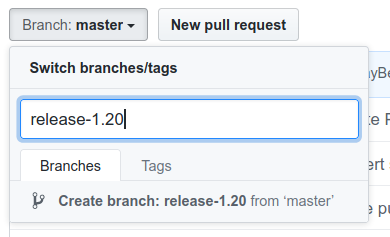
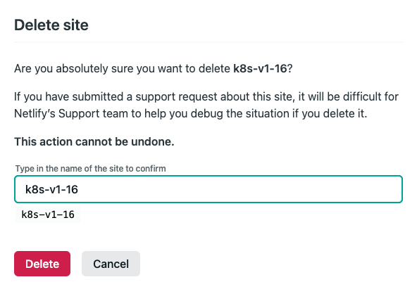
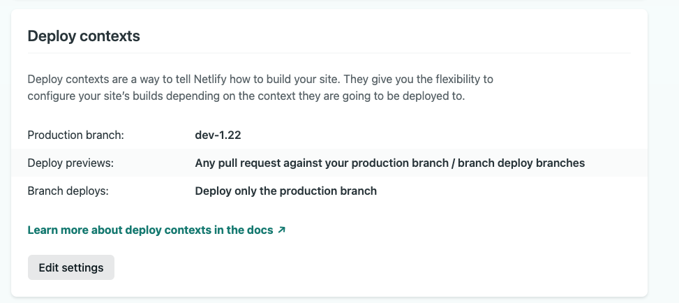

# Release Timeline

- [Release Timeline](#release-timeline)
  - [Overview](#overview)
  - [Early Steps (Weeks 1-2)](#early-steps-weeks-1-2)
    - [Connect with Release Team](#connect-with-release-team)
      - [Getting Started](#getting-started)
      - [Slack & Messaging](#slack--messaging)
      - [Google Groups](#google-groups)
    - [Shadow Selection & Onboarding](#shadow-selection--onboarding)
      - [Select Shadows](#select-shadows)
      - [Contact Selected Shadows](#contact-selected-shadows)
    - [Shadow Onboarding Meeting](#shadow-onboarding-meeting)
      - [Enhancement Tracking Setup](#enhancement-tracking-setup)
    - [Update Release Team & Access Control](#update-release-team--access-control)
      - [Access & Permission Setup](#access--permission-setup)
    - [Introduce Yourself to Localization Teams](#introduce-yourself-to-localization-teams)
    - [Responsibilities Sign-up Sheet](#responsibilities-sign-up-sheet)
    - [Update the website configuration ahead of the release](#update-the-website-configuration-ahead-of-the-release)
  - [Middle Steps (Weeks 3-8)](#middle-steps-weeks-3-8)
    - [Internal Team Coordination](#internal-team-coordination)
    - [Track PRs](#track-prs)
    - [Communicate Major Deadlines](#communicate-major-deadlines)
    - [Begin Generating Release Notes](#begin-generating-release-notes)
      - [Set up the Tools and Generate the Release Notes](#set-up-the-tools-and-generate-the-release-notes)
      - [Periodically Review and Fix New Release Notes](#periodically-review-and-fix-new-release-notes)
      - [Reviewing the Release Notes PR](#reviewing-the-release-notes-pr)
      - [Maintain Known Issues](#maintain-known-issues)
      - [Ensure Release Highlights are Reflected in the Notes](#ensure-release-highlights-are-reflected-in-the-notes)
      - [Get Feedback from SIG Leads](#get-feedback-from-sig-leads)
    - [Reach Out to Enhancement Owners](#reach-out-to-enhancement-owners)
      - [Before the Open Placeholder PR Deadline](#before-the-open-placeholder-pr-deadline)
      - [After the Code Freeze Deadline](#after-the-code-freeze-deadline)
      - [Before the PRs Ready for Review Deadline](#before-the-prs-ready-for-review-deadline)
      - [Before the Docs Freeze Deadline](#before-the-docs-freeze-deadline)
      - [Week of Docs Freeze](#week-of-docs-freeze)
      - [After Docs Freeze](#after-docs-freeze)
      - [Handling Docs Freeze Exceptions](#handling-docs-freeze-exceptions)
    - [Weekly Branch Sync PRs](#weekly-branch-sync-prs)
      - [Periodically Merge `main` into `dev-[future release]`](#periodically-merge-main-into-dev-future-release)
    - [Monitor & Review Doc PRs](#monitor--review-doc-prs)
      - [Style Guide Checklist (High to Low Level)](#style-guide-checklist-high-to-low-level)
    - [Nominate a Docs Lead for the Next Release](#nominate-a-docs-lead-for-the-next-release)
  - [Late-Middle Steps (Weeks 7-8) - Sync with Comms team on the release blog post](#late-middle-steps-weeks-7-8---sync-with-comms-team-on-the-release-blog-post)
  - [Late Steps (Weeks 9-11) - Prep for the Release](#late-steps-weeks-9-11---prep-for-the-release)
    - [⚠️ Final Release Notes Preparation (CRITICAL TASK)](#️-final-release-notes-preparation-critical-task)
    - [Coordinate with SIG Docs for Release Day Support](#coordinate-with-sig-docs-for-release-day-support)
    - [Verify SIG Cluster Lifecycle (kubeadm) Documentation](#verify-sig-cluster-lifecycle-kubeadm-documentation)
    - [Curate the External Dependencies Section](#curate-the-external-dependencies-section)
    - [Update Releases Page (the week before the release)](#update-releases-page-the-week-before-the-release)
  - [Release Week (Week 12)](#release-week-week-12)
    - [Coordinate with Branch Release Management](#coordinate-with-branch-release-management)
    - [Update the site configuration files for previous releases](#update-the-site-configuration-files-for-previous-releases)
    - [Update the site configuration files for future release](#update-the-site-configuration-files-for-future-release)
    - [Inform localization teams](#inform-localization-teams)
    - [Day before Release Day](#day-before-release-day)
      - [Request for temporary write access to the website repo](#request-for-temporary-write-access-to-the-website-repo)
      - [Freeze Kubernetes website](#freeze-kubernetes-website)
      - [Create the release branch](#create-the-release-branch)
      - [Update Netlify](#update-netlify)
      - [Merge `main`](#merge-main)
      - [Get approvals for open PRs](#get-approvals-for-open-prs)
      - [Publish final Release Notes](#publish-final-release-notes)
      - [Review milestone](#review-milestone)
  - [Release Day](#release-day)
    - [Merge the integration branch](#merge-the-integration-branch)
    - [Publish the release blog post](#publish-the-release-blog-post)
    - [Create release with tag](#create-release-with-tag)
    - [Unfreeze Kubernetes website](#unfreeze-kubernetes-website)
    - [Close the \[future release\] milestone](#close-the-future-release-milestone)
  - [Day after Release - Prepare the Next Docs Lead for Success](#day-after-release---prepare-the-next-docs-lead-for-success)
    - [Create the dev-future-FUTURE branch](#create-the-dev-future-future-branch)
    - [Modify prow config file](#modify-prow-config-file)
    - [Create milestone](#create-milestone)
    - [Update Netlify](#update-netlify-1)
    - [Update Slack](#update-slack)
    - [Reassign issues](#reassign-issues)
    - [Clean up access](#clean-up-access)
  - [Review Docs Process & Transition](#review-docs-process-update-handbook-and-transition)
    - [Review & Updates](#review--updates)
    - [Transition to the Next Lead](#transition-to-the-next-lead)
  - [Celebrate!](#celebrate)

---

## Overview

This timeline provides a week-by-week breakdown of Docs team responsibilities throughout the Kubernetes release cycle. Each phase includes specific tasks, deadlines, and checklists.

For each release, the schedule with deliverables is added to the release directory. This section talks about specific Docs Lead deliverables for each milestone in the release timeline.

Read the release timeline and **make sure the timeline includes deadlines for documentation work**, e.g: [1.35 timeline](https://github.com/kubernetes/sig-release/tree/master/releases/release-1.35#timeline):

- Docs deadline - Reminder for *Open placeholder PRs* in the respective KEPs (~3.5 weeks before release)
- Docs deadline - Reminder for *PRs ready for review* in the respective KEPs (~2 weeks before release)
- Docs complete - All PRs reviewed and ready to merge (~1 week before release)

If these deadlines aren't listed in the release timeline, request that the Release Lead add them.
Define deadlines clearly e.g. avoid using EOD as it's ambiguous - use AoE (Anywhere on Earth) or specify an exact time and time zone instead e.g. "Thursday 21st May 2026 (AoE) / Friday 22nd May 2026, 12:00 UTC".

Responsibilities of the Docs Team:
- Same as [Docs Lead responsibilities](../docs#docs-lead-responsibilities)
- Track Doc PRs for KEPs in the [website](https://github.com/kubernetes/website) project, plus all Doc PRs for the dev-[future release] branch that may include general updates without a KEP.
- By default, all opted-in KEPs will `Need Docs`. Enhancement owners/contributors should confirm the enhancement does not need new or updated documentation.

> [!Note]
> - The blog-PR is tracked by the Release Comms Team.
> - The kubernetes/website repo changed from using a `master` branch to a `main` branch in 2021. Be aware that several linked, example PRs uses the `master` branch.

> [!Tip]
> For the end-of-year release, KubeCon NA and the US Thanksgiving holiday can be additional impediments to Docs-related deadlines. Please communicate to enhancement owners/contributors about upcoming deadlines earlier and more frequently.

---

## Early Steps (Weeks 1-2)

These steps take approximately one hour to complete, and should be completed immediately.

### Connect with Release Team

#### Getting Started

- Familiarize yourself with the [release team and process](https://github.com/kubernetes/sig-release/tree/master/release-team).

#### Slack & Messaging

- Join `#sig-release` Slack channel and introduce yourself as Docs Lead for [future release].
- Send direct message to the [future release] Release Lead introducing yourself.
- Join `#sig-docs` Slack channel.
- Join `#release-docs` Slack channel.
- Join `#release-notes` Slack channel.
- Join `#release-management` Slack channel.
- Join `#release-comms` Slack channel.

#### Google Groups

| Google Group | PR Required? | Where to Add |
|--------------|--------------|--------------|
| [kubernetes-sig-release](https://groups.google.com/forum/#!forum/kubernetes-sig-release) | No | Directly join the mailing list via the URL |
| [kubernetes-sig-docs](https://groups.google.com/forum/#!forum/kubernetes-sig-docs) | No | Directly join the mailing list via the URL |
| [kubernetes-dev](https://groups.google.com/a/kubernetes.io/g/dev) | No | Directly join the mailing list via the URL |
| [kubernetes-release-team](https://groups.google.com/a/kubernetes.io/g/release-team) | **Yes** | List of members for this group is managed in git. Please create a PR against `kubernetes/k8s.io` repo to include your email under `release-team` group in [`sig-release/groups.yaml`](https://github.com/kubernetes/k8s.io/blob/main/groups/sig-release/groups.yaml) |
| [kubernetes-release-team-shadows](https://groups.google.com/a/kubernetes.io/g/release-team-shadows) | **Yes** | List of members for this group is managed in git. Please create a PR against `kubernetes/k8s.io` repo to include your email under `release-team-shadows` group in [`sig-release/groups.yaml`](https://github.com/kubernetes/k8s.io/blob/main/groups/sig-release/groups.yaml) |

---

### Shadow Selection & Onboarding

#### Select Shadows

You will be provided with survey results from people interested in working on the release team. If you do not have the results, contact the Release Lead or the Subproject Leads for more information.

After vetting the volunteers for their roles, role leads should make a final decision on selected shadows with the incoming Release Team Lead & Release Team Subproject Lead. In the past, the SIG Docs release team has been between 3-6 members. Read the following document to know more about the role of [Shadow in the Release Team](https://github.com/kubernetes/sig-release/blob/master/release-team/release-team-selection.md#shadows).

Drop a Slack DM or email the incoming candidates for shadows to check if they are still interested and available:
```markdown
Hello! 👋

You have been selected to be a Kubernetes [future-release] Release Docs Shadow. Can you please confirm that you're still interested and available?

Thanks,
[Docs Lead Name]
```

Once all the shadows have been selected and confirmed, add the contacts to the Contact Sheet to be shared by the Release Lead / Subproject Lead. Example: [v1.21 Contact Sheet](https://bit.ly/k8s121-contacts)

> [!Important]
> Beyond meeting the basic requirements and time commitments, a good shadow is someone who is active in SIG Docs. Selection priority should go to previous shadows who want to eventually lead a SIG Docs release. Other than those few guidelines, use your best judgement!

#### Contact Selected Shadows

- Create a Slack Group with the selected shadows and send them a message.

**Template:**
```markdown
Welcome to the Kubernetes [future-release] Docs team! :k8s-heart: Beyond just shipping docs, this is a space for collaboration, growth, and fun. Looking forward to learning from each other and making this journey memorable.:kubernetes-intensifies:

👋 Hi everyone! [Introduce yourself with your name, workplace, k8s community involvement, timezone etc]

I’d love to hear from you all - please introduce yourself so we can all get to know each other. ☺️

We are an inclusive group so if there’s something you’re concerned about, or don’t understand, don’t worry and just ask! Also, do let me know if there's any issues with being a shadow (with respect to timing / availability / etc).
```

- Send a Slack message with the first step of onboarding tasks as a shadow.

**Template:**
```markdown
We’ll be collaborating on the [future-release] Docs over the next few months.

Our team includes both returning & new members, so feel free to ask questions and support one another whenever possible. During this cycle, we’ll be working on tasks such as:
- Creating and reviewing release notes PRs.
- Syncing the main branch with the development branch.
- Reaching out to KEPs to raise placeholder Doc PRs.
- Providing status updates during weekly release team meetings and bi-weekly SIG-Docs meetings.

I’ll walk you through these tasks during our onboarding call.🤜🤛

**Action items (React to this post with a :white_check_mark: once you’ve completed the items)**:
- Onboarding: Make sure to complete the [onboarding guide](https://github.com/kubernetes/sig-release/blob/master/release-team/release-team-onboarding.md#new-members)
  - Some onboarding specifics for new members:
    - Review the [Community Guidelines](https://github.com/kubernetes/community/blob/master/community-membership.md).
    - Sign the [CLA](https://github.com/kubernetes/community/blob/master/community-membership.md).
        - Tip: CLA bot is only triggered on your first PR to the `kubernetes` org, so in order to avoid delaying that till you have a real PR, you can create a Dummy PR right away in the `k/contributor-playground` to trigger it.
    - Apply to become an **org member** (`kubernetes` and `kubernetes-sigs`) by [creating an issue](https://github.com/kubernetes/org/issues/new?assignees=&labels=area%2Fgithub-membership&template=membership.yml&title=REQUEST%3A+New+membership+for+%3Cyour-GH-handle%3E) ( use @[Release Team Subproject Lead] @[Release Lead] as your sponsors)
        - Example PR: https://github.com/kubernetes/org/issues/5626
  - Join the appropriate slack channels #release-notes #sig-release #release-management #release-docs #release-comms
  - Subscribe to the [Release Google Calendar](https://bit.ly/k8s-release-cal) and join the [dev](https://groups.google.com/a/kubernetes.io/g/dev), [sig-docs](https://groups.google.com/g/kubernetes-sig-docs) and [sig-release](https://groups.google.com/forum/#!forum/kubernetes-sig-release) Google Groups.
  - When it comes to contributing and reviewing PRs, you should check out the docs style guide: https://kubernetes.io/docs/contribute/style/style-guide/
  - Docs Handbook: Review the [Docs-Handbook](https://github.com/kubernetes/sig-release/tree/master/release-team/role-handbooks/docs) to get an idea of what to expect with the role.

**Resources**:
- Know your Timelines: [Release Timeline](https://github.com/kubernetes/sig-release/blob/master/releases/release-[future-release]/README.md) to keep track of where we are in the cycle and what is expected at each interval, especially the Docs deadlines as they’ll be crucial for our team. I will also provide updates and reminders as we progress.

**Meetings**:
- Shadow Onboarding Meeting: I'd love to jump on a call to go over the release process with everybody, describe what we'll be doing, and answer any questions. Below is a poll to see what time works best for everyone. As we near the end of the release cycle I will add a regular weekly check-in. Please select your preferred time(s): [include the Doodle Link]
- Also @[Subproject Lead] will be hosting a general release shadow orientation soon - stay tuned!
```

---

### Shadow Onboarding Meeting

Schedule a shadow onboarding meeting with the incoming shadows. The meeting will help everyone get to know each other and break the ice, while also walking them through a high-level overview of the release process and what's coming in the next few months.

- **Duration:** About 30-60 minutes
- **Record:** Yes, if possible. Share with team for reference.

**Action Items:**
- Schedule meeting using poll results
- Create meeting agenda
- Record session (if possible).
- Share recording and slides (if any) with team.

**Agenda:**
1. Introductions (5-10 min)
1. Release process overview (15-20 min)
1. Walk through this timeline document (15-20 min)
1. Q&A (10-15 min)
1. Set expectation that the mantra is "Hurry up & Wait" - but it does get hectic in the last few weeks.


#### Enhancement Tracking Setup

Early in the release cycle, the Enhancements Lead creates a GitHub Project for release tracking, for example the [v1.37 Release Tracking board](https://github.com/orgs/kubernetes/projects/264). Later in the cycle, this board contains important information for the Docs team. If you don't have the access - please check that you are part of the `release-team-docs` Github group.

Check the Docs view [here](https://github.com/orgs/kubernetes/projects/264/views/3):

- Familiarize yourself with the Docs view of the tracker.
- Which enhancements the team will be tracking for this release.
- Feature owners (and their GitHub IDs).
- Links to docs PRs opened for each enhancement.
- Docs requirement status (default: "Needs Docs").
- PR documentation status (No PR, Draft PR, Ready-for-Review PR, Merged PR).

> [!Important]
> Until [1.25](https://tinyurl.com/k8s125-enhancements), a tracking spreadsheet was used. e.g.: [the 1.21 release spreadsheet](http://bit.ly/k8s121-enhancements).

---

### Update Release Team & Access Control

#### Access & Permission Setup

- Make sure you are included in the `k/sig-release` release team group [sig-release/group.yaml](https://github.com/kubernetes/k8s.io/blob/main/groups/sig-release/groups.yaml)
  - Example: [v1.35 PR to update release team groups](https://github.com/kubernetes/k8s.io/pull/8498)
- Open a PR to add the Docs Team in the `release-[future release]`. Here is an example of the [v1.35 Release Team](https://github.com/Urvashi0109/sig-release/blob/558161ffcdd2791543a233bd19f88b9e62b06cd8/releases/release-1.35/release-team.md).
  - Example PR: [v1.35 Docs Shadows PR](https://github.com/kubernetes/sig-release/pull/2875)
- Please create a PR against `k/sig-release` repo to include the email ids of the Docs Team member of this release under `release-team` and `release-team-shadows` group in [sig-release/group.yaml](https://github.com/kubernetes/k8s.io/blob/main/groups/sig-release/groups.yaml).
  - Example: [v1.35 Docs Shadows PR](https://github.com/kubernetes/k8s.io/pull/8585)
- Open a PR to add yourself (Docs Lead Only) to `k/k` [CHANGELOG OWNERS](https://github.com/kubernetes/kubernetes/blob/master/CHANGELOG/OWNERS) `approvers` and `reviewers` section.
- Make sure you are part of the [sig-docs-en-owners](https://github.com/orgs/kubernetes/teams/sig-docs-en-owners).
- Open a PR for approval permission in the [OWNERS_ALIASES](https://github.com/kubernetes/website/blob/main/OWNERS_ALIASES)
  - Example PR: [v1.21 release](https://github.com/kubernetes/website/pull/26114).
- Add docs team to the `website-milestone-maintainers` group in k/org/config/kubernetes/sig-docs/teams.yaml and `release-team` group in k/org/kubernetes/sig-release/teams.yaml.
  - Example PR: [v1.21 release](https://github.com/kubernetes/org/pull/2445).
- You need push access to the Kubernetes website repo (contact a SIG Docs chair if you don't have it).

> [!CAUTION]
> **The next should be done by the Docs Lead**

  Open the [integration branch] by creating a pull request against `main` referencing the `dev-[future release]` branch.
  Example: The [Release 1.21](https://github.com/kubernetes/website/pull/26153) PR uses the branch `dev-1.21`.

> [!Important]
> Add the label `do-not-merge/hold` to the PR.

  This release pull request (also known as the [integration branch]) serves as the base for individual, component enhancement PRs of the release. A [integration branch] lets you bundle and merge multiple PRs simultaneously.

- First PR in `dev-[future release]`: Update hugo.toml to show `[future release]` as the current version and add the `[future release]` entry to the drop-down. The intent is that your new branch should be showing as the current version IN the new branch.
  - Example PR: [v1.27 Updated hugo.toml](https://github.com/kubernetes/website/pull/40231)

---

### Introduce Yourself to Localization Teams

- Create GitHub discussion in [k/sig-release](https://github.com/kubernetes/sig-release/discussions/) to introduce yourself to the current localization owners and to sync up early on the release timeline.

**Template:**
```markdown
Title: K8s [future release] - Formalize docs release strategy with docs localization owners

Hello 👋,

I'm [Your Name], the SIG Release Docs lead for the [future release] release.

I'm opening this discussion to coordinate the docs release (tentatively scheduled for [Release Date]) with localization owners. I look forward to working with everyone! Let me know if you have any questions!

Thank you! 🙏

cc: @kubernetes/sig-docs-fr-owners @kubernetes/sig-docs-de-owners @kubernetes/sig-docs-hi-owners @kubernetes/sig-docs-id-owners
@kubernetes/sig-docs-ja-owners @kubernetes/sig-docs-ru-owners @kubernetes/sig-docs-pl-owners @kubernetes/sig-docs-ko-owners
@kubernetes/sig-docs-pt-owners @kubernetes/sig-docs-es-owners @kubernetes/sig-docs-zh-owners @kubernetes/sig-docs-vi-owners
@kubernetes/sig-docs-uk-owners @kubernetes/sig-docs-it-owners
```
---

### Responsibilities Sign up Sheet

Create a multisheet spreadsheet with `Weekly Branch Sync`, `Release Notes PR Creation/Review`, `Release Team Updates`, `SIG Docs (APAC) Updates`, `SIG Docs (EMEA) Updates`, `Burndown Meeting` sheets. This will serve as an internal schedule and signup sheet for the Docs team to follow. The schedule is used to track progress and give status during the release team meetings.

Please use the template for [responsibility-signup-sheet](responsibilities-signup-sheet-template.xlsx). The Release Docs Lead would import the document into a Google Sheet, update the names of the shadows and share the link with the team.

- Sheet **`Weekly Branch Sync`**
  
  Weekly Branch Sync is typically done on a Friday.
  
  * Column A `Date`: Include all the dates of Fridays until the Release
  * Column B `Assignee`: Assignee from the Docs Team

- Sheet **`Release Notes PR Creation/Review`**
  
  This includes the responsibility to share generation of release notes for the alpha, beta and rc releases.
  
  * Column A `Release`: Include all the releases, alpha, beta, rc that would happen in the cycle.
  * Column B `Branch Creation Date`: Date on which the Branch Creation would happen. This helps in tracking the release by the Assignee.
  * Column C `PR Merge Deadline`: Date by which the release notes PR should be merged.
  * Column D `Release Notes Assignee`: Assignee from the Docs Team.
  * Column E `Release Notes Reviewer`: Reviewer from the Docs Team.

- Sheet **`Release Team Updates`**
  
  This sheet is used to assign the responsibility among the team to provide updates to the weekly Release Meetings.
  
  * Column A `Date`: Include all the dates of the weekly release meetings until release.
  * Column B `APAC`: Assignee from the Docs Team.
  * Column C `EMEA`: Assignee from the Docs Team.

- Sheet **`Burndown Meeting`**
  
  This sheet is used to assign the responsibility among the team to provide updates to the Burndown Meetings.
  
  * Column A `Date`: Include all the dates of the Burndown meetings until release.
  * Column B `APAC`: Assignee from the Docs Team.
  * Column C `EMEA`: Assignee from the Docs Team.

- Sheet **`SIG Docs (EMEA) Updates`**
  
  This sheet is used to assign the responsibility among the team to provide updates to the SIG Docs (EMEA) Meetings.
  
  * Column A `Date`: Include all the dates of the SIG Docs (EMEA) until release.
  * Column B `Assignee`: Assignee from the Docs Team.

- Sheet **`SIG Docs (APAC) Updates`**
  
  This sheet is used to assign the responsibility among the team to provide updates to the SIG Docs (APAC) Meetings.
  
  * Column A `Date`: Include all the dates of the SIG Docs (APAC) until release.
  * Column B `Assignee`: Assignee from the Docs Team.

---

### Update the website configuration ahead of the release

Update the main `hugo.toml` based on the version on the `main` branch. Open a PR for these changes against the `dev-[future release]` branch (which should already exist - this is a good check!)

```shell
# Step 1
# Do this on a fresh local clone OF YOUR FORK
# It's OK to use SSH for the git URL if you know how to do that
git clone https://github.com/yourGitHubUsername/website.git kubernetes-website
cd kubernetes-website

# Step 2
# Add the upstream repo as a remote
git remote add upstream https://github.com/kubernetes/website.git

git fetch upstream dev-[future release]
git checkout --track upstream/dev-[future release]
git checkout -b config-toml-[future release] # change for the release you're making, for example config-toml-1.21

# Step 3
# Edit hugo.toml to make the changes described above
# save your changes
git add hugo.toml
git commit -m "Updated hugo.toml for [future release] release"

# Step 4
# Check things look right
git status
git remote -v

# Step 5
# Push this new branch to your fork
git push origin config-toml-[future release]
```
Now create a pull request that targets the future release (example: `dev-1.21`) **not** `main`.

---

### Attend Meetings & Slack Updates

> [!Important]
> - Attend the release team meeting outlined in the current release. If you cannot attend, a Shadow needs to attend in your place.
> - Attend [SIG Docs meetings](https://github.com/kubernetes/community/tree/master/sig-docs#meetings) to report a status update. 
> If you cannot attend, a Shadow needs to attend in your place and/or update the [SIG Docs meeting notes](https://docs.google.com/document/d/1emuO4nmaQq3K8JZ9-MQeIygtrCPO9kWv7U7RzTaW4F8/edit?usp=sharing) with the information necessary to keep the community informed (e.g. staffing updates, branch syncs, placeholder PR deadlines, etc).
> - The Docs Lead and Shadows must either attend all release team and SIG Docs meetings or communicate with the team if unable to attend. Every team member should have equal opportunities to provide verbal status updates in the meetings. The Docs Lead must ensure Shadows are well-informed on the status updates that release team and SIG Docs need, while Shadows must actively monitor progress to report on.

> [!Note]
> SIG Docs prefers and welcomes a status of yellow or red on anything that needs attention, has the possibility to miss deadlines or target dates, or requires follow-up from feature authors and SIGs that you're not receiving.

**Checklist to guide the weekly status report**. 
- Is the integration branch healthy (does not need rebase)?
- Has the weekly branch sync been done? (a lapse in 1-2 branch syncs indicates 'yellow' status, 3 or more lapses should be deemed red)
- Has the PR for the weekly branch sync merged or does it need review? If assistance is needed to resolve merge conflicts, please flag others by communicating on the #release-docs Slack channel
- Is the Release Notes PR open, reviewed, and merged within the deadline?
- Is the Release Notes PR late or blocked?
- A week before the Docs PR Placeholder deadline, have 80% of the enhancements that opted in for docs created a placeholder PR? (anything below 60% opt-in for docs where placeholder PRs are needed should indicate yellow (or red) status, contingent on the amount)
- Three days before the Docs PR Placeholder deadline, have 90% of the enhancements that opted in for docs created a placeholder PR? (anything below 90% of placeholder PRs being created by enhancements opted in for doc are needed should indicate yellow (or red) status, contingent on the amount)
- A week before the Docs Ready for Review deadline, are 80% of the docs PRs ready for review? (anything below 60% should indicate yellow (or red) status, contingent on the amount)
- Three days before the Docs Ready for Review deadline, are 90% of the docs PRs ready for review? (anything below 90% of placeholder PRs being ready for review should indicate yellow (or red) status, contingent on the amount)
- A week before the Docs Complete deadline, have 80% of the docs PRs merged? (anything below 60% should indicate yellow (or red) status, contingent on the amount)
- Three days before the Docs Complete deadline, have 90% of the docs PRs merged? (be sure to mention if you need the help of SIG Docs approvers/reviewers to meet your deadline)
- On the day before any deadline, are there any outstanding items or PRs?
- On the day of any deadline, are there any outstanding items or PRs?

#### Post Weekly Assignments on Slack

Post this in the private Docs team Slack DM group at the beginning of each each week so everyone knows the owner for each task. A sample template is give below for reference. Tasks vary every week, so feel free to include whatever tasks fits the bill for that week. Refer to the Responsibilities Signup Sheet to know who is the assigee/reviewer for the week.

**Template**
```
Hey folks, welcome to Week <WEEK NUMBER>!:kubernetes-intensifies:

The tasks for this week, along with the assigned owners, are as follows
-----------------------------------------------------------------------------------
Release Team Updates (Meeting Link)
<DATE> (<DAY>)
APAC Meeting (<TIME> UTC): @<handle>
EMEA Meeting (<TIME> UTC): @<handle>

-----------------------------------------------------------------------------------
Weekly Branch Sync PR:
<DATE> (<DAY>)
Assignee: @<handle>

-----------------------------------------------------------------------------------
BURNDOWN Meeting
<DATE> (<DAY>)
APAC (<TIME> UTC): @<handle>
EMEA (<TIME> UTC): @<handle>
<DATE> (<DAY>)
APAC (<TIME> UTC): @<handle>
EMEA (<TIME> UTC): @<handle>

-----------------------------------------------------------------------------------
v<MAJOR>.<MINOR>.<PATCH>-rc.<N> release notes
<DATE> (<DAY>)
Assignee: @<handle>
Reviewer: @<handle>
```

---

## Middle Steps (Weeks 3-8)
 
The middle weeks of the release cycle are where the Docs Lead and Docs Lead Shadows track and review incoming PRs.
 
### Internal Team Coordination
 
Before diving into tracking and reviews, establish a lightweight async communication rhythm with your shadows. This is especially important given that shadows are typically distributed across timezones.
 
- Set up a dedicated Slack thread or DM group with your shadow team for daily async standups.
- Assign each shadow one or more KEPs from the tracking board to own end-to-end (initial outreach, PR review, merge tracking). When assigning KEPs, try grouping same Enhancement Owners and/or by same SIGs - This is helpful in scenarios when a shadow needs to reach out over Slack, they can probably club similar Enhancement Owners/SIGs PRs in a single message. 
- Reference the **Responsibility Signup Sheet** (shared by the outgoing Docs Lead or Release Lead at the start of the cycle) to distribute weekly tasks such as release notes generation and branch sync PRs.
- Hold a brief weekly sync (or async check-in) to surface blockers, reassign stalled KEPs, and coordinate on upcoming deadlines.

### Track PRs
 
Track PRs in the Release Tracking Github board shared by the Enhancements sub-team.
 
The Release Tracking Github board contains multiple views for the Enhancements, Docs, and the Comms subteam. The view of concern to the Docs sub-team is the Docs view. For example: Please refer to the [v1.37 Release Tracking board](https://github.com/orgs/kubernetes/projects/264)
 
>
The Docs view contains the following items:
 - **Title**: The Title of the KEP
 - **Assignees**: The KEP authors or the assignees
 - **Status**: Track the status of the KEP. This cycles between the _KEP Readiness Deadline_, _Enhancement Freeze_, _Code Freeze_, and the _Docs Freeze_.
 - **Docs Required?**: Track if the Enhancements requires a Docs update.
    1. **Need docs**: Actively needs docs to support the enhancement in the [future-release]
    1. **Has Docs**: Actively has docs in place on Kubernetes website or in flight
    1. **None Required**: The KEP doesn't change anything that requires reflection in Kubernetes website
    1. **Removed from release**: The KEP has been now removed from the release.
    1. **Unknown**: After reviewing the KEP, it is unclear if this needs docs or not
    1. **Complete**: All the changes required has been merged and complete.
    1. **PR Ready for Review**: The docs PR has been authored and is ready for review.
 - **Docs Assignee**: The assignee from the Docs subteam responsible to track this KEP
 - **Docs Status**: The status of the the Docs PR authored by the KEP owner or one of the assignees.
    1. **No PR**: No PR has been created yet in the `k/website`
    1. **Draft(PR)**: A draft PR has been open for the docs changes but the PR is not ready to review. The draft PR could also have no changes or empty commit.
    1. **PR Ready to Review**: The docs PR is open but content IS ready for review by the respective SIGs and sig-docs.
    1. **Complete (Merged PR)**: The docs PR has been merged after the review and approval from the involved sigs.
    1. **No Docs Needed**: The KEP doesn't change anything that requires reflection in Kubernetes website
    1. **Removed from Release**: The KEP has been now removed from the release.

### Communicate Major Deadlines
 
The Release Lead and Enhancements Lead will send announcements to the [Kubernetes Dev Group](https://groups.google.com/a/kubernetes.io/g/dev) periodically during the release cycle. Remember to communicate with the Release Lead and Enhancements Lead to include the Docs Placeholder PR deadline, Doc Ready-for-Review deadline, and the Docs Freeze dates in their announcements.

> [!IMPORTANT]
> Communicate all 3 Major dates **at least a week** prior, including the _**release date**_, and the _**repo freeze date**_, following the methods given below.
 
- Keep developers apprised of due dates for docs.
    Send announcements in timely manner to:
    - Your team / shadows
    - [#sig-release](https://kubernetes.slack.com/messages/sig-release) on Slack
    - [#sig-docs](https://kubernetes.slack.com/messages/sig-docs)
    - [#sig-docs-maintainers](https://kubernetes.slack.com/messages/sig-docs-maintainers)
    - [#chairs-and-techleads](https://kubernetes.slack.com/messages/chairs-and-techleads)
    - Release subteams:
      - [#enhancements](https://kubernetes.slack.com/messages/enhancements)
      - [#release-ci-signal](https://kubernetes.slack.com/messages/release-ci-signal)
      - [#release-notes](https://kubernetes.slack.com/messages/release-notes)
      - [#release-comms](https://kubernetes.slack.com/messages/release-comms)
    - (optional) Twitter
      - If you tweet, send a message to [#sig-release](https://kubernetes.slack.com/messages/sig-release) and ask for a friendly signal boost (retweets)


**Example Template:**
```
Hello {doc/KEP owners} 👋! [future-release] Docs team here. 

The Docs `Placeholder PR` deadline is Thursday 26th February 2026 (AoE) / Friday 27th February 2026, 12:00 UTC.
 
That means if you have a v1.36 enhancement (that requires docs), #sig-docs require that you have _at the very least_ a PR opened against the `dev-1.36` branch in the kubernetes/website repo.
 
It would be AWESOME if it's the full doc! 😀
 
Important dates for v1.36: https://github.com/kubernetes/sig-release/blob/master/releases/release-1.36/README.md#summary
```
 
### Begin Generating Release Notes
 
#### Set up the Tools and Generate the Release Notes
 
The Docs team is responsible for the generation of the release notes during the release cycle.
 
All the members of the Docs team will take turn based on the Responsibility Signup Sheet to prepare the release notes. Please start with [setting up](https://github.com/kubernetes/release/tree/master/docs/krel#installation) and [running](https://github.com/kubernetes/release/blob/master/docs/krel/release-notes.md) the release-notes subcommand of krel to generate the release notes after each patch release.
 
Update the release notes draft, a markdown file which will become the final document which will encompass all release notes written by contributors during the current release cycle. See previous drafts for versions [1.25](https://github.com/kubernetes/sig-release/blob/master/releases/release-1.25/release-notes/release-notes-draft.md), [v1.24](https://github.com/kubernetes/sig-release/blob/master/releases/release-1.24/release-notes/release-notes-draft.md) or [v1.23](https://github.com/kubernetes/sig-release/blob/master/releases/release-1.23/release-notes/release-notes-draft.md).
Detailed instructions for generating the release notes bundle is in the [krel release-notes subcommand documentation](https://github.com/kubernetes/release/blob/master/docs/krel/release-notes.md).
 
#### Periodically Review and Fix New Release Notes
 
The Docs team must make sure that the final document includes well-written and informative release notes. To achieve a high-quality document the team should review and edit the notes by running `krel release-notes --fix` weekly or as often as development pace demands.
 
This command will enable the team to review each release note and edit the note's data. It is recommended that the team splits the work among all members and runs the editing flow on a weekly or biweekly basis. More information about the editing flow can be found in a separate document detailing the [editing process and tooling](editing-flow.md).
 
The general style guide for release notes includes checking for:
- Past tense: Release notes should be written in the past tense since the changes have already been implemented.
- Technical jargon: While the notes are generally user-friendly, some technical terms like "VAC" or "scheduling hints" could be explained briefly with backticks or double quotes for users unfamiliar with them.
- Additional context: In some cases, providing more context about the problem these changes address or the specific situations where they're relevant could be helpful for understanding their significance. You can find additional context referenced in the PR in k8s/k8s repo to check what the PR does for end users.
Additional style guidelines can be found in the [Documentation Style Guide](https://kubernetes.io/docs/contribute/style/style-guide/).

#### Reviewing the Release Notes PR

Once the Release Notes PR has been created, the assigned reviewer for the release needs to review the PR. It is highly recommended for all shadows to have a look at the PR. The better the review, the lighter the load when creating the Final Release Notes Draft PR.

As a reviewer, you need to look into the following items:
- Check that all PRs merged since the last patch release have been processed. If a PR with release notes is missed, please report the issue to the Docs Lead immediately.
- The release notes draft markdown needs a thorough review of text.
- Please strictly adhere to the [style guide](https://kubernetes.io/docs/contribute/style/style-guide/).
- When placing a release note under the `ACTION_REQUIRED` section, consult with the appropriate SIG or category. The release notes in the `ACTION_REQUIRED` section are given high importance and a release note can sometimes be wrongly placed in this category.
- Check that the SIG marked against each release note in the markdown file is correct. If missing, please make sure to let the PR author know.
- During re-reviews, make sure the changes in the markdown are synced in the release notes draft JSON and the map files.
 
#### Maintain Known Issues
 
A ["Known Issues Umbrella Issue"](known-issues-bucket.md) for the release must be created by the Docs team in [kubernetes/kubernetes](https://github.com/kubernetes/kubernetes/issues/new) so issues can be collected for the "Known Issues" section of the release notes. See previous known issues for [1.25](https://github.com/kubernetes/kubernetes/issues/110336), [1.24](https://github.com/kubernetes/kubernetes/issues/109027), [v1.23](https://github.com/kubernetes/kubernetes/issues/104885), [v1.22](https://github.com/kubernetes/kubernetes/issues/101728), [v1.21](https://github.com/kubernetes/kubernetes/issues/98232), [v1.19](https://github.com/kubernetes/kubernetes/issues/90304), [v1.18](https://github.com/kubernetes/kubernetes/issues/86882) or [v1.17](https://github.com/kubernetes/kubernetes/issues/83683).
 
#### Ensure Release Highlights are Reflected in the Notes
 
The Communications team will hold a meeting to discuss Release Highlights sometime around Code Freeze. Ensure that at least one person from the Docs team attends this meeting with the Release Lead and Enhancements Lead. The Docs team should ensure that the "Release Highlights" identified in this meeting are reflected in the "Release Highlights" section of the release notes. If no one is able to attend the meeting, reach out to the Communications team, Release Lead or Enhancements Lead to ensure messaging around Release Highlights is coordinated.
 
#### Get Feedback from SIG Leads
 
Around Code Freeze, the Docs team will get in touch with the SIG Leads to ensure that the Release Notes accurately reflect the major themes for their SIGs. The team will also ensure that major issues captured in the release notes are confirmed by the SIG leads before release day.
 
Set a clear internal deadline for SIG Lead feedback - typically 3-4 days before the release notes need to be finalized. If a SIG Lead is unresponsive by that deadline, proceed with the best available information and notify the Release Lead. The Docs team can use a reasonable amount of creative liberty in completing the notes, but should not silently omit major themes for a SIG.
 
### Reach Out to Enhancement Owners
 
#### Before the Open Placeholder PR Deadline
 
After the Enhancement Freeze, reach out to all tracked enhancements to see if new docs or modification to existing docs are required.
 
**Template:**
```
Hello {doc/KEP owners} 👋! [future-release] Docs team here.
 
Does this enhancement work planned for [future-release] require any new docs or modification to existing docs?
 
If so, please follow the steps [here](https://kubernetes.io/docs/contribute/new-content/new-features/#open-a-placeholder-pr) to open a PR against `dev-[future release]` branch in the `k/website` repo. This PR can be just a placeholder at this time and must be created before {Docs Open Placeholder deadline HH:MM timezone}.
 
Also, take a look at [Documenting for a release](https://kubernetes.io/docs/contribute/new-content/new-features/#for-developers-or-other-sig-members) to get yourself familiarized with the docs requirement for the release.
 
Thank you!
```
 
#### After the Code Freeze Deadline
 
A few days after the Code Freeze deadline, once the code freeze exceptions have been tackled - please update the tracked KEPs to mark them `At Risk for Docs Freeze` or `Tracked for Docs Freeze` within the Release Tracking Github board.

- **Tracked for Docs Freeze:** The Docs PR has been reviewed, approved and merged. The KEP is marked `Tracked for the Docs Freeze`
- **At Risk for Docs Freeze:** The Docs PR is upcoming and the documentation looks incomplete. The KEP is marked `At Risk for Docs Freeze`

If all the checkboxes are checked in the template below, then the KEP will usually be `Tracked for Docs Freeze` otherwise `At Risk for Docs Freeze`. Please use the template given below to comment it on the KEP's GitHub issue and then track the status from there. 
 
**Template:**
```
Hello {doc/KEP owners} 👋! [future-release] team here,
 
As we approach:
- Ready to Review deadline: [Ready to review deadline]
- Docs Freeze deadline: [Docs Freeze deadline]
 
Here's where this enhancement currently stands:
- [ ] The docs PR(s) to the `k/website` repo that are related to your enhancement are linked in the above issue description (for tracking purposes).
- [ ] The docs PR(s) is created against the dev-[future-release] branch.
- [ ] The docs PR(s) are in Ready to Review state wherein they are updated with all the changes required and marked ready to review.
- [ ] The docs PR(s) are ready to be merged (they have `approved` and `lgtm` labels applied) by the Docs Freeze deadline.
 
The status of this enhancement is marked as At Risk for Docs Freeze / Tracked for Docs Freeze.
 
If you anticipate missing docs freeze, you can file an [exception request](https://github.com/kubernetes/sig-release/blob/master/releases/EXCEPTIONS.md) in advance.
```
 
#### Before the PRs Ready for Review Deadline
 
After the Open Placeholder PR deadline, reach out to all open/tracked doc PRs to remind the PR owners to get their docs PR ready to be reviewed. It's better to send the reminders directly in the Draft PR so as to get quick replies and updates. In case of no updates, feel free to send the message over on Slack channels/DMs. The idea here is to use your best judgement.
 
**Template:**
```
Hello {doc/KEP owners} 👋! [future-release] Docs team here.
 
Please take a look at [Documenting for a release - PR Ready for Review](https://kubernetes.io/docs/contribute/new-content/new-features/#pr-ready-for-review) to get your PR ready for review before {PR Ready for Review deadline HH:MM timezone}.
 
Thank you!
```
 
#### Before the Docs Freeze Deadline
 
1. **Update the Docs view of Enhancements Tracking board**:<br/>
Keep a close watch on the tracking board. As the PRs progress, please move the PRs into their respective status. 

2. **Coordinate a Plan with SIG Docs**:<br/>
It is crucial for the Docs Lead to plan and coordinate with the SIG Docs leads, especially between the PR Ready for Review deadline and the Docs Freeze deadline. Establish a clear plan to address the available capacity of SIG Docs and Release Docs to review doc PRs and anticipate potential obstacles such as KubeCon or other events that might affect the availability of reviewers.

3. **Prepare to Loop in the Subproject Leads**:<br/>
In case of a non-responsive KEP, please drop a reminder well in advance to the respective SIG Leads to take action on the PR. The escalation path is as follows:
    1. Leave a comment on the PR and send a Slack DM to the KEP owner.
    1. Ping the SIG Chairs and Tech Leads via [#chairs-and-techleads](https://kubernetes.slack.com/messages/chairs-and-techleads) on Slack.
    1. Join the SIG's regular meeting and raise the urgency in person.
    1. As a last resort, escalate to the Subproject lead(s) and the Release Lead. Please reach out to them at least a week prior.

4. **Communicate Docs Freeze at Start of Review**:<br/>
After the PR Ready for Review deadline, reach out to all open/tracked doc PRs to remind the PR owners to get docs reviewed.
**Template:**
```
Hello {doc/KEP owners} 👋! [future-release] Docs team here.

A friendly reminder that this PR needs a doc review by {Docs Complete Deadline HH:MM timezone} to get this into the release. Please reach out to required SIGs to get their review.

Thank you!
```
 
5. For a technical review, reach out to the KEP reviewers and approvers. KEP reviewers and approvers are usually listed in the
[kep.yaml](https://github.com/kubernetes/enhancements/blob/master/keps/sig-architecture/1194-prod-readiness/kep.yaml) or to the SIG owner.
 
**Template:**
```
Hello {doc/KEP owners} 👋! [future-release] Docs team here.

Please provide a technical review for this PR by {Docs Complete deadline HH:MM timezone} to get this into the release.

Thank you!
```
 
#### Week of Docs Freeze
 
Follow up with owners of all docs PRs that are not in a mergeable state via both a GitHub comment and a Slack DM. To be ready to merge, a PR requires both `/lgtm` and `/approve`, one of them from a technical reviewer, and comments and suggestions addressed. If the docs owner or KEP owners are unresponsive, you may reach out to the chairs and technical leads of the SIG that owns the associated KEP.
 
#### After Docs Freeze
 
Once Docs Freeze has passed, if there are any docs PRs not marked "Complete (Merge PR)" on the Enhancement Tracking board - Please reach out in the KEP with the following:
 
**Template:**
```
Hello {doc/KEP owners} 👋! [future-release] Docs team here.

This PR did not meet the deadline for [docs freeze](https://github.com/kubernetes/sig-release/blob/master/releases/release_phases.md#docs-freeze).
Enhancements without required documentation may be removed from the current release. If you still wish to include this enhancement in [current-release], please file an [exception](https://github.com/kubernetes/sig-release/blob/master/releases/EXCEPTIONS.md) request. 

Thank you!
```
 
#### Handling Docs Freeze Exceptions
 
When an exception request is filed, the Docs Lead should:
 
1. Confirm the exception has been filed in the correct location ([sig-release EXCEPTIONS.md](https://github.com/kubernetes/sig-release/blob/master/releases/EXCEPTIONS.md) process).
1. Track the exception against the KEP on the Docs view of the Enhancements board.
1. Coordinate with the Release Lead on whether the enhancement will remain in the release.
1. If approved, ensure the PR reaches a mergeable state before the final branch merge - communicate the hard deadline clearly to the PR owner.
1. If denied, update the KEP status to `Removed from Release` on the tracking board and notify the PR owner.

### Weekly Branch Sync PRs
 
The Docs subteam is required to maintain the current and upcoming `dev-[future release]` branch. This allows us to avoid merge conflicts on release day with `dev-[future release]`. This is usually done on a weekly basis - every Friday, a Docs subteam member assigned on the Responsibility Signup Sheet creates the respective PR.
 
The Branch Sync PRs can either be created using the [branch-sync-script (recommended)](https://github.com/kubernetes/sig-release/tree/master/release-team/role-handbooks/docs/branch-sync-script) or the manual steps below.
 
#### Periodically Merge `main` into `dev-[future release]`
 
To merge `main` into `dev-[future release]` on your local fork:
 
```bash
git clone git@github.com:{YOUR_USER}/website.git
# Step 0 (if you don't already have a remote called "upstream")
git remote add upstream https://github.com/kubernetes/website.git | git remote add upstream git@github.com:kubernetes/website.git
# Step 1
git fetch upstream main
# Step 2
git fetch upstream dev-[future release]
# Step 3
git checkout --track upstream/dev-[future release]
# Step 4
git pull --ff-only # make sure you're up to date
# Step 5 You might see merge conflicts at this point.
git merge upstream/main
## if needed: https://help.github.com/articles/resolving-a-merge-conflict-using-the-command-line/
## git add ...
## git merge --continue
# Step 6
git checkout -b merged-main-dev-[future release]
# Step 7
git commit -m "Merge main into dev-[future release] to keep in sync"
# Step 8
git push origin merged-main-dev-[future release]
```
 
Merge conflicts are the most common pain point in branch sync. If a page has been updated on both `main` and the dev branch, you will need to reconcile those changes manually. A few tips:
 
- The dev branch change is almost always an in-progress feature doc - preserve it, and layer in the `main` update on top where they don't conflict.
- If a conflict is not obvious, abort the merge (`git merge --abort`) and reach out to SIG Docs before re-attempting.
- After resolving conflicts, run `git merge --continue` and verify the branch builds cleanly before pushing.
Submit a PR against upstream `dev-[future release]` from your fork's branch `merged-main-dev-[future release]` by changing the `base` to `dev-[future-release]` when creating the PR. Example: [Merge main into future release](https://github.com/kubernetes/website/pull/16225).
 
Report out the `dev-[future release]` branch health in Release Team meetings and sig-docs meetings.
 
### Monitor & Review Doc PRs
 
Make a query showing all PRs raised against `dev-[future release]` and monitor that regularly, e.g. [1.21 search](https://github.com/kubernetes/website/pulls?utf8=%E2%9C%93&q=is%3Apr+is%3Aopen+base%3Adev-1.21+label%3Alanguage%2Fen).
 
It is the Docs Lead and Shadows' responsibility to ensure the incoming docs meet our standards. Considering SIG Docs has limited capacity, the Release Docs Lead and Shadows should actively engage in reviewing and providing feedback on documentation changes in each of their PRs. It's impossible for us to understand every technical component, so it is important to get a technical LGTM too if you're unsure about technical accuracy.
 
Also review each PR for:
 
- Check that the PR is in the `[future release]` milestone
- Check that the KEP / enhancement is likely to land in `[future release]`.
- Review PR commit histories, and make sure that PR commit histories contain only changes to files. It's especially important to **avoid revert commits**. Encourage developers to rebase any PRs with complicated commit histories.
- Check that the PRs don't have any `work-in-progress`, `WIP`, or `Draft` commits.
- Check that the PR has a technical review `/lgtm`.
- Check that the PR has a docs final approval `/approve`.
- Check that the milestone for the release has been added. If not, please use the `/milestone` command to apply
- KEP reviewers and approvers can provide a technical review or delegate appropriately. KEP reviewers and approvers are usually listed in the [kep.yaml](https://github.com/kubernetes/enhancements/blob/master/keps/sig-architecture/1194-prod-readiness/kep.yaml).
- If there is no LGTM, assign the relevant `sig/*` labels listed in the release tracking board to help find technical reviewers.


#### Style Guide Checklist (High to Low Level)
 
The [style guide](https://kubernetes.io/docs/contribute/style/style-guide/) consists of guidelines, not rules.
 
> [!Tip]
> Most PR owners are **not** writers, and many are non-native / secondary English speakers. **Start here:** missing commas or passive voice should **not** block a `/lgtm` if the content is accurate. Focus your review energy on correctness and completeness first. If a style issue really bugs you, make a note and open a follow-up PR rather than blocking the author.
 
- Make sure new docs use the correct page content type.
    - [Concept](https://kubernetes.io/docs/contribute/style/page-content-types/#concept)
    - [Task](https://kubernetes.io/docs/contribute/style/page-content-types/#task)
    - [Tutorial](https://kubernetes.io/docs/contribute/style/page-content-types/#tutorial)
- Make sure the page content renders correctly.
    - Numbered list
    - Code blocks
    - [Shortcodes](https://kubernetes.io/docs/contribute/style/style-guide/#shortcodes) for notes, cautions, and warnings
- Make sure the content makes sense
    - Check spelling
    - Strictly adhere to the Style Guide's [best practices](https://kubernetes.io/docs/contribute/style/style-guide/#content-best-practices) and [patterns to avoid](https://kubernetes.io/docs/contribute/style/style-guide/#patterns-to-avoid)

If you need help reviewing PRs, ask SIG Docs (#sig-docs channel on Slack) for help. The weekly [PR Wrangler](https://github.com/kubernetes/website/wiki/PR-Wranglers) is your best resource.
 
> [!Note]
> PRs against the dev branch can be merged at any time assuming they meet the criteria. Be careful though that you don't merge a feature that might be pushed out to the next release. If that happens, you can revert - but it's better to avoid the mess altogether.
>
> You can add `/hold` to mark a PR that should not merge until the matching code changes are already in.
 
### Nominate a Docs Lead for the Next Release
 
During Code Freeze, pick a successor who has demonstrated the ability and understanding of the process.
 
> [!Tip]
> Usually this is a Docs Lead Shadow that has been on the team for 2 releases with a desire to continue with SIG Docs.
 
When evaluating candidates, consider:
- Consistency in completing assigned tasks (release notes rotation, branch sync PRs, KEP outreach).
- Quality and depth of PR reviews - not just volume.
- Proactiveness: did they flag problems, unblock others, or go beyond their assigned scope?
- Engagement with the broader SIG Docs and SIG Release communities beyond the release cycle.

Once you have a candidate:
- Reach out to the shadow(s) privately to confirm if they are interested and they are able to commit the time and effort for a successful release.
- Reach out to the Subproject Lead(s) and the Release Lead in Slack group DM for further discussion.
- If no suitable candidates are available, you may choose to lead again or nominate someone outside of the current release team. Please discuss with the Subproject Lead(s) and the Release Lead for the same.

## Late-Middle Steps (Weeks 7-8) - Sync with Comms team on the release blog post

The Docs Lead is responsible for publishing the release blog post during the release day. Therefore, it's important to
follow the status of the blog posts created by the Comms team.

Validate that the Comms team has all the blog posts (release and features) ready for the upcoming release.
If unsure, send a message to their [Slack](https://kubernetes.slack.com/messages/release-comms/) channel, e.g:

> Hi Comms team :wave: 1.21 Docs Lead here, can someone confirm that all blog posts PRs related to the release have been
> opened and are being reviewed? Is there anything the Docs team can do to help?

Be congnizant of the status of the release blog post as merging and publishing the release blog post is a significant step on release day e.g., [1.21 release blog](https://github.com/kubernetes/website/pull/27233).

## Late Steps (Weeks 9-11) - Prep for the Release

During these weeks, the Docs Lead focuses on finalizing release notes, coordinating with SIG Docs and SIG Cluster Lifecycle, and ensuring all documentation is ready for release day.

### ⚠️ Final Release Notes Preparation (CRITICAL TASK)

> [!Important]
> This is a **Docs Lead responsibility** and a **time-intensive task**.
> Start this process around **Docs Freeze** (as noted in the release calendar), since release notes typically diminish after each `rc`. Aim to complete the majority of reviews before the final `rc.1` release so you are in a comfortable position to incorporate, review, and merge any final `rc.1` release note changes before the final release cut.

**What:** Perform a comprehensive final review of all release notes to ensure they conform to the [Documentation Style Guide](https://kubernetes.io/docs/contribute/style/style-guide/) and maintain consistent quality.

**Process:** This is a manual process to review and clean up the accumulated release notes from the entire release cycle.

1. **Fork and Setup**
   ```bash
   # Fork kubernetes/sig-release repo (if not already done)
   # Clone your fork
   git clone https://github.com/${USERNAME}/sig-release.git
   cd sig-release
   
   # Create a new branch for final release notes review
   git checkout -b ${USERNAME}/v[future-release]-final-release-notes-review
   ```

2. **Review and Edit Release Notes Files**
   - Navigate to `releases/release-[future-release]/release-notes/`
   - Review and edit both files: `release-notes-draft.json` and `release-notes-draft.md`
   - Ensure conformance to [Documentation Style Guide](https://kubernetes.io/docs/contribute/style/style-guide/)
   - Check: consistent tone, grammar, clarity, appropriate technical detail
   - **⚠️ Keep both files in sync with identical changes**

3. **Commit and Create PR**
   ```bash
   git add releases/release-[future-release]/release-notes/
   git commit -m "Final review and cleanup of v[future-release] release notes"
   git push origin ${USERNAME}/v[future-release]-final-release-notes-review
   ```

4. **Open PR for Peer Review**
   - Create PR against `kubernetes/sig-release` repository
   - Title: `Final review and cleanup of v[future-release] release notes`
   - Request review from:
     - Docs Team Shadows
     - SIG Docs reviewers
     - Release Lead
     - SIG Chairs and Tech Leads (they need to review release notes changes relevant to their SIGs)
   - Post in [#chairs-and-techleads](https://kubernetes.slack.com/archives/CD6LAC15M) to notify SIG Chairs/Tech Leads to look through their release notes changes
      <details>
        <summary>Slack message template</summary>

        ```text
        Hello #chairs-and-techleads! 👋

        The Release Docs Team has prepared the final draft of the release notes, and we’d appreciate your help in reviewing the notes related to your SIG.

        Please review the draft here:
        <release-notes-final-draft-link>

        Things to review:

        - Search (Ctrl+F) for your SIG and suggest moving notes to an appropriate location in the Release Note PR comments.
        - If you are aware of anything that should appear in the "Known Issues" section of the release notes, please leave a comment with the issue and a draft of the note text.
        - Please review the release notes for the SIG you are associated with and check for technical inaccuracies, grammar inconsistencies, etc.
        - Please remove minor and/or non-user-facing release notes contributed by your SIG.
        - For notes associated with multiple SIGs, suggest the most appropriate SIG categorization if required.

        Please leave your feedback/comments on the PR.
        
        Thank you so much for supporting the release process and helping improve the release notes!
        ```

  </details>

**Example PR:** [v1.35 Final Release Notes Review](https://github.com/kubernetes/sig-release/pull/2928)

---

### Coordinate with SIG Docs for Release Day Support

The goal here is to identify a **Point of Contact (PoC)** within SIG Docs who can help the Docs Lead with release day tasks and answer questions. Reach out via the SIG Docs meeting or on [#sig-docs](https://kubernetes.slack.com/messages/sig-docs) to confirm:

- **Who** will be available on release day to help with Netlify configuration updates and release blog post publication?
- **Generated docs readiness** — Confirm that the Kubernetes API reference, kubectl documentation, and components documentation are ready (these are generated by a SIG Docs tech lead). See [Generating Reference Documentation for a Release](https://kubernetes.io/docs/contribute/generate-ref-docs/release-generation/) for the process and the pull requests each reference set needs.

**Sample Message (post in [#sig-docs](https://kubernetes.slack.com/messages/sig-docs) Slack channel and also bring to attention during the SIG Docs meeting):**

```
Hi @sig-docs-leads 👋

The v[future release] release is scheduled for **[Day], [Date] at [Time] [Timezone]**.

Could someone from SIG Docs be the point of contact for the Docs Lead on release day? Specifically:
1. **Release day support** - Help with Netlify configuration updates and release blog post publication
2. **Generated docs status** - Please confirm these are ready: Kubernetes API reference, kubectl documentation, components documentation

Thank you!
```

---

### Verify SIG Cluster Lifecycle (kubeadm) Documentation

This is to ensure kubeadm-related documentation is complete and ready for the release.

**Action Items:**
- Validate kubeadm documentation completeness
- Send verification message to [#sig-cluster-lifecycle](https://kubernetes.slack.com/messages/sig-cluster-lifecycle/) Slack channel

**Sample Message:**

```
Hi @sig-cluster-lifecycle 👋

v[future release] Docs Lead here. Can someone confirm all kubeadm documentation (upgrade guides, installation docs, changes) are in place for the v[future release] release on [Date]?

Thank you!
```

---

### Curate the External Dependencies Section

A "Dependencies" section should be curated which outlines how external dependency versions have changed since the last release. These changes are currently [automatically aggregated](https://github.com/kubernetes/community/issues/2234), but should still be manually validated for correct content and formatting.

---

### Update Releases Page (the week before the release)

Create a PR against the dev-[future-release] branch to add an entry for [future-release] on https://kubernetes.io/releases.

**Actions:**
- Have a Release Manager `/lgtm` the dates on the PR
- This PR can be merged on release day by the Docs Lead

To update https://kubernetes.io/releases, update https://github.com/kubernetes/website/blob/main/data/releases/schedule.yaml.
The following fields are required:
  - `release`: <1.xy>
  - `releaseDate`: <YYYY-MM-DD> # date of release
  - `next`: <1.xy.1>
  - `cherryPickDeadline`: <YYYY-MM-DD> # the Friday before `targetDate`
  - `targetDate`: <YYYY-MM-DD> # the 2nd Wednesday of the next month
  - `maintenanceModeStartDate`: # 2 months before `endOfLifeDate`
  - `endOfLifeDate`: <YYYY-MM-DD> # the 28th of the month after 1 year and 2 months after the release

[Example PR for 1.29](https://github.com/kubernetes/website/pull/44135)


## Release Week (Week 12)

> [!Important]
> ⚠️ Everything in this section is important. It's OK to ask for advice if you're not sure.

### Coordinate with Branch Release Management

> [!Important]
> Coordinate with the Branch Release Management team regarding the exact release cut date and time. The Final Release Notes PR must be merged at least a day before the release cut. Failure to do so will result in an outdated CHANGELOG file in the `kubernetes/kubernetes` repo.

The release cut happens quite early on the release day, a couple of hours before the Release Day Party. The Docs Lead needs to coordinate with the Branch Release Management team on the release cut timing in order to prepare the Final Release Notes PR, which must be merged before the release cut. As the Final Release Notes PR requires approval from multiple SIGs, starting the work a couple of weeks early is recommended - make sure the PR has the `lgtm` and the `approved` labels at least a day before merge.

### Update the site configuration files for previous releases

Working from your fork of the `kubernetes/website` repository, update the `config.toml` files for the 4 previous releases. You need to open 4 separate PRs, because each release has its own `release-` branch.

For the immediately previous release, there will not be a `release-[previous-release]` branch, so you should open the pull request updating the site configuration for the previous release targeting `main` and update the base branch to `release-[previous-release]` once you have created the `release-[previous-release]` branch.

> [!Warning]
> DO NOT MERGE **ANY** OF THE CONFIGURATION PULL REQUESTS UNTIL THE RELEASE HAS OCCURRED

See this for example (1.29 was the "future release"):
* 1.25 https://github.com/kubernetes/website/pull/44302
* 1.26 https://github.com/kubernetes/website/pull/44301
* 1.27 https://github.com/kubernetes/website/pull/44299
* 1.28 https://github.com/kubernetes/website/pull/44298

Changes required:
- Set `baseURL` to versioned docs URL i.e `https://v[current-release-hyphenated].docs.kubernetes.io/`. `[current-release-hyphenated]` is the release version with dots replaced by hyphens (e.g. `1.35` -> `1-35`). 
  Example, `baseURL = "https://v1-35.docs.kubernetes.io/"` for `v1.35`
- Set `latest` to the [future release] version.
- Update `githubbranch` and `fullversion` (if present) to the latest patched version of the corresponding release.
- Update the list of versions to include the [future release] and remove the oldest release.
- Set `deprecated` to `true`.
- For each previous release, update the patch version to the latest patch version available.

Here is an example of the steps taken to update the release 1.28 config.toml for the future release 1.29, as well as the [PR](https://github.com/kubernetes/website/pull/44298)

```shell
git remote add upstream https://github.com/kubernetes/website.git && git remote set-url --push upstream no_push
git fetch upstream main
git pull --ff-only
# make necessary updates to hugo.toml at this point
git checkout -b update-release-1.28-hugo.toml
git add .
git commit -m "Updates v1.28 hugo.toml for release v1.29"
git push origin update-release-1.28-hugo.toml
Go to your fork in a browser: https://www.github.com/{YOUR_USER}/website
Submit a PR against upstream `main` from your fork's branch `update-release-[previous-release]-hugo.toml`. The day before the release, once you have created the `release-[previous-release]` branch, change the base branch for this PR from `main` to `release-[previous-release]`
```

Here is an example of the steps taken to update the release 1.27 config.toml for the future release v1.29, as well as the [PR](https://github.com/kubernetes/website/pull/44299)

```shell
git fetch upstream release-1.27
git checkout --track upstream/release-1.27
# make necessary updates to hugo.toml at this point
git checkout -b update-release-1.27-hugo.toml
git add .
git commit -m "Updates v1.27 hugo.toml for release v1.29"
git push origin update-release-1.27-hugo.toml
# In this case, a PR is submitted against `release-1.27` from the fork's branch `update-release-1.27-hugo.toml`. 
```
> [!Warning]
> DO NOT MERGE **ANY** OF THE CONFIGURATION PULL REQUESTS UNTIL THE RELEASE HAS OCCURRED

### Update the site configuration files for future release

The future release branch site configuration also needs to be updated to reflect the latest patch versions of the past releases.
Create a PR against the `dev-[future-release]` branch to update the `config.toml` file that matches the [PRs for previous releases](#update-the-site-configuration-files-for-previous-releases).

### Inform localization teams

Let localization teams know about the `kubernetes/website` repo freeze and the tentative timeline(s) for important dates with a comment to the GitHub discussion created earlier in the release cycle.

**Template:**
```
Hello localization team leads!

I don't think any action is required from you, but I wanted to let you know that we are on track for the release on [Date of Release] 
and all Kubernetes website branches are up to date (main, dev-[future release]).

Let me know if I can help with anything! Thanks!
```

### Day before Release Day

> [!Important]
> ⚠️ Everything in this section is important. It's OK to ask for advice if you're not sure.

#### Request for temporary write access to the website repo

> [!Important]
> Write access is required to freeze the website repo and to complete tasks during release day. Notify a SIG Docs chair to review and approve the PR before proceeding to the next step.

Create a PR against the [kubernetes/org](https://github.com/kubernetes/org) repo to add the current Docs Lead to the [website-maintainers](https://github.com/orgs/kubernetes/teams/website-maintainers) team, for example the [PR to `org` repo in the v1.20 release](https://github.com/kubernetes/org/pull/2364). Assign the PR to the current [SIG Docs chairs](https://github.com/kubernetes/community/tree/master/sig-docs#chairs) for approval.

With elevated access, make sure you are not accidentally pushing to upstream by disabling the `git push` command against the upstream repo.

```shell
git remote set-url --push upstream no_push
```

#### Freeze Kubernetes website

> [!Important]
> Freeze the [k/website](https://github.com/kubernetes/website) repo 24 hours before the release. No PRs should be allowed to merge **AT ALL** until the release PR has successfully merged. There is an exception for your release PRs, which will bypass that restriction.

Submit an issue with the `tide/merge-blocker` label. Depending on your permissions, a [SIG Docs chair](https://github.com/kubernetes/community/tree/master/sig-docs#leadership) can assist with adding the label. If needed, add it manually via the gear icon in the Labels section of the issue rather than using a `/tide` command.

Once the issue is filed, submit a freeze announcement following our [communication protocols](#communicate-major-deadlines) to `#sig-docs`, `#sig-release`, and `#kubernetes-contributors`.

#### Create the release branch

Creating the release branch lets you snapshot the current docs in a new branch, `release-[current release]`, after merging `dev-[future release]`. For example: For the 1.21 release cycle where `main` represents `v1.20`, you would create `release-1.20`.

> **Note:** Creating a branch requires someone with write access to `k/website`, such as a [SIG Docs co-chair](https://github.com/kubernetes/community/tree/master/sig-docs#leadership).

- From [k/website](https://github.com/kubernetes/website) click on `main` branch.
- Type the name of the release branch.
- **click** Create branch `release-x.yy` from `main`



> **Note:** During the v1.29 release process, it was discovered that someone during the v1.28 release cycle had erroneously created and abandoned a `release-1.28` branch. This left the v1.29 Docs team with a release branch that was 2,330 commits behind `main`, rendering it unusable as a release branch. Should this issue arise again, any repo admin or org admin has the necessary permissions to delete the branch. Reach out to the [SIG Docs chairs](https://github.com/kubernetes/community/tree/master/sig-docs#leadership) to obtain their agreement that deletion is necessary. You may also be able to simply fast-forward the branch.

#### Update Netlify

Update the Netlify configuration. You will need to work with a [SIG Docs chair](https://github.com/kubernetes/community/tree/master/sig-docs#leadership) to have them complete this task for you.

Log in to [Netlify](https://app.netlify.com/) and navigate to the Sites tab.

- Create a Netlify site that builds from `release-[current-release]` branch. Even though the `[current-release]` is currently `main` (e.g: https://kubernetes.io), eventually `main` will be a newer k8s version and we'll use the `release-[current-release]` branch to contain all prior changes - like a snapshot. (e.g https://v1-20.docs.kubernetes.io)
  - Taking the defaults here is mostly fine
  - When in doubt, compare it to a working example
  - e.g, site name: k8s-v1-20
  - e.g, custom domain: v1-20.docs.kubernetes.io

> [!Note]
> If the `release-[current-release]` is created before the website is frozen you may need to merge in main to keep up-to-date
> If you create the `release-[current-release]` right before freezing the k/website repo, it is less likely you need to keep the `release-[current-release]` up-to-date but always verify with the following steps:
To merge `main` into `release-[current-release]` on your local fork:

```shell
# Step 0 (if you don't already have a remote called "upstream")
git remote add upstream https://github.com/kubernetes/website.git
# Step 1
git fetch upstream main
# Step 2
git checkout --track upstream/release-[current release]
# Step 3
git merge upstream/main
# Step 4
git checkout -b merged-main-release-[current release]
# Step 5
git commit -m "Merge main into release-[current release] to keep in sync"
# Step 6
git push origin merged-main-release-[current release]
```

Now create a pull request to merge the new branch you've made into the `release-[current-release]` branch on [k/website](https://github.com/kubernetes/website).

> [!Note]
> Make a note of the commit hash of the last commit of the `[release-current-release]` branch as it will be used to tag the commit as the final commit for the snapshot.

#### Merge `main`

After the freeze, if the dev-[future-release] branch is behind `main`, create a PR to merge `main` into dev-[future-release].

[Sync](#weekly-branch-sync-prs) `main` into the release-[current-release] branch the day before the release.

After review from SIG Docs, both PRs will need to be merged manually using the `Create a merge commit` method of merging.

#### Get approvals for open PRs

At this stage, [integration branch] PR and configuration PRs should be ready to be reviewed and approved by SIG Docs.
Request a review for all open PRs, especially the [integration branch], to make sure it can be merged on time during the
release day.

#### Publish final Release Notes

- Final version of release notes committed for release.
- Close the _Known Issues_ Issue and make sure everything has been resolved.
- Release Notes must be merged into `master` prior to the release. If this is not done the release will include the latest draft.
- Keep an eye on the `#release-notes` channel for any questions, requests, edits, or missed release notes.

#### Review milestone

Review milestone for completion and outstanding PRs. For PRs that won't make the release, change their milestone and make sure everyone is clear.


## Release Day

> [!Important]
> ⚠️ Everything in this section is important. It's OK to ask for advice if you're not sure.

This process takes approximately 4 hours.

Coordinate with the Branch Release Management, SIG-Docs Chair, and Release Lead for the exact timing of each step. Typically, after the release is 'officially' built, you proceed to merge the docs, and then you approve the blog post to "make it official". For 1.21, we merged docs at 11:00 am PDT and the blog was merged at 11:30 am PDT - marking the release "complete".
    
### Merge the integration branch

Once the release management team has successfully cut the release, Docs Lead or the coordinating SIG-Docs Chair will merge the [integration branch] manually using the `Create a merge commit` method of merging. Do not delete the dev-[future-release] when GitHub asks.

> [!Important]
> **Make a note of the commit hash of the integration branch merge.**

- Verify that the pull request has an `approved` and an `lgtm` label.
- Remove the hold from the on-hold integration PR when needed and merge into `main`.
- Check the [Netlify build logs](https://app.netlify.com/sites/kubernetes-io-main-staging/deploys) to make sure the site builds successfully.
- Once the site is up, validate the docs by checking the navigation, version dropdown, [generated APIs](https://kubernetes.io/docs/reference/),
[documentation version](https://kubernetes.io/docs/home/supported-doc-versions/), and random clicks.

> [!Note]
> In 1.28 the Docs Release Team had failing CLA checks while merging the integration branch, in which case they made a decision to not change history at all. Rather, they merged the integration branch even with failing CLA checks since the commit did pass CLA when it was merged to `dev-1.28`, and the docs team did not want to fix this by altering history due to the side effects of doing so.

### Publish the release blog post

After validation, merge the blog post manually using the `Create a merge commit` method of merging.

- Verify that the pull request has an `approved` and an `lgtm` label.
- Remove the hold from blog post when needed and merge into `main`.
- Check the [Netlify build logs](https://app.netlify.com/sites/kubernetes-io-main-staging/deploys) to make sure the site builds successfully.
- Navigate to the [blog page](https://kubernetes.io/blog/) to validate that release blog post is available.
- Once confirmed, notify the release team with the link to the blog post. This will allow the Release Lead to send out a notification of the release to the Kubernetes Dev mailing list.

### Create release with tag

- Tag the commit hash before the [integration branch] as the final commit for [current release].
- Tag the commit hash of the [integration branch] as the initial commit of the [future release]

> [!Note]
> This can be done at any time post-release.  
> You should have kept track of the last commit hash of the release branch, `release-[current release]` and the commit hash of the integration branch merge. The following steps will confirm the commit hashes.

```shell
git clone https://github.com/kubernetes/website/
cd website
git checkout main
```
```
Switched to branch 'main'
Your branch is up to date with 'origin/main'.
```
Confirm the commit hash before the [integration branch]:
```shell
git show <merge commit of integration branch>^1
```

The following example is from the `v1.21` release:
  - It was noted that the last commit hash of the `release-1.20` branch is `6d252624b21452bcf6c22f156cccd316111204d4` from PR 2738
  - The commit hash of the integration branch merge, which is the first commit of 1.21, is `969a3db92326746a94e2eb4449fd60f25d9151b8`.

```shell 
git show 969a3db92326746a94e2eb4449fd60f25d9151b8^1

commit 6d252624b21452bcf6c22f156cccd316111204d4 (origin/release-1.20)
Merge: d1c650d2a 5767f39fd
Author: Kubernetes Prow Robot <k8s-ci-robot@users.noreply.github.com>
Date:   Wed Apr 7 07:53:53 2021 -0700

    Merge pull request #27387 from Arhell/label
    
    [ja] updated labels for cli command in the PHP Guestbook tutorial

```
Proceed with tagging the commit hashes:
```shell
git tag -a snapshot-final-v1.20 6d252624b -m "Release 1.20 final snapshot"
git tag -a snapshot-initial-v1.21 969a3db92 -m "Release 1.21 initial snapshot"
git push --tags origin main
```

After creating the tags, you can create a release based off of a tag very easily. Follow the naming conventions as done before and update: https://github.com/kubernetes/website/releases

- Navigate to the [k/website releases page](https://github.com/kubernetes/website/releases)
- Click "Draft a new release"
- Enter the snapshot initial version tag in the "tag version" box
- Enter "snapshot-initial-v[future release]: Release [future release]" as release title and "Release [future release] initial snapshot" as the description.
- Click "Publish release"

### Unfreeze Kubernetes website

Unfreeze the k/website repo as done earlier (remove the `tide/merge-blocker` label and close issue).

Afterwards, submit an unfreeze announcement following our [protocols](#communicate-major-deadlines)

### Close the [future release] milestone

- Merge the 4 config.toml's created as part of the sunsetting docs.
  - Remove hold from the configuration PRs to allow merge automatically by Prow.
- Find the open milestone for [future release] and close it. ⚠️ Be careful not to delete it.

## Day after Release - Prepare the Next Docs Lead for Success

### Create the dev-future-FUTURE branch

> [!Important]
> Create this branch as soon as possible after the release to unblock the next release cycle.

Create a working branch named `dev-[future FUTURE release]` (for example, `dev-1.22`) locally based on `main` and push it to upstream.

```shell
# This example is for a future release version 1.22
git clone https://github.com/kubernetes/website.git
git checkout -b dev-1.22
git commit --allow-empty -m "Tracking commit for v1.22 docs"
git push -u origin dev-1.22
```

### Modify prow config file

Create a [pull request](https://github.com/kubernetes/test-infra/pull/21727) against [k/test-infra](https://github.com/kubernetes/test-infra)
 to configure [prow](https://github.com/kubernetes/test-infra/tree/master/prow#) to automatically apply milestones to future release branch
 and to remove the configuration for the last release e.g. [Add branch protection and milestone applier for k/website](https://github.com/kubernetes/test-infra/pull/30389).

```diff
kubernetes/website:
-   dev-1.21: 1.21
+   dev-1.22: 1.22
```

### Create milestone

Create a milestone for NEW upcoming release. Depending on your permissions, you might need to contact a SIG Docs maintainer. Move anything missed for the current release to the new milestone.

### Update Netlify

You will need to work with a [SIG Docs Chair or Technical Lead](https://git.k8s.io/community/sig-docs#leadership) to have them complete this task for you.

Log in to [Netlify](https://app.netlify.com/) and navigate to the Sites tab.

- Clean Up
  - Delete the oldest docs site (usually a deprecated version 5+ releases ago)
  
- Update [vnext](https://app.netlify.com/sites/kubernetes-io-vnext-staging/settings) staging
  - Point at the new future dev-[future release]
  
  - Taking the defaults here is mostly fine
  - When in doubt, compare it to a working example
  - (check) build only production branch

- Save the change and verify that the change is live at [https://kubernetes-io-vnext-staging.netlify.com/](https://kubernetes-io-vnext-staging.netlify.com/).

### Update Slack

Announce that `[dev-future FUTURE release]` branch is open for new feature docs on slack #sig-docs.

### Reassign issues

Assign any issues / features / PRs (that missed the release) to the new Docs Lead.

### Clean up access

- ⚠️  Create a PR against the **[kubernetes/org](https://github.com/kubernetes/org) repo** to **remove** the current Docs Lead from the [website-maintainers](https://github.com/orgs/kubernetes/teams/website-maintainers) team and to **remove** current Docs shadows from [website-milestone maintainers](https://github.com/orgs/kubernetes/teams/website-milestone-maintainers/), e.g., [Remove 1.21 shadows from sig docs teams](https://github.com/kubernetes/org/pull/2624)
  - The current lead must stay in the website milestone maintainers list until the `[current release]` website version is officially supported.
  - The future lead must stay in the website milestone maintainers list to prepare for the next release.
- ⚠️  Create a PR against the **[kubernetes/website](https://github.com/kubernetes/website) repo** to **remove** the current Docs Lead from [sig-docs-en-owners](https://github.com/orgs/kubernetes/teams/sig-docs-en-owners)


### Review Docs Process, Update Handbook and Transition

#### Review & Updates

Once the release is over, it is highly recommended to go over the handbook and identify areas of improvement. The Docs Lead is responsible for holding a docs-only retro with the SIG-Docs team. The Release Retro meetings can also be used to discuss process and handbook improvements with the broader team. Ask the shadows to share their thoughts and suggestions as well.

The questions to ask in the retro meetings:
- Can we improve the process? The challenges that were faced during the release.
- Can we improve the playbook? The areas where the handbook fails to guide the team.
- Can we add or **remove** anything from the playbook?

#### Transition to the Next Lead

Conduct a transition call with the incoming Lead. Walk through the process, your experience, and your learnings. Encourage them to ask questions. You can also go through the individual sections of the handbook to explain what happened at each step. Remember, the primary goal of the meeting is to walk them through the steps that only the Docs Lead performs - particularly during the last week of the release and on release day itself.

## Celebrate!
YOU MADE IT! 🎉 Celebrate a job well done, keep an eye out for anything on fire, and begin to relax!
