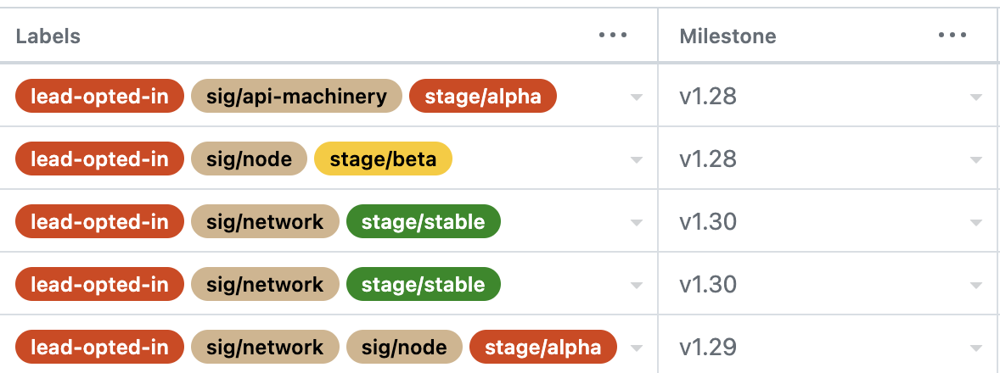

# Enhancements Lead Handbook

## Overview

While the Enhancements Lead serves as a member of the Release Team (a subproject of [SIG Release][sig-release]), this role is also a liaison to [sig-arch-Enhancements][sig-arch-enhancements] subproject of [SIG Architecture][sig-arch-readme].

## Responsibilities

An Enhancements Lead holds the following responsibilities:

- Maintain the active status of Enhancements within [kubernetes/enhancements][k/enhancements]
- Facilitate communication between Enhancement Owners, and SIG leadership, as necessary
- Collate the major themes of the release, including but not limited to:
  - new enhancements
  - long-awaited enhancements
  - enhancements moving into GA
  - enhancement deprecations
  - notable changes to existing behaviors
- Assist in Communications activities (in conjunction with the Communications Lead & the CNCF Communications team):
  - Draft and/or review https://kubernetes.io/blog/ release announcement post, leveraging the themes collected across the release cycle e.g., [1.17 Announcement][1.17-announcement]
  - Engage with media analysts during the embargo period to discuss the release themes
  - CNCF Kubernetes Release webinar
  - Identify potential contributors for the “5 Days of Kubernetes” blog series
- Identify candidates to assume the Enhancements Lead role (according to the [Release Team selection process][rt-selection]) in the following release cycle
  - Chose Enhancement shadows whom you believe would be a good fit for succession and help mentor them throughout the release cycle

## Prerequisites for Enhancements Lead and Shadows

### General Requirements

**Before continuing on to the Enhancements specific requirements listed below, please review and work through the tasks in the [Release Team Onboarding Guide](/release-team/release-team-onboarding.md).**

### Enhancements Specific Requirements

- MUST have served on the Release Team in a previous capacity, ideally as an Enhancements Shadow
- MUST be a member of the [Release Team Google Group][rt-group]
  - List of members for this group is managed in git. Create a [pull request](https://github.com/kubernetes/k8s.io/pull/1533) against [kubernetes/k8s.io](https://github.com/kubernetes/k8s.io/) repo to include both Lead and Shadows under `release-team` group in [k8s.io/sig-release/group.yaml](https://github.com/kubernetes/k8s.io/blob/bd082f195599b8a86b76b0249e5f70f219f1d079/groups/sig-release/groups.yaml#L318)
- MUST be a member of the [SIG Release Google Group][sig-release-group]
- MUST be a member of the [SIG Architecture Google Group][sig-arch-group]
- MUST be a member of the [Kubernetes Enhancements Google Group][enhancements-group]
- The enhancements lead should take the [Inclusive Speaker Orientation (LFC101)](https://training.linuxfoundation.org/training/inclusive-speaker-orientation/) training course

Helpful characteristics of an Enhancements Lead include:

- experience with the Kubernetes community, code layout, ecosystem projects, organizational norms, governance, SIG structure, architecture, and release process
- product/project/program management experience
- release management experience

### Time Commitments

Enhancement is one of the most time-intensive areas of the release team, and especially so during the early parts of the release. An Enhancements Lead can expect to spend:

- Beginning of the cycle through enhancement freeze: ~8–15 hours a week
- Week of enhancements freeze: 20+ hours
- Enhancement Freeze through Code Freeze: ~4–7 hours a week
- Code Freeze through Release Day: ~1–4 hours a week

Note that Enhancements Lead in particular will need to do work **during the week** during the early release, and will need to be available at least daily.

Enhancements shadows can expect to spend ~10–15 hours a week during the early release until enhancements freeze, and ~1–5 hours a week after enhancements freeze. Unlike Enhancements Lead, shadows can expect to do their work largely on weekends if they desire.

## Mentoring Shadows

The selected shadows should be:

- Interested in learning more about the Kubernetes release process.
- Able to dedicate a couple of hours each week to attending the Release meeting in addition to helping with weekly tasks.

The shadows should be selected keeping in mind that one of them may eventually be taking up the Enhancements Lead role. It is important to delegate tasks and give the shadows broad exposure to the different aspects of the role.

## Getting Started

### Access Required

Ensure that the previous Enhancements Lead has given you access to:

- The previous Kubernetes release enhancements tracking board.

Ensure that you and the shadows have been added to:

- GitHub teams
  - [enhancements](https://git.k8s.io/org/config/kubernetes/sig-architecture/teams.yaml) (This group should be used for Enhancement Subproject related pinging only and not for Release Team Enhancements Group)
  - [milestone-maintainers](https://git.k8s.io/org/config/kubernetes/sig-release/teams.yaml)
  - [release-team](https://git.k8s.io/org/config/kubernetes/sig-release/teams.yaml)
  - [release-team-enhancements](https://git.k8s.io/org/config/kubernetes/sig-release/teams.yaml) (For elevated access to tracking board)

### Slack

Join the following Kubernetes Slack channels:

- [#sig-release](https://kubernetes.slack.com/messages/sig-release)
- [#enhancements](https://kubernetes.slack.com/messages/enhancements)
- [#release-enhancements](https://kubernetes.slack.com/messages/release-enhancements)
- (optional) [#prod-readiness](https://kubernetes.slack.com/messages/prod-readiness)
- (optional) [#release-management](https://kubernetes.slack.com/messages/release-management)

## Process

### Standards

As mentioned previously, the Enhancements Lead role encompasses several cross-functional responsibilities with [sig-arch-Enhancements][sig-arch-enhancements] subproject of [SIG Architecture][sig-arch-readme].

The process of maintaining an enhancement in Kubernetes is documented in the [kubernetes/enhancements][k/enhancements] repo. Any questions / concerns / suggestions for improvement to the Enhancements process should be raised as GitHub issues / PRs to k/enhancements.

It is important that this process be followed and documentation remain up-to-date as the [Enhancements repo][k/enhancements] is the primary ingress point for contributors interested in tracking enhancements.

### Milestone Activities + Timing

> Note: The week #n timings given below are tentative. There are special releases like Kubernetes 1.19 or releases at the end of the year which may not strictly conform to that.

#### Week 0

- Create the Enhancements Tracking Board for the current release
  - Navigate to https://github.com/orgs/kubernetes/projects/, click the `New Project` button, select the `Table` template (default), and click the `Create` button.
  - Update project settings by clicking `...` -> `Settings` from the project board
    - Update the `Project name` to reflect the current release, e.g. **1.29 Enhancements Tracking**
    - Set the project's `Visibility` to **Public**
  - Update project access by clicking `Manage Access` from the settings page
    - Set the `Base role` access to **Read**
    - Add the following GitHub teams with **Admin** access
      - @release-team-leads
    - Add the following GitHub teams with  **Write** access
      - @production-readiness
      - @release-team-comms
      - @release-team-docs
      - @release-team-enhancements
      - @prod-readiness-reviewers
    - Add the @k8s-infra-ci-robot account to the board with **Write** access.
  - Create all the Fields (columns) for the board
    > Note: This is currently a manual process and  <https://github.com/orgs/community/discussions/41133> filed to help automate the process.
    > Note: Since `v1.30` an exceptions process for the Release Doc team is enforced. The previous PR Ready for Review deadline has been replaced with a Docs Freeze phase. Make sure to add `At Risk for Docs Freeze` and `Tracked for Docs Freeze` to the options in `status` column. Moreover add `docs` to the options in `type` column.
    - Until this can be automated; manually create fields with the same `Field Name`, `Field type`, and `Option` values from the previous release's project board.
  - Create all the Views for the board
    > Note: This is also currently a manual process until GitHub GraphQL APIs allow for manipulating Views
    - Until this can be automated; manually create Views with the same Names and Fields from the previous release's project board.
      Tip: You can easily view all the Fields present in each view by clicking the `v` next to the View's name a selecting `Configuration` -> `Fields`
      Note: Remember to **save** each View. If there is a blue bubble next to the Views name there are unsaved changed for that view!
  - Disable all Workflows for the project
    - Click `...` -> `Workflows`
    - For each workflow that enabled (has a green circle next to it), click the workflow and slide the toggle to 'Off'
  - Update automation to add issues to the correct Enhancement Tracking Board. Open a PR into [kubernetes/test-infra](https://github.com/kubernetes/test-infra) with the following changes: 
    - Update the [`GITHUB_PROJECT_BETA_NUMBER`](https://github.com/kubernetes/test-infra/blob/3de59f96b327c87c6d23a7308abc785268931707/config/jobs/kubernetes/sig-k8s-infra/trusted/sig-release-release-team-jobs/release-team-periodics.yaml#L20-L21) variable used by automation to identity the enhancements tracking board for the current release.
    - Enable the test-infra job that syncs enhancements to the GitHub project board based on the `lead-opt-in` label. Update the name of the [periodic-sync-enhancements-github-project](https://github.com/kubernetes/test-infra/blob/master/config/jobs/kubernetes/sig-k8s-infra/trusted/sig-release-release-team-jobs/release-team-periodics.yaml#L2) cronjob with the version number of the release and enable the cronjob by commenting the impossible cron and uncommenting the `interval`. You can see how this was done for the v1.29 release cycle in [this commit](https://github.com/kubernetes/test-infra/pull/30528/files#diff-9d86ca0a46a2f74a2cf59fff3d18cbba57b5b3489ecc00c36b03f6b6a0c2ac3a).
- Create a shortlink for the Tracking Board
  - Create a free account on [bitly](https://bitly.com/) to create a shortlink for the new Enhancement Tracking Board following the pattern `k8sxyy-enhancements`, e.g. <https://bit.ly/k8s127-enhancements>.
- Make a [pull request](https://github.com/kubernetes/sig-release/pull/1411) to add the shortlinked Enhancement Tracking Board to the current release page in [sig-release][sig-release].
- Make a pull request to add the shortlinked Enhancement Tracking Board to [kubernetes/enhancements README page](https://github.com/kubernetes/enhancements#enhancements-tracking-board).
- Find [Issues][enhancements-issues] from previous milestone that have graduated to Stable. Check to see if the KEP status has been updated to `implemented`. If it has, close the issue. If it has not, ask the issue contact to both update the KEP status field and close the Enhancement issue once the update PR has merged.
- Find [Issues labeled `lead-opted-in`](https://github.com/kubernetes/enhancements/issues?q=+is%3Aissue+label%3Alead-opted-in+) and remove the `lead-opted-in` label from all issues. Enhancements must be explicitly opted into each release.
- Close previous milestone by ensuring that there are no open issues/PRs in that milestone.
- Gather Shadows to have them read this handbook and give expectations on what the process looks like and their particular role. If possible, try to schedule a call with the shadows to get them accustomed to the team. This helps as a great team building exercise.
- Add Shadows to the  `release-team` and `release-team-enhancements` GitHub teams. (See [access-required](#access-required))
- Add Shadows to the `Enhancements Contact` Field of the Enhancements Tracking Board.
- Create a Google Sheet to track who will give updates at release team meetings
  - Access: : **restricted access**, edit rights shared with release team enhancements shadows individually

#### Week 1

- Send an email to the [Kubernetes-Dev](https://groups.google.com/a/kubernetes.io/g/dev) mailing list and a message to #chairs-and-techleads Slack channel with a call for enhancements and how to opt in to the release. Previous communications can be used as a template.
  - [1.26 call for enhancements](https://groups.google.com/a/kubernetes.io/g/dev/c/lnxXgZmOOMo/m/r6QNJIewBwAJ?utm_medium=email)
- Verify issues have k/k PRs associated, so they can be referenced and easily tracked. This is going to be critical come Enhancement Freeze and Code Freeze to see the status of the code.
- Work with the Release Lead to introduce yourself, talk about release information, and relay information about opting into the release with SIG Leads.

#### Before Enhancements Freeze

- Monitor the Enhancements Tracking Board for new additions as SIGs opt-in KEPs for the release and assign an enhancement contact to each Issue.
- For opted in Issues periodically (at least once a week):
  - Ensure Issue is in the current milestone
  - Ensure Issue has correct labels (`stage/xxx` is accurate, etc.)
  - Ensure Fields in the Enhancement Tracking Board are populated and accurate (Status, Stage, SIG, ...)
  - Evaluate if the enhancement satisfies all the [requirements](https://github.com/kubernetes/sig-release/blob/master/releases/release_phases.md#enhancements-freeze) for inclusion in the current release.
    - Comment on the Issue with a status updating using one of the [templates from below](#enhancement-freeze-templates)
    - Update `Enhancement Status` field for this Enhancement in the Enhancement Tracking Board (`tracked for enhancement freeze` or `at risk for enhancement freeze`)
    - KEPs targeting `stable` will need to be marked as `implemented` after code PRs are merged and the feature gates are removed. This will need to be verified after the code freeze.
    - *Note*: The scalability section in the README is required for only Enhancements targeting `beta` or `stable`. 
- Reach out to each [SIG on Slack](https://github.com/kubernetes/community/blob/master/sig-list.md) tagging one or more chairs or technical leads to communicate the Enhancements statuses. Example [communication templates](#sig-outreach-templates-optional) can be found below.
- Start syncing with Communications Team on giving an induction what's coming up for the release.
- Send an email to [Kubernetes-Dev](https://groups.google.com/a/kubernetes.io/g/dev) that Enhancement freeze is coming and share current Enhancements status. Examples [1](https://groups.google.com/g/kubernetes-dev/c/-nTNtBBHL2Y/m/WfNzb_E1EAAJ).
- Provide updates during release team meetings
  - Use the `KEPs by Stage` insight from the Enhancement Tracking Board ([example](https://github.com/orgs/kubernetes/projects/98/insights/3))

#### PRR Reviews 

The KEP template production readiness questionnaire should be filled out by the KEP authors, and reviewed by the SIG leads. 
Once the leads are satisfied with both the overall KEP (i.e., it is ready to move to `implementable` state) and the PRR answers,
the authors request a PRR approval. See [submitting a KEP for production readiness approval](#submitting-a-kep-for-production-readiness-approval) for more details.

When should a KEP owner request for a new PRR? 
1. When the KEP is ready to move to `implementable` state from `provisional`. 
2. Everytime the KEP graduates to a new stage (`alpha`/`beta`/`stable`) the KEP needs a new PRR approval. If the KEP is graduating and is missing a section in the README that was not required for earlier stages (e.g. the scalability section is only required for `beta` or `stable`) it will need a new PRR review.
3. When there are major changes introduced in the responses of the PRR questionnaire in the KEP README.md file (this requires a new PRR review even if the KEP is staying in the same stage).

For example, the Enhancements team needs to check the KEP has PRR approval when:

**KEP graduates to `alpha`:**

```
# keps/prod-readiness/<name-of-the-sig>/1234.yaml
kep-number: 1234
alpha:
  approver: @<gh-handle-of-PRR-approver>
```

**KEP graduating from `alpha` -> `beta`**

```
# keps/prod-readiness/<name-of-the-sig>/1234.yaml
kep-number: 1234
alpha:
  approver: @<gh-handle-of-PRR-approver>
beta:
  approver: @<gh-handle-of-PRR-approver>
```

**and `beta` -> `stable`**

```
# keps/prod-readiness/<name-of-the-sig>/1234.yaml
kep-number: 1234
alpha:
  approver: @<gh-handle-of-PRR-approver>
beta:
  approver: @<gh-handle-of-PRR-approver>
stable:
  approver: @<gh-handle-of-PRR-approver>
```

##### Enhancement KEP Status

For each Enhancement KEP, the Enhancement team needs to verify that the `status` set in the KEP is one of `provisional`, `implementable`, `implemented`, `deferred`, `rejected`, `withdrawn`, or `replaced`.
The `status` mus follow the criteria:

|        Status | Description                                                                                                                                                                                                         |
|--------------:|---------------------------------------------------------------------------------------------------------------------------------------------------------------------------------------------------------------------|
|   provisional | The KEP has been proposed and is actively being defined. This is the starting state while the KEP is being fleshed out and actively defined and discussed. The owning SIG has accepted that this work must be done. |
| implementable | Enhancement KEP should no longer have major changes and must be approved by each of the KEP approvers to enter `implementable`.                                                                                     |
|   implemented | Enhancement is graduating to`Stable`, code PRs are merged and feature flags have been removed. Once a feature has become `implemented`, major changes should get new KEPs.                                          |
|      deferred | Enhancement is proposed but not actively being worked on or the Enhancement has been bumped to a future release by owning SIG.                                                                                      |
|      rejected | The approvers and authors have decided that this KEP is not moving forward. The KEP is kept around as a historical document.                                                                                        |
|     withdrawn | Enhancement KEP authors have withdrawn the KEP and Enhancement will be removed from the code.                                                                                                                       |
|      replaced | The KEP has been replaced by a new KEP. The superseded-by metadata value should point to the new KEP.                                                                                                               |

See the sig-architecture Enhancements [KEP Template](https://github.com/kubernetes/enhancements/blob/master/keps/sig-architecture/0000-kep-process/README.md#kep-template) guide for a walkthrough of the metadata fields found in the KEP template.

#### Week of Enhancements Freeze
- On the day of the Enhancements Freeze, schedule an "Enhancement Freeze Party". Invite all the Enhancement shadows, Emeritus Advisor, Release Team Lead and Lead Shadows (make participation optional for the invitees due to potential timezone differences.) Post the "Enhancement Freeze Party" meeting details in the #sig-release and #release-enhancements Kubernetes Slack channels. **Note**: It is helpful to delegate enhancements to review to shadows to help with the process.
- Clean up Enhancements issues by removing release milestone (e.g., v1.28) from the KEP GitHub issue by commenting /milestone clear on the KEP issue for Enhancements that have not opted-in 
  - [example GitHub comment](https://github.com/kubernetes/enhancements/issues/3140#issuecomment-1121930633) on removing 1.24 milestone
  - Make sure that number of in-tree open issues with current milestone matches number of opted-in enhancements by checking the Enhancements Tracking Board and GitHub issues with the current milestone. **Note**: in-tree refers to KEPs with PRs inside the [kubernetes/kubernetes](https://github.com/kubernetes/kubernetes) repository.
- If a previously removed Enhancement has had their exception Approved, set their **Enhancement Status** to `tracked for enhancement freeze` in the Enhancement Tracking Board.
- On Freeze day, email [Kubernetes-Dev](https://groups.google.com/a/kubernetes.io/g/dev) that freeze has happened and upcoming key dates. Examples [1](https://groups.google.com/g/kubernetes-dev/c/JDM7bNKvhqQ/m/8S7BXtXPBQAJ).
- Disable the [periodic-sync-enhancements-github-project](https://github.com/kubernetes/test-infra/blob/master/config/jobs/kubernetes/sig-k8s-infra/trusted/sig-release-release-team-jobs/release-team-periodics.yaml#L2) cronjob which syncs enhancements where the `lead-opt-in` label has been added to the GitHub project board.
  - Disable the job by commenting the `interval` and uncommenting the impossible cron date. You can see how this was done in the v1.29 release in [this commit](https://github.com/kubernetes/test-infra/commit/064dd07f0164c2aadc12d611f5a851d6cc40afdd).
- Remove any Enhancements that failed to meet the criteria by the Enhancement freeze deadline.
  - Set their **Enhancement Status** in the board to `Removed from Milestone`.
  - Remove the milestone.
    ```text
    /milestone clear
    ```
    
<figure class="image">
  
  <figcaption>
    Sample GitHub project board with labels showing `lead-opted-in` and different milestones. 
    Only the enhancements targeting the current release should have the milestone set. 
  </figcaption>
</figure>

#### Post Enhancements Freeze

- Any enhancements removed from the milestone will now require an exception. As exception requests come in, discuss each with the Release Lead (and Shadows) to arrive at an approve/reject decision.
  - Create an exception file in the Release for exceptions Example [1](https://github.com/kubernetes/sig-release/blob/master/releases/release-1.14/exception.yaml).
- Stay on top of issues and continually monitor them twice a week and look at attached PRs. As Code Freeze gets closer, if there are PRs that have not been merged, move the issue to `at risk for code freeze`. If there is no activity, ping issue owners on either the issue or the k/k PR.
- Monitor issues that are `at risk for code freeze` closely, almost daily. Code Freeze means no new code and keeping tabs on the status of the k/k PR is critical to planning. Make decisions if the enhancement should be deferred and work with SIG Leads to determine the best path forward.

#### Before Code Freeze

**All** enhancements going into the release must have their pull requests in a merge-ready state with approved and lgtm labels applied. This includes tests, and docs PRs opened by the due date. Due to the Prow queue, this may mean that approved PRs merge shortly after the deadline.

Read https://github.com/kubernetes/sig-release/blob/master/releases/release_phases.md#code-freeze for more information on the Code Freeze.

#### Week of Code Freeze

- Delegate enhancements to shadows to reach out to assigned KEPs two weeks before code freeze. 
  - Evaluate if the enhancement satisfies all the [requirements](https://github.com/kubernetes/sig-release/blob/master/releases/release_phases.md#code-freeze) for inclusion in the current release.
    - Comment on the Issue with a status updating using one of the [templates from below](#code-freeze-templates)
    - Update `Enhancement Status` field for this Enhancement in the Enhancement Tracking Board (`tracked for code freeze` or `at risk for code freeze`)
    - If the code PRs are not tracked in the GitHub issue description, search [kubernetes/kubernetes](https://github.com/kubernetes/kubernetes) for the KEP number or KEP keywords to find the PRs and add them to the GitHub issue description. Validate that you found the correct code PRs with the KEP author. 
    - KEPs targeting `stable` for the release will now need to be marked as `implemented` after code PRs are merged and the feature gates are removed.
- Start planning for the next release while assisting the Release Lead with anything relating to analytics or Public Relation planning of the release. Work with the Communications Lead to develop major themes for the official Kubernetes blog post.

**Note**: out-of-tree enhancements i.e. enhancements with label `tracked/out-of-tree` applied to them don't have their PRs inside [kubernetes/kubernetes](https://github.com/kubernetes/kubernetes) repository unlike other enhancements, therefore during enhancements-freeze and code-freeze they might not strictly comply with the tracking criteria.
  Examples: 
  - https://github.com/kubernetes/enhancements/issues/3203#issuecomment-1421928726 
  - https://github.com/kubernetes/enhancements/issues/3476#issuecomment-1467208685

#### Code Freeze Party 🎉
- Schedule a "Code Freeze Party" on the day of the code freeze. Invite all the Enhancement shadows, Emeritus Advisor, Release Team Lead and Lead Shadows (make participation optional for the invitees due to potential timezone differences.) Post the "Code Freeze Party" meeting details in the #sig-release and #release-enhancements Kubernetes Slack channels.
- During the "Code Freeze Party" meeting, review each of the tracked Enhancements to perform a final status assessment for code freeze readiness. If an Enhancement doesn't meet the requirements for the [code freeze](https://github.com/kubernetes/sig-release/blob/master/releases/release_phases.md#code-freeze), notify the author of the KEP by leaving a comment on the corresponding KEP issue. Use the [second code freeze communication template from below.](#code-freeze-templates) **Note**: It is helpful to delegate enhancements to review to shadows to help with the process.
- Remove any enhancements that failed to merge their code by the Code freeze deadline.
  - Set their status in the sheet to `Removed from Milestone`.
  - Remove the milestone.
    ```text
    /milestone clear
    ```

  - Remove the milestone from all open `k/k` PRs related to the enhancement.
- Any enhancements removed from the milestone will now require an exception. As exception requests come in, discuss each with the Release Lead (and Shadows) to arrive at an approve/reject decision.
  - Add a `/hold` label to `k/k` PRs associated with incoming exceptions to prevent from accidental merge.
  - Add incoming exception information to the previous created `exception.yaml` file.
  - If an **Exception Request** for a previously removed Enhancement is approved by the Release Team (on the Exception Request email), update its **Enhancement Status** to `tracked for enhancement freeze` on the Enhancement Tracking Board.

### Communication Templates

#### Enhancement Freeze Templates

If the Enhancement Issue **does not** meet the criteria for inclusion in the current release use this template in Issue comments:

```markdown
Hello {enhancement owner} 👋, Enhancements team here.

Just checking in as we approach **enhancements freeze on { FREEZE_DATETIME }**.

This enhancement is targeting for stage `<insert-stage-here>` for {current release} (correct me, if otherwise)

Here's where this enhancement currently stands:

- [ ] KEP readme using the [latest template](https://github.com/kubernetes/enhancements/tree/master/keps/NNNN-kep-template) has been merged into the k/enhancements repo.
- [ ] KEP status is marked as `implementable` for `latest-milestone: { CURRENT_RELEASE }`. KEPs targeting `stable` will need to be marked as `implemented` after code PRs are merged and the feature gates are removed.
- [ ] KEP readme has up-to-date graduation criteria
- [ ] KEP has a production readiness review that has been completed and merged into k/enhancements. (For more information on the PRR process, check [here](https://github.com/kubernetes/community/blob/master/sig-architecture/production-readiness.md#submitting-a-kep-for-production-readiness-approval)).

For this KEP, we would just need to update the following:
- {insert list of action items}

The status of this enhancement is marked as `at risk for enhancement freeze`. Please keep the issue description up-to-date with appropriate stages as well.

If you anticipate missing enhancements freeze, you can file an [exception request](https://github.com/kubernetes/sig-release/blob/master/releases/EXCEPTIONS.md) in advance. Thank you!

```

If the Enhancement Issue **does** meet the criteria for inclusion in the current release use this template in Issue comments:

```markdown
Hello {enhancement owner} 👋, Enhancements team here.

Just checking in as we approach **enhancements freeze on { FREEZE_DATETIME }**.

This enhancement is targeting for stage `<insert-stage-here>` for {current release} (correct me, if otherwise)

Here’s where this enhancement currently stands:

- [X] KEP readme using the [latest template](https://github.com/kubernetes/enhancements/tree/master/keps/NNNN-kep-template) has been merged into the k/enhancements repo.
- [X] KEP status is marked as `implementable` for `latest-milestone: { CURRENT_RELEASE }`. KEPs targeting `stable` will need to be marked as `implemented` after code PRs are merged and the feature gates are removed.
- [X] KEP readme has up-to-date graduation criteria.
- [X] KEP has [submitted a production readiness review](https://github.com/kubernetes/community/blob/master/sig-architecture/production-readiness.md#submitting-a-kep-for-production-readiness-approval) request for approval and has a reviewer assigned.
- [X] KEP has a production readiness review that has been completed and merged into k/enhancements. (For more information on the PRR process, check [here](https://github.com/kubernetes/community/blob/master/sig-architecture/production-readiness.md#submitting-a-kep-for-production-readiness-approval)).

With all the KEP requirements in place and merged into k/enhancements, this enhancement is all good for the upcoming enhancements freeze. 🚀

The status of this enhancement is marked as `tracked for enhancement freeze`. Please keep the issue description up-to-date with appropriate stages as well. Thank you!
```

#### Enhancement Freeze Party Templates

If the Enhancement Issue **does** meet the enhancement freeze criteria for inclusion in the current release use this template in Issue comments:

```markdown
With all the requirements fulfilled this enhancement is now marked as tracked for the upcoming enhancements freeze 🚀
```

Then make sure the status of the enhancement is set to `tracked for enhancement freeze`. 

If the Enhancement Issue **does not** meet the enhancement freeze criteria for inclusion in the current release use this template in Issue comments:

```markdown 
Hello 👋, {current release} Enhancements team here.

Unfortunately, this enhancement did not meet requirements for [enhancements freeze](https://github.com/kubernetes/sig-release/blob/master/releases/release_phases.md#enhancements-freeze).

If you still wish to progress this enhancement in {current release}, please file an [exception](https://github.com/kubernetes/sig-release/blob/master/releases/EXCEPTIONS.md) request as soon as possible, within three days. If you have any questions, you can reach out in the #release-enhancements channel on Slack and we'll be happy to help. Thanks!
```

#### Code Freeze Templates

```markdown
Hey again {enhancement owner} 👋 Enhancements team here,

Just checking in as we approach **code freeze at { FREEZE_DATETIME }** .

Here's where this enhancement currently stands:

- [ ] All PRs to the Kubernetes repo that are related to your enhancement are linked in the above issue description (for tracking purposes).
- [ ] All PR/s are ready to be merged (they have `approved` and `lgtm` labels applied) by the code freeze deadline. This **includes** tests.

For this enhancement, it looks like the following PRs are open and need to be merged before code freeze (and we need to update the Issue description to include all the related PRs of this KEP):
- { list of PRs associated with this enhancement }

If you anticipate missing code freeze, you can file an [exception request](https://github.com/kubernetes/sig-release/blob/master/releases/EXCEPTIONS.md) in advance.

Also, please let me know if there are other PRs in k/k we should be tracking for this KEP.
As always, we are here to help if any questions come up. Thanks!
```

#### Code Freeze Party Templates

If the Enhancement Issue **does** meet the code freeze criteria for inclusion in the current release use this template in Issue comments:

```markdown
Hello {enhancement owner} 👋, Enhancements team here.

With all the implementation(code related) PRs merged as per the issue description:
- {insert list of code prs}

This enhancement is now marked as `tracked for code freeze` for the {current release} Code Freeze!
```

If the Enhancement Issue **does not** meet the code freeze criteria for inclusion in the current release use this template in Issue comments:

```markdown 
Hello {enhancement owner} 👋 Enhancements team here,

Unfortunately, the implementation (code related) PR(s) associated with this enhancement is not in the merge-ready state by code-freeze and hence this enhancement is now removed from the {current release} milestone.

If you still wish to progress this enhancement in {current release}, please file an [exception](https://github.com/kubernetes/sig-release/blob/master/releases/EXCEPTIONS.md) request as soon as possible, within three days. If you have any questions, you can reach out in the #release-enhancements channel on Slack and we'll be happy to help. Thanks!

/milestone clear
```

#### SIG Outreach Templates (optional)

For SIGs which have opted to include Enhancements in the current release:

```markdown
Hello SIG { SIG_NAME }! Enhancements team here.
Just checking in as we approach enhancements freeze at { FREEZE_DATETIME }.
Your SIG has submitted { X } enhancements for the { CURRENT_RELEASE } cycle, and { Y } enhancements are currently `at risk for enhancement freeze`.
Refer to the [announcement here]({link to announcement for current release cycle}) for the list of review requirements.
If your SIG still plans to submit more enhancements, follow the [instructions here]({link to announcement for current release cycle}) so the enhancements team can begin tracking.
Please plan to make KEP updates to meet all the requirements before enhancement freeze.
Please reach out to [#release-enhancements](https://kubernetes.slack.com/archives/C02BY55KV7E) if you have any questions.
```

For SIGs which have not opted to include Enhancements in the current release:

```markdown
Hello SIG {{ SIG_NAME }}. Enhancements team here.
Just checking in as we approach enhancements freeze at {{ FREEZE_DATETIME }}.
Your SIG has not submitted any enhancements for the { CURRENT_RELEASE } cycle.
If your SIG still plans to submit an enhancement, follow the [instructions here]({link to announcement for current release cycle}) so the enhancements team can begin tracking.
If your SIG is not planning to submit an enhancement, please reply to this message to confirm.
Please reach out to [#release-enhancements](https://kubernetes.slack.com/archives/C02BY55KV7E) if you have any questions.
```

### Working with the Enhancement Tracking Board

The Enhancements Tracking Board is used by the release-enhancements, release-docs, and release-comms teams.
Information in this document will be focused on how the Enhancements team should interact with the project board.

#### Enhancements View

The `Enhancements` view is the primary view for the project board and is owned by the Enhancements subteam.
This view is used source of truth for tracking the status of enhancements included in a given release.

> - **Do not** archive items from the board! Enhancements that are no longer being tracked for the current release are filtered out of the default View but should remain in the board for tracking purposes.

|                Field | Description                                                                       |
|---------------------:|-----------------------------------------------------------------------------------|
|                Title | Title of (and link to) the `Issue` in k/enhancements.                             |
|            Assignees | Assignees for the `Issue` in k/enhancements.                                      |
|                 Type | [Type](#type) of enhancement.                                                     |
|                Stage | Target stage (Alpha, Beta, Stable) for the current release.                       |
|               Status | [Status](#status) of the enhancement.                                             |
| Enhancements Contact | Alias of the Enhancements team designated as primary contact for the enhancement. |
|                  SIG | Owning SIG.                                                                       |
|           PRR Status | Status of PRR review for the enhancement.                                         |
|               Labels | Labels applied to the `Issue` in k/enhancements.                                  |
|            Milestone | The milestone assigned to the `Issue` in k/enhancements.                          |
|                 Note | Freeform notes added by the Enhancements team.                                    |

##### Type

|         Type | Description                                                                                                   |
|-------------:|---------------------------------------------------------------------------------------------------------------|
|      Net New | Enhancement is adding net-new work. Usually reserved for enhancements targeting their `Alpha` implementation. |
| Major Change | Enhancement is staying at the current Stage, but major changes in functionality are being implemented.        |
|   Graduating | Enhancement is graduating to `Beta` or `Stable`.                                                              |
|  Deprecation | Enhancement is tracking a deprecations or removals.                                                           |
|         Docs | This is a PR for Docs that is being tracked by Docs team.                                                     |
Notes :

- If the feature is graduating to `Alpha`, the type can either be Net New/Major Change. But usually when features are introduced to Kubernetes, they are not Major Changes.
- If the feature is graduating to `Beta/Stable`, almost always the type is Graduating/Major Change. One exception to that is some features directly jump the hoop to Beta, in that case, the type can be Net New for even a `Beta` feature.

##### Status

The field `Status` tracks if the KEP has met all the criteria for inclusion in the current release.
Refer to the [Enhancement Freeze Communications](#enhancement-freeze-templates) for detailed requirements.

|                 Status | Description                                                                                                                                 |
|-----------------------:|---------------------------------------------------------------------------------------------------------------------------------------------|
|                Tracked For Enhancement Freeze | Enhancement has met all requirements for inclusion into current release.                                                                    |
|                At Risk For Enhancement Freeze | Enhancement does not currently meet requirements for inclusion into current release.                                                        |
|                Tracked For Code Freeze | Enhancement has met all code freeze requirements for inclusion into current release.                                                                    |
|                At Risk For Code Freeze | Enhancement does not currently meet requirements for inclusion into current release because code freeze requirements have not been met. |
|                Tracked For Docs Freeze | Enhancement has met all docs freeze requirements for inclusion into current release.                                                                    |
|                At Risk For Docs Freeze | Enhancement does not currently meet requirements for inclusion into current release because docs freeze requirements have not been met. |
|     Exception Required | Enhancement did not meet requirements by enhancement / code freeze and deadlines for requesting an [exception](#exceptions) has not passed. | 
|               Deferred | Enhancement has been bumped to a future release by owning SIG.                                                                              |
| Removed From Milestone | Enhancement did not meet requirements by enhancement / code freeze for current release and an exception was not requested and/or approved.  |

Notes:

- If the Enhancement is being bumped to a later release, set its status to `Deferred`.
- If it is being removed due to missing criteria or lack of response after being included in the milestone, set its status to `Removed from Milestone`.

> Feel free to ask the previous enhancements leads about this when in doubt.

##### Release Team Meeting Updates

For the release team meeting, provide a `status` based on the following criteria:
- A `Red` on our enhancements status means that something major is blocking our work while tracking the enhancements. We hardly have a red status on our enhancements team.
- A `Yellow` status generally means that we are still in progress of tracking and reaching out to KEPs and owners, or we have some minor blockages but will be good as they will be resolved soon.
- A `Green` status means that everything looks good and done from enhancements team side, i.e. every KEP on the tracking board has been communicated with, done with the follow-ups, outreaches etc. Everything is A-OK here.


### Escalation / Handling Unresponsive Enhancement Owners

For issues where the initial owner is unresponsive, try escalating to the relevant SIG's leadership to determine if the issue is still targeted for the release.

If there is continued unresponsiveness on issues, remove them from the milestone at your discretion.

### Exceptions

Exception process is outlined [here](https://github.com/kubernetes/sig-release/blob/master/releases/EXCEPTIONS.md)

### CNCF / Media Engagement

- You may be called upon by the communications lead to help with media engagement near the end of the release cycle.  Please ensure that if there are any restrictions or training required by your company before engaging that you have completed those ahead of Code Thaw.

### Succession

- Select who will be the new enhancement lead for the next release. Shadows should be the first source pool. If none are available to lead then look externally through other release team members or members of [SIG Architecture Enhancements Subproject](https://github.com/kubernetes/community/blob/master/sig-architecture/README.md#enhancements)
- Continually work to improve Enhancements process
- Review / update documentation as the release cycle ends
- Close issues marked as stable that made it into the release, only after the corresponding KEPs have been marked `Implemented`
- Close milestones that are complete
- Cleanup old milestones

### Limitations

- Populating the Enhancements Tracking sheet is a manual process
- Enhancements issues that are not submitted to [k/enhancements][k/enhancements] are not actively tracked in the context of the Release Team and Release cycle e.g.,
  - `kubeadm` (https://github.com/kubernetes/kubeadm/issues?utf8=%E2%9C%93&q=is%3Aissue+label%3Akind%2Ffeature+milestone%3Av1.12+)
  - out-of-tree Cloud Provider code that may live in `kubernetes-sigs/*`
  - additional out-of-tree code that may live in the following organizations:
    - `kubernetes`
    - `kubernetes-client`
    - `kubernetes-csi`
    - `kubernetes-incubator`
    - `kubernetes-sig-testing`
  - `kubernetes-sigs`
- Finding consensus on how frequently to triage enhancements

## Signals

## Tips & Tricks

### Sample Searches (examples)

### GitHub Notifications

https://groups.google.com/forum/#!topic/kubernetes-dev/5qU8irU7_tE

[enhancements-group]: https://groups.google.com/forum/#!forum/kubernetes-keps
[enhancements-issues]: https://github.com/kubernetes/enhancements/issues
[k/enhancements]: https://github.com/kubernetes/enhancements
[rt-group]: https://groups.google.com/a/kubernetes.io/g/release-team
[rt-selection]: /release-team/release-team-selection.md
[rt-requirements]: /release-team/release-team-onboarding.md
[sig-arch-readme]: https://github.com/kubernetes/community/tree/master/sig-architecture/README.md
[sig-arch-group]: https://groups.google.com/forum/#!forum/kubernetes-sig-architecture
[sig-arch-enhancements]: https://github.com/kubernetes/community/tree/master/sig-architecture#enhancements
[sig-docs-group]: https://groups.google.com/forum/#!forum/kubernetes-sig-docs
[sig-leads-group]: https://groups.google.com/a/kubernetes.io/g/leads
[sig-release]: https://github.com/kubernetes/community/blob/master/sig-release/README.md
[sig-release-group]: https://groups.google.com/forum/#!forum/kubernetes-sig-release
[sig-release-leads-group]: https://groups.google.com/forum/#!forum/kubernetes-sig-release-leads
[1.17-announcement]: https://kubernetes.io/blog/2019/12/09/kubernetes-1-17-release-announcement/
[1.17-tracking]: https://bit.ly/k8s117-enhancement-tracking
