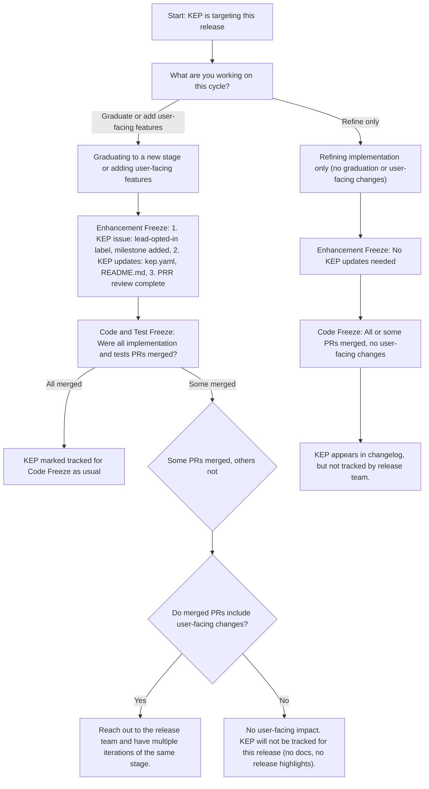

# Enhancements Lead Handbook

## Table of Contents

- [Overview](#overview)
- [Responsibilities](#responsibilities)
- [Prerequisites](#prerequisites)
  - [General Requirements](#general-requirements)
  - [Enhancements-Specific Requirements](#enhancements-specific-requirements)
  - [Time Commitments](#time-commitments)
  - [Mentoring Shadows](#mentoring-shadows)
- [Getting Started](#getting-started)
  - [Access Required](#access-required)
  - [Slack](#slack)
- [Process](#process)
  - [Standards](#standards)
  - [PRR Reviews](#prr-reviews)
  - [Enhancement KEP Status](#enhancement-kep-status)
  - [What Changes Require Tracking](#what-changes-require-tracking)
  - [Working with the Enhancement Tracking Board](#working-with-the-enhancement-tracking-board)
  - [Release Team Meeting Updates](#release-team-meeting-updates)
  - [Exceptions](#exceptions)
  - [Escalation / Handling Unresponsive Enhancement Owners](#escalation--handling-unresponsive-enhancement-owners)
  - [Limitations](#limitations)
- [Milestone Activities + Timing](#milestone-activities--timing)
  - [Week 0](#week-0)
  - [Week 1](#week-1)
  - [Before PRR Freeze](#before-prr-freeze)
  - [Before Enhancements Freeze](#before-enhancements-freeze)
  - [Week of Enhancements Freeze](#week-of-enhancements-freeze)
  - [Post Enhancements Freeze](#post-enhancements-freeze)
  - [Before Code Freeze](#before-code-freeze)
  - [Pre-Freeze Check: Catching untracked feature changes](#pre-freeze-check-catching-untracked-feature-changes)
  - [Week of Code Freeze](#week-of-code-freeze)
  - [Code Freeze Party 🎉](#code-freeze-party-)
  - [Post Code Freeze](#post-code-freeze)
  - [CNCF / Media Engagement](#cncf--media-engagement)
  - [Succession](#succession)

## Overview

While the Enhancements Lead serves as a member of the Release Team (a subproject of [SIG Release][sig-release]), this role is also a liaison to [sig-arch-Enhancements][sig-arch-enhancements] subproject of [SIG Architecture][sig-arch-readme].

## Responsibilities

An Enhancements Lead holds the following responsibilities:

- Maintain the active status of Enhancements within [kubernetes/enhancements][k/enhancements]
- Facilitate communication between Enhancement Owners, and SIG leadership, as necessary

- Assist in Communications activities (in conjunction with the Communications Lead & the CNCF Communications team):
  - Help collate the Release Highlights of the release, including but not limited to:
    - new enhancements
    - long-awaited enhancements
    - enhancements moving into GA
    - enhancement deprecations
    - notable changes to existing behaviors
  - Draft and/or review the https://kubernetes.io/blog/ release announcement post, leveraging the themes collected across the release cycle, e.g.:
    - [1.35 Announcement](https://kubernetes.io/blog/2025/12/17/kubernetes-v1-35-release/)
    - [1.34 Announcement](https://kubernetes.io/blog/2025/08/27/kubernetes-v1-34-release/)
  - Engage with media analysts during the embargo period to discuss the release themes
  - CNCF Kubernetes Release webinar (with the Release Lead and Communications Lead)
  - Identify potential contributors for the “5 Days of Kubernetes” blog series
- Identify candidates to assume the Enhancements Lead role (according to the [Release Team selection process][rt-selection]) in the following release cycle
  - Chose Enhancement shadows whom you believe would be a good fit for succession and help mentor them throughout the release cycle

## Prerequisites

### General Requirements

**Before continuing on to the Enhancements specific requirements listed below, please review and work through the tasks in the [Release Team Onboarding Guide](/release-team/release-team-onboarding.md).**

### Enhancements-Specific Requirements

Enhancements Lead:
- MUST have served on the Release Team in a previous capacity, ideally as an Enhancements Shadow
- MUST take the [Inclusive Speaker Orientation (LFC101)](https://training.linuxfoundation.org/training/inclusive-speaker-orientation/) training course

Enhancements Lead and Shadows:
- MUST be a member of the [Release Team Google Group][rt-group]
  - List of members for this group is managed in git. Create a [pull request](https://github.com/kubernetes/k8s.io/pull/1533) against [kubernetes/k8s.io](https://github.com/kubernetes/k8s.io/) repo to include both Lead and Shadows under `release-team` group in [k8s.io/sig-release/group.yaml](https://github.com/kubernetes/k8s.io/blob/bd082f195599b8a86b76b0249e5f70f219f1d079/groups/sig-release/groups.yaml#L318)
- MUST be a member of the [SIG Release Google Group][sig-release-group]
- MUST be a member of the [SIG Architecture Google Group][sig-arch-group]

Helpful characteristics of an Enhancements Lead include:

- experience with the Kubernetes community, code layout, ecosystem projects, organizational norms, governance, SIG structure, architecture, and release process
- product/project/program management experience
- release management experience

### Time Commitments

Enhancements is one of the most time-intensive areas of the release team, and especially so during the early parts of the release. An Enhancements Lead can expect to spend:

- Beginning of the cycle through enhancement freeze: ~8–15 hours a week
- Week of enhancements freeze: 20+ hours
- Enhancement Freeze through Code Freeze: ~4–7 hours a week
- Code Freeze through Release Day: ~1–4 hours a week

Note that Enhancements Lead in particular will need to do work **during the week** during the early release, and will need to be available at least daily.

Enhancements shadows can expect to spend ~10–15 hours a week during the early release until enhancements freeze, and ~1–5 hours a week after enhancements freeze. Unlike Enhancements Lead, shadows can expect to do their work largely on weekends if they desire.

### Mentoring Shadows

The selected shadows should be:

- Interested in learning more about the Kubernetes release process.
- Able to dedicate a couple of hours each week to attending the Release meeting in addition to helping with weekly tasks.

The shadows should be selected keeping in mind that one of them may eventually be taking up the Enhancements Lead role. It is important to delegate tasks and give the shadows broad exposure to the different aspects of the role.

## Getting Started

### Access Required

Ensure that the previous Enhancements Lead has given you access to:

- The previous Kubernetes release enhancements tracking board.

Ensure that you and the shadows have been added to:

- GitHub teams
  - [enhancements](https://git.k8s.io/org/config/kubernetes/sig-architecture/teams.yaml) (This group should be used for Enhancement Subproject related pinging only and not for Release Team Enhancements Group)
  - [milestone-maintainers](https://git.k8s.io/org/config/kubernetes/sig-release/teams.yaml)
  - [release-team](https://git.k8s.io/org/config/kubernetes/sig-release/teams.yaml)
  - [release-team-enhancements](https://git.k8s.io/org/config/kubernetes/sig-release/teams.yaml) (For elevated access to tracking board)

### Slack

Join the following Kubernetes Slack channels:

- [#sig-release](https://kubernetes.slack.com/messages/sig-release)
- [#enhancements](https://kubernetes.slack.com/messages/enhancements)
- [#release-enhancements](https://kubernetes.slack.com/messages/release-enhancements)
- (optional) [#prod-readiness](https://kubernetes.slack.com/messages/prod-readiness)
- (optional) [#release-management](https://kubernetes.slack.com/messages/release-management)

## Process

### Standards

As mentioned previously, the Enhancements Lead role encompasses several cross-functional responsibilities with [sig-arch-Enhancements][sig-arch-enhancements] subproject of [SIG Architecture][sig-arch-readme].

The process of maintaining an enhancement in Kubernetes is documented in the [kubernetes/enhancements][k/enhancements] repo. Any questions / concerns / suggestions for improvement to the Enhancements process should be raised as GitHub issues / PRs to k/enhancements.

It is important that this process be followed and documentation remain up-to-date as the [Enhancements repo][k/enhancements] is the primary ingress point for contributors interested in tracking enhancements.

### PRR Reviews

The KEP template production readiness questionnaire should be filled out by the KEP authors, and reviewed by the SIG leads. 
Once the leads are satisfied with both the overall KEP (i.e., it is ready to move to `implementable` state) and the PRR answers,
the authors request a PRR approval. See [submitting a KEP for production readiness approval](https://github.com/kubernetes/community/blob/master/sig-architecture/production-readiness.md#submitting-a-kep-for-production-readiness-approval) for more details.

When should a KEP owner request for a new PRR?
1. When the KEP is ready to move to `implementable` state from `provisional`.
2. Everytime the KEP graduates to a new stage (`alpha`/`beta`/`stable`) the KEP needs a new PRR approval. If the KEP is graduating and is missing a section in the README that was not required for earlier stages (e.g. the scalability section is only required for `beta` or `stable`) it will need a new PRR review.
3. When there are major changes introduced in the responses of the PRR questionnaire in the KEP README.md file (this requires a new PRR review even if the KEP is staying in the same stage).

For example, the Enhancements team needs to check the KEP has PRR approval when:

**KEP graduates to `alpha`:**

```
# keps/prod-readiness/<name-of-the-sig>/1234.yaml
kep-number: 1234
alpha:
  approver: @<gh-handle-of-PRR-approver>
```

**KEP graduating from `alpha` -> `beta`**

```
# keps/prod-readiness/<name-of-the-sig>/1234.yaml
kep-number: 1234
alpha:
  approver: @<gh-handle-of-PRR-approver>
beta:
  approver: @<gh-handle-of-PRR-approver>
```

**and `beta` -> `stable`**

```
# keps/prod-readiness/<name-of-the-sig>/1234.yaml
kep-number: 1234
alpha:
  approver: @<gh-handle-of-PRR-approver>
beta:
  approver: @<gh-handle-of-PRR-approver>
stable:
  approver: @<gh-handle-of-PRR-approver>
```

### Enhancement KEP Status

For each Enhancement KEP, the Enhancement team needs to verify that the `status` set in the KEP is one of `provisional`, `implementable`, `implemented`, `deferred`, `rejected`, `withdrawn`, or `replaced`.
The `status` must follow the criteria:

|        Status | Description                                                                                                                                                                                                         |
|--------------:|---------------------------------------------------------------------------------------------------------------------------------------------------------------------------------------------------------------------|
|   provisional | The KEP has been proposed and is actively being defined. This is the starting state while the KEP is being fleshed out and actively defined and discussed. The owning SIG has accepted that this work must be done. |
| implementable | Enhancement KEP should no longer have major changes and must be approved by each of the KEP approvers to enter `implementable`.                                                                                     |
|   implemented | Enhancement is graduating to`Stable`, code PRs are merged and feature flags have been removed. Once a feature has become `implemented`, major changes should get new KEPs.                                          |
|      deferred | Enhancement is proposed but not actively being worked on or the Enhancement has been bumped to a future release by owning SIG.                                                                                      |
|      rejected | The approvers and authors have decided that this KEP is not moving forward. The KEP is kept around as a historical document.                                                                                        |
|     withdrawn | Enhancement KEP authors have withdrawn the KEP and Enhancement will be removed from the code.                                                                                                                       |
|      replaced | The KEP has been replaced by a new KEP. The superseded-by metadata value should point to the new KEP.                                                                                                               |

See the sig-architecture Enhancements [KEP Template](https://github.com/kubernetes/enhancements/blob/master/keps/sig-architecture/0000-kep-process/README.md#kep-template) guide for a walkthrough of the metadata fields found in the KEP template.

### What Changes Require Tracking

A KEP may still be required to opt-in in order for the Enhancements subteam to monitor it, even if it is not graduating to a new stage.

**Changes that typically do NOT require tracking by the Release Team:**
- Improvements or refactors that do not affect behaviour (e.g., code cleanup, variable renaming, internal function reorganisation)
- Bug fixes that preserve functionality while restoring the intended behaviour

**Changes that typically DO require tracking by the Release Team:**
- Refactors or enhancements that affect behaviour (e.g., altering the functionality of a feature, modulating error handling, or changing performance characteristics)
- Any modifications that affect the user experience

The team will collaborate with the KEP authors to ensure that any outstanding exception request deadlines are met in the event that a KEP is discovered to contain modifications that should have been monitored.

Please contact SIG Release on Slack if there is any uncertainty regarding whether the planned action meets the threshold for required tracking.

### Working with the Enhancement Tracking Board

The Enhancements Tracking Board is used by the release-enhancements, release-docs, and release-comms teams.
Information in this document will be focused on how the Enhancements team should interact with the project board.

#### Enhancements View

The `Enhancements` view is the primary view for the project board and is owned by the Enhancements subteam.
This view is used source of truth for tracking the status of enhancements included in a given release.

> - **Do not** archive items from the board! Enhancements that are no longer being tracked for the current release are filtered out of the default View but should remain in the board for tracking purposes.

|                Field | Description                                                                       |
|---------------------:|-----------------------------------------------------------------------------------|
|                Title | Title of (and link to) the `Issue` in k/enhancements.                             |
|            Assignees | Assignees for the `Issue` in k/enhancements.                                      |
|                 Type | [Type](#type) of enhancement.                                                     |
|                Stage | Target stage (Alpha, Beta, Stable) for the current release.                       |
|               Status | [Status](#status) of the enhancement.                                             |
| Enhancements Contact | Alias of the Enhancements team designated as primary contact for the enhancement. |
|                  SIG | Owning SIG.                                                                       |
|           PRR Status | Status of PRR review for the enhancement.                                         |
|               Labels | Labels applied to the `Issue` in k/enhancements.                                  |
|            Milestone | The milestone assigned to the `Issue` in k/enhancements.                          |
|                 Note | Freeform notes added by the Enhancements team.                                    |

##### Type

|         Type | Description                                                                                                   |
|-------------:|---------------------------------------------------------------------------------------------------------------|
|      Net New | Enhancement is adding net-new work. Usually reserved for enhancements targeting their `Alpha` implementation. |
| Major Change | Enhancement is staying at the current Stage, but major changes in functionality are being implemented.        |
|   Graduating | Enhancement is graduating to `Beta` or `Stable`.                                                              |
|  Deprecation | Enhancement is tracking a deprecations or removals.                                                           |
|         Docs | This is a PR for Docs that is being tracked by Docs team.                                                     |
Notes :

- If the feature is graduating to `Alpha`, the type can either be Net New/Major Change. But usually when features are introduced to Kubernetes, they are not Major Changes.
- If the feature is graduating to `Beta/Stable`, almost always the type is Graduating/Major Change. One exception to that is some features directly jump the hoop to Beta, in that case, the type can be Net New for even a `Beta` feature.

##### Status

The field `Status` tracks if the KEP has met all the criteria for inclusion in the current release. The value of the column will change as we progress through the phases of the release cycle.

Refer to [Release Phases](/releases/release_phases.md) for detailed requirements for each release phase.

|                 Status | Description                                                                                                                                 |
|-----------------------:|---------------------------------------------------------------------------------------------------------------------------------------------|
|                Tracked For PRR Freeze | Enhancement has met all PRR Freeze requirements for inclusion into current release.                                                                    |
|                At Risk For PRR Freeze | Enhancement does not currently meet PRR Freeze requirements for inclusion into current release. 
|                Tracked For Enhancement Freeze | Enhancement has met all Enhancements Freeze requirements for inclusion into current release.                                                                    |
|                At Risk For Enhancement Freeze | Enhancement does not currently meet Enhancements Freeze requirements for inclusion into current release.                                                        |
|                Tracked For Code Freeze | Enhancement has met all Code Freeze and Test Freeze requirements for inclusion into current release.                                                                    |
|                At Risk For Code Freeze | Enhancement does not currently meet Code Freeze and Test Freeze requirements for inclusion into current release. |
|                Tracked For Docs Freeze | Enhancement has met all Docs Freeze requirements for inclusion into current release.                                                                    |
|                At Risk For Docs Freeze | Enhancement does not currently meet Docs Freeze requirements for inclusion into current release. |
|     Exception Pending | Enhancement did not meet requirements for the current release phase, and an [exception](#exceptions) has been requested but not yet approved by the Release Team. | 
|     Exception Approved | Enhancement did not meet requirements for the current release phase, and an [exception](#exceptions) has been requested and approved by the Release Team. | 
|               Deferred | Enhancement has been bumped to a future release by owning SIG.                                                                              |
| Removed From Milestone | Enhancement did not meet requirements for one of the release phases and was removed from the milestone by the Release Team.  |

Notes:

- If the Enhancement is being bumped to a later release by the owning SIG, set its status to `Deferred`.
- If it is being removed due to missing criteria or lack of response after being included in the milestone, set its status to `Removed from Milestone`.

> Feel free to ask the previous enhancements leads about this when in doubt.

### Release Team Meeting Updates

For the release team meeting, provide a `status` based on the following criteria:
- A `Red` on our enhancements status means that something major is blocking our work while tracking the enhancements. We hardly have a red status on our enhancements team.
- A `Yellow` status generally means that we are still in progress of tracking and reaching out to KEPs and owners, or we have some minor blockages but will be good as they will be resolved soon.
- A `Green` status means that everything looks good and done from enhancements team side, i.e. every KEP on the tracking board has been communicated with, done with the follow-ups, outreaches etc. Everything is A-OK here.

### Exceptions

Exception process is outlined [here](/releases/EXCEPTIONS.md)

#### Exceptions.yaml File Format

When tracking exceptions for a release, create an `exceptions.yaml` file in the release directory (e.g., `releases/release-1.35/exceptions.yaml`). Here's the expected format:

```yaml
# Exception requests in v1.35
# Google Group: https://groups.google.com/g/kubernetes-sig-release
# Release Team Lead: [Name] ([@github-handle](https://github.com/github-handle))

# Enhancements Freeze Exceptions requested in v1.35

enhancementFreeze:

- name: "Feature Name"
  issue: 1234
  date_requested: 2025-01-15
  date_reviewed: 2025-01-18
  thread: https://groups.google.com/g/kubernetes-sig-release/c/thread-id
  pull_requests:
    - https://github.com/kubernetes/enhancements/pull/5678
  status: "approved"  # or "rejected"

# Code Freeze Exceptions requested in v1.35

codeFreeze:

- name: "Another Feature Name"
  issue: 5678
  date_requested: 2025-02-15
  date_reviewed: 2025-02-18
  thread: https://groups.google.com/g/kubernetes-sig-release/c/thread-id
  pull_requests:
    - https://github.com/kubernetes/kubernetes/pull/123456
  status: "approved"  # or "rejected"
```

**Field Descriptions:**
- `name`: Human-readable name of the enhancement
- `issue`: Enhancement issue number in kubernetes/enhancements
- `date_requested`: Date when the exception was requested (YYYY-MM-DD format)
- `date_reviewed`: Date when the exception was formally approved/rejected by the release team (YYYY-MM-DD format)
- `thread`: Link to the Google Groups discussion thread
- `pull_requests`: List of relevant PRs (enhancements PRs for enhancement freeze, k/k PRs for code freeze)
- `status`: Either "approved" or "rejected"

### Escalation / Handling Unresponsive Enhancement Owners

For issues where the initial owner is unresponsive, try escalating to the relevant SIG's leadership to determine if the issue is still targeted for the release.

If there is continued unresponsiveness on issues, remove them from the milestone at your discretion.

### Limitations

- Enhancements issues that are not submitted to [k/enhancements][k/enhancements] are not actively tracked in the context of the Release Team and Release cycle e.g.,
  - `kubeadm` (https://github.com/kubernetes/kubeadm/issues?utf8=%E2%9C%93&q=is%3Aissue+label%3Akind%2Ffeature+milestone%3Av1.12+)
  - out-of-tree Cloud Provider code that may live in `kubernetes-sigs/*`
  - additional out-of-tree code that may live in the following organizations:
    - `kubernetes`
    - `kubernetes-client`
    - `kubernetes-csi`
    - `kubernetes-incubator`
    - `kubernetes-sig-testing`
  - `kubernetes-sigs`
- Finding consensus on how frequently to triage enhancements

## Milestone Activities + Timing

> Note: The week #n timings given below are tentative. There are special releases like Kubernetes 1.19 or releases at the end of the year which may not strictly conform to that.

### Week 0

- Create the Enhancements Tracking Board for the current release
  - Navigate to https://github.com/orgs/kubernetes/projects/, click the `New Project` button, select the `Table` template (default), and click the `Create` button.
  - Update project settings by clicking `...` -> `Settings` from the project board
    - Update the `Project name` to reflect the current release, e.g. **1.29 Enhancements Tracking**
    - Set the project's `Visibility` to **Public**
  - Update project access by clicking `Manage Access` from the settings page
    - Set the `Base role` access to **Read**
    - Add the following GitHub teams with **Admin** access
      - @release-team-leads
    - Add the following GitHub teams with  **Write** access
      - @production-readiness
      - @release-team-comms
      - @release-team-docs
      - @release-team-enhancements
      - @prod-readiness-reviewers
    - Add the @k8s-infra-ci-robot account to the board with **Write** access.
  - Create all the Fields (columns) for the board
    > Note: This is currently a manual process and  <https://github.com/orgs/community/discussions/41133> filed to help automate the process.
    > Note: Since `v1.30` an exceptions process for the Release Doc team is enforced. The previous PR Ready for Review deadline has been replaced with a Docs Freeze phase. Make sure to add `At Risk for Docs Freeze` and `Tracked for Docs Freeze` to the options in `status` column. Moreover add `docs` to the options in `type` column.
    - Until this can be automated; manually create fields with the same `Field Name`, `Field type`, and `Option` values from the previous release's project board.
  - Create all the Views for the board
    > Note: This is also currently a manual process until GitHub GraphQL APIs allow for manipulating Views
    - Until this can be automated; manually create Views with the same Names and Fields from the previous release's project board.
      Tip: You can easily view all the Fields present in each view by clicking the `v` next to the View's name a selecting `Configuration` -> `Fields`
      Note: Remember to **save** each View. If there is a blue bubble next to the Views name there are unsaved changed for that view!
  - Disable all Workflows for the project (these should all be disabled by default, but just double check)
    - Click `...` -> `Workflows`
    - For each workflow that enabled (has a green circle next to it), click the workflow and slide the toggle to 'Off'
  - Find [Issues labeled `lead-opted-in`](https://github.com/kubernetes/enhancements/issues?q=+is%3Aissue+label%3Alead-opted-in+) and remove the `lead-opted-in` label from all issues (only from previous milestones!). Enhancements must be explicitly opted into each release.
    > **Make sure you remove the `lead-opted-in` labels from all the KEPs of the previous release before you turn on the `test-infra` job. Otherwise KEPs from the previous release will be added to the board.**
  - Update automation to add issues to the correct Enhancement Tracking Board. Open a PR into [kubernetes/test-infra](https://github.com/kubernetes/test-infra) with the following changes: 
    - Update the [`GITHUB_PROJECT_BETA_NUMBER`](https://github.com/kubernetes/test-infra/blob/3de59f96b327c87c6d23a7308abc785268931707/config/jobs/kubernetes/sig-k8s-infra/trusted/sig-release-release-team-jobs/release-team-periodics.yaml#L20-L21) variable used by automation to identity the enhancements tracking board for the current release.
    - Enable the test-infra job that syncs enhancements to the GitHub project board based on the `lead-opted-in` label. Update the name of the [periodic-sync-enhancements-github-project](https://github.com/kubernetes/test-infra/blob/master/config/jobs/kubernetes/sig-k8s-infra/trusted/sig-release-release-team-jobs/release-team-periodics.yaml#L2) cronjob with the version number of the release and enable the cronjob by commenting the impossible cron and uncommenting the `interval`. You can see how this was done for the v1.29 release cycle in [this commit](https://github.com/kubernetes/test-infra/pull/30528/files#diff-9d86ca0a46a2f74a2cf59fff3d18cbba57b5b3489ecc00c36b03f6b6a0c2ac3a).
      > Note: Make sure you remove the `lead-opted-in` label from all the KEPs of the previous release before enabling the job. Otherwise KEPs from the previous cycle will be populated in the board.
- Create a shortlink for the Tracking Board
  - Create a free account on [bitly](https://bitly.com/) to create a shortlink for the new Enhancement Tracking Board following the pattern `k8sxyy-enhancements`, e.g. <https://bit.ly/k8s127-enhancements>.
- Make a [pull request](https://github.com/kubernetes/sig-release/pull/1411) to add the shortlinked Enhancement Tracking Board to the current release page in [sig-release][sig-release].
- Make a pull request to add the shortlinked Enhancement Tracking Board to [kubernetes/enhancements README page](https://github.com/kubernetes/enhancements#enhancements-tracking-board).
- Find [Issues][enhancements-issues] from previous milestone that have graduated to Stable. Check to see if the KEP status has been updated to `implemented`. If it has, close the issue. If it has not, ask the issue contact to both update the KEP status field and close the Enhancement issue once the update PR has merged.
- Close previous milestone by ensuring that there are no open issues/PRs in that milestone.
- Gather Shadows to have them read this handbook and give expectations on what the process looks like and their particular role. If possible, try to schedule a call with the shadows to get them accustomed to the team. This helps as a great team building exercise.
- Add Shadows to the  `release-team` and `release-team-enhancements` GitHub teams. (See [access-required](#access-required))
- Add Shadows to the `Enhancements Contact` Field of the Enhancements Tracking Board.
- Create a Google Sheet to track who will give updates at release team meetings
  - Access: : **restricted access**, edit rights shared with release team enhancements shadows individually

### Week 1

- Send an email to the [Kubernetes-Dev](https://groups.google.com/a/kubernetes.io/g/dev) mailing list and a message to #chairs-and-techleads Slack channel with a call for enhancements and how to opt in to the release. Previous communications can be used as a template.
  - [1.26 call for enhancements](https://groups.google.com/a/kubernetes.io/g/dev/c/lnxXgZmOOMo/m/r6QNJIewBwAJ?utm_medium=email)
- Verify issues have k/k PRs associated, so they can be referenced and easily tracked. This is going to be critical come Enhancement Freeze and Code Freeze to see the status of the code.
- Work with the Release Lead to introduce yourself, talk about release information, and relay information about opting into the release with SIG Leads.

### Before PRR Freeze

The PRR Freeze is a hard deadline happening a week before the Enhancements Freeze. KEPs that will miss this deadline require an [Exception](/releases/EXCEPTIONS.md) or they will be removed from the milestone.

- Monitor the Enhancements Tracking Board for new additions (as SIGs may opt-in KEPs for the release up until the deadline), and assign an `Enhancements Contact` to each Issue.
- For opted-in Issues periodically (a few times a week, increasing to daily closer to the deadlines):
  - Ensure Issue is in the current milestone
  - Ensure Issue has correct labels (`stage/xxx` is accurate, etc.)
  - Ensure the `SIG`, `Stage`, and `Enhancement Type` Fields in the Enhancement Tracking Board are populated and accurate
  - Evaluate if the enhancement satisfies all the [PRR Freeze requirements](/releases/release_phases.md#prr-freeze) for inclusion in the current release.
    - Comment on the Issue with a status updating using one of the [PRR Freeze communication templates](./communication-templates.md#prr-freeze-templates)
    - Update the `Status` field for this Enhancement in the Enhancement Tracking Board (`Tracked for PRR freeze` or `At risk for PRR freeze`)
    - *Tip*: In case they are not linked from the issue description, both the `kep.yaml` and `README.md` can be found in a directory with the format `https://github.com/kubernetes/enhancements/tree/master/keps/<sig>/<kep-issue-number>-<kep-title>/`, and the PRR can be found at `https://github.com/kubernetes/enhancements/blob/master/keps/prod-readiness/<sig>/<kep-number>.yaml`.
  - In the (relatively rare) case of a KEP deprecation or removal:
    - The `kep.yaml` should have `status` set to `withdrawn`, and the `latest-milestone` updated to the current release.
    - The `README.md` should be updated to indicate that the KEP is deprecated or withdrawn.
    - No changes are needed to the PRR.
    - Verify that the KEP author has followed the [Kubernetes Deprecation Policy](https://kubernetes.io/docs/reference/using-api/deprecation-policy/). If there is any uncertaintly, it may be helpful to start a thread in the #enhancements channel in Slack.
  - If the KEP meets the PRR Freeze requirements (`Tracked for PRR freeze`), then proceed to check for the [Enhancements Freeze requirements](#before-enhancements-freeze) immediately. Since the two deadlines are only a week apart, it is crucial to give the KEP authors feedback as soon as possible so they can fix any issues before the deadlines.

### Before Enhancements Freeze

- Since some KEPs may have been removed from the milestone after PRR Freeze, re-balance the issue assignments (`Enhancements Contact`) across the team as needed.
- For each issue that is already `Tracked for PRR Freeze`:
  - Evaluate if the enhancement satisfies all the [Enhancements Freeze requirements](/releases/release_phases.md#enhancements-freeze) for inclusion in the current release.
    - Comment on the Issue with a status updating using one of the [Enhancements Freeze communication templates](./communication-templates.md#enhancements-freeze-templates)
    - Update the `Status` field for this Enhancement in the Enhancement Tracking Board (`Tracked for enhancements freeze` or `At risk for enhancements freeze`)
    - KEPs targeting `stable` will need to be marked as `implemented` after code PRs are merged. This will need to be verified after the code freeze.
    - *Note*: Refer to the [README template](https://github.com/kubernetes/enhancements/blob/master/keps/NNNN-kep-template/README.md?plain=1) to determine which sections are required based on the stage (`alpha`/`beta`/`stable`) that the enhancement is targeting. It is not the Enhancement team's responsibility to validate the correctness/completeness of the README content; we only need to make sure that each required section is present.
- Reach out to each [SIG on Slack](https://github.com/kubernetes/community/blob/master/sig-list.md) tagging one or more chairs or technical leads to communicate the Enhancements statuses. See the example [SIG Outreach communication templates](./communication-templates.md#sig-outreach-templates-optional).
- Start syncing with Communications Team on giving an induction what's coming up for the release.
- Send an email to [Kubernetes-Dev](https://groups.google.com/a/kubernetes.io/g/dev) that Enhancement freeze is coming and share current Enhancements status. Examples [1](https://groups.google.com/g/kubernetes-dev/c/-nTNtBBHL2Y/m/WfNzb_E1EAAJ).
- Provide updates during release team meetings
  - Use the `KEPs by Stage` insight from the Enhancement Tracking Board ([example](https://github.com/orgs/kubernetes/projects/98/insights/3))
- Notify folks in [#prod-readiness](https://kubernetes.slack.com/archives/CPNHUMN74) about KEPs waiting for PRR reviews with the project board filtered for KEPs missing PRR assignees.

### Week of Enhancements Freeze
- Schedule an "Enhancements Freeze Party" for the day of the Enhancements Freeze. Invite all the Enhancement shadows, Emeritus Advisor, Release Team Lead and Lead Shadows (make participation optional for the invitees due to potential timezone differences.) Post the "Enhancements Freeze Party" meeting details in the #sig-release and #release-enhancements Kubernetes Slack channels. **Note**: It is helpful to delegate enhancements to review to shadows to help with the process.
- Clean up Enhancements issues by removing release milestone (e.g., v1.28) from the KEP GitHub issue by commenting /milestone clear on the KEP issue for Enhancements that have not opted-in 
  - [example GitHub comment](https://github.com/kubernetes/enhancements/issues/3140#issuecomment-1121930633) on removing 1.24 milestone
  - Make sure that number of in-tree open issues with current milestone matches number of opted-in enhancements by checking the Enhancements Tracking Board and GitHub issues with the current milestone. **Note**: in-tree refers to KEPs with PRs inside the [kubernetes/kubernetes](https://github.com/kubernetes/kubernetes) repository.
- If a previously removed Enhancement has had their exception Approved, set their **Status** to `Tracked for enhancements freeze` in the Enhancement Tracking Board.
- On Freeze day, email [Kubernetes-Dev](https://groups.google.com/a/kubernetes.io/g/dev) that freeze has happened and upcoming key dates. Examples [1](https://groups.google.com/g/kubernetes-dev/c/JDM7bNKvhqQ/m/8S7BXtXPBQAJ).
- Disable the [periodic-sync-enhancements-github-project](https://github.com/kubernetes/test-infra/blob/master/config/jobs/kubernetes/sig-k8s-infra/trusted/sig-release-release-team-jobs/release-team-periodics.yaml#L2) cronjob which syncs enhancements where the `lead-opt-in` label has been added to the GitHub project board.
  - Disable the job by commenting the `interval` and uncommenting the impossible cron date. You can see how this was done in the v1.29 release in [this commit](https://github.com/kubernetes/test-infra/commit/064dd07f0164c2aadc12d611f5a851d6cc40afdd).
- Remove any Enhancements that failed to meet the criteria by the Enhancement freeze deadline.
  - Set their **Status** in the board to `Removed from Milestone`.
  - Remove the milestone.
    ```text
    /milestone clear
    ```
    
<figure class="image">
  
  <figcaption>
    Sample GitHub project board with labels showing `lead-opted-in` and different milestones. 
    Only the enhancements targeting the current release should have the milestone set. 
  </figcaption>
</figure>

### Post Enhancements Freeze

- Any enhancements removed from the milestone will now require an exception. As exception requests come in, discuss each with the Release Lead (and Shadows) to arrive at an approve/reject decision.
  - Create an exception file in the Release for exceptions Example [1](/releases/release-1.33/exceptions.yaml).
  - Example PRs where the `exceptions.yaml` file was created to track enhancement freeze exception requests:
    - [Add exceptions from v1.33 Enhancement Freeze](https://github.com/kubernetes/sig-release/pull/2732)
    - [Add exceptions from v1.32 Enhancement Freeze](https://github.com/kubernetes/sig-release/pull/2645)
- Stay on top of issues and continually monitor them twice a week and look at attached PRs. As Code Freeze gets closer, if there are PRs that have not been merged, move the issue to `At risk for code freeze`. If there is no activity, ping issue owners on either the issue or the k/k PR.
- Monitor issues that are `At risk for code freeze` closely, almost daily. Code Freeze means no new code and keeping tabs on the status of the k/k PR is critical to planning. Make decisions if the enhancement should be deferred and work with SIG Leads to determine the best path forward.

### Before Code Freeze

- Since some KEPs may have been removed from the milestone after Enhancements Freeze, re-balance the issue assignments (`Enhancements Contact`) across the team as needed.
- Delegate enhancements to shadows to reach out to assigned KEPs two weeks before code freeze.
  - Evaluate if the enhancement satisfies all the [Code Freeze requirements](/releases/release_phases.md#code-freeze) for inclusion in the current release.
    - Comment on the Issue with a status updating using one of the [Code Freeze communication templates](./communication-templates.md#code-freeze-templates)
    - Update the `Status` field for this Enhancement in the Enhancement Tracking Board (`Tracked for code freeze` or `At risk for code freeze`)
    - If the code PRs are not tracked in the GitHub issue description, search [kubernetes/kubernetes](https://github.com/kubernetes/kubernetes) for the KEP number or KEP keywords to find the PRs and add them to the GitHub issue description. Validate that you found the correct code PRs with the KEP author.
    - KEPs targeting `stable` for the release will now need to be marked as `implemented` after code PRs are merged.

**All** enhancements going into the release must have their pull requests in a merge-ready state with `approved` and `lgtm` labels applied. This includes tests, and docs PRs opened by the due date. Due to the Prow queue, this may mean that approved PRs merge shortly after the deadline.

> **Note**: Refer to the [What Changes Require Tracking](#what-changes-require-tracking) section for guidance on whether your KEP needs to be tracked by the Release Team and marked as `Tracked for code freeze`.

> **Note**: out-of-tree enhancements i.e. enhancements with label `tracked/out-of-tree` applied to them don't have their PRs inside [kubernetes/kubernetes](https://github.com/kubernetes/kubernetes) repository unlike other enhancements, therefore during enhancements-freeze and code-freeze they might not strictly comply with the tracking criteria.
>   Examples:
>   - https://github.com/kubernetes/enhancements/issues/3203#issuecomment-1421928726 
>   - https://github.com/kubernetes/enhancements/issues/3476#issuecomment-1467208685

To avoid delays and ensure everything is in place for Code Freeze, the Enhancements Lead should: 
- **Coordinate with the Release Branch Manager**: Reach out to the Release Branch Manager to give them a heads-up about the upcoming Code Freeze. They are responsible for raising the PR that officially enforces the Code Freeze. Coordinating early helps minimize the risk of delays and last-minute blockers. For more details on their role and responsibilities, refer to the [Release Branch Manager Handbook](/release-engineering/role-handbooks/branch-manager.md)

- **Ensure the Code Freeze PR is Ready to Merge**:  
  The Code Freeze PR should be ready for merge (i.e., it has both `lgtm` and `approved` labels) **on or before the date of Code Freeze**.  
  **Recommendation:** Work with the Release Branch Manager to get the PR created ahead of time and ensure all **required labels** (`lgtm`, `approved`) are in place. They can add a `/hold` to prevent the PR from merging early - then simply lift the hold in the Code Freeze Party.

- **Reference Code Freeze PRs**: Below are examples of PRs used to enforce Code Freeze in previous releases:
  - [PR Enforcing Code Freeze - v1.33](https://github.com/kubernetes/test-infra/pull/34532)
  - [PR Enforcing Code Freeze - v1.32](https://github.com/kubernetes/test-infra/pull/33778)
  - [PR Enforcing Code Freeze - v1.31](https://github.com/kubernetes/test-infra/pull/33049)

Read [here](/releases/release_phases.md#code-freeze) for more information on the Code Freeze.

### Pre-Freeze Check: Catching untracked feature changes

As part of the Enhancements team’s responsibilities, this step helps ensure that user-facing feature changes are not merged without being properly tracked via a KEP.

#### When to check for Untracked feature work

- Before **Code Freeze**
- Especially useful in active release cycles where many `kind/feature` PRs are being merged.

#### How to identify merged feature PRs for current release

Use the GitHub search below to list PRs:
- Labeled `kind/feature`
- Closed (i.e., merged or declined)
- Targeting the **current release milestone**

[View feature PRs merged in v1.33](https://github.com/kubernetes/kubernetes/pulls?q=is%3Apr+milestone%3Av1.33+is%3Aclosed+sort%3Acreated-asc+label%3Akind%2Ffeature)

```text
https://github.com/kubernetes/kubernetes/pulls?q=is%3Apr+milestone%3Av1.33+is%3Aclosed+sort%3Acreated-asc+label%3Akind%2Ffeature
```
> [!NOTE]  
> Be sure to update the milestone (`v1.33`) in the query to the current release (e.g., `v1.34`).

####  Why check for untracked user-facing features

In past releases, we've seen partial implementations get merged without being fully tracked. This can result in:
  - User-facing features with no docs or release notes.
  - Confusion during testing or upgrade planning.
  - Late-stage reversions or rushed exceptions.

By doing this simple check, we give ourselves an early window to document changes, request follow-ups, or even coordinate a rollback if needed.

####  Visual Flow: Handling partially merged KEPs
Use this decision flow to determine next steps when a KEP’s implementation is only partially complete at freeze time:



### Week of Code Freeze

- Schedule a "Code Freeze Party" for the day of the Code Freeze. Invite all the Enhancement shadows, Emeritus Advisor, Release Team Lead and Lead Shadows (make participation optional for the invitees due to potential timezone differences.) Post the "Code Freeze Party" meeting details in the #sig-release and #release-enhancements Kubernetes Slack channels.
- Start planning for the next release while assisting the Release Lead with anything relating to analytics or Public Relation planning of the release. Work with the Communications Lead to develop Release Highlights for the official Kubernetes blog post.

### Code Freeze Party 🎉

At the start of the "Code Freeze Party" meeting, send an announcement in Slack (#sig-release and #release-enhancements) that the meeting is starting.

During the meeting:
- Unhold (`/unhold`) the PR enforcing code freeze, allowing it to merge. This will prevent any PRs from merging unless they are in the current milestone.
- For PRs that were already approved before the code freeze deadline, add them to the milestone so that they are able to merge. This [query](https://github.com/kubernetes/kubernetes/pulls?q=is%3Apr+is%3Aopen+label%3Aapproved+label%3Algtm+-label%3Ado-not-merge%2Fcherry-pick-not-approved+-label%3Ado-not-merge%2Fhold++-label%3Aneeds-rebase) can be used to find open PRs that are approved / ready to merge, and should be added to the milestone.
- Review each of the tracked Enhancements to perform a final status assessment for code freeze readiness. If an Enhancement doesn't meet the requirements for the [code freeze](/releases/release_phases.md#code-freeze), notify the author of the KEP by leaving a comment on the corresponding KEP issue. Use the appropriate [Code Freeze Party communication template](./communication-templates.md#code-freeze-party-templates) **Note**: It is helpful to delegate enhancements to review to shadows to help with the process.
- Remove any enhancements that failed to merge their code by the Code freeze deadline.
  - Set their status in the sheet to `Removed from Milestone`.
  - Remove the milestone.
    ```text
    /milestone clear
    ```

  - Remove the milestone from all open `k/k` PRs related to the enhancement.

### Post Code Freeze

Any enhancements removed from the milestone will now require an exception. As exception requests come in, discuss each with the Release Lead (and Shadows) to arrive at an approve/reject decision.
  - Add a `/hold` label to `k/k` PRs associated with incoming exceptions to prevent from accidental merge.
  - Add incoming exception information to the previous created `exceptions.yaml` file (e.g., [PR #2753](https://github.com/kubernetes/sig-release/pull/2753), [PR #2593](https://github.com/kubernetes/sig-release/pull/2593)).
  - If an **Exception Request** for a previously removed Enhancement is approved by the Release Team (on the Exception Request email), update its **Status** to `Tracked for code freeze` on the Enhancement Tracking Board.

### CNCF / Media Engagement

- The Enhancements Lead may be called upon by the communications lead to help with media engagement near the end of the release cycle.  Please ensure that if there are any restrictions or training required by your company before engaging that you have completed those ahead of Code Thaw.

### Succession

- Select who will be the new enhancement lead for the next release. Shadows should be the first source pool. If none are available to lead then look externally through other release team members or members of [SIG Architecture Enhancements Subproject](https://github.com/kubernetes/community/blob/master/sig-architecture/README.md#enhancements)
- Continually work to improve Enhancements process
- Review / update documentation as the release cycle ends
- Close issues marked as stable that made it into the release, only after the corresponding KEPs have been marked `Implemented`
- Close milestones that are complete
- Cleanup old milestones
- Open a pull request to add the exceptions.yaml file with all the KEPs which applied for an exception during enhancements freeze and code freeze. You can find an example of this exceptions.yaml file [here](/releases/release-1.25/exceptions.yaml).


[enhancements-issues]: https://github.com/kubernetes/enhancements/issues
[k/enhancements]: https://github.com/kubernetes/enhancements
[rt-group]: https://groups.google.com/a/kubernetes.io/g/release-team
[rt-selection]: /release-team/release-team-selection.md
[rt-requirements]: /release-team/release-team-onboarding.md
[sig-arch-readme]: https://github.com/kubernetes/community/tree/master/sig-architecture/README.md
[sig-arch-group]: https://groups.google.com/a/kubernetes.io/g/sig-architecture
[sig-arch-enhancements]: https://github.com/kubernetes/community/tree/master/sig-architecture#enhancements
[sig-docs-group]: https://groups.google.com/forum/#!forum/kubernetes-sig-docs
[sig-leads-group]: https://groups.google.com/a/kubernetes.io/g/leads
[sig-release]: https://github.com/kubernetes/community/blob/master/sig-release/README.md
[sig-release-group]: https://groups.google.com/forum/#!forum/kubernetes-sig-release
[sig-release-leads-group]: https://groups.google.com/forum/#!forum/kubernetes-sig-release-leads
