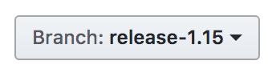
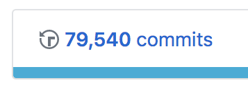
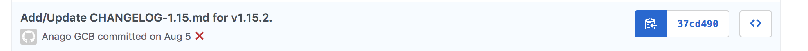
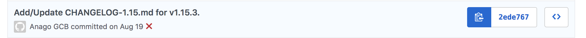

### Generating Patch Release Notes for the Release Notes website

Note: There is likely an opportunity to automate this process :)

To follow this process, fork the[Release Notes repo](https://github.com/kubernetes-sigs/release-notes), and create your own branch.

First, go to [kubernetes/kubernetes](https://github.com/kubernetes/kubernetes), and select the release branch (e.g. 1.15)



Second, select Commits



Third, find the start SHA for the patch release-- look at the list of commits and find the entry for the CHANGELOG of the previous patch release (in this example 1.15.2 is the previous patch release):



Fourth, find the end SHA for the patch release-- look at the list of commits and find the entry for the CHANGELOG of the current patch release (in this example 1.15.3 is the current patch release):



#### Running the Release Notes Tool for Patch Release

Run the [Release notes tool](https://github.com/kubernetes/release/tree/master/cmd/release-notes) with the start and end SHAs from above.

Also, make sure you specify the branch, patch release, and `JSON` as the format:

Example:

```
./release-notes \
-branch=release-1.15 \
-format=json \
-release-version=1.15.3 \
  -start-sha 37cd490ae77a893ecd73f4c372ebed0cf29a3727 \
  -end-sha 2ede767523a0b7e8bea869da223a7b5c616f4894
  ```

After you successfully run the Release Notes tool, copy the resulting file into the `src/assets` directory,
and name it [release-notes-patch-release.json] [1.15.3 Example](https://github.com/kubernetes-sigs/release-notes/blob/master/src/assets/release-notes-1.15.3.json)

#### Two More Steps!

You'll need to update the Typescript file that filters notes per release -- just add the patch release entry to the list:

Example: `'assets/release-notes-1.15.3.json'`

assets.ts(https://github.com/kubernetes-sigs/release-notes/blob/master/src/environments/assets.ts)


Lastly, prepare (prettify) the JSON file, using the following commands:

`npm install`

`npm run prettier`

Commit the JSON file and TS file and open your pull request.


