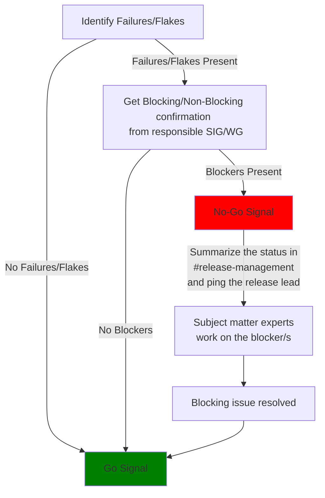
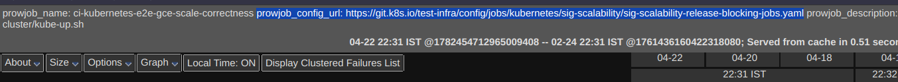
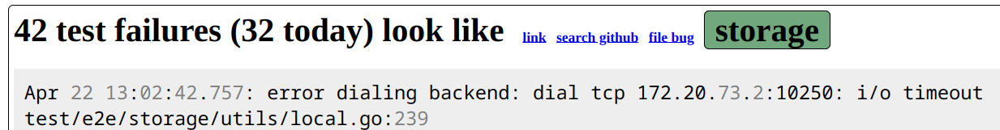

# Release Signal Role Handbook

<!-- TOC -->
* [Release Signal Role Handbook](#release-signal-role-handbook)
  * [Overview](#overview)
  * [Requirements](#requirements)
    * [Time Requirements](#time-requirements)
    * [Additional Requirements for Shadows](#additional-requirements-for-shadows)
      * [Good To Have](#good-to-have)
    * [Additional Requirements for Leads](#additional-requirements-for-leads)
  * [Timeline](#timeline)
    * [Onboarding](#onboarding)
      * [Create Assignment Excel Sheet](#create-assignment-excel-sheet)
    * [Early Release](#early-release)
    * [Mid-Release Cycle](#mid-release-cycle)
    * [Code Freeze](#code-freeze)
      * [Day Of The Code Freeze](#day-of-the-code-freeze)
      * [Once the Code Freeze starts - one week later](#once-the-code-freeze-starts---one-week-later)
      * [Week 1 of Code Freeze until Code Thaw starts](#week-1-of-code-freeze-until-code-thaw-starts)
    * [Code Thaw](#code-thaw)
  * [Release Cutting - Go or No-Go](#release-cutting---go-or-no-go)
  * [Judging State of Testgrid dashboards](#judging-state-of-testgrid-dashboards)
  * [Blocking vs. Informing Dashboards](#blocking-vs-informing-dashboards)
  * [Opening Issues](#opening-issues)
    * [Decision Tree](#decision-tree)
    * [Closing Issues](#closing-issues)
  * [Special high risk test categories to monitor](#special-high-risk-test-categories-to-monitor)
    * [Scalability tests](#scalability-tests)
  * [Reporting](#reporting)
  * [Tips and Tricks of the game](#tips-and-tricks-of-the-game)
    * [A Tour of CI on the Kubernetes Project](#a-tour-of-ci-on-the-kubernetes-project)
    * [How to Escalate](#how-to-escalate)
    * [Checking test dashboards](#checking-test-dashboards)
      * [Inferring Responsible SIG from the failure](#inferring-responsible-sig-from-the-failure)
    * [Finding a Flaky Test](#finding-a-flaky-test)
    * [Priority Labels](#priority-labels)
    * [Milestones](#milestones)
<!-- TOC -->

## Overview

The release signal team is responsible for making sure that **both** Issues (`is:issue`) and Pull Requests (PRs) (`is:pr`), which
are targeted for the ongoing release cycle, are dealt with in a timely fashion. It also assumes the responsibility of the quality
gate for the release, checking the health status of testgrid dashboards. This team is a combination of old [CI Signal](https://github.com/kubernetes/sig-release/tree/master/release-team/role-handbooks/ci-signal) and [Bug
Triage](https://github.com/kubernetes/sig-release/tree/master/release-team/role-handbooks/bug-triage) sub-team. Further responsibilities are:

- Consistently monitor end-to-end (e2e) tests in sig-release
  dashboards ([master-blocking](https://testgrid.k8s.io/sig-release-master-blocking), [master-informing](https://testgrid.k8s.io/sig-release-master-informing), `release-x.y-blocking/informing` (
  x.y being the current release)) throughout the release cycle and notify / signal the release team on the status of the tests and coordinate with the responsible SIG's to resolve unhealthy tests.
  - Give a “Go” or “No-Go” Signal to the release team whenever a release is being cut.
  - Flagging regressions as close to the source as possible, i.e., as soon as the offending code was merged
  - Making recommendations to SIG-Release for promoting and demoting release blocking and merge blocking tests as per
    the [Blocking Jobs Criteria](/release-blocking-jobs.md)
- Tracking issues and PRs in the current milestone
- Presenting summary reports at release team and burndown meetings
- Maintaining the automation around tracking issues/PRs against the current milestone

Release Signal team maintains two GitHub project boards. Detailed information can be found [here](/release-team/role-handbooks/release-signal/project-boards.md). As a Release Signal Team member, it is not your
responsibility to fix issues/create PRs; instead, you should get the assignees, owners, SIG leads, or contributors to do it.
Check [How To Escalate](#how-to-escalate) on how to do it.

## Requirements

### Time Requirements

Release Signal is one of the most time-intensive roles on the release team. General time requirements:

For Release Signal Lead:

- 1/2 hour to 2 hours daily, every workday, checking and following up on failing/flaky tests, issues and PRs targeted for the
  ongoing release cycle around week 6 (mid-release).

For Release Signal Shadows:

- 10 minutes daily, checking the state of testgrid, and tracking issues/PRs on the Bug Triage Board. 1/2 hour during assigned periods, where
  shadow is the prime testgrid observer (to create issues, investigate and follow up).

For Both:

- Availability to attend most of Release Team (weekly) and Burndown meetings (daily during Code Freeze), subject to time zone
  appropriateness.
- Ability to follow up on test fixes during Code Freeze at arbitrary times to ensure rapid turnaround.
- The time commitment increases through the release cycle, peaking during Code Freeze. In the last week of Code Freeze, shadows
  should expect to spend at least 10 hours and lead at least 20 hours per week.

### Additional Requirements for Shadows

The following requirements are all things that the lead should already have, and shadows should acquire, with coaching, within the
first weeks of the release cycle:

- Get [Kubernetes Community Membership](https://github.com/kubernetes/sig-release/blob/master/release-team/release-team-onboarding.md#kubernetes-community-membership)
- General familiarity with our [test boards](https://testgrid.k8s.io/) and examining test results from automated tests.
- Willingness and ability to follow up with contributors about test failures on Slack, email, and SIG meetings, as
  appropriate.
- Ability to file well-crafted Kubernetes issues, including labelling.
- General familiarity with GitHub labels and how to find issues/PRs for the current milestone.
- General knowledge of our SIG system and SIGs' areas of responsibility.

#### Good To Have

- Prior involvement with [SIG Testing](https://github.com/kubernetes/community/blob/master/sig-testing/README.md) and the [Test Infrastructure](https://github.com/kubernetes/community/blob/master/sig-k8s-infra/README.md) team.
- Experience with automated testing, CI/CD, quality engineering, and/or quality assurance.
- Experience with quality assurance and bug-tracking systems.
- Experience with the GitHub automation.

### Additional Requirements for Leads

In addition to the above requirements for shadows, most of which become prerequisites, Release Signal Leads must:

- Have the ability to add a milestone to issues, so must be a member of
  the [milestone maintainers](https://github.com/orgs/kubernetes/teams/milestone-maintainers). Reach out to the Release Add for the same.
- Have a working knowledge of our various test infrastructure tools, such as [Testgrid](https://github.com/GoogleCloudPlatform/testgrid), [Triage](https://github.com/kubernetes/test-infra/tree/master/triage), [Spyglass](https://docs.prow.k8s.io/docs/spyglass/), [Prow](https://docs.prow.k8s.io/docs/), and [Tide](https://docs.prow.k8s.io/docs/components/core/tide/).
- Have a working knowledge of GitHub labelling (using [prow](https://prow.k8s.io/command-help)) and labels (main: SIG, Area, Priority, Kind, Triage) used by the project. Release Signal leads must be able to identify
  relevant issues and PRs for a given milestone.
- Understand what defines a Release Blocking issue or PR, or know who to contact to determine that information.
- Release Signal lead needs to understand what tests matter and how our testing infra is wired together.
    - They can ask previous Release Signal leads for advice.
    - They can ask SIG-Testing for guidance.
- The Release Signal lead should take
  the [Inclusive Speaker Orientation (LFC101)](https://training.linuxfoundation.org/training/inclusive-speaker-orientation/)
  training course.

The core responsibility of the Release Signal lead is to foster a culture of continuous test integration, fail-fast and fix-fast
mindset and strive for continuously passing tests that provide an accurate positive signal to the release team to ensure that
releases go out on time with high quality. It is critical to maintain a sustained focus on test health through the entire release
cycle, as opposed to accepting destabilizing test failures during active enhancement development followed by an extended test
stabilization phase.

## Timeline

### Onboarding

- Update
  the [release-signal team in the teams.yaml](https://github.com/kubernetes/org/blob/main/config/kubernetes/sig-release/teams.yaml)
  which grants access to the [ci signal project board](https://github.com/orgs/kubernetes/projects/68/) and the [bug triage project board](https://github.com/orgs/kubernetes/projects/80). _Coordinate with the
  release lead to make multiple changes to this file in one PR._
- Adding the lead and (more experienced) shadows as milestone maintainers in
  the [teams.yaml](https://github.com/kubernetes/org/blob/master/config/kubernetes/sig-release/teams.yaml).
  _Coordinate with the release lead to make multiple changes to this file in one PR._
- Plan release support and status reporting. Setup [CI-Signal project board](/release-team/role-handbooks/release-signal/project-boards.md#setting-up-the-ci-signal-project-board) and the [Bug Triage Project Board](/release-team/role-handbooks/release-signal/project-boards.md#setting-up-the-bug-triage-project-board).
- Release Signal Shadows must be a member of the Kubernetes organization and, therefore, apply for membership by opening an issue
  on [kubernetes/org](https://github.com/kubernetes/org) (
  see [Issue template](https://github.com/kubernetes/org/issues/new?assignees=&labels=area%2Fgithub-membership&template=membership.yml&title=REQUEST%3A+New+membership+for+%3Cyour-GH-handle%3E)).
- Organizing an onboarding meeting with shadows to walk through this handbook and useful tools like [Testgrid](https://github.com/GoogleCloudPlatform/testgrid),
  [Triage](https://github.com/kubernetes/test-infra/tree/master/triage), [Spyglass](https://docs.prow.k8s.io/docs/spyglass/), [Prow](https://docs.prow.k8s.io/docs/), and [Tide](https://docs.prow.k8s.io/docs/components/core/tide/).

#### Create Assignment Excel Sheet

Create an excel sheet to track various assignments during the release cycle. [Example](https://docs.google.com/spreadsheets/d/1lYbCOGvG9jD-AVT0Ajc3LoSLNKHC6xIIy1t6BJPlO7E/edit?usp=sharing)

Roles in the assignments excel sheet:

1. **Task Assignee:** Responsible for completing an assigned task, including providing team meeting updates and/or giving the Go/No-Go signal.
2. **Main Coordinator:** Main coordinator is responsible for:
    - Observing testgrid dashboards (along with other shadows).
    - Creating issues for failing/flaking tests. 
    - Following up with related SIGs/WGs to get the issue resolved.
    - Close fixed issues after verifying the fix.
    - _**Additionally the main coordinator has the authority to assign above mentioned tasks to other shadows explicitly.**_ <br>
    eg:
      - _Assigning other shadows to create issues for failures/flakes._
      - _Assigning other shadows to observe a particular job._
      - _Assigning other shadows to follou up on issues with related SIGs/WGs_
      - _Assigning any other task that the main coordinator does._

      <br>**_Note:_** The Release Signal Lead has the ensure that the assignments are fair and the work distribution during the cycle is even.

**_Note:_** Shadows not having any of the above roles in any week are supposed to complete tasks assigned by the 'Main Coordinator' and regularly observe and report about failures/flakes on the testgrid dashboards.

### Early Release

Once the onboarding meetings have been organized, the following tasks are good to begin with during the early release cycle (Week
0 - Week 6)

- Ask shadows to fill the assignments excel sheet ([example](https://docs.google.com/spreadsheets/d/1lYbCOGvG9jD-AVT0Ajc3LoSLNKHC6xIIy1t6BJPlO7E/edit?usp=sharing)). Lead assigns the remaining spots (to themselves or to the shadows)
- Start maintaining the [CI signal project board](https://github.com/orgs/kubernetes/projects/68) and keep it up-to-date with
  issues tracking any test failure/flake
- Assign the new milestone labels to the open issues from the previous release, assign a member of the Release Signal team, and
  have that member follow up on the issue with the owners
- Monitor [master-blocking](https://testgrid.k8s.io/sig-release-master-blocking)
  and [master-informing](https://testgrid.k8s.io/sig-release-master-informing) dashboards daily and ensure all failures and flakes
  are tracked via open issues. See [Opening Issues](#opening-issues) for how to write an effective issue.
- Updating/Extending scripts/actions that populate the Bug Triage and CI Signal project board with relevant issues/PRs.
- Familiarize yourself with major enhancements and fixes planned by each SIG for this release so that you can have context in
  advance of when you will need to identify incoming bugs as being associated with a work focus in the current release.
- Start pinging stale or long-running issues / PRs so that an early assessment can be made if these should be moved out of the
  current release cycle's milestone.

### Mid-Release Cycle

This stage lasts from around week 6 until the code freeze starts (usually week 9). At this point, the Release Signal team should
start [escalating issues/PRs](#how-to-escalate) and communicating deadlines with contributors and SIG leads. During this time, the
release-x.y-blocking and release-x.y-informing dashboards are also added to the testgrid.

The following are the major tasks:

- Monitoring the master-blocking, master-informing, release-x.y-blocking and release-x.y-informing dashboards on a daily basis.
- Closely working with SIGs/WGs and test owners to fix failing and flaky tests.
- Ensure that issues and PRs targeting the release have the correct *milestone* and *priority* labels.
    - Linked issues and PRs tracked in the current milestone should have `priority` and `kind` labels.
- Ensure that `priority/critical-urgent` issues and PRs are not blocked.
    - If such a `priority/critical-urgent` issue/PR is found, ping the owner and owner SIGs and alert the release team leads.
- Ping all issues and PRs to remind contributors and SIG leads about the code freeze approaching in a month or so.
    - You may want to ping issues at least two times to ensure deadlines are communicated correctly, usually once this stage
      starts and a couple of days before the code freeze starts.

Initially, you should prioritize pinging issues/PRs that haven't been updated for a longer time. You can use the following
queries: [`is:issue is:open milestone:v1.28 sort:updated-asc`](https://github.com/kubernetes/kubernetes/issues?utf8=%E2%9C%93&q=is%3Aissue+is%3Aopen+milestone%3Av1.28+sort%3Aupdated-asc)
and [`is:pr is:open milestone:v1.28 sort:updated-asc`](https://github.com/kubernetes/kubernetes/pulls?utf8=%E2%9C%93&q=is%3Apr+is%3Aopen+milestone%3Av1.28+sort%3Aupdated-asc).

For pinging, the following template can be used:

```
Hello! This <issue|PR> has not been updated for a long time, so I'd like to check what's the status. The code freeze is starting <insert date> (about <number of weeks> from now), and while there is still plenty of time, we want to ensure that each PR has a chance to be merged on time.

As the PR is tagged for 1.28, is it still planned for this release?
```

### Code Freeze

One of the main purposes of Code Freeze is to ensure that the code base is stable and tests on informing and blocking (master and
release-x.y) dashboards are passing. At this point, only release-blocking issues and PRs (usually bug fixes: `kind/bug`) are
considered to be merged.

Your responsibility here is to actively watch for any new issues/PRs targeting the milestone, monitor the status of existing
issues/PRs, and filter the milestone by removing issues/PRs that are out of this release cycle.

#### Day Of The Code Freeze

On the day of the Code Freeze, your responsibility is to help contributors get the approval on their PRs and needed labels. Check
the [How To Escalate](#how-to-escalate) part of the document for a guide on how to do this.

Please note that Code Freeze is EOD Pacific Time (astronomical sun) on the day of. No items are to be removed from the milestone
until the next day.

The day after the Code Freeze has begun, the Release Signal team will wait to see if new exception requests are filed and
approved (see [exception process](/releases/EXCEPTIONS.md) for more details). You will remove the remaining issues / PRs that are
not approved for the next milestone. It is important to ensure that the Release Team Lead has been informed during the Burndown
meetings following Code Freeze that items are being removed so they may provide any additional feedback.

When the code freeze starts, the highest priority is the PRs that had `approved` and `lgtm` labels before the code freeze started
and are in the milestones. Depending on the merge queue length, it might be proposed to hold PRs that have `approved`
and `lgtm`, but are not in the milestone (using the following
query [`is:pr is:open no:milestone label:approved label:lgtm`](https://github.com/kubernetes/kubernetes/pulls?utf8=%E2%9C%93&q=is%3Apr+is%3Aopen+no%3Amilestone+label%3Aapproved+label%3Algtm)).

You can monitor PRs using the following queries:

- [PRs supposed to be in the merge pool (`is:pr is:open milestone:v1.28 label:approved label:lgtm -label:do-not-merge/hold`)](https://github.com/kubernetes/kubernetes/pulls?utf8=%E2%9C%93&q=is%3Apr+is%3Aopen+milestone%3Av1.28+label%3Aapproved+label%3Algtm+-label%3Ado-not-merge%2Fhold)
- [PRs that have `approved` and `lgtm`, but are on-hold (`is:pr is:open milestone:v1.28 label:approved label:lgtm label:do-not-merge/hold`)](https://github.com/kubernetes/kubernetes/pulls?utf8=%E2%9C%93&q=is%3Apr+is%3Aopen+milestone%3Av1.28+label%3Aapproved+label%3Algtm+label%3Ado-not-merge%2Fhold+)
- [PRs that doesn't have `approved` but have `lgtm` (`is:pr is:open milestone:v1.28 -label:approved label:lgtm`)](https://github.com/kubernetes/kubernetes/pulls?utf8=%E2%9C%93&q=is%3Apr+is%3Aopen+milestone%3Av1.28+-label%3Aapproved+label%3Algtm)
- [PRs that doesn't have `lgtm` but have `approved` (`is:pr is:open milestone:v1.28 label:approved -label:lgtm`)](https://github.com/kubernetes/kubernetes/pulls?utf8=%E2%9C%93&q=is%3Apr+is%3Aopen+milestone%3Av1.28+label%3Aapproved+-label%3Algtm+)

#### Once the Code Freeze starts - one week later

Usually, the removal of issues/PRs doesn't start right once the code freeze starts. Depending on the testgrid state, the merge
queue length, and the release team lead's decision, it might be decided to allow some more time for PRs to get merged. At this
stage, `kind/bug` PRs are prioritized, but other PRs can be allowed too if there is no risk of destabilizing the release (such PRs
require an exception).

You can still use the queries from the previous section at this stage to monitor PRs, but you should also monitor issues using
similar queries.

#### Week 1 of Code Freeze until Code Thaw starts

> **_NOTE:_** When changing or removing milestones, be sure to communicate _why_ the change is being made to avoid confusion. The
> issue/PR author may not always be familiar with all the processes and deadlines surrounding code freeze, and we want to contribute
> to a friendly and transparent process.

At this stage, the Release Signal Lead should remove issues/PRs from the milestone. Before doing so, the Release Signal Lead
should confirm the intention with the Release Team Lead.

If the issue/PR got confirmation that it's planned for the next milestone or there was recent activity, it should be moved to the
next milestone using the `/milestone v1.xx` command.

If there is no response on the issue/PR and no recent activity, the issue/PR should be removed from the milestone to reduce the
burden on the next Release Signal team. This is done by using the `/milestone clear` command.

If the issue/PR has the `priority/critical-urgent` label, it should be coordinated with the owning SIG and the Release Team Lead
to determine whether it should be allowed to stay or whether the priority should be decreased and the issue/PR moved to the next
milestone.

### Code Thaw

A week before the release target date, Code Freeze labelling restrictions are lifted. At this point, you need to make sure that
three things happen:

1. major breakage bugs get fixed immediately
2. any pending release-blocking PRs get approved and merged
3. _anything else should get kicked out of the release_
4. tests on blocking and informing dashboards are green

During this period, it is reasonable to expect issue owners and SIG leads to get back to you within hours (check their time zones,
though). In cases where SIG Leads are unavailable, you may need to appeal to Kubernetes project leaders to deal with stuck PRs.

Another part of staying on top of code churn, regression, and risk is monitoring commits to the master and the release branch,
especially in the final days of the release. On occasion, things will merge that are unexpected by the release team. This
possibility needs to be monitored, and when it happens, the commits need to be triaged for destabilizing risk and proper exception
justification, tests, docs, etc.

## Release Cutting - Go or No-Go

Basic idea behind giving go/no-go signal:



Over the release cycle, the release engineering team will cut several releases (alpha, beta, rc), before it ends with a new major
Kubernetes release. During the release cycle, tests fail and potentially prevent the cut of a new version. The release signal team
is responsible for getting these failures resolved timely to prevent delaying a release cut.

The responsible member for the particular release from the release signal team should get in touch with
the [current release branch manager](https://kubernetes.io/releases/release-managers/) 2-3 days before the release cut. Typically,
this is done via starting a thread like [this](https://kubernetes.slack.com/archives/CJH2GBF7Y/p1694951715192089) in
the [#release-management](https://kubernetes.slack.com/archives/CJH2GBF7Y) slack channel.

See [Judging State of Testgrid dashboards](#judging-state-of-testgrid-dashboards) for the actual Go/No-Go signal for the release
cut.

## Judging State of Testgrid dashboards

As a general rule of thumb, **any** failure/flake on **any** board under observation is a reason for concern. It should be brought
to the notice of the responsible SIG/someone with technical expertise in that area as soon as possible. However broadly, giving
green/yellow/red signals can be initially checked from the table below (Note: Release cutting has only Go/No-Go, so yellow is
equivalent to red).

See [Blocking vs. Informing Dashboards](#blocking-vs-informing-dashboards) for the reason behind these signals.

| (master/release-x.y)-blocking | (master/release-x.y)-informing | Signal |
|-------------------------------|--------------------------------|--------|
| ✅                             | ✅                              | 🟢     |
| ✅                             | ⚠️                             | 🟢     |
| ✅                             | ❌                              | 🔴     |
| ⚠️                            | ⚠️                             | 🟡     |
| ⚠️                            | ✅                              | 🟡     |
| ⚠️                            | ❌                              | 🔴     |
| ❌                             | ⚠️                             | 🔴     |
| ❌                             | ✅                              | 🔴     |
| ❌                             | ❌                              | 🔴     |

Key:

- ❌ - Failing Test
- ⚠️ - Flaking Test
- ✅ - Passing Test

**_Important Notes:_**

- Red/Yellow Signals block a release cut, and it is not until the issue is resolved or someone from a related SIG/someone with
  technical expertise marks that issue as a non-blocker that the release is cut.

- For reporting the testgrid status in the weekly meetings, the following factors come into play:
    - Is someone from the responsible SIG working on that issue?
    - How close are we to the next release cut?
    - What is the estimated time to solve the issue? Would it take too long?
    - Is the fix for that issue blocked by some other issue?

All these questions contribute to the signal in the weekly meeting and are up to the release signal team's interpretation based on
the situation. Red and Yellow indicate that we want attention to the issues or that the actual fix still needs to be implemented.

## Blocking vs. Informing Dashboards

Summary: Failing 'Blocking' jobs always block the release. Failing 'Informing' jobs sometimes blocks the release.

Jobs on the master-blocking and release-x.y-blocking dashboards are expected to be green _all the time_. As such, you should take
immediate action when one of them turns red and may recommend postponing the release if any one of these jobs is not passing.

Jobs on the master-informing and release-x.y-informing dashboards require more interpretation. Some run infrequently or for a long
time and can take days to show effects from merged changes. Others are inconsistent and require you to wait for several failed
runs to file an issue and consult the owning SIG. As a result, these tests block release either when they have unexplained
failures or failures that have been investigated and relate to blocking issues. If they're just flaking, or failing for explained
and tolerated reasons, they do not block.

For more detailed information about what's on these dashboards, see [Release Blocking Jobs](/release-blocking-jobs.md)
documentation.

## Opening Issues

The appropriate response to a failing or flaking job on a blocking or informing dashboard is to open an issue. The primary goal of
opening an issue is to track the work that needs to be done to bring the job back to a healthy status while providing an accurate
signal. The format for a helpful and informative issue may vary depending on the type of job, the test(s) that are failing for the
job, and the responsible parties for the job.

Before creating a new GitHub issue, check if somebody else has already opened an issue. To filter already opened
issues, [queries](https://docs.github.com/en/search-github/searching-on-github/searching-issues-and-pull-requests#search-by-project-board)
can be applied.

### Decision Tree

The decision tree below can be followed to make sure that you are opening an issue that is most effective for triaging, tracking,
and resolving a failing or flaking job.

_All instances of "failing" below can be replaced with "flaking" when appropriate._

- The following pattern can be used to title a failure/flake while opening an issue:
    - [Failing Test] [Responsible SIG]... (failing test name/failure description) (failing-job-name)
    - The `...` used above is somewhat similar to variadic functions. You can tag as well as mention multiple SIGs if a test
      belongs to them, example: [Failing Test] [sig apps] [sig testing] (failing test name/failure description) (failing-job-name)

- If the failure is clearly related to a testing infrastructure issue, it may be appropriate to open the issue
  in [k/test-infra](https://github.com/kubernetes/test-infra) or [k/k8s.io](https://github.com/kubernetes/k8s.io).

An issue should remain open until the appropriate fix has been made and the affected tests have returned to a healthy status. If
an issue is closed prematurely, or the same test starts failing or flaking again, a new issue should be opened. Do not reopen
closed issues.

For all opened issues:

- Make sure all open issues have a `priority/` label (see: [Priority Labels](#priority-labels)) and one of either the `kind/flake`
  or `kind/failing-test` label.
- Make sure the issue is assigned against the current milestone 1.x, using `/milestone`.
- Assign the issue to the appropriate SIG using the `/sig` label.
- If you are aware of the individual associated with the enhancement area or issue, @mention of the individual(s) and SIG leads
  tends to result in a faster turnaround.
- Add `@kubernetes/sig-foo-test-failures` to draw SIG-foo's attention to the issue.
- `/cc @kubernetes/release-team-release-signal` Github team on the issue to let the rest of the team know about it. You might also `/cc` the release
  lead if the issue needs extra attention immediately.
- Assign the issue to yourself or recruit another member of the Release Signal team to own the issue. The Release Signal team
  member assigned to an issue is responsible for driving it to resolution alongside the assignee from the appropriate SIG.
- Post the test failure in SIG's Slack channel to get help in routing the issue to the rightful owner(s).
- Add the issue to the [CI signal board](https://github.com/orgs/kubernetes/projects/68) under "New". The Release Signal team lead
  is responsible for making sure every issue on the CI signal board is assigned to a member of the Release Signal team and is
  being actively driven to resolution.

In addition to the steps above, make sure to fill in any additional information that is part of
the [Failing Test](https://github.com/kubernetes/kubernetes/issues/new?labels=kind%2Ffailing-test&template=failing-test.md)
or [Flaking Test](https://github.com/kubernetes/kubernetes/issues/new?labels=kind%2Fflake&template=flaking-test.md) issue
template.

### Closing Issues

After a fix is applied to an issue, it often gets fast closed. Be aware that the issue's status (open/closed) is not the same as
on the CI Signal board (New/under investigation/observing/resolved). For the same reasons, as explained earlier, we have to see if
a flaky test is stable. When a fix is applied, and it is expected that this should solve the problem, the issue gets moved to
Observing. After an appropriate amount of time, a big thumb rule would be two weeks; the issue can be moved to resolved. An issue
should remain open until the appropriate fix has been made and the affected tests have returned to a healthy status. If an issue
is closed prematurely, or the same test starts failing or flaking again, a new issue should be opened. Do not reopen closed
issues.

Closing flaky tests requires more investigation as the test may have passed on the informing and blocking dashboards but may be failing in other clusters with the same configuration. Always use [Traige](https://go.k8s.io/triage) to see whether the test health is stable across different jobs.

## Special high risk test categories to monitor

Historically, there are a couple of families of tests that are hard to stabilize, regression-prone and pose a high risk of
delaying and/or derailing a release. As a Release Signal lead, it is highly recommended to pay close attention and extra caution
when dealing with test failures in the following areas.

### Scalability tests

Scalability testing is inherently challenging, and regressions in this area are potentially a huge project risk

- Requires lots and lots of servers running tests, and hence expensive
- Tests are long-running, so it is especially hard/expensive/slow to resolve issues via Git bisection
- Examination of results is actually the bigger, more expensive part of the situation

The following scalability jobs/tests could regress quite easily (due to seemingly unrelated PRs anywhere in the k8s codebase) and
require constant manual monitoring/triaging and domain expertise to investigate and resolve.

- [master-blocking gce-cos-master-scalability-100](https://testgrid.k8s.io/sig-release-master-blocking#gce-cos-master-scalability-100)
- [master-informing gce-scale-correctness](https://testgrid.k8s.io/sig-release-master-informing#gce-master-scale-correctness)
- [master-informing gce-scale-performance](https://testgrid.k8s.io/sig-release-master-informing#gce-master-scale-performance)
- `release-x.y-blocking gce-cos-x.y-scalability-100`

Importantly, the expensive scalability jobs that run on master-informing do not run or appear on release-x.y-informing because we
do not currently run them against the release branch as well as the master. In the event of a problem with these jobs, you then
will have to figure out whether the problem is related to code that's in the release branch as opposed to code that exists only in
the master.

The Release Signal team should

- Continuously monitor these tests early in the release cycle, ensure issues are filed and escalated to the Release team and right
  owners in [SIG-Scalability](https://github.com/kubernetes/community/tree/master/sig-scalability#chairs).
- Work with SIG-Scalability to understand if the failure is a product regression versus a test issue (flake) and, in either case,
  follow-up closely on a fix.
- Additionally, it might help to monitor SIG-Scalability's performance dashboard to flag if and when there is considerable
  performance degradation.

## Reporting

A member of the Release Signal team should give status updates in every release team meeting. For summarizing the signal for the
testgrid see [judging state of testgrid dashboards](#judging-state-of-testgrid-dashboards). For summarizing the issues and PRs
being tracked for this release, the following template is to be used.

- Release [blocking Issues](https://github.com/kubernetes/kubernetes/issues?q=is%3Aopen+is%3Aissue+label%3Arelease-blocker) (#number)
- Release [blocking PRs](https://github.com/kubernetes/kubernetes/pulls?q=is%3Apr+is%3Aopen+label%3Arelease-blocker+) (#number)

- Query: [open non-test/flake k/k issues for v1.29](https://github.com/kubernetes/kubernetes/issues?q=is%3Aopen+milestone%3Av1.29+is%3Aissue+sort%3Aupdated-asc+-label%3Akind%2Ffailing-test+-label%3Akind%2Fflake+) (#number)
    -   [priority/critical-urgent issues](https://github.com/kubernetes/kubernetes/issues?q=is%3Aopen+milestone%3Av1.29+label%3Apriority%2Fcritical-urgent+is%3Aissue+sort%3Aupdated-asc+-label%3Akind%2Ffailing-test+-label%3Akind%2Fflake+) (#number)
    -   [priority/important-soon issues](https://github.com/kubernetes/kubernetes/issues?q=is%3Aopen+milestone%3Av1.29+label%3Apriority%2Fimportant-soon+is%3Aissue+sort%3Aupdated-asc+-label%3Akind%2Ffailing-test+-label%3Akind%2Fflake+) (#number)

- Query: open k/k [PR’s for v1.29](https://github.com/kubernetes/kubernetes/pulls?q=repo%3Akubernetes%2Fkubernetes+is%3Aopen+milestone%3Av1.29+is%3Apr+sort%3Aupdated-asc+) (#number)
    -   [priority/critical-urgent PRs](https://github.com/kubernetes/kubernetes/pulls?q=repo%3Akubernetes%2Fkubernetes+is%3Aopen+milestone%3Av1.29+is%3Apr+sort%3Aupdated-asc+label%3Apriority%2Fcritical-urgent) (#number)
    -   [priority/important-soon PRs](https://github.com/kubernetes/kubernetes/pulls?q=repo%3Akubernetes%2Fkubernetes+is%3Aopen+milestone%3Av1.29+label%3Apriority%2Fimportant-soon+is%3Apr+sort%3Aupdated-asc+) (#number)

- Query: ALL [open k/k issues for v1.29](https://github.com/kubernetes/kubernetes/issues?q=repo%3Akubernetes%2Fkubernetes+milestone%3Av1.29+is%3Aissue+is%3Aopen+sort%3Aupdated-asc+) (#number) (incl. [this query](https://github.com/kubernetes/kubernetes/issues?q=is%3Aopen+milestone%3Av1.26+is%3Aissue+sort%3Aupdated-asc+-label%3Akind%2Ffailing-test+-label%3Akind%2Fflake) (#number))

**Note:**

The actual template and links would vary according to the particular release. Also, apart from this, add any important points you
feel should be brought to the attention of the release team.

## Tips and Tricks of the game

### A Tour of CI on the Kubernetes Project

- [A guide to CI on Kubernetes with Rob Kielty (1.20 CI Signal lead) and Dan Magnum (1.19 CI Signal lead)](https://www.youtube.com/watch?v=bttEcArAjUw):
Introduces the role of CI Signal members and walks through the tools and processes used for logging flaky/failing tests (as
explained below).
<br> Notes to follow along: http://bit.ly/k8s-ci-signal

- The [Release Signal Walkthroughs Playlist](https://youtube.com/playlist?list=PL69nYSiGNLP2Lzsjir9W7S8u0UsQeeW71&si=mp8zpMyheVR1eI1i) contains short videos explaining some essential aspects of Release Signal. 

### How to Escalate

This role consists of creating issues for failing and flaky tests on the testgrid and monitoring issues and PRs targeted for the
current release cycle. The path of escalation is slightly different for both types of issues.

As a general rule of thumb:

_**Always ping folks alongside posting to a Slack channel**_

- For tests failing/flaking on testgrid:
  1. Create an issue in the [k/k](https://github.com/kubernetes/kubernetes)
     or [k/test-infra](https://github.com/kubernetes/test-infra)
     or [k/k8s.io](https://github.com/kubernetes/k8s.io) (depending on the type of issue) repository and tag the appropriate SIG
     and ping the relevant contributor (if a PR broke something), Leads/Technical Leads of the SIGs involved or anyone who you
     feel should know about that particular issue.
  2. Start a thread in the [#release-ci-signal](https://kubernetes.slack.com/archives/CN0K3TE2C) channel on Kubernetes slack and
     CC the folks mentioned in the previous point.
  3. Cross-post the link to the thread in the relevant SIGs/WGs channel on the Kubernetes slack; for example,
     see [this](https://kubernetes.slack.com/archives/CN0K3TE2C/p1694239448798339) thread in
     the [#release-ci-signal](https://kubernetes.slack.com/archives/CN0K3TE2C) channel.

- For issues and PRs targeted for the current release cycle:
  1. Leave a comment on the GitHub issue or PR: "This issue hasn't been updated in 3 months. Are you still expecting to complete
     it for 1.28?". It's helpful to @ mention individuals or SIG ```-bugs``` or ```-pr-reviews``` alias, e.g.
     "@kubernetes/sig-node-bugs" or
     "@kubernetes/sig-network-pr-reviews".
  2. Send a message to the relevant SIG Slack channel or mailing list about the problem: It's helpful to directly @ mention the
     relevant SIG Leads / Owners and to condense multiple issues into a list, e.g. "Hey, these three issues haven't seen any
     attention, are they still valid for 1.28?"
  3. Message individual owners and reviewers directly via Slack. If owners and reviewers are unresponsive, you can reach out to
     the SIG leads using the `kubernetes-sig-${name}-leads@googlegroups.com` mailing lists.

If none of the methods mentioned above work, you can escalate to the EA, Release Team Lead, and Lead Shadows with suggestions on what to do with
non-responsive issues.

### Checking test dashboards

- Quirk: If a job is listed as FAILING but doesn't have "Overall" as one of its ongoing failures, it's not actually failing. It
  might be "red" from some previous test run failures and will clear up after a few "green" runs.
- if a job is failing in one of the meta-stages (Up, Down, DumpClusterLogs, etc.), find the owning SIG since it is a infra failure
- You can look at the past history of the job/test (even as far back as multiple releases) by querying
  the [triage dashboard for specific job and/or test name](https://storage.googleapis.com/k8s-triage/index.html).

#### Inferring Responsible SIG from the failure

- If a job is failing because a specific test case is failing, and that test case has a [sig-foo] in its name, tag SIG-foo in the
  issue and find the appropriate owner within the SIG
- With unit test case failures, try to infer the SIG from the path or OWNERS files in it. Otherwise, find the owning SIG to help. OWNERS file is present in the same directry as a job's config file.



- With verify failures, try to infer the failure from the log. Otherwise, find the owning SIG to help
- If a test case is failing in one job consistently but not others, both the job owner and test case owner are responsible for
  identifying why this combination is different.
- [Triage](https://go.k8s.io/triage) also has the ability to infer the responsible SIG in some cases.



### Finding a Flaky Test

A flaky test is a software test that yields both passing and failing results despite zero changes to the code or test. A test may flake for different reasons, including bad synchronization, environmental issues, race conditions, etc. Release Signal team members should, in general, keep an eye on overall top flakes using [Traige](https://go.k8s.io/triage).

If a test is suspected to be flaky and not enough evidence is present on the testgrid dashboard itself, search that test name in [Traige](https://go.k8s.io/triage) to see the test results across different jobs. Not all results may be accurate, as tests running in different jobs may have different configurations. But this, overall, gives a good picture of the test's health.

### Priority Labels

Issues you create for test failures and flakes must be assigned a `priority` label, that is compatible with the priorities
described in
the [Issue Triage Contributor Guide](https://github.com/kubernetes/community/blob/master/contributors/guide/issue-triage.md#define-priority).

In the CI signal context, we use priority labels to mean:

| priority                      | Description                                                                                                                                                                                | Expectation                                                                                                                                                                                                              |
|-------------------------------|--------------------------------------------------------------------------------------------------------------------------------------------------------------------------------------------|--------------------------------------------------------------------------------------------------------------------------------------------------------------------------------------------------------------------------|
| `priority/critical-urgent`    | Actively impacting release-blocking signal. Includes: consistently failing tests, frequently (more than 20% of the time) flaking tests in release-blocking dashboards.                     | Work with SIGs for these to be worked on as soon as possible, prioritized over other work.                                                                                                                               |
| `priority/important-soon`     | Negatively impacting release-blocking signal. Includes: Flakes (especially occurring >2% of the time) in release-blocking jobs, failures and flakes in release-informing jobs.             | work with sigs to resolve them soon, ideally before the end of this release cycle.                                                                                                                                       |
| `priority/important-longterm` | Painful, results in manual workarounds/toil, limits developer productivity, but is of lower urgency and importance than issues in `priority/critical-urgent` or `priority/important-soon`. | In reality, there's a high chance these won't be finished, or even started within the current release. Work with sigs to ensure they are on their radar, and help find ways they can be broken down into smaller chunks. |

CI monitoring part is not currently using `priority/backlog` or `priority/awaiting-more-evidence`. If ever in doubt, label it
as `critical-urgent` to ensure you get eyes on the issue.

### Milestones

All issues the Release Signal team creates must be part of the current milestone. In order to apply a milestone, you will need to
be part of the GitHub team [milestone-maintainers](https://github.com/orgs/kubernetes/teams/milestone-maintainers).

To add an issue or PR to a milestone, use the following Prow command:

```
/milestone v1.x
```

Near the end of the release cycle, if you still have open issues that are not release blocking, please move these to the next
milestone.
