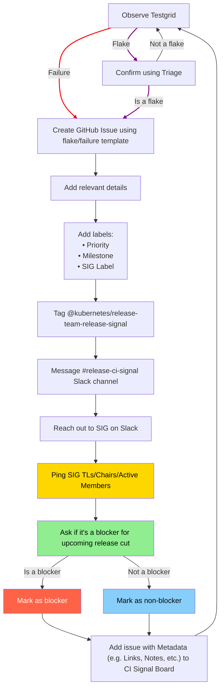
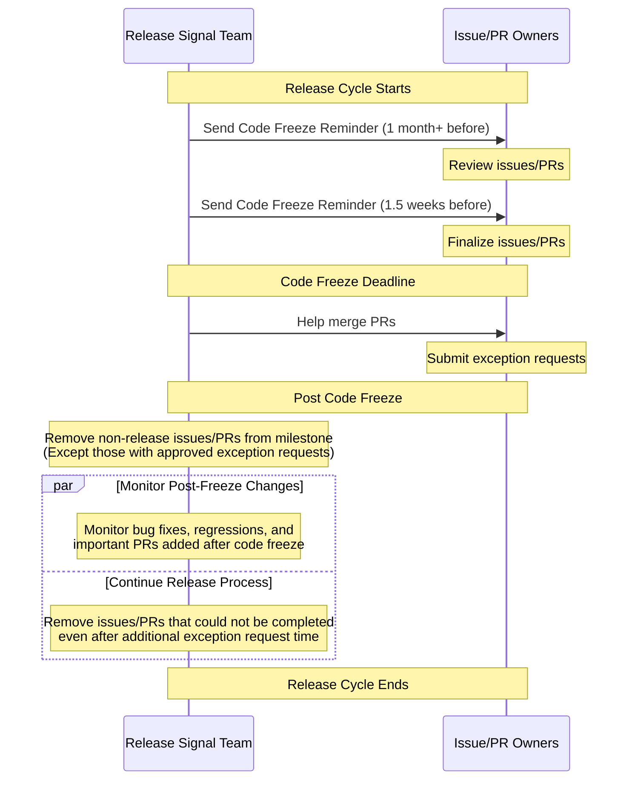

# Release Signal One Pager

<h3>Minimum text, maximum learning.</h3>

Detailed version of this is the [Release Signal Handbook](/release-team/role-handbooks/release-signal/README.md). This is meant to be a quick
reference rather than a comprehensive guide.

Also refer to [tips and tricks of the game](/release-team/role-handbooks/release-signal/README.md#tips-and-tricks-of-the-game).

## Release Signal - Testgrid Observation Loop

## Release Signal - Go or No-Go

Go or No-Go signal with diagrams and steps can be found [here](/release-team/role-handbooks/release-signal/README.md#release-cutting---go-or-no-go). 

## Release Signal - Following up on issues/PRs in milestone

