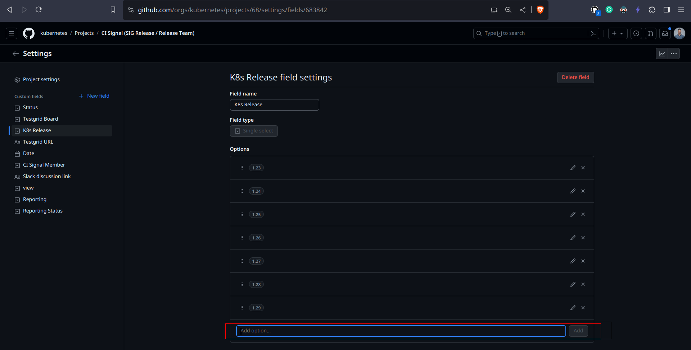

# Release Signal Boards

<!-- TOC -->
* [Release Signal Boards](#release-signal-boards)
  * [Project Board Overview](#project-board-overview)
    * [CI Signal Project Board](#ci-signal-project-board)
      * [Information on the CI Signal Board](#information-on-the-ci-signal-board)
      * [Setting up the CI Signal Project Board](#setting-up-the-ci-signal-project-board)
    * [Bug Triage Project Board](#bug-triage-project-board)
      * [Information on the Bug Triage Board](#information-on-the-bug-triage-board)
      * [Bug Triage Board Views](#bug-triage-board-views)
      * [Setting up the Bug Triage Project Board](#setting-up-the-bug-triage-project-board)
<!-- TOC -->

The release signal team maintains two project boards throughout the release cycle. These boards are set up by the release signal
lead and are maintained by the entire release signal team. The [CI Signal Project Board](#ci-signal-project-board) keeps track of
the failures and flakes on the testgrid dashboards. In contrast, the [Bug Triage Board](#bug-triage-project-board) tracks the
current status of all issues and PRs targeting the release, their priorities, and to distribute the work amongst the team.

## Project Board Overview

### CI Signal Project Board

The CI component of the team is using [GitHub project board](https://github.com/orgs/kubernetes/projects/68) to track the
currently failing and flaking tests across various testgrid dashboards.

Release Signal team members are expected to observe the testgrid dashboards and create issues, and add them to the GitHub project
board. You may create issues from the board or add them later. This board acts as a single point of reference for the current
state of the CI and is referred to by both the general public and the release management team. Issues directly created in the
kubernetes/kubernetes repository are not directly added to the board; they need to be manually added.

The CI component of the release signal team only looks at the dashboard mentioned in this document, failures on other boards, if
important and not mentioned may go unnoticed by the team.

#### Information on the CI Signal Board

The release signal team members set the following items for each issue. Some are automatically populated when you create issues
through the project board itself.

- `Status`: One of the following values:
    - `NEW`: Default category when an item is added to this board (defined in the workflow)
    - `CRITICAL`: Indicates that the item is of critical priority. Consider adding `priority/critical-urgent` label too
    - `FAILING`: Indicates that the issue is about a failing test
    - `FLAKY`: Indicates that the issue is about a flaking test
    - `INVESTIGATING`: Default category when an item is re-opened in this board (defined in the workflow)
    - `OBSERVING`: Indicates that the test mentioned in the issue is under observation
    - `RESOLVED`: Default category when an item is closed in this board (defined in the workflow)
    - `PASSING`: Indicates that the test mentioned in the issue is passing
- `Testgrid Board`: Indicates the board that the failing test is a part of i.e. `master-blocking`, `master-informing` or both
- `K8s Release`: Signifies the release version this issue is targeting, consider setting the `milestone` label too
- `Testgrid URL`: The URL of the testgrid job
- `Date`: Date of addition to the board
- `CI Signal Member`: The CI Signal member tracking the issue
- `Slack discussion link`: The slack discussion link in the [#release-ci-signal](https://kubernetes.slack.com/archives/CN0K3TE2C)
  channel or the SIG/WG channel
- `view`: The view of the board, single value, added for future modifications:
    - `issue-tracking`: The item is part of currently tracked issues

#### Setting up the CI Signal Project Board

- Copy the prior project board as it has some settings related to Workflows, fields, grouping, etc that help with some basic
  automation and the look and feel (you can look at the past Workflows in prior tabs).

- You need to add a new option to the field `K8s Release` to add and view items being tracked in the current release.

- Your new board will need to have the filter updated (see red line below) to make sure it is pulling in issues tagged with the
  proper release.

### Bug Triage Project Board

The Bug Triage component of the team is using a [GitHub project board](https://github.com/orgs/kubernetes/projects/80) to track
the current status of all issues and PRs targeting the release, their priorities, and to distribute the work amongst the team.

Release Signal team members are expected to assign themselves as the `Responsible` person to track an issue to the extent of their
time availability throughout the cycle. The release signal team should keep an eye on the board for new issues/PRs and make sure
they are tracked.

The project board is public so that both the release team and anyone interested from the community can stay updated about the
current status of issues and PRs that are targetting the release. Write access to the board is limited to members
of [@kubernetes/release-team-bug-triage](https://github.com/orgs/kubernetes/teams/release-team-bug-triage).

New issues and PRs that target the current release milestone are automatically added to the board with
a [a prow job](https://prow.k8s.io/?job=periodic-sync-bug-triage-github-project-*). The prow job is defined
in [kubernetes/test-infra](https://github.com/kubernetes/test-infra/blob/master/config/jobs/kubernetes/sig-k8s-infra/trusted/sig-release-release-team-jobs/release-team-periodics.yaml)
and the script can be found
in [kubernetes/sig-release](https://github.com/kubernetes/sig-release/blob/master/release-team/hack/sync-bug-triage-github-project-beta.sh).

#### Information on the Bug Triage Board

For each board item, the following details are set and managed by the release signal team:

- `Responsible`: The release signal team member that is responsible for tracking the progress on the issue/PR. This is not the
  same as the issue assignee.
- `Notes`: Short note by the release signal team member regarding the issue/PR,
  e.g. `[6/3] No progress made since last comment; notified them about the code freeze`
- `Status`: One of the following values:
    - `Tracked`: a member of the release signal team is actively tracking the issue
    - `Pending inclusion`: the issue is not actively tracked by anyone yet
    - `At Risk`: the issue is marked as `at-risk` and might not make the release
    - `Release Blocker`: the issue is marked as a `release-blocker`
    - `Done`: work on the issue is complete and all pull requests have been merged
- `Priority`: This should match the `priority/*` label that is currently assigned to the issue or PR
- `Fixes`: This should match the `kind/*` label that is currently assigned to the issue or PR

The following details for each item can be seen on the board. Editing the fields below from the board should be avoided (and for
some it might not even be possible):

- `Title`: Issue/PR title
- `Type`: Issue or Pull Request
- `Milestone`: The milestone that the issue/PR is targeting. This should be the current release
- `Labels`: Issue/PR labels, mostly useful to identify `kind` and `priority` of each item

#### Bug Triage Board Views

The bug triage board has a number of views to simplify issue management.

- [Bug Triage](https://github.com/orgs/kubernetes/projects/80/views/1) shows all open issues and PRs for the current milestone
- [Bug Triage (Filter by Responsible)](https://github.com/orgs/kubernetes/projects/80/views/19)
  shows all open issues and PRs, grouped by the Release Signal team member that is responsible for them
- [Issues](https://github.com/orgs/kubernetes/projects/80/views/12) shows all open issues for the current milestone
- [PR](https://github.com/orgs/kubernetes/projects/80/views/13) shows all open PRs for the current milestone
- [Release Blocker](https://github.com/orgs/kubernetes/projects/80/views/7) shows all issues and PRs that are marked as release
  blockers
- [By Priority](https://github.com/orgs/kubernetes/projects/80/views/6) shows all open issues and PRs, grouped by priority
- [ALL](https://github.com/orgs/kubernetes/projects/80/views/10) shows all issues and PRs on the board

#### Setting up the Bug Triage Project Board

At the beginning of the cycle, the Release Signal Lead should prepare the bug triage board for the ongoing release cycle. The
following steps should be taken:

1. Edit bug triage board name for current cycle, e.g. `[sig-release] 1.xx bug-triage`
2. Update the milestone for the periodic prow job. [Example PR from 1.28](https://github.com/kubernetes/test-infra/pull/29527)
3. Edit the [Responsible](https://github.com/orgs/kubernetes/projects/80/settings/fields/2845019) field and add the new Release Signal
   team members
4. Update the milestone filter to `milestone:v1.xx` in all relevant views. You can do this by editing the filter and then
   clicking `Save`
5. Set the `Status` field to `Pending inclusion` value for all open issues and PRs targeting the current milestone to indicate
   that no one is responsible yet at the beginning of the cycle. Later, any Release Signal member picking up the issue/PR should set
   it to `Tracked`.

