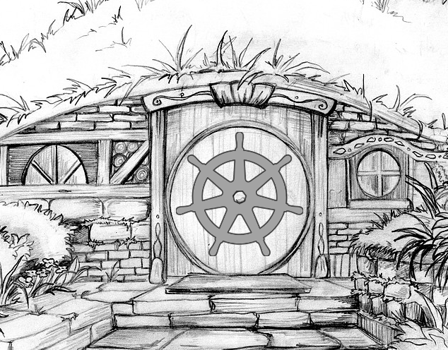

# Eleventy-One: A Long-Expected Release

# Kubernetes 1.11 Release Schedule

*Handy Links*

* [Release Team](https://github.com/kubernetes/sig-release/blob/master/releases/release-1.11/release_team.md)
* [Zoom](http://bit.ly/k8s111-zoom)
* [Slack](https://kubernetes.slack.com/messages/sig-release/)
* [Forum](https://groups.google.com/forum/#!forum/kubernetes-sig-release)
* [Feature Tracking Sheet](http://bit.ly/k8s111-features)
* [Milestone Process](https://github.com/kubernetes/community/blob/master/contributors/devel/release/issues.md)
* [Meeting Minutes](http://bit.ly/k8s111-minutes)
* [CI Signal Report](http://bit.ly/k8s111-cisignal)
* [Retrospective Document](http://bit.ly/k8s111-retro)

**tl;dr** The 1.11 release cycle begins on **Tuesday, April 3rd, 2018**, and ends on release day, **Tuesday, June 26th**.  Feature freeze is **Tuesday, April 24th**.  Code freeze begins **Tuesday, June 5th** and ends **Tuesday, June 19th**. Docs must be completed and reviewed by **Friday, June 11th**.

## Notes About this Release

* The Release Team will be using a conditional process to potentially shorten Code Freeze, [see below](#conditionally-shortening-code-freeze).
* We have changed [burndown times]() to make it easier for more contributors to attend.
* The feature process is remaining as it has in prior releases.
* Features that don't have complete code and tests by [Code Freeze](https://github.com/kubernetes/sig-release/blob/master/releases/release-1.11/release-1.11.md#code-freeze) may be disabled by the release team before cutting the first beta.
* The release team will escalate [release-master-blocking](https://k8s-testgrid.appspot.com/sig-release-master-blocking) failures to SIGs throughout the cycle, not just near release cuts.
* Key deliverables (e.g. initial release cuts) tend to be scheduled on Tuesdays to maintain context while ramping up and then responding to any problems.  The final release will be on a Wednesday in keeping with prior practice.
* The release length is nearly 12 weeks

## Timeline

| **What** | **Who** | **APR** | **MAY** | **JUN** | **JUL** | **DEV WEEK** | **TEST GATES** |
| --- | --- | --- | --- | --- | --- | --- | --- |
| Start of Release Cycle | Lead | 2| | | | week 1 |
| Finalize Schedule | Lead | 4 |
| Begin collecting planned work from SIGs | Lead, Features Lead | 9| | | | week 2 |
| Begin weekly release team meetings | Lead | 10 |
| Begin weekly status reports at Community | Lead, Shadow | 12 |
| Finalize Release Team | Lead | 16 |
| Start Release Notes Draft | Release Notes Lead | 17 | || | week 3 |
| Clean up features repo | Features Lead | 17 |
| 1.11.0-alpha.1 release | Branch Manager | 18 | || | |master-blocking |
| "Feature Freeze" begins (EOD PST) | Features Lead | 24 | || | week 4 |
| 1.11.0-alpha.2 release | Branch Manager | |2 | | | week 5 | master-blocking |
| Blog post: what we're working on for 1.11 | Communications | |10 | | | week 6 |
| 1.11.0-beta.0 release | Branch Manager | |15 | | | week 7 | master-blocking, master-upgrade |
| [1st stability evaluation to shorten Code Freeze](#conditionally-shortening-code-freeze) | Release Lead | | 18 | | | | master-blocking, master-upgrade |
| Create 'release-1.11' branch and begin daily branch | Branch Manager | | 15 |
| All release branch CI jobs created | Test Infra Lead | |18 |
| Begin Code Slush | Bot, Lead | | 29 | | | week 9 |
| Docs deadline - Open placeholder PRs | Docs Lead | | 25 | | | week 8 | |
| All Issues & PRs must have complete labels | Bug Triage | | 29 |
| | 1.11-blocking, master-blocking, master-upgrade |
| 1.11.0-beta.1 release | Branch Manager | | 30 | || | 1.11-blocking, master-blocking, master-upgrade |
| Begin code freeze (EOD PST) | Bot, Lead | | | 5 | | week 10 | 1.11-blocking, master-blocking, master-upgrade |
| Begin pruning | Lead and release team | |  | 5 |
| Begin MWF Burndown meetings | Lead | | | 1 |
| Unapproved/non-critical Issues/PRs get kicked out | Bot, Bug Triage | | | 1 |
| Docs deadline - PRs ready for review | Docs Lead | | | 4 |
| 1.11.0-beta.2 release | Branch Manager | | | 7 | |week 10 | 1.11-blocking, master-blocking, master-upgrade |
| Docs complete - All PRs reviewed and ready to merge | Docs Lead | | | 11 | |week 11
| Begin M-F Burndown meetings | Lead | | | 18 |
| End of code freeze (EOD PST) | Bot, Lead | | | 19 | |week 12 |
| Perform final branch | Branch Manager | | | 20 |
| 1.11.0-rc.1 release | Branch Manager | | | 20 | | | 1.11-blocking, master-blocking, master-upgrade |
| Master branch re-opens for 1.12 | Bot, Branch Manager | | | 20 |
| PRs for v1.11.0 must be cherry picked to release-1.11 | Branch Manager | | | 21 |
| Notify kubernetes-dev of lifting code freeze | Lead | | | 21 |
| v1.11.0 | Branch Manager | | | 26 | |week 13 | 1.11-blocking |
| v1.12.0-alpha.1 | Branch Manager | || | 2
| 1.12 Release Cycle Begins | Next Lead | || | 9 |
| Release retrospective | Community | || | 12 |

## Details

### Conditionally Shortening Code Freeze

*Update: due to fairly stable test results and low bug counts, the Release Team shortened Code Freeze per the below*

In an effort to make the Code Freeze period shorter, and allow more time for feature development, the Release Team will be testing out a procedure for postponing it based on release stability.

On **May 18th**, the Release Team will evaluate the stability of 1.11.  This stability will be primarily based on "clean signal", primarily that all tests in [master-blocking](https://k8s-testgrid.appspot.com/sig-release-master-blocking) and [master-upgrade](https://k8s-testgrid.appspot.com/sig-release-master-upgrade) are passing and have been passing for a few days.  If the tests boards are green, the release team will announce delaying the start of Code Slush and Code Freeze by one week each (to **May 29** and **June 5**) on that day.

If Code Freeze is not postponed on May 18th, then on **May 25** the Release Team will evaluate again.  This evaluation will be based primarily on the three test suites (master-blocking, master-upgrade, and 1.11-blocking), and if passed, Code Freeze will be postponed by one week, to **June 5th**.

Code Freeze will end on **June 19th** regardless, unless that is delayed for unrelated reasons.

If we are able to shorten Code Freeze, the 1.12 Release Team will take that into account when setting the 1.12 schedule.

### Feature Freeze

All features going into the release must have an associated issue in the features repo by Tuesday, April 24th. That issue must be in the 1.11 milestone.  SIG "themes" should also be in the release notes draft at this time to prepare for blog posts and release marketing.  Any work the SIG wants publicized needs to be called out to the Features Lead so the Release Team communications lead can work with SIG-PM and the CNCF.

### Code Slush

Starting on Tuesday, May 29th, only PRs labeled by their owner SIGs with [`status/approved-for-milestone`](/ephemera/issues.md) will be allowed to merge into the master branch. All others will be deferred until the end of Code Freeze, when master opens back up for the next release cycle. If necessary, the release team can add the `status/approved-for-milestone` label in cases where the SIG approvers do not have permissions to do so.

At this time, any issues/PRs with incomplete labels, or which are "stale" will be removed from the release.  The release team will work with SIGs to make sure that labels are complete prior to removal.

Code Slush begins prior to Code Freeze to help reduce noise from miscellaneous changes that aren't related to issues that SIGs have approved for the milestone. Feature work is still allowed at this point, but it must follow the process to get approved for the milestone. SIGs are the gatekeepers of this label, not the release team.

#### Exceptions

Starting at Code Slush, the release team will solicit and rule on [exception requests](https://github.com/kubernetes/features/blob/master/EXCEPTIONS.md) for feature and test work that is unlikely to be done by Code Freeze. As with the `status/approved-for-milestone` label, the exception approval is the responsibility of the SIG or SIGs labeled in the pull request. The release team may intervene or deny the request only if it poses a risk to release quality, or could negatively impact the overall timeline. Changes introduced at this point should be well-tested, well-understood, limited in architectural scope, and low risk.  All of those factors should be considered in the approval process.

### Code Freeze

All features going into the release must be code-complete (including tests) and have docs PRs open by Tuesday, June 5th.

The docs PRs don't have to be ready to merge, but it should be clear what the topic will be and who is responsible for writing it. This person will become the primary contact for the documentation lead. It’s incredibly important that documentation work gets completed as quickly as possible.

After this point, only release-blocking issues and PRs will be allowed in the milestone. The milestone bot will remove anything that lacks the priority/critical-urgent label, as well as other required labels.

### Pruning

Features that are partially implemented and/or lack sufficient tests may be considered for pruning beginning after code freeze, unless they've been granted exceptions.

The release team will work with SIGs and feature owners to evaluate each case, but for example, pruning could include actions such as:

* Disabling the use of a new API or field
* Switching the default value of a flag or field
* Moving a new API or field behind an Alpha feature gate
* Reverting commits or deleting code

This needs to occur before 1.11.0-beta.1 is cut so we have time to gather signal on whether the system is stable in this state. These are considered drastic measures, so the release team will strive to coordinate at-risk work with SIGs before this time. The goal is to make code freeze, and overall project transparency, enforceable despite the lack of a feature branch process.

### Docs

If a feature needs documentation, enter Yes in the feature tracking spreadsheet and add a link to the documentation PR. You can open documentation PRs in the [kubernetes/website](https://github.com/kubernetes/website) repository. If you have questions, the release documentation lead, or representatives from SIG-Docs will be happy to assist you.

For documentation PRs:

* Open PRs against the release-1.11 branch based off of the 1.11 release PR. The documentation workflow uses feature branches for release documentation, rather than basing from master. **Be sure to open your PR against the release branch**.
* Add your PR to the 1.11 Release milestone.

### Burndown

Burndown meetings are held on Mondays, Wednesdays and Fridays, alternating between 8am Pacific and 10am Pacific, until about a week before the scheduled final release when they become every day.

Join the [Kubernetes Milestone Burndown Group](https://groups.google.com/forum/#!forum/kubernetes-milestone-burndown) to get the calendar invite, or subscribe to the SIG-Release calendar.

The intent of these meetings is to:

* Focus on fixing bugs, eliminating test flakes and general release stabilization.
* Ensure docs and release notes are written and accurate.
* Identify all features going into the release, and make sure alpha, beta, ga is marked in features repo.
* Provide a [one-stop view of release progress](http://bit.ly/kube111-burndown) including relevant release metrics.
* Host SIG stakeholders for updates.
