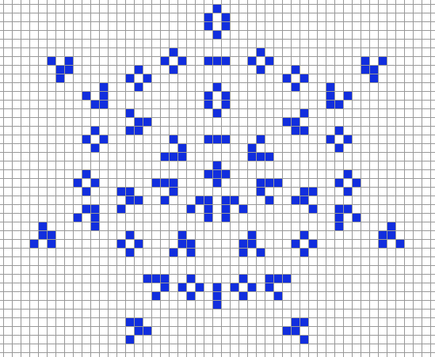

# 1.12: A next iteration in the evolving stable distributed system.

"Class 4: Nearly all initial patterns evolve into structures that interact in complex and interesting ways, with the formation of local structures that are able to survive for long periods of time." ([see Cellular Automaton](https://en.wikipedia.org/wiki/Cellular_automaton); see also [TestGrid.k8s.io](https://testgrid.k8s.io))

# Kubernetes 1.12 Release Schedule

*Handy Links*

* [This document](https://git.k8s.io/sig-release/releases/release-1.12/README.md)
* [Release Team](https://git.k8s.io/sig-release/releases/release-1.12/release_team.md)
* Zoom: join Google Group to receive meeting invite
* [Slack](https://kubernetes.slack.com/messages/sig-release/)
* [Forum](https://groups.google.com/forum/#!forum/kubernetes-sig-release)
* [Feature Tracking Sheet](http://bit.ly/k8s112-features)
* [Targeting Issues and PRs to This Milestone](https://git.k8s.io/community/contributors/devel/release.md)
* [Meeting Minutes](http://bit.ly/k8s112-minutes)
* [CI Signal Report](http://bit.ly/k8s112-cisignal)
* [Retrospective Document](http://bit.ly/k8s112-retro)

**tl;dr** The 1.12 release cycle begins on **Monday, July 2nd, 2018**, and ends on release day, ~~Tuesday, September 25, 2018~~ **Thursday, September 27, 2018** .  Feature freeze is **Tuesday, July 31, 2018**.  Code freeze begins **Tuesday, September 4, 2018** and ends **Wednesday, September 19, 2018**, but [may be vary depending on CI Signal](#conditionally-shortened-code-freeze). Docs must be completed and reviewed by **Tuesday, September 18, 2018**. Release blocking test case additions must be completed by in conjunction with features by code freeze.

## Notes About this Release

* The Release Team will continue with the shortened Code Freeze, [see below](#conditionally-shortened-code-freeze).
* The feature process is remaining as it has in prior releases.
* Features that don't have complete code and tests by [Code Freeze](https://github.com/kubernetes/sig-release/blob/master/releases/release-1.12/release-1.12.md#code-freeze) may be disabled by the release team before cutting the first beta.
* The release team will escalate [release-master-blocking](https://k8s-testgrid.appspot.com/sig-release-master-blocking) and [release-master-upgrade](https://k8s-testgrid.appspot.com/sig-release-master-upgrade) failures to SIGs throughout the cycle, not just near release cuts.
* Key deliverables (e.g. initial release cuts) tend to be scheduled on Tuesdays to maintain context while ramping up and then responding to any problems.  The final release will also be on a Tuesday in keeping with prior practice.
* The release cycle length is approximately 12 weeks.

## Timeline

| **What** | **Who** | **JUL** | **AUG** | **SEP** | **OCT** | **DEV WEEK** | **TEST GATES** |
| --- | --- | --- | --- | --- | --- | --- | --- |
| Start of Release Cycle | Lead | 2| | | | week 1 | |
| Finalize Schedule | Lead | 6 | | | | | |
| Begin collecting planned work from SIGs | Lead, Features Lead | 9| | | | week 2 | |
| Begin weekly release team meetings | Lead | 9 | | | | | |
| Begin weekly status reports at Community | Lead, Shadow | 12 | | | | | |
| Finalize Release Team | Lead | 13 | | | | | |
| Start Release Notes Draft | Release Notes Lead | 17 | || | week 3 | |
| Clean up features repo | Features Lead | 17 | | | | | |
| "Feature Freeze" begins (EOD PST) | Features Lead | 31 | || | week 4 | |
| 1.12.0-alpha.1 release | Branch Manager | 31 | | | | week 5 | [master-blocking], [master-upgrade] |
| Blog post: what we're working on for 1.12 | Communications | | 9 | | | week 6 | |
| All release-1.8 CI jobs/testgrid removed | Test Infra Lead | |14 | | | | |
| Create 'release-1.12' branch and begin daily branch | Branch Manager | |14 | | | | |
| v1.13.0-alpha.0 | Branch Manager | | 14 | | | | |
| 1.12.0-beta.0 released from branch | Branch Manager | | 14 | | | week 7 | [master-blocking], [master-upgrade] |
| All release-1.12 CI jobs/testgrid created | Test Infra Lead | |17 | | | | |
| Docs deadline - Open placeholder PRs | Docs Lead | |21 | | | | |
| Begin MWF Burndown meetings | Lead | | 27 | | | | |
| Begin Code Slush | Bot, Lead | | 28 | | | week 9 | |
| All Issues & PRs must have complete labels | Bug Triage | | 29 | | | | |
| Begin code and test freeze (EOD PST) | Bot, Lead | | | 4 | | week 10 | [1.12-blocking], [master-blocking], [master-upgrade] |
| Begin pruning | Lead and release team | | | 4 | | | |
| 1.12.0-beta.1 released from branch | Branch Manager | | | 4 || | [1.12-blocking], [master-blocking], [master-upgrade] |
| Unapproved/non-critical Issues/PRs get kicked out | Bot, Bug Triage | | | 7 | | | |
| Docs deadline - PRs ready for review | Docs Lead | | | 7 | | week 11 | |
| Begin M-F Burndown meetings | Lead | | | 10 | | | |
| 1.12.0-beta.2 released from branch | Branch Manager | | | 11 | | | [1.12-blocking], [master-blocking], [master-upgrade] |
| Docs complete - All PRs reviewed and ready to merge | Docs Lead | | | 18 | | week 12 | |
| 1.12.0-rc.1 released from branch | Branch Manager | | | 18 | | | [1.12-blocking], [master-blocking], [master-upgrade] |
| End of code freeze (EOD PST): Master branch re-opens for 1.12 | Bot, Branch Manager, Lead | | | 19 | | | |
| PRs for v1.12.0 must be cherry picked to release-1.12 | Branch Manager | | | 19 | | | |
| Notify kubernetes-dev of lifting code freeze | Lead | | | 19 | | | |
| cherry pick deadline | Branch Manager | | | 21 | | | |
| v1.12.0 | Branch Manager | | | ~~25~~ moved to **27** | |week 13 | [1.12-blocking] |
| Release retrospective | Community | | | 27? | | | | |
| 1.13 Release Cycle Begins | Next Lead | | | | 1 | | |

## Details

### Conditionally Shortened Code Freeze

In an effort to make the Code Freeze period shorter, and allow more time for feature development, the 1.11 Release Team tested out a procedure for postponing it based on release stability and "clean signal".

The goal is that all tests in [master-blocking](https://k8s-testgrid.appspot.com/sig-release-master-blocking) and [master-upgrade](https://k8s-testgrid.appspot.com/sig-release-master-upgrade) are passing and have been passing for a few days.

Based on the 1.11 outcome, the 1.12 Release Team has set the schedule with a shortened code freeze in line with the prior cycle.  The release team may need to inncrease the length of code slush and freeze to begin earlier if the project does not maintain a clean CI signal heading into the planned slush and freeze.  Any such changes will be communicated early and broadly.

### Feature Freeze

All features going into the release must have an associated issue in the features repo by ***Tuesday July 31st, 2018***. That issue must be in the 1.12 milestone.  SIG "themes" should also be in the release notes draft at this time to prepare for blog posts and release marketing.  Any work the SIG wants publicized needs to be called out to the Features Lead so the Release Team communications lead can work with SIG-PM and the CNCF.

### Code Slush

Starting on ***Tuesday, August 28th, 2018***, only PRs marked for the 1.12 milestone (issue the Prow "/milestone v1.12" command) by their owner SIGs' leadership will be allowed to merge into the master branch. All others will be deferred until the end of Code Freeze, when master opens back up for the next release cycle. If necessary, the release team can add the milestone in cases where the SIG approvers do not have permissions to do so.  For more information on correct PR marking see [the release process](https://git.k8s.io/community/contributors/devel/release.md) in the developer guide.

At this time, any issues/PRs with incomplete labels, or which are "stale" will be removed from the release.  The release team will work with SIGs to make sure that labels are complete prior to removal.

Code Slush begins prior to Code Freeze to help reduce noise from miscellaneous changes that aren't related to issues that SIGs have approved for the milestone. Feature work is still allowed at this point, but it must follow the process to get approved for the milestone. SIGs are the gatekeepers of this label, not the release team.

#### Exceptions

Starting at Code Slush, the release team will solicit and rule on [exception requests](https://github.com/kubernetes/features/blob/master/EXCEPTIONS.md) for feature and test work that is unlikely to be done by Code Freeze. The exception approval is the responsibility of the SIG or SIGs labeled in the pull request. The release team may intervene or deny the request only if it poses a risk to release quality, or could negatively impact the overall timeline. Changes introduced at this point should be well-tested, well-understood, limited in architectural scope, and low risk.  All of those factors should be considered in the approval process.  Features on a feature branch with documentation, test cases, and passing CI are more likely to be accepted.

### Code Freeze

All features going into the release must be code-complete, ***including tests***, and have docs PRs open by ***Tuesday, September 4th, 2018***.

The docs PRs don't have to be ready to merge, but it should be clear what the topic will be and who is responsible for writing it. This person will become the primary contact for the documentation lead. It’s incredibly important that documentation work gets completed as quickly as possible.

After this point, only release-blocking issues and PRs will be allowed in the milestone.

### Pruning

Features that are partially implemented and/or lack sufficient tests may be considered for pruning beginning after code freeze, unless they've been granted exceptions.

The release team will work with SIGs and feature owners to evaluate each case, but for example, pruning could include actions such as:

* Disabling the use of a new API or field
* Switching the default value of a flag or field
* Moving a new API or field behind an Alpha feature gate
* Reverting commits or deleting code

This should occur before 1.12.0-beta.1 is cut so we have time to gather signal on whether the system is stable in this state. These are considered drastic measures, so the release team will strive to coordinate at-risk work with SIGs before this time. The goal is to make code freeze, and overall project transparency, enforceable despite the lack of a consistently used feature branch process.

### Docs

If a feature needs documentation, enter Yes in the feature tracking spreadsheet and add a link to the documentation PR. You can open documentation PRs in the [kubernetes/website](https://github.com/kubernetes/website) repository. If you have questions, the release documentation lead, or representatives from SIG-Docs will be happy to assist you.

For documentation PRs:

* Open PRs against the release-1.12 branch based off of the 1.12 release PR. The documentation workflow uses feature branches for release documentation, rather than basing from master. **Be sure to open your PR against the release branch**.
* Add your PR to the 1.12 Release milestone.

### Burndown

Burndown meetings are held on Mondays, Wednesdays and Fridays at TIME TBD until the final release is near, and then every business day until the release.  These meetings may overlap with other SIG meetings and the Community Meeting, but it is critical that SIGs provide representation at the release burndown meeting when requested to discuss specific issues and insure they do not become gating on the release.  The release lead or a release team representative will keep the Community Meeting informed of release status even if there are meeting conflicts.

Join the [Kubernetes Milestone Burndown Group](https://groups.google.com/forum/#!forum/kubernetes-milestone-burndown) to get the calendar invite.

The intent of these meetings is to:

* Focus on fixing bugs, eliminating test flakes and general release stabilization.
* Ensure docs and release notes are written and accurate.
* Identify all features going into the release, and make sure alpha, beta, ga is marked in features repo.
* Provide a [one-stop view of release progress](http://bit.ly/kube112-minutes) including relevant release metrics.
* Host SIG stakeholders for updates.

[master-blocking]: https://testgrid.k8s.io/sig-release-master-blocking#Summary
[master-upgrade]: https://testgrid.k8s.io/sig-release-master-upgrade#Summary
[1.12-blocking]:https://testgrid.k8s.io/sig-release-1.12-blocking#Summary
