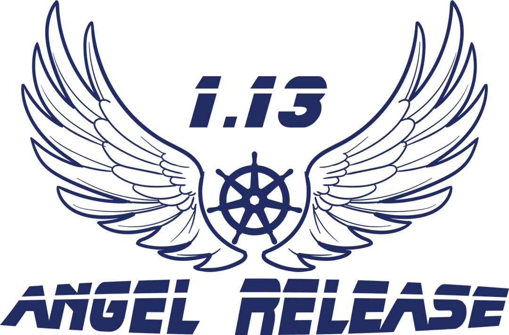

# 1.13 - Angel Release

Angel Number 113 signifies new beginnings, transformation and end of a chapter to open new exciting ones. This is fitting for the EOY stability release, as we look forward to evolving and further maturing Kubernetes releases next year !

# Kubernetes 1.13 Release Schedule

*Handy Links*

* [This document](https://git.k8s.io/sig-release/releases/release-1.13/README.md)
* [Release Team](https://git.k8s.io/sig-release/releases/release-1.13/release_team.md)
* Zoom: join [Google Group](https://groups.google.com/forum/#!forum/kubernetes-milestone-burndown) to receive meeting invite
* [Slack](https://kubernetes.slack.com/messages/sig-release/)
* [Forum](https://groups.google.com/forum/#!forum/kubernetes-sig-release)
* [Enhancements Tracking Sheet](http://bit.ly/k8s113-enhancements)
* [Targeting Issues and PRs to This Milestone](https://git.k8s.io/community/contributors/devel/release.md)
* [Meeting Minutes](http://bit.ly/k8s113-minutes)
* [Bug Triage Tracking Sheet](http://bit.ly/k8s113-bugtriage)
* [CI Signal Report](http://bit.ly/k8s113-cisignal)
* [Retrospective Document](http://bit.ly/k8s113-retro)

**tl;dr** The 1.13 release cycle begins on **Monday, October 1st, 2018**, and ends on release day, **Monday, December 03, 2018**.  Enhancements freeze is **Tuesday, October 23, 2018**.  Code slush is **Friday, November 09, 2018**. Code freeze begins **Friday, November 16, 2018** and ends **Wednesday, November 28, 2018**, but [may vary depending on CI Signal](#conditionally-shortened-code-freeze). Docs must be completed and reviewed by **Tuesday, November 27, 2018**. Release blocking test case additions must be completed by in conjunction with enhancements by code freeze.

## Notes About this Release

* The Release Team will continue with the shortened Code Freeze, [see below](#conditionally-shortened-code-freeze).
* The Features process is remaining as it has in prior releases, except that it is being renamed from Features to Enhancements.
* Enhancements that don't have complete code and tests by [Code Freeze](https://github.com/kubernetes/sig-release/blob/master/releases/release-1.13/release-1.13.md#code-freeze) may be disabled by the release team before cutting the first beta.
* The release team will escalate [release-master-blocking](https://k8s-testgrid.appspot.com/sig-release-master-blocking) and [release-master-upgrade](https://k8s-testgrid.appspot.com/sig-release-master-upgrade) failures to SIGs throughout the cycle, not just near release cuts.
* Unlike the previous cycles key deliverables, including the final release, do **not** fall on Tuesdays due to shortened release cycle.
* The release cycle length is approximately only **10 weeks** long.

## Timeline

| **What** | **Who** | **Oct** | **Nov** | **Dec** | **Jan** | **DEV WEEK** | **TEST GATES** |
| --- | --- | --- | --- | --- | --- | --- | --- |
| Start of Release Cycle | Lead | 1| | | | week 1 | |
| Begin weekly release team meetings | Lead | 1 | | | | | |
| Finalize Schedule | Lead | 5 | | | | | |
| Begin collecting planned work from SIGs | Lead, Enhancements Lead | 8| | | | week 2 | |
| Begin weekly status reports at Community | Lead, Shadow | 11 | | | | | |
| Finalize Release Team | Lead | 12 | | | | | |
| 1.13.0-alpha.1 release | Branch Manager | 15 | | | | | |
| Start Release Notes Draft | Release Notes Lead | 16 | || | week 3 | |
| Clean up enhancements repo | Enhancements Lead | 16 | | | | | |
| "Enhancements Freeze" begins (EOD PST) | Enhancements Lead | 23 | || | week 4 | |
| 1.13.0-alpha.2 release | Branch Manager | 23 | | | | | [master-blocking], [master-upgrade] |
| 1.13.0-alpha.3 release | Branch Manager | 31 | | | | | [master-blocking], [master-upgrade] |
| Begin MWF Burndown meetings | Lead | | 5 | | | week 6 | |
| All release-1.9 CI jobs/testgrid removed | Test Infra Lead | | 6 | | | | |
| Create 'release-1.13' branch and begin daily branch | Branch Manager | | 6 | | | | |
| v1.14.0-alpha.0 | Branch Manager | | 6 | | | | |
| 1.13.0-beta.0 released from branch | Branch Manager | | 6 | | | | [master-blocking], [master-upgrade] |
| Docs deadline - Open placeholder PRs | Docs Lead | | 8 | | | | |
| All release-1.13 CI jobs/testgrid created | Test Infra Lead | | 9 | | | | |
| Begin Code Slush | Bot, Lead | | 9 | | | week 6 | |
| All Issues & PRs must have complete labels | Bug Triage | | 12 | | | week 7 | |
| Kubecon Shangai 2018 | Community event | | 13 - 15 | | | | |
| Begin code and test freeze (EOD PST) | Bot, Lead | | 16 | | | week 7 | [1.13-blocking], [master-blocking], [master-upgrade] |
| Begin pruning | Lead and release team | | 16 | | | | |
| 1.13.0-beta.1 released from branch | Branch Manager | | 16 | || | [1.13-blocking], [master-blocking], [master-upgrade] |
| Begin M-F Burndown meetings | Lead | | 19 | | | week 8 | |
| Unapproved/non-critical Issues/PRs get kicked out | Bot, Bug Triage | | 19 | | | | |
| Docs deadline - PRs ready for review | Docs Lead | | 19 | | | | |
| 1.13.0-beta.2 released from branch | Branch Manager | | 21 | | | | [1.13-blocking], [master-blocking], [master-upgrade] |
| US Thanksgiving | Holiday | | 22 | | | | |
| Docs complete - All PRs reviewed and ready to merge | Docs Lead | | 27 | | | week 9 | |
| 1.13.0-rc.1 released from branch | Branch Manager | | 27 | | | | [1.13-blocking], [master-blocking], [master-upgrade] |
| End of code freeze (EOD PST): Master branch re-opens for 1.13 | Bot, Branch Manager, Lead | | 28 | | | | |
| PRs for v1.13.0 must be cherry picked to release-1.13 | Branch Manager | | 28 | | | | |
| Notify kubernetes-dev of lifting code freeze | Lead | | 28 | | | | |
| cherry pick deadline (EOD PST) | Branch Manager | | 30 | | | | |
| 1.13.0-rc.2 released from branch | Branch Manager | | 30 | | | | [1.13-blocking], [master-blocking], [master-upgrade] |
| v1.13.0 | Branch Manager | | | 3 | |week 10 | [1.13-blocking] |
| Release retrospective | Community | | | 6? | | | | |
| Contributor Summit + Kubecon Seattle 2018 | Community event | | | 9 - 13 | | week 11 | |
| 1.14 Release Cycle Begins | Next Lead | | | | 2 | | |

## Details

### Conditionally Shortened Code Freeze

In keeping with 1.11 and 1.12 release cycles, the 1.13 Release Team has set the schedule with a shortened code freeze. This is ofcourse contingent on all tests in [master-blocking](https://k8s-testgrid.appspot.com/sig-release-master-blocking) and [master-upgrade](https://k8s-testgrid.appspot.com/sig-release-master-upgrade) passing and have been passing for a few days leading to the code slush and freeze.

The release team may need to shorten the length of code slush and increase length of freeze to begin earlier if the project does not maintain a clean CI signal heading into the planned slush and freeze. Any such changes will be communicated early and broadly.

### Enhancements Freeze

All enhancements going into the release must have an associated issue in the enhancements repo by ***Tuesday, October 23, 2018***. That issue must be in the 1.13 milestone.  SIG "themes" should also be in the release notes draft at this time to prepare for blog posts and release marketing.  Any work the SIG wants publicized needs to be called out to the Enhancements Lead so the Release Team communications lead can work with SIG-PM and the CNCF.

### Code Slush

Starting on ***Friday, November 9th, 2018***, only PRs marked for the 1.13 milestone (issue the Prow "/milestone v1.13" command) by their owner SIGs' leadership will be allowed to merge into the master branch. All others will be deferred until the end of Code Freeze, when master opens back up for the next release cycle. If necessary, the release team can add the milestone in cases where the SIG approvers do not have permissions to do so.  For more information on correct PR marking see [the release process](https://git.k8s.io/community/contributors/devel/release.md) in the developer guide.

At this time, any issues/PRs with incomplete labels, or which are "stale" will be removed from the release.  The release team will work with SIGs to make sure that labels are complete prior to removal.

Code Slush begins prior to Code Freeze to help reduce noise from miscellaneous changes that aren't related to issues that SIGs have approved for the milestone. Enhancements work is still allowed at this point, but it must follow the process to get approved for the milestone. SIGs are the gatekeepers of this label, not the release team.

#### Exceptions

Starting at Code Slush, the release team will solicit and rule on [exception requests](https://github.com/kubernetes/enhancements/blob/master/EXCEPTIONS.md) for enhancements and test work that is unlikely to be done by Code Freeze. The exception approval is the responsibility of the SIG or SIGs labeled in the pull request. The release team may intervene or deny the request only if it poses a risk to release quality, or could negatively impact the overall timeline. Changes introduced at this point should be well-tested, well-understood, limited in architectural scope, and low risk.  All of those factors should be considered in the approval process.  Enhancements on an feature branch with documentation, test cases, and passing CI are more likely to be accepted.

### Code Freeze

All enhancements going into the release must be code-complete, ***including tests***, and have docs PRs open by ***Thursday, November 15th, 2018***.

The docs PRs don't have to be ready to merge, but it should be clear what the topic will be and who is responsible for writing it. This person will become the primary contact for the documentation lead. It’s incredibly important that documentation work gets completed as quickly as possible.

After this point, only release-blocking issues and PRs will be allowed in the milestone.

### Pruning

Enhancements that are partially implemented and/or lack sufficient tests may be considered for pruning beginning after code freeze, unless they've been granted exceptions.

The release team will work with SIGs and enhancements owners to evaluate each case, but for example, pruning could include actions such as:

* Disabling the use of a new API or field
* Switching the default value of a flag or field
* Moving a new API or field behind an Alpha Enhancements gate
* Reverting commits or deleting code

This should occur before 1.13.0-beta.1 is cut so we have time to gather signal on whether the system is stable in this state. These are considered drastic measures, so the release team will strive to coordinate at-risk work with SIGs before this time. The goal is to make code freeze, and overall project transparency, enforceable despite the lack of a consistently used feature branch process.

### Docs

If an enhancement needs documentation, enter "Yes" in the enhancement tracking spreadsheet and add a link to the documentation PR. You can open documentation PRs in the [kubernetes/website](https://github.com/kubernetes/website) repository. If you have questions, the release documentation lead, or representatives from SIG-Docs will be happy to assist you.

For documentation PRs:

* Open PRs against the release-1.13 branch based off of the 1.13 release PR. The documentation workflow uses feature branches for release documentation, rather than basing from master. **Be sure to open your PR against the release branch**.
* Add your PR to the 1.13 Release milestone.

### Burndown

Burndown meetings are held on Mondays, Wednesdays and Fridays at 10am PST until the final release is near, and then every business day until the release. These meetings may overlap with other SIG meetings and the Community Meeting, but it is critical that SIGs provide representation at the release burndown meeting when requested to discuss specific issues and ensure they do not become gating on the release. The release lead or a release team representative will keep the Community Meeting informed of release status even if there are meeting conflicts.

Join the [Kubernetes Milestone Burndown Group](https://groups.google.com/forum/#!forum/kubernetes-milestone-burndown) to get the calendar invite.

The intent of these meetings is to:

* Focus on fixing bugs, eliminating test flakes and general release stabilization.
* Ensure docs and release notes are written and accurate.
* Identify all enhancement going into the release, and make sure alpha, beta, GA is marked in enhancements repo.
* Provide a [one-stop view of release progress](https://bit.ly/k8s113-minutes) including relevant release metrics.
* Host SIG stakeholders for updates.

[master-blocking]: https://testgrid.k8s.io/sig-release-master-blocking#Summary
[master-upgrade]: https://testgrid.k8s.io/sig-release-master-upgrade#Summary
[1.13-blocking]:https://testgrid.k8s.io/sig-release-1.13-blocking#Summary
