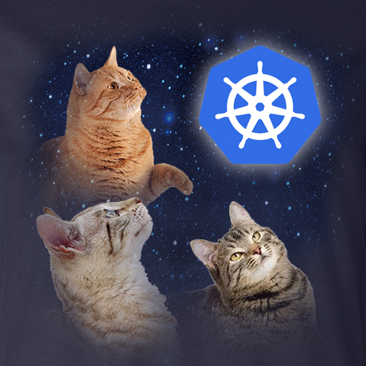

# Kubernetes 1.14: Caturnetes

#### Links

* [This document](https://git.k8s.io/sig-release/releases/release-1.14/README.md)
* [Release Team](https://git.k8s.io/sig-release/releases/release-1.14/release_team.md)
* [Meeting Minutes](http://bit.ly/k8s114-minutes) (join [kubernetes-sig-release@] to receive meeting invites)
* [v1.14 Release Calendar][k8s114-calendar]
* Contact: [#sig-release] on slack, [kubernetes-release-team@] on e-mail
* [Internal Contact Info](https://bit.ly/k8s114-contacts) (accessible only to members of [kubernetes-release-team@])

#### Tracking docs

* [Enhancements Tracking Sheet](http://bit.ly/k8s114-enhancements)
* [Bug Triage Tracking Sheet](http://bit.ly/k8s114-bugtriage)
* [CI Signal Report](http://bit.ly/k8s114-cisignal)
* [Retrospective Document](http://bit.ly/k8s114-retro)
* [kubernetes/sig-release v1.14 milestone][k/sr-milestone-v1.14]

#### Guides

* [Targeting Issues and PRs to This Milestone](https://git.k8s.io/community/contributors/devel/sig-release/release.md)
* [Triaging and Escalating Test Failures](https://git.k8s.io/community/contributors/devel/sig-testing/testing.md#troubleshooting-a-failure)

## tl;dr

The 1.14 release cycle is proposed as follows:

- **Monday, January 07**: Week 1 - Release cycle begins
- **Tuesday, January 29**: Week 4 - [Enhancements Freeze]
- **Thursday, March 07**: Week 9 - [Code Freeze]
- **Monday, March 18**: Week 11 - Docs must be completed and reviewed
- **Monday, March 25**: Week 12 - Kubernetes v1.14.0 released

## What Will We Do Differently This Release?

* All proposed Enhancements for this release must have an associated KEP.
  * There are no exceptions; if the enhancement had no associated KEP
    before, it must have one now.
  * The KEP must have a checklist of requirements necessary for a feature to
    land as alpha, beta, or stable.  That checklist must have at a minimum a
    test plan, and an upgrade/downgrade plan.
* There will be no Code Slush.
  * Previous release teams have said the only value of Code Slush was a clear
    one week warning that Code Freeze is coming
  * Use the start of [Burndown] meetings as that date if you need it

## Timeline

| **What** | **Who** | **Jan** | **Feb** | **Mar** | **WEEK** | **CI SIGNAL** |
| --- | --- | --- | --- | --- | --- | --- |
| Start of Release Cycle | Lead | Mon 7 | | | week 1 | [master-blocking] |
| Schedule finalized | Lead | Fri 11 | | | | |
| Team finalized | Lead | Fri 18 | | | week 2 | |
| Start Enhancements Tracking | Enhancements Lead | Tue 15 | | | | |
| 1.14.0-alpha.1 released | Branch Manager | Tue 15 | | | | |
| Start Release Notes Draft | Release Notes Lead | Tue 22 | | | week 3 | |
| **Begin [Enhancements Freeze]** (EOD PST) | Enhancements Lead | Tue 29 | | | week 4 | [master-blocking], [master-upgrade] |
| 1.14.0-alpha.2 released | Branch Manager | Tue 29 | | | | |
| 1.14.0-alpha.3 released | Branch Manager | | Tue 12 | | week 6 | |
| release-1.10 jobs removed | Test Infra Lead | | Tue 12 | | | |
| release-1.14 branch created | Branch Manager | | Tue 19 | | week 7 | |
| 1.14.0-beta.0 released | Branch Manager | | Tue 19 | | | |
| release-1.14 jobs created| Test Infra Lead | | Tue 19 | | | |
| **Begin [Burndown]** (MWF meetings) | Lead | | Mon 25 | | week 8 | [1.14-blocking], [master-blocking], [master-upgrade] |
| **Call for [Exceptions][Exception]** | Lead | | Mon 25 | | | |
| Brace Yourself, Code Freeze is Coming | Comms | | Mon 25 | | | |
| 1.14.0-beta.1 released | Branch Manager | | Tue 26 | | | |
| Docs deadline - Open placeholder PRs | Docs Lead | | | Fri 1 | | |
| **Begin [Code Freeze]** (EOD PST) | Test Infra | | | Thu 7 | week 9 | |
| Burndown Meetings daily| Lead | | | Mon 11 | week 10 | |
| Docs deadline - PRs ready for review | Docs Lead | | | Mon 11 | | |
| 1.14.0-beta.2 released | Branch Manager | | | Tue 12 | | |
| Docs complete - All PRs reviewed and ready to merge | Docs Lead | | | Mon 18 | | |
| **Begin [Code Thaw]** (EOD PST) | Test Infra | | | Tue 19 | week 11 | [1.14-blocking] |
| 1.14.0-rc.1 released | Branch Manager | | | Tue 19 | | |
| **Cherry Pick Deadline** (EOD PST) | Branch Manager | | | Thu 21 | week 11 | |
| **v1.14.0 released** | Branch Manager | | | Mon 25 | week 12 | |
| Release retrospective | Community | | | Thu 28 | | | | |

## Phases

### Enhancements Freeze

By **Tuesday January 29, 2019** all enhancements landing in v1.14.0 must:
- have an associated tracking issue in [kubernetes/enhancements] in the 
  [v1.14 milestone][k/e-milestone-v1.14]
- have an associated KEP merged or in progress in [kubernetes/enhancements], 
  linked to in the description of the tracking issue

By **Monday, February 4, 2019**, the KEPs associated with all enhancements landing in v1.14.0 
must be merged with an implementable status. This 1.14-specific extension is intended to allow 
time to complete KEPs that were in progress by enhancements freeze. In future releases, the 
intent is to require associated KEPs be merged/implementable by the enhancements freeze date.

We will de-milestone any enhancements that fail to meet these criteria. Any
new enhancements not in the milestone will require an [Exception][Exception]. We will be
lenient within reason if a KEP not quite landing on time is the justification.

SIG "themes" should also be in the release notes draft at this time to prepare
for blog posts and release marketing.  Any work the SIG wants publicized needs
to be called out to the Enhancements Lead so the Release Team communications 
lead can work with SIG-PM and the CNCF.

### Burndown

One week prior to Code Freeze, we increase the cadence of release team meetings
to begin tracking work more closely.  We call this Burndown, because at this
point we have a list of outstanding issues and PRs, and are actively working to
burn that list down.  SIG representatives are asked to attend if their SIG has
specific outstanding issues that are blocking the release.

Join [kubernetes-sig-release@] to get a calendar invite.  This meeting
may conflict with other community meetings.  Please prioritize this meeting if
a member of the release team asks you to attend.

The intent of these meetings is to:

* Focus on fixing bugs, eliminating test flakes and general release
  stabilization.
* Ensure docs and release notes are written and accurate.
* Identify all enhancement going into the release, and make sure alpha, beta, GA
  is marked in enhancements repo.
* Provide a [one-stop view of release progress](https://bit.ly/k8s114-minutes)
  including relevant release metrics.

### Code Freeze

All enhancements going into the release must be code-complete, **including
tests**, and have docs PRs open by ***Thursday, March 7th, 2018***.

The docs PRs don't have to be ready to merge, but it should be clear what the
topic will be and who is responsible for writing it. This person will become the
primary contact for the documentation lead. It’s incredibly important that
documentation work gets completed as quickly as possible.

After this point, only release-blocking issues and PRs will be allowed in the
milestone.

### Code Thaw

One week prior to release, it is expected that all but a handful of outstanding
PRs for kubernetes v1.14.0 have landed in the release-1.14 branch.  Assuming the
release team agrees, Code Freeze will be lifted, and we enter Code Thaw.

From this point forward, any PRs intended for v1.14 must be cherry picked to the
release-1.14 branch.

## Processes

### Exceptions

Starting at [Enhancements Freeze] the release team will solicit and rule on 
[exception requests] for enhancements and test work that is unlikely to be done
by Code Freeze. The exception approval is the responsibility of the SIG or SIGs
labeled in the pull request. The release team may intervene or deny the request 
only if it poses a risk to release quality, or could negatively impact the overall
timeline. Changes introduced at this point should be well-tested,
well-understood, limited in architectural scope, and low risk.  All of those
factors should be considered in the approval process.  Enhancements on an
feature branch with documentation, test cases, and passing CI are more likely to
be accepted.

### Pruning

Enhancements that are partially implemented and/or lack sufficient tests may be
considered for pruning beginning after [Code Freeze], unless they've been
granted an [Exception].

The release team will work with SIGs and enhancements owners to evaluate each
case, but for example, pruning could include actions such as:

* Disabling the use of a new API or field
* Switching the default value of a flag or field
* Moving a new API or field behind an Alpha Enhancements gate
* Reverting commits or deleting code

This should occur before 1.14.0-beta.1 is cut so we have time to gather signal
on whether the system is stable in this state. These are considered drastic
measures, so the release team will strive to coordinate at-risk work with SIGs
before this time. The goal is to make code freeze, and overall project
transparency, enforceable despite the lack of a consistently used feature branch
process.

### Docs

If an enhancement needs documentation, enter "Yes" in the enhancement tracking
spreadsheet and add a link to the documentation PR. You can open documentation
PRs in the [kubernetes/website] repository. If you have questions, the release
documentation lead, or representatives from SIG-Docs will be happy to assist
you.

For documentation PRs:

* Open PRs against the dev-1.14 branch based off of the 1.14 release PR. The
  documentation workflow uses feature branches for release documentation, rather
than basing from master. **Be sure to open your PR against the release branch**.
* Add your PR to the 1.14 Release milestone.

[Enhancements Freeze]: #enhancements-freeze
[Burndown]: #burndown
[Code Freeze]: #code-freeze
[Code Thaw]: #code-thaw
[Exception]: #exceptions

[kubernetes-release-team@]: https://groups.google.com/forum/#!forum/kubernetes-release-team
[kubernetes-sig-release@]: https://groups.google.com/forum/#!forum/kubernetes-sig-release
[#sig-release]: https://kubernetes.slack.com/messages/sig-release/
[contact-info]: https://bit.ly/k8s114-contacts
[k8s114-calendar]: https://bit.ly/k8s114-calendar

[kubernetes/kubernetes]: https://github.com/kubernetes/kubernetes
[kubernetes/enhancements]: https://github.com/kubernetes/enhancements
[kubernetes/website]: https://github.com/kubernetes/website

[k/e-milestone-v1.14]: https://github.com/kubernetes/enhancements/milestone/13
[k/k-milestone-v1.14]: https://github.com/kubernetes/kubernetes/milestone/41
[k/sr-milestone-v1.14]: https://github.com/kubernetes/sig-release/milestone/7

[master-blocking]: https://testgrid.k8s.io/sig-release-master-blocking#Summary
[master-upgrade]: https://testgrid.k8s.io/sig-release-master-upgrade#Summary
[1.14-blocking]:https://testgrid.k8s.io/sig-release-1.14-blocking#Summary

[exception requests]: https://github.com/kubernetes/sig-release/blob/master/releases/EXCEPTIONS.md
