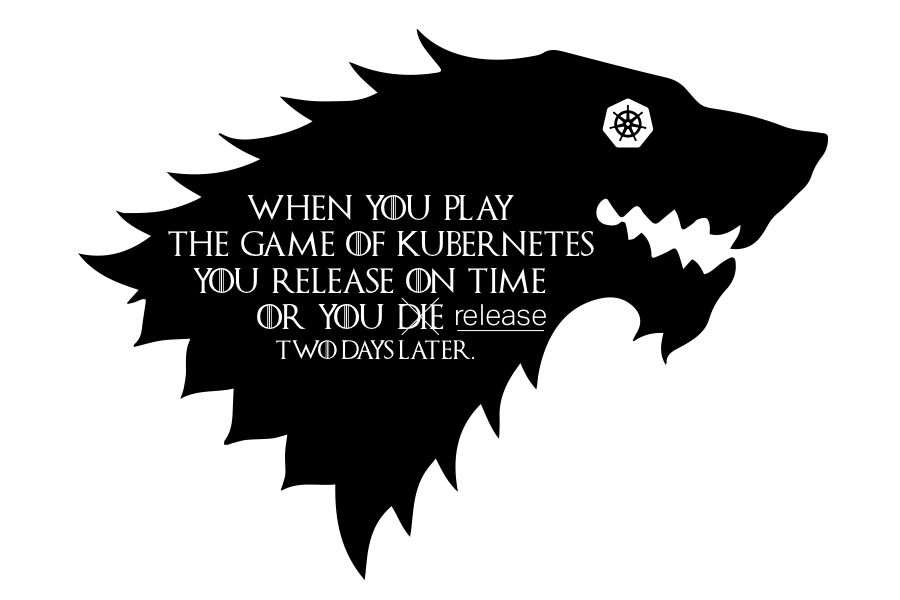

# Kubernetes 1.15: The Persevering Release 

#### Links 
* [This document](https://git.k8s.io/sig-release/releases/release-1.15/README.md)
* [Release Team](https://git.k8s.io/sig-release/releases/release-1.15/release_team.md)
* [Meeting Minutes](http://bit.ly/k8s115-releasemtg) - Every Monday at 9AM PT - Zoom link is in the meeting minutes 
* [v1.15 Release Calendar](http://bit.ly/k8s115cal)
* Contact: [#sig-release] on slack, [kubernetes-release-team@] on e-mail

#### Tracking docs

* [Enhancements Tracking Sheet](http://bit.ly/115-enhancements)
* Bug Triage Tracking Sheet
* [CI Signal Report](http://bit.ly/k8sv115cisignal)
* [Retrospective Document](http://bit.ly/115-retro)
* [kubernetes/kubernetes v1.15 milestone](https://github.com/kubernetes/kubernetes/milestone/42)

#### Guides

* [Targeting Issues and PRs to This Milestone](https://git.k8s.io/community/contributors/devel/sig-release/release.md)
* [Triaging and Escalating Test Failures](https://git.k8s.io/community/contributors/devel/sig-testing/testing.md#troubleshooting-a-failure)

## tl;dr
The 1.15 release cycle is proposed as follows: 

- **Monday, April 08**  - Release Cycle Begins 
- **Tuesday, April 30th, EOD PST** - Enhancements Freeze 
- **Thursday, May 30th, EOD PST**  - Code Freeze 
- **Tuesday, June 04** - Docs must be completed and reviewed 
- **Monday, June 17th** - Kubernetes 1.15.0 Released 

## What will we do differently this release? 

* To avoid releasing during KubeCon Shanghai (June 24-28) we will plan for an 11 week release cycle.  

* We have a new role on the release team - the emeritus lead.  
    *The emeritus lead will be responsible for ensuring shadow selection happens and that release shadows are getting the most out of their participation in the release process  
    
## What are we continuing from the previous release 
* All Enhancements must have a KEP that is in an implementable state by enhancement freeze.  If the enhanement does not have a KEP in an implementable state by enhancement freeze it will be removed from the milestone and will require an exception.  

* No code slush 

## Timeline 
| **What** | **Who** |**WHEN** | **WEEK** | 
| --- | --- | --- | --- | 
| 1.15 Release Cycle begins | Release Lead | Monday, April 08,  2019 | Week 1 |
| Schedule Finalized | Release Lead | Friday, April 12, 2019 | Week 1 |
| Release Team Finalized | Release Team Leads | Friday, April 12, 2019 | Week 1 |
| Start Enhancements Tracking | Enhancements Lead | Tuesday, April 16th, 2019 | Week 2
| 1.15.0-alpha.1 released | Branch Manager Lead | Tuesday, April 16, 2019 | Week 2 |
| Start Release Notes Draft | Release Notes Lead | Tuesday, April 23, 2019 | Week 3 |
| Enhancements Freeze | Enhancements Lead | Tuesday, April 30th, 2019 | Week 4 | 
| 1.15.0-alpha.2 released | Branch Manager Lead | Monday, April 29, 2019 | Week 4|
| 1.15.0-alpha.3 releaed | Branch Manager Lead | Tuesday May 07, 2019  | Week 5 |
| 1.15.0 branch cut | Branch Manager Lead | Tuesday, May 14th, 2019 | Week 6 |
| 1.15.0-beta.0 released | Branch Manager Lead | Tuesday, May 14th, 2019 | Week 6 |
| 1.15.0 release jobs created, 1.11.0 Jobs removed | Test Infra Lead | Thursday, May 16th, 2019 | Week 6 |
| Begin [Burndown] (MWF meetings) | Release Lead | Monday, May 27th, 2019 | Week 8 | 
| 1.15.0-beta.1 released | Branch Manager Lead |Tuesday, May 28th, 2019 | Week 8 |
| Docs Deadline - Open placeholder Prs | Docs Lead | Friday, May 31, 2019 | Week 8 | 
| Code Freeze | Test Infra Lead | Thursday, May 30th, 2019 | Week 8 |
| Daily burndowns start | Release Lead | Monday, June 03, 2019 | Week 9 |
| Docs deadline - PRs ready for review | Docs Lead |Tuesday, June 04, 2019 | Week 9 |
| 1.15.0-beta.2 released | Branch Manager Lead | Wednesday, June 05, 2019 | Week 9 | 
| Docs Last Call | Docs Lead | Monday, June 10th, 2019 | Week 10 |
| Code Thaw | Test Infra Lead | Tuesday, June 11th. 2019 | Week 10 
| 1.15.0-rc.1 released | Branch Manager Lead | Tuesday, June 11th, 2019 | Week 10 | 
| Cherry pick deadline | Branch Manager | Thursday, June 13th, 2019 | Week 10
| 1.15.0 Released | Branch Manager Lead | Monday, June 17th, 2019 | Week 11 

## Phases

### Enhancements Freeze
All enhancements wishing to be included in 1.15 must have 
* A KEP in an implementable state 
  * Including Testing Plans 
  * Including Graduation Criteria 
* An open issue in the 1.15 Milestone 

If your enhancement doesn't not meet these requirements it will be removed from the milestone and will require an exception.  

### Burndown
One week prior to Code Freeze, we increase the cadence of release team meetings
to begin tracking work more closely.  We call this Burndown, because at this
point we have a list of outstanding issues and PRs, and are actively working to
burn that list down.  SIG representatives will be asked to attend if their SIG has
specific outstanding issues that are blocking the release.

Join [kubernetes-sig-release@] to get a calendar invite.  This meeting
may conflict with other community meetings.  Please prioritize this meeting if
a member of the release team asks you to attend.

The intent of these meetings is to:

* Focus on fixing bugs, eliminating test flakes and general release
  stabilization.
* Ensure docs and release notes are written and accurate.
* Identify all enhancement going into the release, and make sure alpha, beta, GA
  is marked in enhancements repo.
* Provide a [one-stop view of release progress](https://bit.ly/k8s114-minutes)
  including relevant release metrics.
  
### Code Freeze

All enhancements going into the release must be code-complete, **including
tests**, and have docs PRs open by ***Thursday, May 30th, 2019***.

The docs PRs don't have to be ready to merge, but it should be clear what the
topic will be and who is responsible for writing it. This person will become the
primary contact for the documentation lead. It’s incredibly important that
documentation work gets completed as quickly as possible.

After this point, only release-blocking issues and PRs will be allowed in the
milestone.

### Code Thaw

One week prior to release, it is expected that all but a handful of outstanding
PRs for kubernetes v1.16.0 have landed in the release-1.15 branch.  Assuming the
release team agrees, Code Freeze will be lifted, and we enter Code Thaw.

From this point forward, any PRs intended for v1.15 must be cherry picked to the
release-1.15 branch.

### Exceptions

Starting at [Enhancements Freeze] the release team will solicit and rule on 
[exception requests] for enhancements and test work that is unlikely to be done
by Code Freeze. The exception approval is the responsibility of the SIG or SIGs
labeled in the pull request. The release team may intervene or deny the request 
only if it poses a risk to release quality, or could negatively impact the overall
timeline. Changes introduced at this point should be well-tested,
well-understood, limited in architectural scope, and low risk.  All of those
factors should be considered in the approval process.  Enhancements on an
feature branch with documentation, test cases, and passing CI are more likely to
be accepted.

### Pruning

Enhancements that are partially implemented and/or lack sufficient tests may be
considered for pruning beginning after [Code Freeze], unless they've been
granted an [Exception].

The release team will work with SIGs and enhancements owners to evaluate each
case, but for example, pruning could include actions such as:

* Disabling the use of a new API or field
* Switching the default value of a flag or field
* Moving a new API or field behind an Alpha Enhancements gate
* Reverting commits or deleting code

This should occur before 1.14.0-beta.1 is cut so we have time to gather signal
on whether the system is stable in this state. These are considered drastic
measures, so the release team will strive to coordinate at-risk work with SIGs
before this time. The goal is to make code freeze, and overall project
transparency, enforceable despite the lack of a consistently used feature branch
process.

### Docs

If an enhancement needs documentation, enter "Yes" in the enhancement tracking
spreadsheet and add a link to the documentation PR. You can open documentation
PRs in the [kubernetes/website] repository. If you have questions, the release
documentation lead, or representatives from SIG-Docs will be happy to assist
you.

For documentation PRs:

* Open PRs against the dev-1.15 branch based off of the 1.15 release PR. The
  documentation workflow uses feature branches for release documentation, rather
than basing from master. **Be sure to open your PR against the release branch**.
* Add your PR to the 1.15 Release milestone.

[Enhancements Freeze]: #enhancements-freeze
[Burndown]: #burndown
[Code Freeze]: #code-freeze
[Code Thaw]: #code-thaw
[Exception]: #exceptions

[kubernetes-release-team@]: https://groups.google.com/forum/#!forum/kubernetes-release-team
[kubernetes-sig-release@]: https://groups.google.com/forum/#!forum/kubernetes-sig-release
[#sig-release]: https://kubernetes.slack.com/messages/sig-release/
[k8s115-calendar]: http://bit.ly/k8s115cal 

[kubernetes/kubernetes]: https://github.com/kubernetes/kubernetes
[kubernetes/enhancements]: https://github.com/kubernetes/enhancements
[kubernetes/website]: https://github.com/kubernetes/website

[master-blocking]: https://testgrid.k8s.io/sig-release-master-blocking#Summary
[master-upgrade]: https://testgrid.k8s.io/sig-release-master-upgrade#Summary

[exception requests]: https://github.com/kubernetes/sig-release/blob/master/releases/EXCEPTIONS.md  
