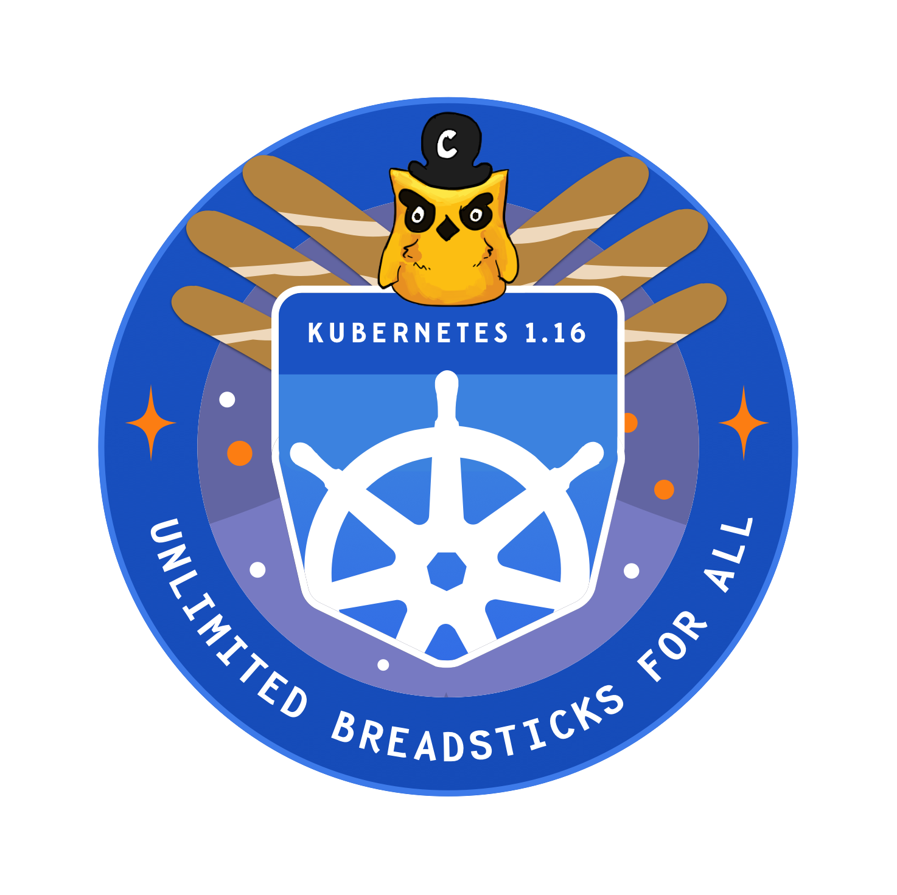

# Kubernetes 1.16: Unlimited Breadsticks For All

The Kubernetes 1.16 release crest was loosely inspired by the Apollo 16 mission crest. It represents the hard work of the release-team and the community alike and is an ode to the challenges and fun times we shared as a team throughout the release cycle.  Many thanks to [Ronan Flynn-Curran](https://github.com/flynnduism) of Microsoft for creating this magnificent piece.

#### Links
* [This document](https://git.k8s.io/sig-release/releases/release-1.16/README.md)
* [Release Team](https://git.k8s.io/sig-release/releases/release-1.16/release_team.md)
* [Meeting Minutes](http://bit.ly/k8s116-releasemtg)
* [Kubernetes Release Calendar](https://bit.ly/k8s-release-cal)
* Contact: [#sig-release] on slack, [kubernetes-release-team@] on e-mail

#### Tracking docs

* [Enhancements Tracking Sheet](http://bit.ly/k8s116-enhancement-tracking)
* [Bug Triage Tracking Sheet](http://bit.ly/k8s116-bugtriage)
* [CI Signal Report](http://bit.ly/k8s116-cisignal)
* [Retrospective Document](http://bit.ly/k8s116-retro)
* [kubernetes/kubernetes v1.16 milestone](https://github.com/kubernetes/kubernetes/milestone/45)

#### Guides

* [Targeting Issues and PRs to This Milestone](https://git.k8s.io/community/contributors/devel/sig-release/release.md)
* [Triaging and Escalating Test Failures](https://git.k8s.io/community/contributors/devel/sig-testing/testing.md#troubleshooting-a-failure)

## tl;dr
The 1.16 release cycle is proposed as follows:

- **Monday, July 01**  - Release Cycle Begins
- **Tuesday, July 30, EOD PST** - Enhancements Freeze
- **Thursday, August 29, EOD PST**  - Code Freeze
- **Monday, September 9** - Docs must be completed and reviewed
- **Wednesday, September 18** - Kubernetes 1.16.0 Released

## What will we do differently this release?
* We have dissolved the test-infra role from the release team. The responsibilities of this role have been reallocated amongst other roles on the release team. This is the tracking [issue](https://github.com/kubernetes/sig-release/issues/631)
* The itemized list of code changes for the release will be migrated from the release changelog `CHANGELOG-x.y.md` (where `x` and `y` are major and minor versions of Kubernetes, respectively) to [https://relnotes.k8s.io](https://relnotes.k8s.io)

## What are we continuing from the previous release
* All Enhancements must have a KEP that is in `implementable` state by Enhancements Freeze. If the enhancement does not have a KEP in `implementable` state by Enhancements Freeze it will be removed from the milestone and will require an [exception](/releases/EXCEPTIONS.md).
* No code slush
* The Emeritus Adviser will be responsible for advising the Release Team Lead and Lead Shadows, ensuring shadow selection happens, and that release shadows are getting the most out of their participation in the release process.

## Timeline
| **What** | **Who** | **Jul** | **Aug** | **Sep** | **WEEK** | **CI SIGNAL** |
| --- | --- | --- | --- | --- | --- | --- |
| Start of Release Cycle | Lead | Mon 1 | | | week 1 | [master-blocking] |
| Schedule finalized | Lead | Fri 5 | | | | |
| Team finalized | Lead | Fri 12 | | | week 2 | |
| Start Enhancements Tracking | Enhancements Lead | Tue 16 | | | week 3 | |
| 1.16.0-alpha.1 released | Branch Manager | Tue 16 | | | | |
| Start Release Notes Draft | Release Notes Lead | Tue 23 | | | week 4 | |
| **Begin [Enhancements Freeze][Enhancements Freeze** (EOD PST) | Enhancements Lead | Tue 30 | | | week 5 | [master-blocking], [master-upgrade] |
| 1.16.0-alpha.2 released | Branch Manager | Tue 30 | | |  | |
| 1.16.0-alpha.3 released | Branch Manager | | Tue 6 | | week 6 | |
| release-1.12 jobs removed | Branch Manager | | Tue 13 | | week 7 | |
| release-1.16 branch created | Branch Manager | | Tue 13 | | | |
| 1.16.0-beta.0 released | Branch Manager | | Tue 13 | | | |
| release-1.16 jobs created| Branch Manager | | Tue 13 | | | |
| **Begin [Burndown]** (MWF meetings) | Lead | | Mon 19 | | week 8 | [1.16-blocking], [master-blocking], [master-upgrade] |
| **Call for [Exceptions][Exception]** | Lead | | Mon 19 | | | |
| Brace Yourselves, Code Freeze is Coming | Comms / Bug Triage| | Mon 19 | | | |
| 1.16.0-beta.1 released | Branch Manager | | Tue 20 | | | |
| Docs deadline - Open placeholder PRs | Docs Lead | | Fri 23 | | | |
| **Begin [Code Freeze]** (EOD PST) | Branch Manager | | Thu 29 | | week 9 | |
| Burndown Meetings daily | Lead | | | Tues 3 | week 10 | |
| Docs deadline - PRs ready for review | Docs Lead | | | Tues 3 | | |
| 1.16.0-beta.2 released | Branch Manager | | | Wed 4 | | |
| Docs complete - All PRs reviewed and ready to merge | Docs Lead | | | Mon 9 | week 11 | |
| **Begin [Code Thaw]** (EOD PST) | Branch Manager | | | Tue 10 |  | [1.16-blocking] |
| 1.16.0-rc.1 released | Branch Manager | | | Tue 10 | | |
| **Cherry Pick Deadline** (EOD PST) | Branch Manager | | | Thu 12 | | |
| 1.16.0-rc.2 released | Branch Manager | | | Fri 13 | | |
| **v1.16.0 released** | Branch Manager | | | Wed 18 | week 12 | |
| Release retrospective | Community | | | Thu 19 | | | | |

## Phases

### Enhancements Freeze
All enhancements wishing to be included in 1.16 must have
* A KEP in an implementable state
  * Including Testing Plans
  * Including Graduation Criteria
* An open issue in the 1.16 Milestone

If your enhancement does not meet these requirements, it will be removed from the milestone and will require an [exception](/releases/EXCEPTIONS.md).

### Burndown
One week prior to Code Freeze, we increase the cadence of release team meetings
to begin tracking work more closely.  We call this Burndown, because at this
point we have a list of outstanding issues and PRs, and are actively working to
burn that list down.  SIG representatives will be asked to attend if their SIG has
specific outstanding issues that are blocking the release.

Please subscribe to the [Kubernetes Release Calendar][kubernetes-release-calendar] to see meeting events. Burndown meetings
may conflict with other community meetings.  Please prioritize this meeting if
a member of the release team asks you to attend.

The intent of these meetings is to:

* Focus on fixing bugs, eliminating test flakes and general release
  stabilization.
* Ensure docs and release notes are written and accurate.
* Identify all enhancement going into the release, and make sure alpha, beta, GA
  is marked in enhancements repo.
* Provide a [one-stop view of release progress](http://bit.ly/k8s116-releasemtg)
  including relevant release metrics.

### Code Freeze

All enhancements going into the release must be code-complete, **including
tests**, and have docs PRs open by ***Thursday, August 29, 2019***.

The docs PRs don't have to be ready to merge, but it should be clear what the
topic will be and who is responsible for writing it. This person will become the
primary contact for the documentation lead. It’s incredibly important that
documentation work gets completed as quickly as possible.

After this point, only release-blocking issues and PRs will be allowed in the
milestone.

### Code Thaw

One week prior to release, it is expected that all but a handful of outstanding
PRs for kubernetes v1.16.0 have landed in the release-1.16 branch. Assuming the
release team agrees, Code Freeze will be lifted, and we enter Code Thaw.

From this point forward, any PRs intended for v1.16 must be cherry picked to the
release-1.16 branch.

### Exceptions

Starting at [Enhancements Freeze] the release team will solicit and rule on
[exception requests] for enhancements and test work that is unlikely to be done
by Code Freeze. The exception approval is the responsibility of the SIG or SIGs
labeled in the pull request. The release team may intervene or deny the request
only if it poses a risk to release quality, or could negatively impact the overall
timeline. Changes introduced at this point should be well-tested,
well-understood, limited in architectural scope, and low risk.  All of those
factors should be considered in the approval process.  Enhancements on an
feature branch with documentation, test cases, and passing CI are more likely to
be accepted.

### Pruning

Enhancements that are partially implemented and/or lack sufficient tests may be
considered for pruning beginning after [Code Freeze], unless they've been
granted an [Exception].

The release team will work with SIGs and enhancements owners to evaluate each
case, but for example, pruning could include actions such as:

* Disabling the use of a new API or field
* Switching the default value of a flag or field
* Moving a new API or field behind an Alpha Enhancements gate
* Reverting commits or deleting code

This should occur before 1.16.0-beta.1 is cut so we have time to gather signal
on whether the system is stable in this state. These are considered drastic
measures, so the release team will strive to coordinate at-risk work with SIGs
before this time. The goal is to make code freeze, and overall project
transparency, enforceable despite the lack of a consistently used feature branch
process.

### Docs

If an enhancement needs documentation, enter "Yes" in the enhancement tracking
spreadsheet and add a link to the documentation PR. You can open documentation
PRs in the [kubernetes/website] repository. If you have questions, the release
documentation lead, or representatives from SIG-Docs will be happy to assist
you.

For documentation PRs:

* Open PRs against the dev-1.16 branch based off of the 1.16 release PR. The
  documentation workflow uses feature branches for release documentation, rather
than basing from master. **Be sure to open your PR against the release branch**.
* Add your PR to the 1.16 Release milestone.

[Enhancements Freeze]: #enhancements-freeze
[Burndown]: #burndown
[Code Freeze]: #code-freeze
[Code Thaw]: #code-thaw
[Exception]: #exceptions

[kubernetes-release-team@]: https://groups.google.com/forum/#!forum/kubernetes-release-team
[kubernetes-sig-release@]: https://groups.google.com/forum/#!forum/kubernetes-sig-release
[#sig-release]: https://kubernetes.slack.com/messages/sig-release/
[kubernetes-release-calendar]: https://bit.ly/k8s-release-cal
[kubernetes/kubernetes]: https://github.com/kubernetes/kubernetes
[kubernetes/enhancements]: https://github.com/kubernetes/enhancements
[kubernetes/website]: https://github.com/kubernetes/website

[master-blocking]: https://testgrid.k8s.io/sig-release-master-blocking#Summary
[master-upgrade]: https://testgrid.k8s.io/sig-release-master-upgrade#Summary
[1.16-blocking]:https://testgrid.k8s.io/sig-release-1.16-blocking#Summary

[exception requests]: https://github.com/kubernetes/sig-release/blob/master/releases/EXCEPTIONS.md
