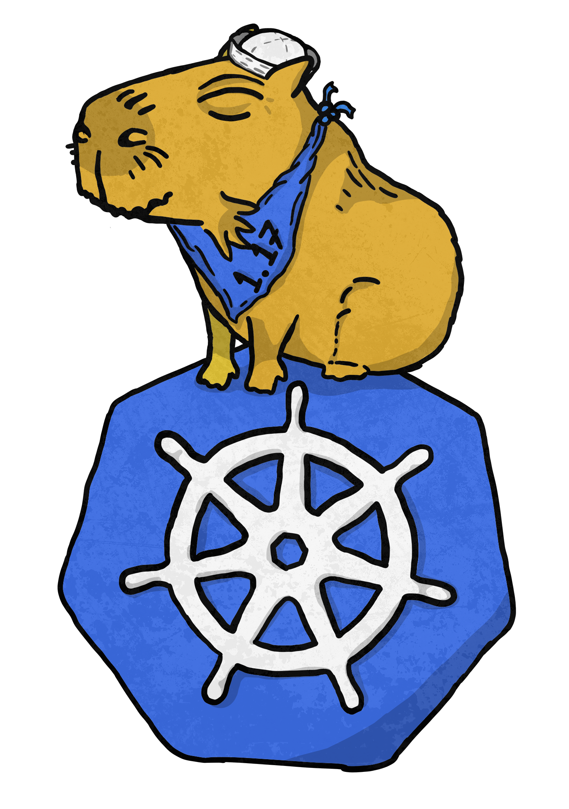

# Kubernetes 1.17 : The Chillest Release

#### Links
* [This document](https://git.k8s.io/sig-release/releases/release-1.17/README.md)
* [Release Team](https://git.k8s.io/sig-release/releases/release-1.17/release_team.md)
* [Meeting Minutes](http://bit.ly/k8s117-releasemtg)
* [Kubernetes Release Calendar](https://bit.ly/k8s-release-cal)
* Contact: [#sig-release] on slack, [kubernetes-release-team@] on e-mail

#### Tracking docs

* [Enhancements Tracking Sheet](http://bit.ly/k8s117-enhancement-tracking)
* [Bug Triage Tracking Sheet](http://bit.ly/k8s117-bugtriage)
* [CI Signal Report](http://bit.ly/k8s117-cisignal)
* [Retrospective Document](http://bit.ly/k8s117-retro)
* [kubernetes/kubernetes v1.17 milestone](https://github.com/kubernetes/kubernetes/milestone/43)

#### Guides

* [Targeting Issues and PRs to This Milestone](https://git.k8s.io/community/contributors/devel/sig-release/release.md)
* [Triaging and Escalating Test Failures](https://git.k8s.io/community/contributors/devel/sig-testing/testing.md#troubleshooting-a-failure)

## tl;dr
The 1.17 release cycle is proposed as follows:
- **Monday, September 23**  - Release Cycle Begins
- **Tuesday, October 15, EOD PST** - Enhancements Freeze
- **Thursday, November 14, EOD PST**  - Code Freeze
- **Friday, November 22** - Docs must be completed and reviewed, ready to merge
- **Monday, December 9** - Kubernetes 1.17.0 Released

## What will we do differently this release?
* Due to the end of the year, this release cycle will be shorter than the other cycles this year. In accordance, we will have a slightly accelerated schedule.

## What are we continuing from the previous release
* All Enhancements must have a KEP that is in `implementable` state by Enhancements Freeze. If the enhancement does not have a KEP in `implementable` state by Enhancements Freeze it will be removed from the milestone and will require an [exception][Exception].
* The Emeritus Adviser will be responsible for advising the Release Team Lead and Lead Shadows, ensuring shadow selection happens, and that release shadows are getting the most out of their participation in the release process.
* The itemized list of code changes for the release is being migrated from the release changelog `CHANGELOG-x.y.md` (where `x` and `y` are major and minor versions of Kubernetes, respectively) to [https://relnotes.k8s.io](https://relnotes.k8s.io)
* We will continue to implement guidelines and clean up around CI Signal.

## Timeline
| **What** | **Who** | **When** | **WEEK** | **CI SIGNAL** |
| --- | --- | --- | --- | --- |
| Team Leads finalized | Lead | Wed September 18 | week 0 | |
| Start of Release Cycle | Lead | Mon September 23 |week 1 | [master-blocking] |
| Start Enhancements Tracking | Enhancements Lead | Tue 24  | |
| Schedule finalized | Lead | Wed September 25 | |
| Team Shadows finalized | Lead | Wed September 25 |
| 1.17.0-alpha.1 released | Branch Manager | Tue October 1 | week 2| |
| Start Release Notes Draft | Release Notes Lead | Tue October 8 | week 3 | |
| **Begin [Enhancements Freeze]** (EOD PST) | Enhancements Lead | Tue October 15 | week 4 | [master-blocking], [master-informing] |
| 1.17.0-alpha.2 released | Branch Manager | Tue October 15 | |
| 1.17.0-alpha.3 released | Branch Manager | Tue October 22 |  week 5 | |
| release-1.13 jobs removed | Branch Manager | Tue October 29 | week 6 | |
| release-1.17 branch created | Branch Manager | Tue October 29 |
| 1.17.0-beta.0 released | Branch Manager | Tue October 29 |
| release-1.17 jobs created| Branch Manager |  Tue October 29 | |
| **Begin [Burndown]** (MWF meetings) | Lead | Mon November 4 | week 7 | [1.17-blocking], [master-blocking], [master-informing] |
| **Call for [Exceptions][Exception]** | Lead | Mon November 4 |
| Brace Yourselves, Code Freeze is Coming | Comms / Bug Triage| Mon November 4 |
| 1.17.0-beta.1 released | Branch Manager | Tue November 5 |
| Docs deadline - Open placeholder PRs | Docs Lead | Fri November 8 |
| **Begin [Code Freeze]** (EOD PST) | Branch Manager | Thu November 14 | week 8 |
| Docs deadline - PRs ready for review | Docs Lead | Fri November 15 |
| KubeCon Begins | Community |Mon November 18 | week 9 | |
| 1.17.0-beta.2 released | Branch Manager | Mon November 18 | week 9 |
| Docs complete - All PRs reviewed and ready to merge | Docs Lead | Fri November 22 | |
| 1.17.0-rc.1 released | Branch Manager | Fri November 22 |
| **Begin [Code Thaw]** (EOD PST) | Branch Manager | Fri November 22 | [1.17-blocking]|
| Burndown Meetings daily | Lead | Tues November 26 | |
| **Cherry Pick Deadline** (EOD PST) | Branch Manager | Mon December 2 |
| 1.17.0-rc.2 released | Branch Manager | Tue December 3 | week 11 |
| **v1.17.0 released** | Branch Manager | Mon December 9 | week 12 | |
| Release retrospective | Community | Thu December 12 |

## Phases

Please refer to the [release phases document](../release_phases.md).

[Enhancements Freeze]: ../release_phases.md#enhancements-freeze
[Burndown]: ../release_phases.md#burndown
[Code Freeze]: ../release_phases.md#code-freeze
[Exception]: ../release_phases.md#exceptions
[Code Thaw]: ../release_phases.md#code-thaw

[kubernetes-release-team@]: https://groups.google.com/forum/#!forum/kubernetes-release-team
[kubernetes-sig-release@]: https://groups.google.com/forum/#!forum/kubernetes-sig-release
[#sig-release]: https://kubernetes.slack.com/messages/sig-release/
[kubernetes-release-calendar]: https://bit.ly/k8s-release-cal
[kubernetes/kubernetes]: https://github.com/kubernetes/kubernetes

[master-blocking]: https://testgrid.k8s.io/sig-release-master-blocking#Summary
[master-informing]: https://testgrid.k8s.io/sig-release-master-informing#Summary
[1.17-blocking]: https://testgrid.k8s.io/sig-release-1.17-blocking#Summary

[exception requests]: ../EXCEPTIONS.md
[release phases document]: ../release_phases.md