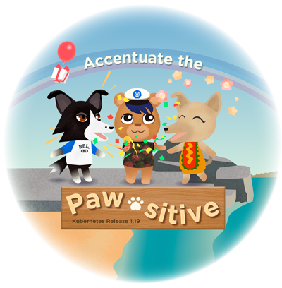

# Kubernetes 1.19: Accentuate The Paw-sitive

All of you inspired this Kubernetes 1.19 release logo! This release was a bit more of a marathon and a testament to when the world is a wild place, we can come together and do unbelievable things. 

"Accentuate the Paw-sitive" was chosen as the release theme because it captures the positive outlook that the release team had, despite the state of the world. The characters pictured in the 1.19 logo represent everyone's personalities on our release team, from emo to peppy, and beyond! 

About the designer: Hannabeth Lagerlöf is a Visual Designer based in Los Angeles, California, and she has an extensive background in Environments and Graphic Design. Hannabeth creates art and user experiences that inspire connection. You can find Hannabeth on Twitter as @emanate_design.

#### Links

* [This document](https://git.k8s.io/sig-release/releases/release-1.19/README.md)
* [Release Team](https://git.k8s.io/sig-release/releases/release-1.19/release_team.md)
* [Meeting Minutes](http://bit.ly/k8s119-releasemtg) (join [kubernetes-sig-release@] to receive meeting invites)
* [v1.19 Release Calendar][k8s119-calendar]
* Contact: [#sig-release] on slack, [kubernetes-release-team@] on e-mail
* [Internal Contact Info]() (accessible only to members of [kubernetes-release-team@])

#### Tracking docs

* [Enhancements Tracking Sheet](http://bit.ly/k8s-1-19-enhancements)
* Bug Triage Tracking Sheet: TODO
* CI Signal Report: TODO
* [Retrospective Document][Retrospective Document]
* [kubernetes/sig-release v1.19 milestone](https://github.com/kubernetes/kubernetes/milestone/46)

#### Guides

* [Targeting Issues and PRs to This Milestone](https://git.k8s.io/community/contributors/devel/sig-release/release.md)
* [Triaging and Escalating Test Failures](https://git.k8s.io/community/contributors/devel/sig-testing/testing.md#troubleshooting-a-failure)

## TL;DR

The 1.19 release cycle is proposed as follows:

- **Monday, April 13**: Week 1 - Release cycle begins
- **Tuesday, May 19**: Week 6 - [Enhancements Freeze]
- **Thursday, July 9th**: Week 13 - [Code Freeze]
- **Thursday, July 16th**: Week 14 - Docs must be completed and reviewed
- **Wednesday, August 26th**: Week 20 - Kubernetes v1.19.0 released
- **Thursday, September 3rd**: Week 21 - Release Retrospective

## Timeline

| **What** | **Who** | **When** | **WEEK** | **CI SIGNAL** |
|---|---|---|---|---|
| Start of Release Cycle | Lead | Mon, April 13 | week 1 | [master-blocking] |
| Start Enhancements Tracking | Enhancements Lead | Tue, April  14 | week 1 | |
| Schedule finalized | Lead | Fri, April 17 | week 1 | |
| Team finalized | Lead | Fri, April 17 | week 1 | |
| 1.19.0-alpha.2 released | Branch Manager | Tue, April 21 | week 2 | |
| Start Release Notes Draft | Release Notes Lead | Tue, April 28 | week 3 | | [master-blocking], [master-informing] |
| 1.19.0-alpha.3 released | Branch Manager | Tue, May 5 | week 4 | |
| **Begin [Enhancements Freeze]** (EOD PST) | Enhancements Lead | Tue, May 19 | week 6 |
| 1.19.0-beta.0 released | Branch Manager | Tue, May 19 | week 6 | |
| **Begin [Burndown]** (MWF meetings) | Lead | Mon, June 1 | week 8 | [1.19-blocking], [master-blocking], [master-informing] |
| **Call for [Exceptions][Exception]** | Lead | Mon, June 1 | week 8 | |
| 1.19.0-beta.1 released | Branch Manager | Tue, June 2 | week 8 | |
| Brace Yourself, Code Freeze is Coming | Comms / Bug Triage | Mon, June 8 | week 9 | |
| 1.19.0-beta.2 released | Branch Manager | Tue, June 9 | week 9 | |
| Docs deadline - Open placeholder PRs | Docs Lead | Fri, June 19 | week 10 | |
| Docs deadline - PRs ready for review | Docs Lead | Mon, July 6 | week 13 | |
| **Begin [Code Freeze]** (EOD PST) | Branch Manager | Thu, July 9 | week 13 | |
| 1.19.0-rc.0 released | Branch Manager | Thu, July 9 | week 13 | |
| release-1.19 branch created | Branch Manager | Thu, July 9 | week 13 | |
| release-1.19 jobs created | Branch Manager | Thu, July 9 | week 13 | |
| 1.19.0-rc.1 released | Branch Manager | Tue, July 14 | week 14 | |
| Docs complete - All PRs reviewed and ready to merge | Docs Lead | Thu, July 16 | week 14 | |
| 1.19.0-rc.2 released | Branch Manager | Tue, July 21 | week 15 | |
| 1.19.0-rc.3 released | Branch Manager | Wed, July 29 | week 16 | |
| Burndown Meetings daily | Lead | Mon, August 3 | week 17 | |
| 1.19.0-rc.4 released | Branch Manager | Tue, August 4 | week 17 | |
| **[Code Thaw]** (EOD PST) | Branch Manager | TBD | TBD | |
| **Cherry Pick Deadline** (EOD PST) | Branch Manager | Thu, August 6 | week 17 | |
| **[Test Freeze]** (EOD PST) | Branch Manager | Thu, August 6 | week 17 | |
| **KubeCon CloudNativeCon Europe  -  Break** | Community | Mon, August 10 | week 18 | |
| **KubeCon CloudNativeCon Europe  - Resume**  | Community | Mon, August 24 | week 20 | |
| **v1.19.0 released** | Branch Manager | Wed, August 26 | week 20 | |
| **Release Retrospective** | Community | Thu, September 3 | week 21 | |

## Phases

Please refer to the [release phases document](../release_phases.md).

[k8s119-calendar]: https://bit.ly/k8s-release-cal
[Internal Contact Info]: https://bit.ly/k8s119-contacts
[Retrospective Document]: https://bit.ly/k8s119-retro
[release phases document]: ../release_phases.md

[Enhancements Freeze]: ../release_phases.md#enhancements-freeze
[Burndown]: ../release_phases.md#burndown
[Code Freeze]: ../release_phases.md#code-freeze
[Exception]: ../release_phases.md#exceptions
[Code Thaw]: ../release_phases.md#code-thaw
[Test Freeze]: ../release_phases.md#test-freeze

[master-blocking]: https://testgrid.k8s.io/sig-release-master-blocking#Summary
[master-informing]: https://testgrid.k8s.io/sig-release-master-informing#Summary
[1.19-blocking]: https://testgrid.k8s.io/sig-release-1.19-blocking#Summary

[kubernetes-release-team@]: https://groups.google.com/a/kubernetes.io/g/release-team
[kubernetes-sig-release@]: https://groups.google.com/forum/#!forum/kubernetes-sig-release
[#sig-release]: https://kubernetes.slack.com/messages/sig-release/
