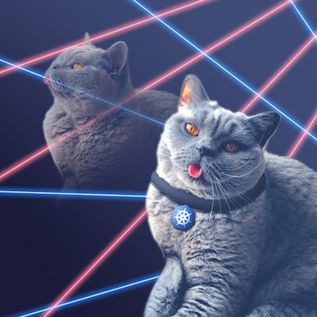

# Kubernetes 1.20: The Raddest Release

[raddest](https://www.dictionary.com/browse/rad): adjective, Slang. excellent; wonderful; cool:

2020 has been a challenging year for many of us, but that didn't stop the community. Kubernetes contributors have delivered a record-breaking number of enhancements in this release and they did it during an end of the year release that overlapped with KubeCon + CloudNativeCon North America, various end of year holidays, and the general challenges of 2020. That is a great accomplishment and makes Kubernetes 1.20 one of the "raddest" releases yet. So as we end the year with a big accomplishment, we chose to add a little levity to the year and pay homage to releases past [Kubernetes 1.14 - Caturnetes](../releases/release-1.14) with a "rad" cat named Humphrey.

Special thanks to [Henry Hsu](https://www.instagram.com/robotdancebattle/?hl=en) for the portrait of Humphrey. 

#### Links

* [This document](https://git.k8s.io/sig-release/releases/release-1.20/README.md)
* [Release Team](https://github.com/kubernetes/sig-release/blob/master/releases/release-1.20/release-team.md)
* [Meeting Minutes](http://bit.ly/k8s120-releasemtg) (join [kubernetes-sig-release@] to receive meeting invites)
* [v1.20 Release Calendar][k8s120-calendar]
* Contact: [#sig-release] on slack, [kubernetes-release-team@] on e-mail
* [Internal Contact Info][Internal Contact Info] (accessible only to members of [kubernetes-release-team@])

#### Tracking docs

* [Enhancements Tracking Sheet](http://bit.ly/k8s-1-20-enhancements)
* Bug Triage Tracking Sheet: TODO
* CI Signal Report: TODO
* [Retrospective Document][Retrospective Document]
* [kubernetes/sig-release v1.20 milestone](https://github.com/kubernetes/kubernetes/milestone/48)

#### Guides

* [Targeting Issues and PRs to This Milestone](https://git.k8s.io/community/contributors/devel/sig-release/release.md)
* [Triaging and Escalating Test Failures](https://git.k8s.io/community/contributors/devel/sig-testing/testing.md#troubleshooting-a-failure)

## TL;DR

The 1.20 release cycle is proposed as follows:

- **Monday, September 14th**: Week 1 - Release cycle begins
- **Tuesday, Oct 6th**: Week 4 - [Enhancements Freeze](../release_phases.md#enhancements-freeze)
- **Thursday, Nov 12th**: Week 9 - [Code Freeze](../release_phases.md#code-freeze)
- **Monday, Nov 23rd**: Week 11 - [Test Freeze](../release_phases.md#test-freeze)
- **Wednesday, Dec 2nd**: Week 12 - Docs must be completed and reviewed
- **Tuesday, Dec 8th**: Week 13 - Kubernetes v1.20.0 released
- **Thursday, Dec 17th**: Week 14 - Release Retrospective

## Timeline

| **What** | **Who** | **When** | **WEEK** | **CI SIGNAL** |
|---|---|---|---|---|
| Start of Release Cycle | Lead | Mon September 14 | week 1 | [master-blocking] |
| Start Enhancements Tracking | Enhancements Lead | Tue September 15 | | |
| Schedule finalized | Lead | Wed September 16 | | |
| Team finalized | Lead | Friday September 18 |  | |
| 1.20.0-alpha.1 released | Branch Manager | Tue September 22 | week 2 | |
| Start Release Notes Draft | Release Notes Lead | Tue September 29 | week 3 | |
| **Begin [Enhancements Freeze]** (EOD PST) | Enhancements Lead | Tue October 6 | week 4 | [master-blocking], [master-informing] |
| 1.20.0-alpha.2 released | Branch Manager | Tue October 13 | week 5 | |
| 1.20.0-alpha.3 released | Branch Manager | Tue October 20 | week 6 | |
| 1.20.0-beta.0 released | Branch Manager | Tue October 27 | week 7 | |
| **Begin [Burndown]** (MWF meetings) | Lead | Mon November 2 | week 8 | [1.20-blocking], [master-blocking], [master-informing] |
| **Call for [Exceptions][Exception]** | Lead | Mon November 2 | | |
| Brace Yourself, Code Freeze is Coming | Comms / Bug Triage | Mon November 2 | | |
| 1.20.0-beta.1 released | Branch Manager | Tue November 3 | | |
| Docs deadline - Open placeholder PRs | Docs Lead | Fri November 6 | | |
| **Begin [Code Freeze]** (EOD PST) | Branch Manager | Thu November 12 | week 9 | |
| Burndown Meetings daily| Lead | Mon November 16 | week 10 | |
| 1.20.0-beta.2 released | Branch Manager | Tue November 17 | | |
| **KubeCon CloudNativeCon North America Starts** | Community | Tue, November 17 |  | |
| **KubeCon CloudNativeCon North America Ends** | Community | Friday, November 20 |  | |
| Docs deadline - PRs ready for review | Docs Lead | Mon November 23 | week 11 | |
| **[Test Freeze]** (EOD PST) | Branch Manager | Mon November 23 | |
| Docs complete - All PRs reviewed and ready to merge | Docs Lead | Wed December 2 | week 12 | |
| release-1.20 branch created | Branch Manager | Tue December 1 | | |
| release-1.20 jobs created | Branch Manager | Tue December 1 | | |
| 1.20.0-rc.0 released | Branch Manager | Tue December 1 | | |
| **v1.20.0 released** | Branch Manager | Tue December 8 | week 13 | |
| **[Thaw]** | Branch Manager | Tue, December 8 | | |
| Release retrospective | Community | Thu December 17 | week 14 | |

## Phases

Please refer to the [release phases document](../release_phases.md).

[k8s120-calendar]: https://bit.ly/k8s-release-cal
[Internal Contact Info]: http://bit.ly/k8s120-contacts
[Retrospective Document]: http://bit.ly/k8s120-retro

[Enhancements Freeze]: ../release_phases.md#enhancements-freeze
[Burndown]: ../release_phases.md#burndown
[Code Freeze]: ../release_phases.md#code-freeze
[Exception]: ../release_phases.md#exceptions
[Thaw]: ../release_phases.md#thaw
[Test Freeze]: ../release_phases.md#test-freeze

[kubernetes-release-team@]: https://groups.google.com/a/kubernetes.io/g/release-team
[kubernetes-sig-release@]: https://groups.google.com/forum/#!forum/kubernetes-sig-release
[#sig-release]: https://kubernetes.slack.com/messages/sig-release/
[kubernetes-release-calendar]: https://bit.ly/k8s-release-cal
[kubernetes/kubernetes]: https://github.com/kubernetes/kubernetes

[master-blocking]: https://testgrid.k8s.io/sig-release-master-blocking#Summary
[master-informing]: https://testgrid.k8s.io/sig-release-master-informing#Summary
[1.20-blocking]: https://testgrid.k8s.io/sig-release-1.20-blocking#Summary

[exception requests]: ../EXCEPTIONS.md
[release phases document]: ../release_phases.md