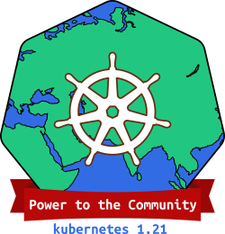

# Kubernetes 1.21 : Power to the Community

#### Links

* [This document](https://git.k8s.io/sig-release/releases/release-1.21/README.md)
* [Release Team](https://github.com/kubernetes/sig-release/blob/master/releases/release-1.21/release-team.md)
* [Meeting Minutes](http://bit.ly/k8s121-releasemtg) (join [kubernetes-sig-release@] to receive meeting invites)
* [v1.21 Release Calendar][k8s121-calendar]
* Contact: [#sig-release] on slack, [kubernetes-release-team@] on e-mail
* [Internal Contact Info][Internal Contact Info] (accessible only to members of [kubernetes-release-team@])

#### Tracking docs

* [Enhancements Tracking Sheet](http://bit.ly/k8s121-enhancements)
* Bug Triage Tracking Sheet: TODO
* CI Signal Report: TODO
* [Retrospective Document][Retrospective Document]
* [kubernetes/sig-release v1.21 milestone](https://github.com/kubernetes/kubernetes/milestone/49)

#### Guides

* [Targeting Issues and PRs to This Milestone](https://git.k8s.io/community/contributors/devel/sig-release/release.md)
* [Triaging and Escalating Test Failures](https://git.k8s.io/community/contributors/devel/sig-testing/testing.md#troubleshooting-a-failure)

## TL;DR

The 1.21 release cycle is proposed as follows:

- **Monday, January 11th**: Week 1 - Release cycle begins
- **Tuesday, February 9th**: Week 5 - [Enhancements Freeze](../release_phases.md#enhancements-freeze)
- **Tuesday, March 9th**: Week 9 - [Code Freeze](../release_phases.md#code-freeze)
- **Wednesday, March 24**: Week 11 - [Test Freeze](../release_phases.md#test-freeze)
- **Wednesday, March 31st**: Week 12 - Docs must be completed and reviewed
- **Thursday, April 8th**: Week 13 - Kubernetes v1.21.0 released
- **Thursday, April 15th**: Week 14 - Release Retrospective

## Timeline

| **What** | **Who** | **When** | **WEEK** | **CI SIGNAL** |
|---|---|---|---|---|
| Start of Release Cycle | Lead | Mon January 11 | week 1 | [master-blocking] |
| Start Enhancements Tracking | Enhancements Lead | Tue January 12 | week 1 | |
| 1.21.0-alpha.1 released | Branch Manager ([@puerco](https://github.com/puerco)) | Wed January 13  | week 1 | |
| Schedule finalized | Lead | Thurs January 14 | week 1 | |
| Team finalized | Lead | Friday January 15 | week 1 | |
| 1.21.0-alpha.2 released | Branch Manager ([@sethmccombs](https://github.com/sethmccombs)) | Tue January 26 | week 3 | |
| **Begin [Enhancements Freeze]** (EOD PST) | Enhancements Lead | Tue February 9th | week 5 | [master-blocking], [master-informing] |
| 1.21.0-alpha.3 released | Branch Manager ([@ameukam](https://github.com/ameukam)) | Tue February 9 | week 5 | |
| 1.21.0-beta.0 released | Branch Manager ([@onlydole](https://github.com/onlydole)) | Tue February 23 | week 7 | |
| **Begin [Burndown]** (MWF meetings) | Lead | Mon March 1 | week 8 | [1.21-blocking], [master-blocking], [master-informing] |
| **Call for [Exceptions][Exception]** | Lead | Mon March 1 | week 8 | |
| Brace Yourself, Code Freeze is Coming | Comms / Bug Triage | Mon March 1 | week 8 | |
| **Begin Feature blog freeze** | Comms Lead | Mon March 1 | week 8 | |
| 1.21.0-beta.1 released | Branch Manager ([@mkorbi](https://github.com/mkorbi)) | Tue March 9 | week 9 | |
| **Begin [Code Freeze]** (EOD PST) | Branch Manager | Tue March 9 | week 9 | |
| Burndown Meetings daily| Lead | Mon March 15 | week 10 | |
| Docs deadline - Open placeholder PRs | Docs Lead | Tue March 16 | week 10 | |
| Docs deadline - PRs ready for review | Docs Lead | Wed March 24 | week 11 | |
| **[Test Freeze]** (EOD PST) | Branch Manager | Wed March 24 | week 11 | |
| 1.21.0-rc.0 released | Branch Manager ([@puerco](https://github.com/puerco)) | Thu March 25 | week 11 | |
| release-1.21 branch created | Branch Manager | Thu March 25 | week 11 | |
| release-1.21 jobs created | Branch Manager | Thu March 25 | week 11 | |
| Start final draft of Release Notes | Release Notes Lead | Thu March 25 | week 11 | |
| Release blog ready to review | Comms / Docs | Thu March 25 | week 11 | |
| Docs complete - All PRs reviewed and ready to merge | Docs Lead | Wed March 31 | week 12 | |
| Feature blogs ready to review | Enhancement Owner / SIG Leads | Wed March 31 | week 12 | |
| Release Notes complete - reviewed & merged to `k/sig-release` | Release Notes Lead | Mon April 5 | week 13 | |
| **v1.21.0 released** | Branch Manager ([@puerco](https://github.com/puerco)) | Thu April 8 | week 13 | |
| Release blog published | Comms | Thu April 8 | week 13 | |
| **[Thaw]** | Branch Manager | Thu April 8 | week 13 | |
| Release retrospective | Community | Thu April 15 | Week 14 | |

## Phases

Please refer to the [release phases document](../release_phases.md).

[k8s121-calendar]: https://bit.ly/k8s-release-cal
[Internal Contact Info]: http://bit.ly/k8s121-contacts
[Retrospective Document]: http://bit.ly/k8s121-retro

[Enhancements Freeze]: ../release_phases.md#enhancements-freeze
[Burndown]: ../release_phases.md#burndown
[Code Freeze]: ../release_phases.md#code-freeze
[Exception]: ../release_phases.md#exceptions
[Thaw]: ../release_phases.md#thaw
[Test Freeze]: ../release_phases.md#test-freeze

[kubernetes-release-team@]: https://groups.google.com/a/kubernetes.io/g/release-team
[kubernetes-sig-release@]: https://groups.google.com/forum/#!forum/kubernetes-sig-release
[#sig-release]: https://kubernetes.slack.com/messages/sig-release/
[kubernetes-release-calendar]: https://bit.ly/k8s-release-cal
[kubernetes/kubernetes]: https://github.com/kubernetes/kubernetes

[master-blocking]: https://testgrid.k8s.io/sig-release-master-blocking#Summary
[master-informing]: https://testgrid.k8s.io/sig-release-master-informing#Summary
[1.21-blocking]: https://testgrid.k8s.io/sig-release-1.21-blocking#Summary

[exception requests]: ../EXCEPTIONS.md
[release phases document]: ../release_phases.md
