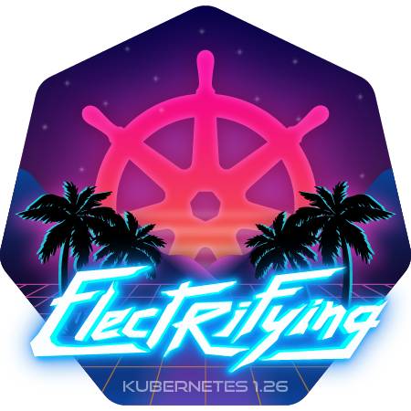

# Kubernetes 1.26: Electrifying

  

Kubernetes 1.26 is named *Electrifying* to raise awareness that Kubernetes orchestrates huge systems that consume a lot of energy and this is simply a problem. *Electrifying* also represents the increased automation we use in the release team and the fact that this community is simply electrifying.

  

There is also a **live wallpaper** version for download see [link](https://drive.google.com/file/d/1nI3MnQv_fIX8X6ssVQTpU313y8B1FfyZ/view?usp=sharing).

#### Links

* [This document](https://git.k8s.io/sig-release/releases/release-1.26/README.md)
* [Release Team](https://github.com/kubernetes/sig-release/blob/master/releases/release-1.26/release-team.md)
* [Meeting Minutes](http://bit.ly/k8s126-releasemtg) (members of [release-team@] receive meeting invites)
* [v1.26 Release Calendar][k8s126-calendar]
* Contact: [#sig-release] on slack, [release-team](mailto://release-team@kubernetes.io) on e-mail
* [Internal Contact Info] (accessible only to members of [release-team@])

#### Tracking docs

* [Enhancements Tracking Sheet](https://bit.ly/k8s126-enhancements)
* [Feature blog Tracking Board](https://github.com/orgs/kubernetes/projects/98/views/11)
* [Bug Triage Tracking Sheet](https://bit.ly/k8s126-bug-triage-tracking)
* [CI Signal Project Board & Issue Tracking](https://github.com/orgs/kubernetes/projects/68)
* [Retrospective Document][Retrospective Document]
* [kubernetes/sig-release v1.26 milestone](https://github.com/kubernetes/kubernetes/milestone/59)

#### Guides

* [Targeting Issues and PRs to This Milestone](https://git.k8s.io/community/contributors/devel/sig-release/release.md)
* [Triaging and Escalating Test Failures](https://git.k8s.io/community/contributors/devel/sig-testing/testing.md#troubleshooting-a-failure)

## Major release cycle events

The 1.26 release cycle is as follows:

- **Monday 5th September 2022**: Week 1 — Release cycle begins
- **Thursday 29th September 2022**: Week 4 — [Production Readiness Freeze](https://groups.google.com/g/kubernetes-sig-architecture/c/a6_y81N49aQ)
- **[01:00 UTC Friday 7th October 2022 / 18:00 PDT Thursday 6th October 2022](https://everytimezone.com/s/3a6f71b0)**: Week 5 — [Enhancements Freeze](../release_phases.md#enhancements-freeze)
- **Monday 24th - Friday 28th October 2022**: Week 8 - [KubeCon NA](https://events.linuxfoundation.org/kubecon-cloudnativecon-north-america/)
- **[17:00 UTC Wednesday 2nd November 2022 / 10:00 PDT Wednesday 2nd November 2022](https://everytimezone.com/s/bb5725f4)**: Week 10 — [Release Retrospective][Retrospective Document] Part 1 - Midcycle
- **[01:00 UTC Wednesday 9th November 2022 / 17:00 PDT Tuesday 8th November 2022](https://everytimezone.com/s/d3187dcc)**: Week 10 — [Code Freeze](../release_phases.md#code-freeze)
- **[01:00 UTC Wednesday 16th November 2022 / 17:00 PDT Tuesday 15th November 2022](https://everytimezone.com/s/dc1d29cb)**: Week 11 — [Test Freeze](../release_phases.md#test-freeze)
- **Tuesday 29th November 2022**: Week 13 — Docs must be completed and reviewed
- **Friday 9th December 2022**: Week 14 — Kubernetes v1.26.0 released
- **Tuesday 13th December**: Week 15 — [Release Retrospective][Retrospective Document] Part 2
- **Wednesday 14th December**: Week 15 — [Release Retrospective][Retrospective Document] Part 3 (Note: Only if items get spill over from Retro Part 2, we will have Part 3)

## Timeline

| **What**                                                      | **Who** | **When**                                                                                                        | **Week** | **CI Signal** |
|---------------------------------------------------------------|---|-----------------------------------------------------------------------------------------------------------------|----------|---|
| Start of Release Cycle                                        | Lead | Monday 5th September 2022                                                                                                         | week 1   | [master-blocking] |
| Start Enhancements Tracking                                   | Enhancements Lead | Monday 5th September 2022                                                                                            | week 1   | |
| Schedule finalized                                            | Lead | Friday 9th September 2022                                                                                                         | week 1   | |
| Team finalized                                                | Lead | Friday 9th September 2022                                                                                                         | week 1   | |
| 1.26.0-alpha.1 released                                       | Branch Manager | Tuesday 20th September 2022                                                                                           | Week 3   | |
| Start Release Notes Draft                                     | Release Notes Lead | Tuesday 20th September 2022                                                                                         | week 3   | |
| Production Readiness Freeze                              | Enhancements Lead | Thursday 29th September 2022                                                                                         | week 4   | |
| **Begin [Enhancements Freeze]**                               | Enhancements Lead | [01:00 UTC Friday 7th October 2022 / 18:00 PDT Thursday 6th October 2022](https://everytimezone.com/s/3a6f71b0)                                              | week 5   | [master-blocking], [master-informing] |
| 1.26.0-alpha.2 released                                       | Branch Manager | Tuesday 11th October 2022                                                                                               | Week 6   | |
| Begin Friday APAC-friendly meetings                           | Lead | Friday 21th October 2022                                                                                                          | Week 7   | |
| KubeCon NA                                                    | | October 24-28 2022                                                                                                                     | week 8   | |
| 1.26.0-alpha.3 released                                       | Branch Manager | Tuesday 1st November 2022                                                                                                                                    | week 9   | [1.26-blocking], [master-blocking], [master-informing] |
| **Call for [Exceptions][Exception]**                          | Lead | Monday 31st October 2022                                                                                                          | week 9   | |
| Brace Yourself, Code Freeze is Coming                         | Comms / Bug Triage | Monday 31st October 2022                                                                                            | week 9   | |
| **Begin Feature blog freeze**                                 | Comms Lead | [01:00 UTC Wednesday 2nd November 2022 / 18:00 PDT Tuesday 1st November 2022](https://everytimezone.com/s/09b6c7c8)                                                 | week 9   | |
| Release retrospective part 1                                  | Community | [17:00 UTC Wednesday 2nd November 2022 / 10:00 PDT Wednesday 2nd November 2022](https://everytimezone.com/s/bb5725f4)                                                | week 9   | |
| **Begin [Code Freeze]**                                       | Branch Manager | [01:00 UTC Wednesday 9th November 2022 / 17:00 PDT Tuesday 8th November 2022](https://everytimezone.com/s/d3187dcc)     | week 10  | |
| 1.26.0-beta.0 released                                        | Branch Manager | Thursday 10th November 2022                                                                                             | week 10  | |
| Docs deadline — Open placeholder PRs                          | Docs Lead | Thursday 10th November 2022                                                                                                  | week 10  | |
| Deprecations and Removals blog published                      | Comms | Thursday 10th November 2022                                                                                                      | week 10  | |
| **Begin [Burndown]** (Monday, Wednesday, and Friday meetings) | Lead           | Monday 14th November 2022 | Week 11   | |
| **[Test Freeze]**                                             | Branch Manager | [01:00 UTC Wednesday 16th November 2022 / 17:00 PDT Tuesday 15th November 2022](https://everytimezone.com/s/dc1d29cb)  | week 11  | |
| Docs deadline — PRs ready for review                          | Docs Lead | Tuesday 15th November 2022 | Week 11   | |
| 1.26.0-rc.0 released                                          | Branch Manager | Tuesday 15th November 2022                                                                                              | week 11  | |
| release-1.26 branch created                                   | Branch Manager | Tuesday 15th November 2022                                                                                              | week 11  | |
| release-1.26 jobs created                                     | Branch Manager | Tuesday 15th November 2022                                                                                              | week 11  | |
| Major Themes deadline                                     | Comms | Tuesday 15th November 2022                                                                                              | week 11  | |
| Start final draft of Release Notes                            | Release Notes Lead | Tuesday 15th November 2022                                                                                          | week 11  | |
| Release blog ready to review                                  | Comms / Docs | [01:00 UTC Wednesday 16th November 2022 / 17:00 PDT Tuesday 15th November 2022](https://everytimezone.com/s/dc1d29cb)    | week 11  | |
| Burndown Meetings daily (Tuesday & Thursday over Slack)       | Lead               | Monday 21st November 2022  | week 12  | |
| Major Themes complete                                         | Release Notes Lead | Tuesday 29th November 2022 | week 13  | |
| Docs complete — All PRs reviewed and ready to merge           | Docs Lead | Tuesday 29th November 2022                                                                                                   | week 13  | |
| Feature blogs ready to review                                 | Enhancement Owner / SIG Leads | Tuesday 29th November 2022                                                                               | week 13  | |
| 1.26.0-rc.1 released                                          | Branch Manager | Tuesday 29th November 2022                                                                                              | week 13  | |
| Release Notes complete — reviewed & merged to `k/k` | Release Notes Lead | Thursday 8th December | week 14  | |
| **v1.26.0 released**                                          | Branch Manager | Friday 9th December 2022                                                                                               | week 14  | |
| Release blog published                                        | Comms | Friday 9th December 2022                                                                                                        | week 14  | |
| **[Thaw]**                                                    | Branch Manager | Friday 9th December 2022                                                                                               | week 14  | |
| Release retrospective Part 2                                  | Community | [17:00 UTC / 09:00 PDT Tuesday 13th December](https://everytimezone.com/s/5ec45da4)                                                                                                                          | week 15  | |
| Release retrospective part 3 (Note: Only if items get spill over from Retro Part 2, we will have Part 3) | Community | [17:00 UTC / 09:00 PDT Wednesday 14th December](https://everytimezone.com/s/1cba3371)                                                                                                                          | week 15  | |

## Phases

Please refer to the [release phases document](../release_phases.md).

[k8s126-calendar]: https://bit.ly/k8s-release-cal
[Internal Contact Info]: https://bit.ly/k8s126-contacts
[Retrospective Document]: https://bit.ly/k8s126-retro

[Enhancements Freeze]: ../release_phases.md#enhancements-freeze
[Burndown]: ../release_phases.md#burndown
[Code Freeze]: ../release_phases.md#code-freeze
[Exception]: ../release_phases.md#exceptions
[Thaw]: ../release_phases.md#thaw
[Test Freeze]: ../release_phases.md#test-freeze

[release-team@]: https://groups.google.com/a/kubernetes.io/g/release-team
[kubernetes-sig-release@]: https://groups.google.com/forum/#!forum/kubernetes-sig-release
[#sig-release]: https://kubernetes.slack.com/messages/sig-release/
[kubernetes-release-calendar]: https://bit.ly/k8s-release-cal
[kubernetes/kubernetes]: https://github.com/kubernetes/kubernetes

[master-blocking]: https://testgrid.k8s.io/sig-release-master-blocking#Summary
[master-informing]: https://testgrid.k8s.io/sig-release-master-informing#Summary
[1.26-blocking]: https://testgrid.k8s.io/sig-release-1.26-blocking#Summary

[exception requests]: ../EXCEPTIONS.md
[release phases document]: ../release_phases.md
