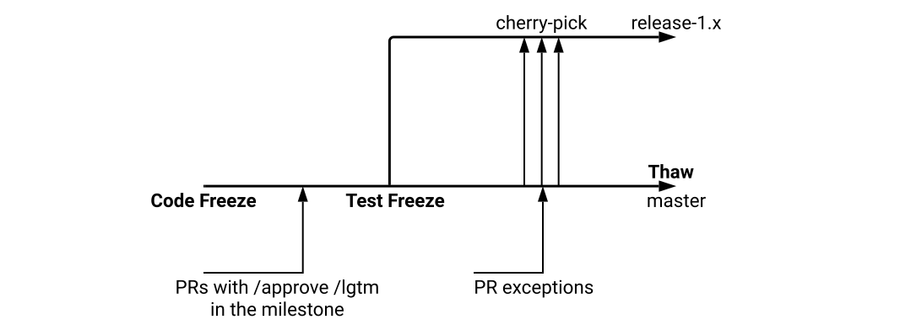

# Release Phases

## Enhancements Freeze

All enhancements wishing to be included in the current release must have

* An [open issue in kubernetes/enhancements](https://github.com/kubernetes/enhancements/issues/)
  * In the current Release Milestone
  * Has the `lead-opted-in` label applied
* A `kep.yaml` with
  * [status](status: provisional|implementable|implemented|deferred|rejected|withdrawn|replaced) set to `implementable`
  * [latest-milestone](latest-milestone: "v1.19") set to the current release
* A `README.md`
  * That uses the [latest template](https://github.com/kubernetes/enhancements/tree/master/keps/NNNN-kep-template)
  * That has a [updated detailed test plan section](https://github.com/kubernetes/enhancements/blob/master/keps/NNNN-kep-template/README.md?plain=1#L257-L328) filled out
* A completed [Production Readiness Review](https://github.com/kubernetes/enhancements/blob/master/docs/glossary.md#production-readiness-review-prr)

If the enhancement does not meet these requirements, it will be removed from the
milestone and will require an [Exception].

## Burndown

Several weeks prior to [Code Freeze], we increase the cadence of release team meetings
to begin tracking work more closely. We call this Burndown, because at this
point we have a list of outstanding issues and PRs, and are actively working to
burn that list down. SIG representatives will be asked to attend if their SIG has
specific outstanding issues that are blocking the release.

Please subscribe to the [Kubernetes Release Calendar] to see meeting events. Burndown meetings
may conflict with other community meetings. Please prioritize this meeting if
a member of the release team asks you to attend.

The intent of these meetings is to:

* Focus on fixing bugs, eliminating test flakes and general release
  stabilization.
* Ensure docs and release notes are written and accurate.
* Identify all enhancement going into the release, and make sure alpha, beta, GA
  is marked in enhancements repo.
* Provide a one-stop view of release progress via the current meeting notes (TODO: link to the template?) including relevant release metrics.

## Code Freeze

All enhancements going into the release must be in a merge-ready state with
`approved` and `lgtm` labels applied. This **includes**
tests, and docs PRs opened by the due date. Due to the Prow queue, this may mean
that approved PRs merge shortly after the deadline.

The docs PRs don't have to be ready to merge, but it should be clear what the
topic will be and who is responsible for writing it. This person will become the
primary contact for the documentation lead. It’s incredibly important that
documentation work gets completed as quickly as possible.

At this point, the only PRs allowed to proceed with changes are those
related to release-blocking issues within the milestone.

## Test Freeze

The date after which no more tests may be changed (or promoted to Conformance),
unless there are release-blocking or other exceptional reasons. Before
this date, it is acceptable to improve test coverage of existing code. After
this date, the goal is to fix, revert, or remove tests that are failing.

Every merged PR, which is part of the current milestone and therefore merged into
the master branch, will be automatically merged into the release branch via the
[periodic release branch fast forward job](https://testgrid.k8s.io/sig-release-releng-blocking#git-repo-kubernetes-fast-forward)
in prow.

## Thaw

Thaw specifies the end of both [Code Freeze] and [Test Freeze]. At this point 
it is expected that all outstanding PRs for the release of Kubernetes have been
merged into the release branch. Assuming the release team agrees,
[Code Freeze], will be lifted, and we enter Thaw. This means from a 
technical perspective, that now the `master` and `release-1.x` branch diverge.
After Thaw, the `master` branch develops toward the next minor release and the
release branch goes into maintenance mode. From this point forward, any PRs
intended for the current release must be cherry-picked into the appropriate
branch.

## Exceptions

Starting at [Enhancements Freeze], the release team will solicit and rule on
[Exception] requests for enhancements and test work that is unlikely to be done
by [Code Freeze]. The [Exception] approval is the responsibility of the SIG or SIGs
labeled in the pull request. The release team may intervene or deny the request
only if it poses a risk to release quality, or could negatively impact the overall
timeline. Changes introduced at this point should be well-tested,
well-understood, limited in architectural scope, and low risk.  All of those
factors should be considered in the approval process.  Enhancements on an
feature branch with documentation, test cases, and passing CI are more likely to
be accepted.

*Exception requests must be received within three days of the relevant freeze deadline to be considered.*

## Feature Blog Freeze

Feature blogs are an amazing way to showcase all the hard work you and your team
have done with the enhancement. While providing technical depth in terms of content,
they are also great avenues to attract newer contributors to the Kubernetes project.
You can opt in to write a feature blog for your enhancement and this deadline is to
freeze the collection phase for the ongoing cycle. Once the collection phase is
completed, the Release Comms team will coordinate further with you to work out details
around delivery & review.

After the deadline passes if you haven't opted in & still would like to have a feature
blog for your enhancement, please contact the current release communications lead on
the #sig-release channel in Kubernetes Slack.

## Pruning

Enhancements that are partially implemented and/or lack sufficient tests may be
considered for pruning beginning after [Code Freeze], unless they've been
granted an [Exception].

The release team will work with SIGs and enhancements owners to evaluate each
case, but for example, pruning could include actions such as:

* Disabling the use of a new API or field
* Switching the default value of a flag or field
* Moving a new API or field behind an Alpha Enhancements gate
* Reverting commits or deleting code

This should occur before 1.x.0-beta.1 is cut so we have time to gather signal
on whether the system is stable in this state. These are considered drastic
measures, so the release team will strive to coordinate at-risk work with SIGs
before this time. The goal is to make code freeze, and overall project
transparency, enforceable despite the lack of a consistently used feature branch
process.

## Docs

If an enhancement needs documentation, enter "Yes" in the enhancement tracking
spreadsheet and add a link to the documentation PR. You can open documentation
PRs in the [kubernetes/website] repository. If you have questions, the release
documentation lead, or representatives from SIG-Docs will be happy to assist
you.

For documentation PRs:

* Open PRs against the dev-1.x branch based off of the current release PR. The
  documentation workflow uses feature branches for release documentation, rather
than basing from master. **Be sure to open your PR against the release branch**.
* Add your PR to the current Release milestone.

## Docs Freeze

All enhancements that are determined to require documentation must have their docs PRs in a `ready to merge` state by the Docs Freeze deadline for the release. To be considered ready to merge, a PR must have a technical review as well as the `lgtm` and `approve` labels applied, with no outstanding comments or suggestions from SIG Docs.

After Docs Freeze, the owners of any outstanding documentation PRs must file an exception request. The release team will work with SIG Docs and the SIG or SIGs labeled in the pull request to determine whether or not an exception can be granted. Authors and reviewers should prioritize getting the PR into a state where it is accurate and useful enough to be merged even if it isn't perfect, and then open a separate PR to continue work on that documentation post-release. 

[kubernetes/website]: https://github.com/kubernetes/website
[Kubernetes Release Calendar]: https://bit.ly/k8s-release-cal
[Exception]: ./EXCEPTIONS.md
[Code Freeze]: #code-freeze
[Test Freeze]: #test-freeze
[Enhancements Freeze]: #enhancements-freeze
